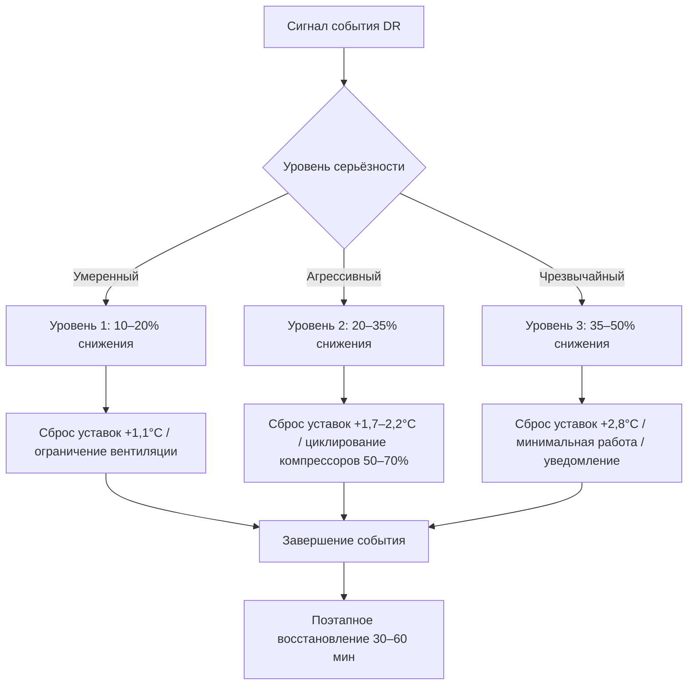

Реагирование на спрос (demand response, DR) — это стратегический подход к управлению нагрузками электрической сети путём изменения режима работы систем HVAC в периоды высокого спроса или напряжённости сети. По данным ASHRAE 90.1-2022, системы HVAC составляют 40–60% электропотребления коммерческих зданий, что делает их главными объектами программ DR, позволяющих снижать пиковую нагрузку при сохранении нормируемого качества внутренней среды.

## Основы реагирования на спрос

Реагирование на спрос в системах HVAC предполагает временное изменение режима работы оборудования в ответ на сигналы энергоснабжающей организации, ценовые сигналы или состояние сети. Основная цель — снижение электрического спроса в критические периоды пиковой нагрузки (обычно 2–6 ч), когда оптовые цены на электроэнергию резко возрастают или надёжность сети оказывается под угрозой.

Системы HVAC обладают значительным потенциалом DR благодаря высокому энергопотреблению, управляемости и способности тепловой оболочки здания к пассивному аккумулированию тепла. Тепловая масса конструкций функционирует как буферное тепловое хранилище, позволяя кратковременно снижать мощность охлаждения или отопления без немедленного ухудшения теплового комфорта.

Потенциал снижения пиковой нагрузки составляет 15–40% от нагрузки HVAC в зависимости от тепловой массы здания, теплозащиты ограждающих конструкций, конфигурации системы и сложности алгоритма управления. Это соответствует 10–25% от суммарного электропотребления типичного коммерческого здания.

## Стратегии снижения нагрузки

Снижение нагрузки (load shedding) предполагает прямое сокращение электропотребления системы HVAC в период события DR путём циклирования оборудования, ограничения производительности или отключения некритичных подсистем.

### Циклирование компрессора

Поршневые и спиральные компрессоры переводятся в режим циклирования при событиях DR, сокращая время работы до 50–75% от нормального. Периоды 15–30 мин включения и 10–20 мин отключения обеспечивают частичное охлаждение при снижении спроса на 20–35%. Чрезмерное циклирование сокращает ресурс компрессора; необходима защита минимального времени включения (не менее 5–10 мин).

### Ограничение производительности

Системы с переменной производительностью снижают холодопроизводительность до 60–80% от номинала без полного останова. Золотниковые клапаны винтовых компрессоров, разгрузочные устройства спиральных компрессоров и компрессоры с частотным регулированием обеспечивают непрерывную модуляцию. Такой подход сохраняет частичное охлаждение при снижении пикового спроса на 20–40% с меньшим температурным дрейфом, чем при полном циклировании.

### Снижение скорости вентиляторов

Преобразователи частоты (ПЧ) вентиляторов приточного воздуха и конденсаторных секций снижают расход воздуха до минимально допустимого уровня вентиляции. Мощность вентилятора подчиняется кубическому закону:


N_2 = N_1 \left(\frac{n_2}{n_1}\right)^3


При снижении скорости до 70% мощность уменьшается до 34% от номинала (0,7³ = 0,343). В сочетании с ограничением производительности холодильной машины модуляция скорости вентиляторов обеспечивает 30–50% суммарного снижения электрического спроса системы.

### Сброс температуры охлаждённой воды

Повышение уставки температуры охлаждённой воды с 6,7°C до 10–11°C в период события DR снижает мощность холодильной машины на 10–20% при сохранении частичного охлаждения. Стратегия наиболее эффективна в системах с избыточной поверхностью теплообменников и умеренной скрытой тепловой нагрузкой.

## Стратегии смещения нагрузки

Смещение нагрузки (load shifting) переносит электропотребление с пиковых на внепиковые периоды за счёт предварительного охлаждения, теплового аккумулирования или сдвига графика работы. Суммарное потребление энергии при этом не уменьшается, но пиковый спрос снижается.

### Предварительное охлаждение

Предварительное охлаждение (pre-cooling) использует тепловую массу здания как пассивное хранилище, переохлаждая здание за 2–4 ч до ожидаемого события DR. Конструкция здания поглощает явное тепло охлаждения во внепиковый период, а затем отдаёт его в период события по мере роста внутренней температуры.

Эффективность предварительного охлаждения определяется количеством и доступностью тепловой массы.


| Тип конструкции | Тепловая масса | Продолжительность предварительного охлаждения | Температурный дрейф | Возможная длительность DR |
|-----------------|----------------|------------------------------------------------|---------------------|--------------------------|
| Тяжёлый монолитный железобетон | Высокая | 3–4 ч | 1,1–1,7°C | 4–6 ч |
| Стальной каркас + гипсокартон | Средняя | 2–3 ч | 1,7–2,8°C | 2–4 ч |
| Лёгкая каркасная конструкция | Низкая | 1–2 ч | 2,2–3,3°C | 1–2 ч |


Заглубление уставки предварительного охлаждения — 1,7–2,8°C ниже нормальной рабочей температуры, то есть снижение температуры помещения до 21–22°C перед событием DR. Избыточное предварительное охлаждение создаёт дискомфорт и бесполезно расходует энергию. Дополнительное энергопотребление при предварительном охлаждении составляет 10–25%, однако эта нагрузка смещается на внепиковый период с более низкими тарифами.

Оптимальная стратегия предварительного охлаждения требует точного прогнозирования времени события DR, наружных климатических условий и теплового отклика здания. Алгоритмы предиктивного управления на основе модели (Model Predictive Control, MPC) рассчитывают момент начала и величину заглубления уставки на основе термической модели здания, метеопрогноза и расписания событий DR.

### Использование тепловой массы

Тепловая масса здания аккумулирует явное тепло, обеспечивая эффективную ёмкость хранения 0,58–2,34 кДж/(м²·°C) в зависимости от конструктивных решений:


| Элемент конструкции | Удельная теплоёмкость, кДж/(м²·°C) |
|---------------------|-------------------------------------|
| Монолитный железобетон | 1,75–2,34 |
| Каменная кладка | 1,46–2,04 |
| Гипсокартон | 0,47–0,70 |
| Мебель и оборудование | 0,29–0,58 |


Суммарная тепловая ёмкость здания составляет 2,92–5,84 кДж/(м²·°C) для лёгких каркасных конструкций и 8,76–14,60 кДж/(м²·°C) для тяжёлых монолитных зданий.

**Числовой пример (Москва, летний день DR):**

Офисное здание площадью 4 645 м², монолитный железобетон, удельная тепловая ёмкость 8,76 кДж/(м²·°C). Допустимый температурный дрейф 2°C.


Q_{\text{акк}} = c_{\text{уд}} \cdot A \cdot \Delta T = 8{,}76 \;\text{кДж/(м}^2\text{·°C)} \times 4645 \;\text{м}^2 \times 2\;°\text{C} = 81{,}4 \;\text{МДж}


При средней нагрузке охлаждения 100 кВт запасённое тепло обеспечивает работу без активного охлаждения в течение:


t = \frac{Q_{\text{акк}}}{P_{\text{охл}}} = \frac{81{,}4 \;\text{МДж}}{100 \;\text{кВт}} \approx 0{,}226 \;\text{ч}^{-1} \cdot 81{,}4 = 814 \;\text{с} \approx 13{,}6 \;\text{мин на каждый °C}


При нагрузке 50 кВт (частичная нагрузка летнего дня) и дрейфе 2°C — около 27 мин работы без включения компрессоров.

Эффективность тепловой массы зависит от качества теплового контакта между кондиционируемым воздухом и несущими поверхностями. Открытые железобетонные потолки, кирпичные стены и бетонные полы обеспечивают прямой тепловой контакт. Подвесные потолки и ковровые покрытия снижают эффективность тепловой массы на 40–60%.

Ночная вентиляция удаляет аккумулированное тепло в климатических зонах с преобладанием нагрузки охлаждения (Москва: июль–август), позволяя к утру вернуть тепловую массу в исходное состояние для следующего цикла DR.

## Интеграция в электросеть: программы и тарифы

Программы DR подключают системы HVAC зданий к диспетчерскому управлению электросети через различные механизмы участия и структуры компенсации.

**Прямое управление нагрузкой (Direct Load Control, DLC).**
Энергоснабжающая организация дистанционно управляет оборудованием HVAC через установленные контроллеры или интеграцию с системой автоматизации здания (BAS). Клиенты получают авансовые стимулы (50–200 долл./кВт контролируемой мощности) плюс ежегодные платежи за участие. События DLC ограничены 15–20 в год по 2–4 ч каждое.

**Автоматизированное реагирование на спрос (Automated Demand Response, AutoDR).**
Система автоматизации здания автоматически реагирует на ценовые сигналы или команды энергоснабжающей организации по протоколу OpenADR 2.0. Предварительно запрограммированные стратегии DR выполняются без ручного вмешательства, что сокращает время отклика и исключает человеческий фактор.

**Дифференцированные тарифы по времени суток (Time-of-Use, TOU).**
Цена электроэнергии варьируется по временным зонам, создавая экономический стимул для смещения нагрузки. Тарифы в пиковый период (14:00–18:00) могут быть в 3–5 раз выше внепиковых, что оправдывает затраты на стратегии предварительного охлаждения и теплового аккумулирования.

**Критические пиковые тарифы (Critical Peak Pricing, CPP).**
Экстремальные надбавки к цене применяются в 10–15 критических пиковых событиях в год (обычно 2–6 ч в самые жаркие летние дни) с уведомлением накануне или в день события. Высокая ценовая разница оправдывает агрессивные стратегии DR.

**Рынки мощности.**
Крупные коммерческие потребители предлагают гарантированный объём снижения нагрузки на рынки мощности или ИСО, получая платежи за мощность (50–150 долл./кВт в год) независимо от частоты событий. Штрафы за недопоставку мощности применяются при вызванных событиях.

## Стратегия поэтапного управления при событии DR

Эффективное DR требует структурированных последовательностей управления, балансирующих снижение спроса с комфортом, защитой оборудования и технологическими ограничениями.

**Уровень 1 — умеренный (снижение 10–20%):**
- Сброс уставок температуры помещений: +1,1°C для охлаждения, −1,1°C для отопления.
- Снижение подачи наружного воздуха до минимума вентиляционного норматива (ASHRAE 62.1).
- Снижение скорости конденсаторных вентиляторов на 10–15%.
- Отключение вспомогательных нагрузок (дополнительный нагрев, увлажнение).

**Уровень 2 — агрессивный (снижение 20–35%):**
- Сброс уставок температуры: +1,7–2,2°C для охлаждения, −1,7–2,2°C для отопления.
- Снижение скорости приточных вентиляторов на 15–25% при соблюдении нормы вентиляции.
- Циклирование компрессоров с коэффициентом включения 50–70%.
- Сброс температуры охлаждённой воды на 2,2–3,3°C выше нормы.
- Отключение некритичных зон.

**Уровень 3 — аварийный (снижение 35–50%):**
- Сброс уставок температуры: +2,8°C для охлаждения, −2,2°C для отопления.
- Минимальная производительность всего оборудования.
- Коэффициент включения компрессоров 30–50% или полный останов.
- Работа только критичных нагрузок (серверные помещения, лаборатории).
- Уведомление персонала об ухудшении параметров микроклимата.

### Стратегия восстановления

Поэтапное восстановление после события предотвращает обратный скачок (rebound peak) спроса при одновременном запуске всего оборудования. Последовательность восстановления (30–60 мин):

1. Восстановление нормального расхода наружного воздуха.
2. Возврат скорости приточных вентиляторов к норме.
3. Плавный возврат уставок температуры помещений в течение 15–30 мин.
4. Последовательный пуск холодильных машин и компрессоров с интервалом 5–10 мин.
5. Возврат вспомогательного оборудования (нагрев, увлажнение) в последнюю очередь.

Скорость восстановления уставки температуры 1°C каждые 15–20 мин обеспечивает комфортное восстановление без перерегулирования и излишнего энергопотребления.

## Экономические параметры программ DR


| Тип программы | Структура стимула | Типичное значение | Периодичность |
|---------------|-------------------|-------------------|---------------|
| Прямое управление нагрузкой | За кВт зарегистрированной мощности | 75–150 долл./кВт·год | Ежемесячно |
| AutoDR (инсталляционный стимул) | За м² площади | 0,20–0,50 долл./м² | Единовременно |
| Критические пиковые тарифы CPP | Избежание платежей за энергию | 5–25 долл./кВт·событие | За событие |
| Рынок мощности | Платёж за обязательную мощность | 100–200 долл./кВт·год | Ежемесячно |
| Стимул производительности | Верифицированное снижение нагрузки | 0,30–0,75 долл./кВт·ч | За событие |


### Снижение затрат на электроэнергию

**Платежи за мощность (demand charges).**
Коммерческие тарифы на электроэнергию включают составляющую платежей за мощность, основанную на пиковом 15-минутном потреблении и составляющую 10–30 долл./кВт·мес. Снижение пикового спроса на 100 кВт экономит 1 200–3 600 долл. в месяц (14 400–43 200 долл. в год).

**Ценовая разница тарифных зон.**
Смещение потребления из пиковой зоны (0,20–0,40 долл./кВт·ч) во внепиковую (0,06–0,12 долл./кВт·ч) даёт экономию 0,14–0,28 долл. на каждый перенесённый кВт·ч. При ежедневном смещении 500 кВт·ч экономия составляет 70–140 долл./сут (25 000–50 000 долл./год).


| Тип здания | Потенциал снижения нагрузки | Событий в год | Длительность события | Годовой доход |
|------------|------------------------------|---------------|----------------------|----------------|
| Офис, 18 580 м² | 150–300 кВт | 12–15 | 3–4 ч | 18 000–35 000 долл. |
| Торговля, 9 290 м² | 100–200 кВт | 15–20 | 2–4 ч | 12 000–25 000 долл. |
| Школа, 13 935 м² | 120–240 кВт | 8–12 | 2–3 ч | 10 000–20 000 долл. |
| Больница, 27 870 м² | 200–400 кВт | 10–15 | 3–5 ч | 25 000–50 000 долл. |


Срок окупаемости вложений в инфраструктуру DR обычно составляет 1–3 года с учётом стимулирующих платежей, снижения платежей за мощность и экономии на тарифах. Стоимость внедрения системы AutoDR — 15 000–75 000 долл. в зависимости от площади здания и сложности системы.

## Технические ограничения и требования к верификации

**Защита компрессорного оборудования.**
Требования минимального времени отключения компрессора (5–10 мин) предотвращают повреждения при коротком цикле. Нагреватели картера поршневых компрессоров требуют предварительного прогрева при отключениях свыше 4–6 ч.

**Поддержание качества воздуха.**
Минимальные нормы подачи наружного воздуха в соответствии с ASHRAE 62.1 должны соблюдаться на всех уровнях DR, кроме аварийного уровня 3, при котором требуется официальное уведомление персонала.

**Контроль влажности.**
В условиях высокой влажности (Санкт-Петербург: июль–август) сокращение работы охлаждения приводит к росту относительной влажности в помещении. Ограничение продолжительности событий DR до 2–4 ч и мониторинг влажности исключают накопление конденсата и рост плесени.

**Установление базовых показателей и верификация.**
Верифицированное снижение нагрузки (Measurement & Verification, M&V) сравнивает фактическое потребление в период события с расчётным базовым значением. Базовое потребление определяется регрессионным анализом в зависимости от наружной температуры, заполненности здания и прочих переменных. Данные интервальных счётчиков (15 мин) фиксируют потребление до, в течение и после события DR для статистического подтверждения результата с нормировкой по погодным условиям.
