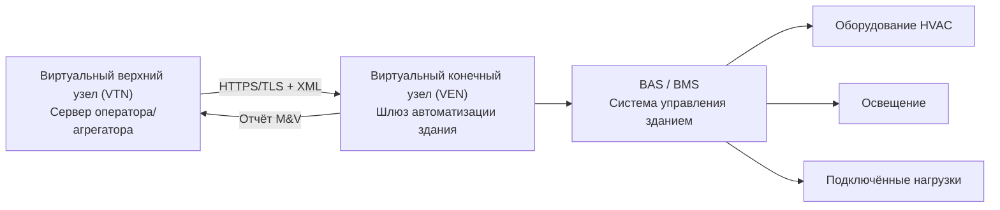

Программы реагирования на спрос (demand response, DR) — это договорные соглашения между энергоснабжающими организациями или системными операторами и потребителями о временном изменении характера электропотребления в обмен на финансовые стимулы. По классификации МЭА (IEA), программы DR делятся на две основные группы: стимулирующие (incentive-based) и ценовые (price-based).

## Стимулирующие программы

### Прямое управление нагрузкой

Прямое управление нагрузкой (Direct Load Control, DLC) — наиболее распространённая форма DR для коммерческих и промышленных потребителей. Оператор энергоснабжающей организации дистанционно управляет оборудованием потребителя во время пиковых событий через установленные контроллеры или интеграцию с системой автоматизации здания (BAS).

Типовые управляемые нагрузки:
- Системы HVAC: циклирование компрессоров 15–30 мин.
- Электрические водонагреватели: отключение на 2–4 ч.
- Насосы бассейнов: смещение нагрузки в ночной минимум.

Компенсация потребителю: 10–50 долл./кВт за сезон. Штрафы за недоступность оборудования не предусмотрены в большинстве программ DLC.

### Программы управляемой прерываемости

Потребители обязуются снижать нагрузку по уведомлению оператора:

- Предварительное уведомление: от 30 мин до 2 ч.
- Продолжительность события: 2–6 ч.
- Максимальное количество событий в год: 10–100 ч суммарно.
- Ставки стимулов: 100–400 долл./кВт·год.
- Штраф за неисполнение: 5–15 долл./кВт·ч за недопоставленное снижение.

### Аварийное управление спросом

Системный оператор инициирует события при угрозе надёжности сети:

- Время уведомления: 10–30 мин.
- Частота: не более 10–20 событий в год.
- Максимальная продолжительность: 4 ч на событие.
- Структура оплаты: 400–600 долл./МВт·ч.
- Характер участия: преимущественно добровольный.

### Программы рынка мощности

Ежегодное обязательство поставлять гарантированный объём снижения спроса на конкурентные аукционы мощности:

- Горизонт форвардного планирования: 1–3 года.
- Цена клиринга аукционов: 2–10 долл./кВт·мес.
- Требования к производительности: 80–100% обязательной мощности при вызванных событиях.
- Протоколы тестирования: сезонная верификация возможностей.
- Штраф за недопоставку: стоимость замещающей энергии на спотовом рынке.

## Ценовые программы

### Дифференцированные тарифы по времени суток (TOU)

Фиксированная дифференциация цены по временным зонам создаёт предсказуемый экономический стимул для смещения нагрузки.


| Зона | Летний тариф | Зимний тариф | Типичные часы |
|------|-------------|-------------|---------------|
| Пик | 0,25–0,40 долл./кВт·ч | 0,18–0,28 долл./кВт·ч | 12:00–20:00 |
| Полупик | 0,15–0,22 долл./кВт·ч | 0,12–0,18 долл./кВт·ч | 8:00–12:00, 20:00–22:00 |
| Минимум | 0,08–0,12 долл./кВт·ч | 0,08–0,12 долл./кВт·ч | 22:00–8:00 |


### Критическое пиковое ценообразование (CPP)

Повышенные тарифы вводятся во время объявленных критических событий при экстремальной нагрузке системы:

- Тариф в период события: 0,75–2,00 долл./кВт·ч.
- Максимальное число событий в год: 12–15 дней.
- Уведомление: накануне или в день события.
- Продолжительность события: 3–6 ч.
- Базовый тариф в остальное время снижается для компенсации высоких пиковых ставок.

### Ценообразование в режиме реального времени (Real-Time Pricing, RTP)

Почасовое или субчасовое ценообразование, отражающее оптовую стоимость электроэнергии:

- Интервал обновления цены: 1 ч или 15 мин.
- Уведомление: за сутки или за час.
- Диапазон цен: 0,03–1,50 долл./кВт·ч.
- Риск: потребитель принимает на себя рыночную волатильность.
- Оптимальная область применения: автоматизированные системы управления зданием с алгоритмами оптимизации.

## Структуры платежей энергоснабжающих организаций

### Платёж за выработку (Energy Payment)

Компенсация за фактически верифицированное снижение потребления:

- Измерение: снижение нагрузки относительно базового уровня.
- Ставка: 0,50–2,00 долл./кВт·ч сниженного потребления.
- Периодичность: ежемесячно или по результатам каждого события.
- Метод расчёта базового уровня: метод 10-of-10 или регрессионный анализ.

### Платёж за мощность (Capacity Payment)

Годовая оплата за гарантированную готовность к снижению нагрузки:

- База подписки: обязательный объём снижения в кВт.
- Ежемесячные платежи: 3–12 долл./кВт·мес.
- Минимальное время подтверждённого отклика: 4 ч.
- Периодичность верификации: ежеквартально или по сезонам.
- Требование доступности: 95–100% от вызванных событий.

### Стационарный платёж (Retainer)

Фиксированный платёж за регистрацию в программе:

- Стимул участия: 50–200 долл./год.
- Минимальный порог нагрузки объекта: 100–500 кВт.
- Дополнительные платежи за производительность при событиях.
- Возможное совместное финансирование установки оборудования DR.

### Финансовые выгоды участия

**Прямое снижение затрат:**
- Снижение платы за мощность (demand charge): 10–40 долл./кВт·мес.
- Избежание потребления по пиковым тарифам: 0,15–0,50 долл./кВт·ч.
- Потенциал годовой экономии: 10–30% от счёта за электроэнергию.
- Срок окупаемости инвестиций в автоматизацию: 1–4 года.

**Косвенные выгоды:**
- Сокращение наработки оборудования продлевает срок службы.
- Снижение пиковой нагрузки уменьшает частоту технического обслуживания.
- Улучшение коэффициента мощности в период снижения нагрузки.
- Повышение надёжности сети снижает риск веерных отключений.

## Стратегии снижения нагрузки HVAC

### Управление цикличностью холодильных машин

Временное отключение холодопроизводства:

- Стратегия: циклы отключения 15–30 мин в течение событий продолжительностью 1–2 ч.
- Снижение нагрузки: 300–800 Вт/кВт установленной холодопроизводительности.
- Температурный дрейф: 1,1–2,2°C при цикловом управлении.
- Предварительное охлаждение: снижение уставки на 1,1–2,2°C за 1–2 ч до события.
- Время восстановления после события: 30–60 мин.

### Модуляция скорости вентиляторов

Снижение частоты вращения через преобразователь частоты (ПЧ):

- Степень снижения скорости: 20–40% от номинала.
- Расход воздуха: 50–75% от номинального (кубическая зависимость).
- Снижение потребляемой мощности: 88–93% от номинала при 50–70% скорости.
- Предел продолжительности без жалоб на комфорт: 1–2 ч.

### Временная коррекция уставок температуры


| Режим | Нормальная уставка | Уставка при DR | Снижение нагрузки HVAC |
|-------|-------------------|---------------|----------------------|
| Охлаждение | 22°C | 24–26°C | 15–25% |
| Отопление | 21°C | 19–20°C | 10–20% |


- Скорость изменения уставки: не более 0,6°C за 15 мин.
- Предварительное кондиционирование: смещение уставки на 1,1–1,7°C за 2 ч до события.

## Протокол OpenADR

### Архитектура OpenADR 2.0

Стандарт OpenADR 2.0b (IEC 62746-10-3) обеспечивает защищённый и интероперабельный обмен данными между системным оператором и системами автоматизации зданий.

**Виртуальный верхний узел (Virtual Top Node, VTN):**
- Сервер управления спросом оператора или агрегатора.
- Создание и рассылка событий DR.
- Сбор и хранение отчётов о производительности.
- Управление регистрацией участников.

**Виртуальный конечный узел (Virtual End Node, VEN):**
- Шлюз автоматизации объекта потребителя.
- Приём и интерпретация событий DR.
- Исполнение стратегии управления.
- Обработка отказоустойчивых сценариев (fallback).
- Генерация верифицированного отчёта о производительности.

### Сигналы событий


| Название сигнала | Описание | Единицы | Диапазон |
|-----------------|----------|---------|----------|
| simple | Уровень нагрузки (0–3) | — | 0 = норма, 3 = аварийный |
| electricity_price | Цена в реальном времени | долл./кВт·ч | 0,01–2,00 |
| load_control | Абсолютный предел спроса | кВт | зависит от объекта |
| load_dispatch | Снижение от базовой нагрузки | кВт | 0–500+ |


### Преимущества автоматизации через OpenADR

- Время отклика: 2–5 мин против 15–30 мин при ручном управлении.
- Воспроизводимость: запрограммированная стратегия исключает человеческую ошибку.
- Верификация: автоматизированный M&V снижает административные затраты.
- Масштабируемость: один VTN управляет тысячами объектов.
- Степень участия в событиях: 95–99% при автоматизации против 70–80% при ручном управлении.
- Точность снижения нагрузки: ±5% от целевого значения.

## Методы расчёта базовой нагрузки

Точность расчёта базового уровня потребления (baseline) определяет достоверность верифицированного снижения нагрузки и, следовательно, размер стимулирующих платежей.

### Метод 10-of-10

Усреднение потребления за предыдущие 10 аналогичных дней (будни или выходные):

- Критерии исключения: события DR, праздничные дни, аномалии.
- Расчёт: среднее арифметическое почасового потребления.
- Корректировка: поправка по утреннему потреблению в день события.
- Точность: ±10–15% от фактического значения.

### Регрессионная базовая нагрузка

Статистическая модель, учитывающая климатические и операционные переменные:

- Степень-дни охлаждения/отопления как основной климатический предиктор.
- Факторы заполненности: день недели, праздники, расписание.
- Нормировка по погоде для учёта климатической изменчивости.
- Точность: ±5–10% при достаточном объёме исторических данных.

### Метод High 4-of-5

Среднее по четырём наибольшим значениям из предыдущих пяти аналогичных дней:

- Снижает проблему завышения базового уровня (baseline inflation).
- Применяется на рынке мощности PJM (США).
- Точность: ±12–18% от фактического значения.

## Критерии отбора объектов и экономический анализ

### Характеристики объекта — кандидата на участие в DR

- Пиковый спрос: не менее 200 кВт.
- Гибкость нагрузки: возможность снижения 15–30% без критического ущерба для производства.
- Тепловая масса: здание способно функционировать без охлаждения 2–4 ч при допустимом температурном дрейфе.
- График работы: совпадает с пиковыми периодами нагрузки оператора.
- Автоматизация: существующая BAS с дистанционным доступом или готовность к её установке.

### Числовой пример: оценка экономической целесообразности

**Исходные данные:** офисное здание в Москве с пиковым спросом 500 кВт, подтверждённая возможность снижения нагрузки — 100 кВт.


| Источник дохода | Ставка | Годовая стоимость |
|----------------|--------|------------------|
| Платёж за мощность | 8 долл./кВт·мес × 12 | 9 600 долл. |
| Платёж за производительность | 1,50 долл./кВт·ч × 50 ч | 7 500 долл. |
| Снижение платы за мощность (demand charge) | 15 долл./кВт·мес × 12 | 18 000 долл. |
| **Итого годовая выгода** | | **35 100 долл.** |


Инвестиции в автоматизацию (установка OpenADR VEN, интеграция с BAS): 25 000 долл.


T_{\text{окуп}} = \frac{C_{\text{инв}}}{D_{\text{год}}} = \frac{25\,000}{35\,100} \approx 0{,}71 \;\text{года}


Срок простой окупаемости — менее 9 месяцев, что подтверждает высокую экономическую привлекательность участия в программе DR для объектов с указанными параметрами.

При отсутствии существующей BAS стоимость комплексной автоматизации возрастает до 50 000–75 000 долл., а срок окупаемости увеличивается до 1,4–2,1 года, что по-прежнему остаётся в допустимых границах инвестиционного решения для большинства коммерческих собственников.
