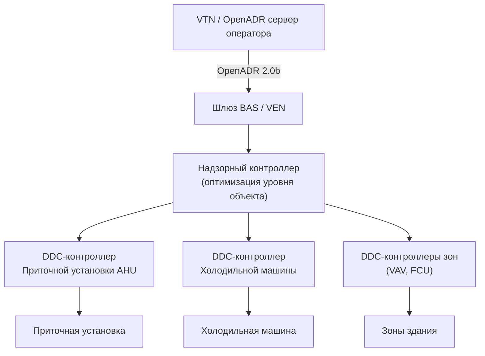
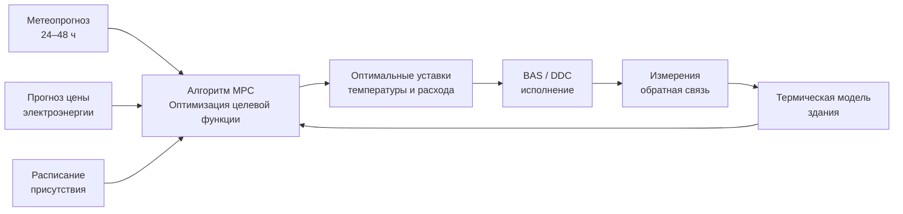

Программы реагирования на спрос (demand response, DR) требуют комплекса технологий управления и передачи данных для автоматической корректировки нагрузок HVAC в ответ на сигналы электросети. Эти технологии образуют мост между системным оператором и механическим оборудованием здания, обеспечивая точность, скорость и воспроизводимость отклика, недостижимые при ручном управлении.

## Умные термостаты

Умные термостаты (smart thermostats) — базовый интерфейс между пользователями, оборудованием HVAC и сигналами DR в жилом и малом коммерческом секторе.

### Основные функциональные возможности

- Облачная связь с серверами энергоснабжающей организации.
- Автоматическая коррекция уставок во время событий DR.
- Стратегии предварительного охлаждения или предварительного прогрева перед событиями.
- Обратная связь по потреблению энергии в режиме реального времени.
- Алгоритмы обучения графиков присутствия людей.
- Интеграция метеорологического прогноза для упреждающего управления.

### Протоколы связи

- Wi-Fi для выхода в интернет.
- OpenADR 2.0b для стандартизированных сигналов DR.
- API и промежуточное ПО энергоснабжающей организации.
- ZigBee или Z-Wave для локальных сетей устройств.
- Сотовый резервный канал для критичных приложений.

### Режимы реализации DR

**Прямое управление нагрузкой (DLC).**
Оператор непосредственно корректирует уставки в пределах заранее авторизованных диапазонов (как правило, ±1,7–2,2°C). Пользователь сохраняет возможность ручного переопределения.

**Ценовой отклик.**
Термостат реагирует на тарифы в режиме реального времени, оптимизируя уставки для минимизации стоимости при сохранении заданных комфортных ограничений.

**Событийный отклик.**
Реакция на отдельные сигналы событий DR с предварительно запрограммированными стратегиями снижения нагрузки.


| Стратегия | Типичная коррекция | Продолжительность | Снижение нагрузки |
|-----------|-------------------|-------------------|-------------------|
| Смещение уставки | +2,2°C охлаждение / −2,2°C отопление | 1–4 ч | 30–50% |
| Временное циклирование | 15 мин откл. / 45 мин вкл. | 2–6 ч | 25–40% |
| Предварительное охлаждение | −1,7°C за 2 ч до события | До события | 40–60% в период события |
| Управление вентилятором | Режим «Авто» вместо «Постоянно» | Событие | 5–15% |


## Системы автоматизации зданий (BAS)

Платформы автоматизации зданий (Building Automation System, BAS; также Building Management System, BMS) обеспечивают возможности DR уровня предприятия для коммерческих и административных зданий.

### Архитектура системы

**Полевые контроллеры (DDC):**
- Прямое цифровое управление приточными установками (AHU), крышными агрегатами, холодильными машинами.
- Локальный интеллект для отказоустойчивой работы при потере связи.
- Регистрация трендов и аварийная сигнализация.
- Протоколы: BACnet, Modbus, LonWorks.

**Надзорные контроллеры:**
- Координация стратегий DR на уровне всего объекта.
- Алгоритмы оптимизации для многозонных зданий.
- Интеграция с системами энергоменеджмента (EMCS).
- Хранение исторических данных и аналитика.

**Уровень предприятия:**
- Клиентское ПО OpenADR (VEN) на серверах BAS.
- Шлюз обмена данными здание–сеть.
- Защита от киберугроз, межсетевые экраны, сегментирование сети.

### Последовательности управления DR

1. **Подготовка до события** (за 2–4 ч):
   - Максимизация теплового накопления в массе здания.
   - Предварительное охлаждение до 20–21°C (летний сезон).
   - Зарядка ледяных или водоохладительных аккумуляторов.
   - Проверка работоспособности всего оборудования.

2. **Период события:**
   - Глобальная коррекция уставок во всех зонах.
   - Оптимизация последовательности пуска холодильных машин.
   - Повышение температуры приточного воздуха на 1,1–2,2°C.
   - Снижение подачи наружного воздуха до нормативного минимума (ASHRAE 62.1).
   - Отключение некритичных вытяжных вентиляторов.
   - Оптимальный запуск/останов по временному графику.

3. **Восстановление после события** (30–60 мин):
   - Постепенный возврат к нормальным уставкам.
   - Поэтапный перезапуск оборудования по зонам.
   - Мониторинг спроса для предотвращения обратного пика.

### Верификация производительности (M&V)

BAS обеспечивает автоматизированное измерение и верификацию:
- Регистрация спроса в кВт с интервалом 1 мин.
- Сравнение фактического потребления с базовым уровнем.
- Отчёт о подтверждённом участии в событии DR.
- Количественная оценка снижения нагрузки для расчёта стимулирующих платежей.

## Контроллеры управления нагрузкой

Специализированные контроллеры ограничения пикового спроса (demand limit controllers) обеспечивают сфокусированное управление конкретными нагрузками.

### Алгоритмы управления

**Ограничение с фиксированной уставкой.**
При достижении спросом здания предопределённого порогового значения (кВт) отключаются нагрузки по приоритетному списку до снижения спроса ниже уставки.

**Скользящая уставка.**
Лимит спроса изменяется в зависимости от времени суток, температуры наружного воздуха или тарифного расписания оператора.

**Метод идеального тарифа.**
Контроллер поддерживает примерно постоянное потребление мощности на протяжении расчётного периода, минимизируя платежи за мощность. Вычисляет допустимый текущий спрос на основе оставшегося времени в расчётном периоде:


P_{\text{доп}}(t) = \frac{E_{\text{бюджет}} - E_{\text{факт}}(t)}{T_{\text{ост}}(t)}


где E_бюджет — целевое потребление за период, E_факт — накопленное потребление, T_ост — оставшееся время.

### Приоритетная иерархия отключения нагрузок


| Приоритет | Нагрузка | Тип отключения |
|-----------|---------|----------------|
| 1 | Некритичные подключённые нагрузки (зарядные устройства, мелкая оргтехника) | Полное отключение |
| 2 | Электрические водонагреватели | Полное отключение |
| 3 | Освещение незанятых зон | Полное отключение |
| 4 | Коррекция уставки HVAC +1,1°C | Частичное снижение |
| 5 | Коррекция уставки HVAC +2,2°C | Частичное снижение |
| 6 | Некритичные вытяжные вентиляторы | Отключение |
| 7 | Вспомогательные системы (увлажнение, дополнительный нагрев) | Отключение |


Критичные нагрузки (серверные, системы безопасности, медицинское оборудование) исключены из управления.

## Интеграция систем аккумулирования энергии

### Тепловое аккумулирование (Thermal Energy Storage, TES)

**Системы аккумулирования льда.**
- Зарядка в ночные часы минимума нагрузки (22:00–06:00).
- Разрядка в пиковые периоды для компенсации работы холодильной машины.
- Конфигурации полного (full storage) или частичного (partial storage) накопления.
- При разрядке — до 100% снижения пикового электрического спроса холодильной машины.

**Аккумулирование охлаждённой воды.**
- Расслоённые накопительные баки поддерживают температурный дифференциал между холодным и тёплым слоями.
- Типовая ёмкость: 4–12 ч охлаждающей нагрузки.
- Более низкая первоначальная стоимость по сравнению с ледяными системами при большем требуемом объёме.

**Тепловая масса здания.**
- Предварительное охлаждение конструктива за 2–4 ч до события DR.
- Бетон, кирпич, мебель поглощают запас явного холода.
- Возможность смещения нагрузки на 2–4 ч без дополнительного оборудования.

**Числовой пример (офис в Москве, август, событие DR):**

Офисное здание площадью 5 000 м², монолитный железобетон. Теплоприток 50 Вт/м². Допустимый температурный дрейф 2°C.


Q_{\text{TES}} = c_{\text{уд}} \cdot A \cdot \Delta T = 9{,}0 \;\text{кДж/(м}^2\text{·°C)} \times 5000 \;\text{м}^2 \times 2\;°\text{C} = 90 \;\text{МДж}



t_{\text{DR}} = \frac{Q_{\text{TES}}}{q_{\text{приток}} \cdot A} = \frac{90 \;\text{МДж}}{50 \;\text{Вт/м}^2 \times 5000 \;\text{м}^2} = \frac{90 \times 10^6}{250\,000} = 360 \;\text{с} \approx 6 \;\text{мин на 1°C}


При полном 2°C дрейфе без активного охлаждения: около 12 мин. Это показывает, что тепловой массы одного только здания недостаточно для длительного события DR без предварительного охлаждения; совмещение с ледяными или водяными TES увеличивает время до 2–6 ч.

### Накопители электрической энергии (Battery Energy Storage System, BESS)

**Функции взаимодействия с сетью:**
- Срезание пиков (peak shaving): разрядка во время событий DR.
- Выравнивание нагрузки: снижение изменчивости электрического спроса здания.
- Резервное электроснабжение при авариях в сети.
- Услуги регулирования частоты на оптовом рынке.

**Интеграция с HVAC:**
- Питание критичного оборудования HVAC при отключениях электроэнергии.
- Продление работы холодильных машин в пиковые периоды без нагрузки на сеть.
- Снижение платы за пиковую мощность ограничением мгновенного потребления.


| Категория объекта | Ёмкость BESS, кВт·ч | Продолжительность разрядки |
|-------------------|---------------------|---------------------------|
| Малый коммерческий | 50–200 | 2–4 ч |
| Средний коммерческий | 200–1 000 | 2–4 ч |
| Крупный коммерческий | 1 000–5 000 | 2–4 ч |


## Предиктивное управление на основе модели (MPC)

Управление с предсказательной моделью (Model Predictive Control, MPC) использует цифровую термическую модель здания для оптимизации работы HVAC на горизонте 24–48 ч с учётом:

- Метеорологических прогнозов (температура, солнечная радиация, влажность).
- Расписания присутствия персонала.
- Прогнозов цены электроэнергии (тарифные зоны, RTP, CPP).
- Ограничений теплового комфорта по ASHRAE 55 / СП 60.13330.
- Технических ограничений оборудования.

**Многокритериальная оптимизация** балансирует конкурирующие цели:


\min_{u} \sum_{k=0}^{N-1} \left[ \lambda_1 C_{\text{energy}}(k) + \lambda_2 C_{\text{demand}}(k) + \lambda_3 \|\Delta T_{\text{комф}}(k)\|^2 \right]


где λ₁, λ₂, λ₃ — весовые коэффициенты приоритизации стоимости энергии, платы за мощность и дискомфорта соответственно.

MPC обеспечивает на 10–25% меньшие затраты на электроэнергию по сравнению с реактивными стратегиями DR и на 5–15% лучший тепловой комфорт по сравнению с простым смещением уставок.

## Здания, активно взаимодействующие с сетью (Grid-Interactive Buildings)

Здания, активно взаимодействующие с сетью (Grid-Interactive Efficient Buildings, GEB), оптимизируют потребление энергии в реальном времени в ответ на состояние электросети путём скоординированного управления несколькими системами.

### Ключевые характеристики GEB

**Связность:**
- Двусторонняя коммуникация с системным оператором в реальном времени.
- Доступ к информации о состоянии сети (частота, напряжение, перегрузка линий).
- Интеграция с оптовыми рынками электроэнергии.
- Участие в рынках вспомогательных услуг (регулирование частоты, вращающийся резерв).

**Вычислительный интеллект:**
- Предиктивные алгоритмы с использованием метеопрогнозов.
- Машинное обучение для оптимизации стратегий DR.
- Энергетическое моделирование и цифровые двойники здания.
- Автоматическое обнаружение неисправностей и диагностика (FDD).

**Гибкость отклика:**
- Множество стратегий DR в зависимости от потребностей сети.
- Быстрое время отклика: от секунд до минут.
- Устойчивое снижение нагрузки: несколько часов.
- Двунаправленный поток мощности при наличии локальной генерации и накопления.

### Киберзащита систем DR

Взаимодействие с электросетью открывает дополнительные векторы атак:

- Сетевая сегментация: изоляция систем BAS/HVAC от корпоративных ИТ-сетей.
- Шифрование всех каналов связи (TLS 1.2 или выше).
- Аутентификация и авторизация всех сигналов DR.
- Системы обнаружения вторжений с мониторингом трафика.
- Регулярные аудиты безопасности и тестирование на проникновение.
- Местное управление резервом (fallback) при потере связи с VTN.

### Показатели производительности


| Метрика | Целевой диапазон | Метод измерения |
|---------|-----------------|-----------------|
| Время отклика на событие DR | < 10 мин | Регистрация кВт с интервалом 1 мин |
| Величина снижения нагрузки | 20–50% нагрузки HVAC | Сравнение с базовым уровнем |
| Устойчивая продолжительность | 2–6 ч | Время при сниженной нагрузке |
| Жалобы персонала | < 5% от числа людей в здании | Опросы по комфорту |
| Точность базового уровня | ±10% от фактического | Статистический анализ |
| Время восстановления | 30–90 мин | Нормализация температуры |


## Дорожная карта внедрения

Успешное развёртывание технологий DR следует структурированной последовательности.

**Фаза 1 — Оценка:**
- Аудит существующих систем управления и измерения.
- Выявление управляемых и гибких нагрузок.
- Оценка доступных программ DR энергоснабжающей организации.
- Количественная оценка потенциала снижения нагрузки.

**Фаза 2 — Проектирование:**
- Выбор технологий (умные термостаты / BAS / MPC / TES / BESS).
- Разработка последовательностей управления по уровням DR.
- Спецификация требований к связи (OpenADR, BACnet, протоколы).
- Разработка мер киберзащиты.

**Фаза 3 — Монтаж и ввод в эксплуатацию:**
- Установка оборудования (контроллеры, датчики, счётчики).
- Конфигурирование ПО и интерфейсов.
- Регистрация VEN в системе VTN оператора.
- Наладка и тестирование последовательностей DR.

**Фаза 4 — Верификация и эксплуатация:**
- Проведение тестовых событий DR с регистрацией результатов.
- Верификация достигнутого снижения нагрузки методами M&V.
- Оценка влияния на тепловой комфорт.
- Итеративная настройка параметров управления.
- Регулярный мониторинг, отчётность и совершенствование стратегий.

Интеграция описанных технологий преобразует пассивные здания в активные ресурсы электросети, обеспечивая снижение операционных затрат и повышение надёжности сети при сохранении нормируемого качества микроклимата по ASHRAE 55 / СП 60.13330.
