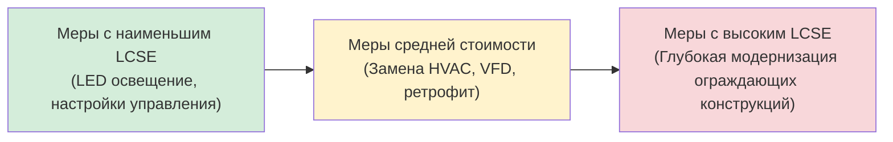

Концепция негаватта превращает энергоэффективность из экологического императива в строго экономический инструмент ресурсного планирования. Сэкономленный ватт-час рассматривается наравне с произведённым: его можно измерить, оценить, продать и включить в портфель энергетических ресурсов наравне с тепловой электростанцией или ветровой турбиной.

## Энергоэффективность как ресурс

### Характеристики ресурса

Ресурс энергоэффективности обладает специфическими атрибутами, принципиально отличающими его от генерирующих мощностей.


| Атрибут | Ресурс эффективности | Генерирующий ресурс |
|---------|---------------------|---------------------|
| Капитальные затраты | Ниже | Выше |
| Срок развёртывания | Месяцы | Годы |
| Масштабируемость | Модульная | Крупными блоками |
| Географическое расположение | Распределённый | Централизованный |
| Сетевые потери | Отсутствуют | 5–8% |
| Топливный риск | Отсутствует | Волатильность цен |
| Выбросы | Нулевые (избегнутые) | Зависят от топлива |
| Срок жизни меры | 10–25 лет | 20–40 лет |


### Категории потенциала

**Технический потенциал.** Максимально возможная экономия при применении наилучших доступных технологий независимо от стоимости. Верхняя граница.

**Экономический потенциал.** Подмножество технического потенциала, где стоимость сохранённой энергии ниже стоимости замещающего ресурса на стороне предложения (с учётом жизненного цикла). Определяет обоснованный масштаб программ DSM.

**Достижимый потенциал.** Реалистичная экономия с учётом рыночных барьеров, темпов внедрения и поведенческих факторов. Как правило, 60–80% от экономического потенциала.

## Уровневая стоимость сохранённой энергии (LCSE)

Levelized Cost of Saved Energy (LCSE) — ключевой показатель для сравнения эффективности с генерацией на единой экономической базе:


\text{LCSE} = \frac{C_0 \cdot \text{CRF} + C_{\text{О\&ТО}}}{\Delta E_{\text{год}}}, \quad [\text{руб./кВт·ч}]


где C₀ — начальные инвестиционные затраты; CRF — коэффициент возврата капитала; C_О&ТО — годовые затраты на обслуживание; ΔE_год — годовая экономия электроэнергии, кВт·ч.


\text{CRF} = \frac{r(1+r)^n}{(1+r)^n - 1}


**Числовой пример (замена крышного кондиционера, Москва):**

Замена кровельного блока с EER 11 на EER 14. Дополнительные инвестиции: 720 000 руб. Годовая экономия: 15 000 кВт·ч. Срок жизни меры: 15 лет. Ставка дисконтирования: 8%. Годовые затраты на обслуживание: 7 000 руб.


\text{CRF} = \frac{0{,}08 \times (1{,}08)^{15}}{(1{,}08)^{15} - 1} = \frac{0{,}08 \times 3{,}172}{2{,}172} = 0{,}1168



\text{LCSE} = \frac{720\,000 \times 0{,}1168 + 7\,000}{15\,000} = \frac{84\,096 + 7\,000}{15\,000} = 6{,}07 \;\text{руб./кВт·ч}


При рыночном тарифе 7 руб./кВт·ч LCSE = 6,07 < 7,00, что подтверждает экономическую целесообразность мероприятия. Инвестиции в высокоэффективный кровельный блок создают ценность для здания.

## Тест полной стоимости ресурса (TRC)

Тест TRC (Total Resource Cost Test) определяет экономическую целесообразность программы DSM с позиции всего общества:


\text{TRC} = \frac{\text{PV(Выгоды)}}{\text{PV(Затраты)}} = \frac{\text{PV(Избегнутые затраты) + PV(Нематериальные выгоды)}}{\text{PV(Затраты на меру) + PV(Администрирование программы)}}


TRC > 1,0 указывает на чистую экономическую выгоду для общества. Программы эффективности HVAC коммерческого сектора типично достигают TRC 1,5–3,0.

**Альтернативные тесты затрат:**
- **Тест участника (PCT):** перспектива потребителя (стимулы снижают эффективные затраты).
- **Тест влияния на тариф (RIM):** перспектива неучаствующего потребителя.
- **Тест коммунального предприятия (UCT):** перспектива выручки/затрат поставщика.
- **Тест общества (SCT):** включает внешние эффекты — выбросы, занятость, здоровье.

## Рамки управления спросом (DSM)

### Категории программ DSM

**Программы энергоэффективности.**
Постоянное снижение суммарного потребления за счёт улучшенного оборудования и операционных практик. Целевой показатель — кВт·ч/год. Выгоды реализуются непрерывно на протяжении срока жизни меры.

**Программы реагирования на спрос (DR).**
Временное снижение нагрузки в периоды пиков или чрезвычайных ситуаций в сети. Целевой показатель — кВт пикового спроса. Выгоды — во время стресса системы.

**Управление нагрузкой.**
Смещение потребления с пиковых на внепиковые периоды. Суммарное потребление сохраняется, но улучшается суточный коэффициент нагрузки.

**Стратегическое изменение поведения.**
Долгосрочные программы формирования поведенческих паттернов через информирование, обратную связь по потреблению и вовлечение. Дополняет технические меры, повышает устойчивость экономии.

### Принципы проектирования программ DSM

**Целевые сегменты.** Сегментация рынка по классам потребителей (жилой, коммерческий, промышленный), направлениям конечного использования (охлаждение, отопление, вентиляция, освещение) и географическим приоритетам (зоны с ограниченной пропускной способностью сети).

**Структура стимулов:**
- Скидки на модернизацию оборудования: покрытие 30–60% дополнительных затрат на эффективность.
- Льготное кредитование (зелёные кредиты).
- Прямая установка для малых мер (LED-лампы, термостаты).
- Многоуровневые стимулы для более высоких классов эффективности.
- Стимулы на основе производительности (оплата по факту верифицированной экономии).

**Механизмы администрирования:**
- Прямое администрирование коммунальной организацией.
- Независимый администратор программы (устраняет конфликт интересов).
- Гибридные модели с конкурентными торгами на отдельные услуги.

## Кривые предложения эффективности

Кривые предложения эффективности ранжируют все доступные меры по LCSE (вертикальная ось) и кумулятивной экономии в ГВт·ч (горизонтальная ось). Горизонтальная линия, соответствующая стоимости замещающего ресурса генерации, отделяет экономически целесообразные меры (ниже линии) от нецелесообразных. Площадь под этой линией определяет экономический потенциал эффективности.

Мероприятия по HVAC (замена холодильных машин, ПЧ, экономайзеры) традиционно занимают левую, наиболее выгодную часть кривой — 30–50% экономического потенциала коммерческого сектора.

## Интегрированное ресурсное планирование (IRP)

IRP включает ресурсы эффективности наравне с генерирующими вариантами в единый процесс оптимизации:

1. **Прогнозирование нагрузки:** с программами DSM и без них.
2. **Оценка ресурсов:** количественная оценка достижимого потенциала эффективности.
3. **Формирование портфеля:** построение альтернативных портфелей ресурсов.
4. **Экономический анализ:** сравнение NPV портфелей.
5. **Анализ рисков:** стресс-тестирование сценариев цен на топливо, спроса, климата.
6. **Выбор:** оптимальный набор ресурсов при ограничениях надёжности.

**Иерархия «порядка загрузки» (merit order) для IRP:**

1. Экономически целесообразная энергоэффективность (наименьший LCSE).
2. Реагирование на спрос и управление нагрузкой.
3. Возобновляемые источники.
4. Высокоэффективная ископаемая генерация (ПГУ).
5. Пиковая генерация (газовые турбины простого цикла).

## Механизмы стимулирования поставщиков энергии

**Политика «развязки» (Decoupling).**
Отделение выручки энергоснабжающей организации от объёма продаж электроэнергии через установление «дохода на потребителя» вместо «дохода на кВт·ч». Устраняет экономический стимул противодействовать программам эффективности.

**Совместное использование экономии.**
Энергоснабжающая организация сохраняет часть верифицированной экономии (5–15%). Стимул на основе производительности. Согласовывает интересы поставщика и потребителя.

**Компенсация потерянного дохода.**
Возмещение снижения объёмных продаж из средств программ DSM, делающее поставщика безразличным к эффективности с точки зрения текущих доходов.

## Измерение и верификация (M&V)

Точность количественной оценки негаватта определяется строгостью протоколов M&V.

### Установление базового уровня

Выбор базового уровня определяет заявленную экономию и существенно влияет на экономическую целесообразность:
- **Текущий базовый уровень:** производительность существующего оборудования до мероприятия.
- **Нормативный базовый уровень:** минимальная эффективность, требуемая строительными нормами (ASHRAE 90.1, СП 50.13330).
- **Базовый уровень стандартной практики:** типичный выбор потребителя без программы (наиболее релевантен для оценки вклада программы DSM).

### Сохранение экономии

Экономия деградирует во времени под влиянием нескольких факторов:
- Деградация производительности оборудования при недостаточном обслуживании.
- Физический отказ меры или её демонтаж.
- Изменение характера использования здания или занятости.
- **«Рикошетный эффект» (rebound effect):** рост потребления при снижении удельных затрат на энергию (например, пользователи увеличивают комфортные уставки при более дешёвом охлаждении).

Программы DSM учитывают деградацию через:
- Коэффициенты действующего оборудования (in-service rate): доля мер, остающихся установленными спустя N лет.
- Коэффициенты реализации (realization rate): отношение фактической экономии к прогнозной.
- Данные о сроке жизни меры (measure life): эмпирические наблюдения за реальными установками.

## Барьеры реализации и решения


| Барьер | Описание | Инструменты преодоления |
|--------|---------|------------------------|
| Разделённые стимулы | Арендодатель платит, арендатор экономит | «Зелёные» договоры аренды, разделение затрат |
| Информационная асимметрия | Отсутствие экспертизы у операторов | Энергоаудиты, техническая помощь |
| Ограничения капитала | Приоритет первоначальных затрат | ESCO-контракты, зелёные кредиты |
| Сложность верификации | Затраты на M&V | Стандартизированные таблицы deemed savings |
| «Рикошетный эффект» | Рост потребления при снижении затрат | Поведенческие программы, ценовые сигналы |
| «Снятие сливок» (cherry-picking) | Только самые лёгкие меры | Комплексные аудиты, стимулы глубокой модернизации |


Преодоление этих барьеров требует скоординированной политики, нормативного регулирования и разработки программ, выравнивающих стимулы всех участников рынка с целями развёртывания эффективности HVAC в масштабе.
