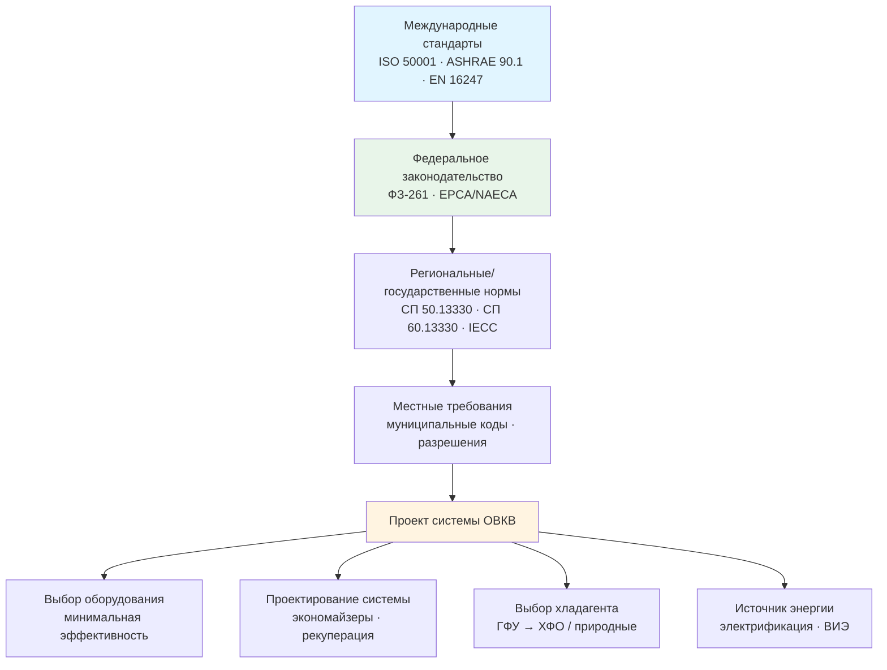

Энергетическая политика формирует нормативную и экономическую среду, в которой проектируются, вводятся в эксплуатацию и обслуживаются системы отопления, вентиляции и кондиционирования воздуха (ОВКВ, HVAC). Политические инструменты действуют одновременно на нескольких уровнях — федеральном, региональном и муниципальном, — создавая многоуровневый ландшафт требований, которые инженер-проектировщик обязан учитывать с самого начала работы над проектом.

В России ключевыми актами являются Федеральный закон № 261-ФЗ «Об энергосбережении», СП 50.13330 (тепловая защита зданий) и СП 60.13330 (ОВКВ зданий). На международном уровне ориентирами служат стандарты ASHRAE 90.1, ISO 50001, EN 16247 и EN 14825.

## Структура нормативно-правовой базы

Нормативное регулирование охватывает три уровня воздействия на системы ОВКВ.

## Стандарты минимальной эффективности оборудования

Минимальные стандарты эффективности запрещают производство и ввоз оборудования, не достигающего установленного порога. Каждое обновление стандарта обосновывается экономическим анализом жизненного цикла затрат.


| Тип оборудования | Диапазон мощности | Минимальная эффективность | Дата вступления в силу |
|---|---|---|---|
| Сплит-система кондиционирования | < 18,5 кВт | 14,0 SEER2 | 01.01.2023 |
| Моноблочный кондиционер | < 18,5 кВт | 13,4 SEER2 | 01.01.2023 |
| Воздушный тепловой насос (сплит) | < 18,5 кВт | 14,3 SEER2 / 7,5 HSPF2 | 01.01.2023 |
| Газовая печь (без каналов наружу) | < 64 кВт | 80% AFUE | Регионально |
| Коммерческая крышная установка | 18,5–38,4 кВт | 11,2 EER / 11,0 IEER | 01.01.2018 |


В России эквивалентные требования задаются через классы энергоэффективности зданий по СП 50.13330-2022 и обязательные энергетические паспорта по ФЗ-261.

## Строительные энергетические коды

Модельные энергетические коды (model energy codes) устанавливают базовые требования к новым зданиям и реконструкции. В США доминируют два кодекса: **ASHRAE 90.1** для коммерческих зданий и **IECC** (International Energy Conservation Code) для жилых и коммерческих объектов.

Каждый кодекс обновляется по трёхлетнему циклу и принимается штатами с поправками, обычно с отставанием на 1–4 года. Россия ориентируется на СП 60.13330-2020 (актуализированная редакция СНиП 41-01-2003) как технический базис для систем ОВКВ.

### Пути обеспечения соответствия

Проектировщик вправе выбрать один из трёх путей соответствия:

- **Предписывающий путь (prescriptive path)** — выполнение поэлементных требований: коэффициент теплопередачи ограждений, минимальная эффективность оборудования, наличие экономайзера. Прост в документировании, но ограничивает гибкость.
- **Путь производительности (performance path)** — энергетическое моделирование в EnergyPlus или аналоге; здание целиком должно потреблять не более расчётного базового здания. Требует больших трудозатрат, но допускает компромиссы между системами.
- **Результатно-ориентированный путь (outcome-based path)** — верификация фактического потребления через постоянный мониторинг. Устраняет разрыв между проектным замыслом и реальной эксплуатацией.

## Механизмы углеродного ценообразования

Углеродное ценообразование (carbon pricing) переводит экологические издержки выбросов парниковых газов в рыночный ценовой сигнал. Существует два основных механизма:

- **Системы ограничения и торговли (cap-and-trade)**: совокупный объём выбросов зафиксирован; разрешения торгуются на рынке. Пример — EU ETS (цена разрешения €60–90/т CO₂ в 2023–2024 гг.) и система Калифорнии ($30–40/т CO₂).
- **Углеродный налог (carbon tax)**: прямой сбор за тонну CO₂-эквивалента. Канадский федеральный налог — 80 CAD/т CO₂ (2024); Швейцария — 120 CHF/т CO₂.

Для систем ОВКВ это означает удорожание сжигания ископаемого топлива и улучшение экономики тепловых насосов. При цене углерода 50 USD/т природный газ дорожает приблизительно на 2,5 USD/ГДж — рост затрат на 15–25% к базовой ставке.

### Пример расчёта: сравнение газового котла и теплового насоса

Здание с тепловой нагрузкой Q = 100 000 кВт·ч/год:

- Газовый котёл, КПД η = 0,95: расход газа = 100 000 / 0,95 = 105 263 кВт·ч (37 900 МДж)
- Тепловой насос, COP = 3,0: расход электроэнергии = 100 000 / 3,0 = 33 333 кВт·ч


\Delta C_{\text{carbon}} = \left(\frac{Q}{\eta_{\text{gas}}} \cdot I_{\text{gas}} - \frac{Q}{\text{COP}} \cdot I_{\text{elec}}\right) \cdot P_{\text{carbon}}


При I_gas = 0,181 кг CO₂/кВт·ч, I_elec = 0,40 кг CO₂/кВт·ч, P_carbon = 50 USD/т:

- Выбросы газа: 105 263 × 0,181 = 19 053 кг CO₂ = 19,05 т → стоимость 952 USD/год
- Выбросы от электроэнергии: 33 333 × 0,40 = 13 333 кг CO₂ = 13,33 т → стоимость 667 USD/год

Разность углеродной стоимости — 285 USD/год в пользу теплового насоса. При росте цены углерода до 100 USD/т разность удваивается, что существенно улучшает срок окупаемости инвестиций в электрификацию.

## Федеральные программы стимулирования

Налоговые кредиты и субсидии снижают первоначальные инвестиционные барьеры.


| Программа | Сумма кредита | Критерии | Срок |
|---|---|---|---|
| 25C: жилая энергоэффективность | До 2 000 USD (ТН) / 1 200 USD (прочее) | ENERGY STAR, HSPF2 ≥ 7,8 | До 31.12.2032 |
| 25D: возобновляемая энергия | 30% от стоимости, без лимита | Геотермальные ТН, солнечный нагрев | До 31.12.2032 |
| 45L: новое жильё | 2 500–5 000 USD/ед. | ENERGY STAR или Zero Energy Ready | До 31.12.2032 |
| 179D: коммерческие здания | До 5,00 USD/м² | Экономия ≥ 50% vs. ASHRAE 90.1-2007 | Бессрочно |


В России аналогичную роль выполняют механизмы ФЗ-261: требования об энергетических обследованиях, энергетических паспортах, а также система «зелёной» ипотеки для зданий высшего класса энергоэффективности.

## Поэтапный отказ от хладагентов с высоким ПГП

Закон об американских инновациях и производстве (AIM Act, 2020) обязывает EPA сократить производство и потребление гидрофторуглеродов (ГФУ, HFC) на 85% к 2036 году:


| Период | Снижение относительно базового уровня |
|---|---|
| 2022–2023 | −10% |
| 2024–2028 | −40% |
| 2029–2033 | −70% |
| 2034–2036 | −80% |
| После 2036 | −85% |


Параллельно действует Кигалийская поправка к Монреальскому протоколу, принятая Россией. Это создаёт стимулы к раннему переходу на хладагенты с низким потенциалом глобального потепления (ПГП, GWP): R-454B (GWP 466), R-32 (GWP 675), R-290/пропан (GWP 3), R-744/CO₂ (GWP 1).

## Стандарты производительности зданий

Ряд городов (Нью-Йорк, Вашингтон, Бостон) ввёл обязательные стандарты производительности существующих зданий (building performance standards, BPS): крупные здания должны достигать целевых показателей энергопотребления или выбросов под угрозой штрафов. Это стимулирует глубокую модернизацию систем ОВКВ, включая замену газовых котлов на тепловые насосы и установку систем управления с оптимизацией в реальном времени.

## Влияние политики на инженерные решения

Совокупность нормативных требований и рыночных механизмов воздействует на каждый этап работы с системами ОВКВ:

**Выбор оборудования.** Минимальные стандарты исключают неэффективные варианты. Налоговые кредиты смещают экономический оптимум к премиальному оборудованию с переменной скоростью компрессора.

**Выбор топлива.** Углеродное ценообразование и мандаты на электрификацию делают тепловые насосы конкурентоспособными с газовыми системами даже без учёта государственных субсидий в регионах с низкоуглеродными электросетями.

**Оптимизация системы.** Путь производительности поощряет комплексное проектирование: снижение пиковых нагрузок через ограждающие конструкции, использование экономайзеров (free cooling), рекуперацию теплоты, передовые системы управления BMS (Building Management System).

**Стратегия хладагента.** Графики поэтапного отказа от ГФУ требуют заблаговременного планирования: оборудование, покупаемое сегодня, будет эксплуатироваться 15–25 лет и должно использовать хладагенты, доступность которых не окажется под угрозой к 2035–2040 годам.

## Ключевые источники и нормативные документы

- IEA. World Energy Outlook 2024. — Paris: IEA, 2024.
- ASHRAE Standard 90.1-2022: Energy Standard for Sites and Buildings Except Low-Rise Residential Buildings.
- ISO 50001:2018: Energy management systems — Requirements with guidance for use.
- EN 16247-2:2014: Energy audits — Part 2: Buildings.
- ФЗ-261 «Об энергосбережении и о повышении энергетической эффективности».
- СП 50.13330-2022. Тепловая защита зданий.
- СП 60.13330-2020. Отопление, вентиляция и кондиционирование воздуха.
- DOE Building Energy Codes Program: energycodes.gov.
- EPA AIM Act Implementation: epa.gov/climate-hfcs-reduction.
