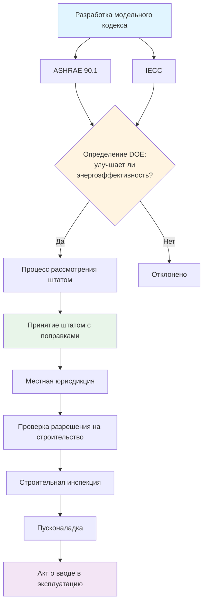
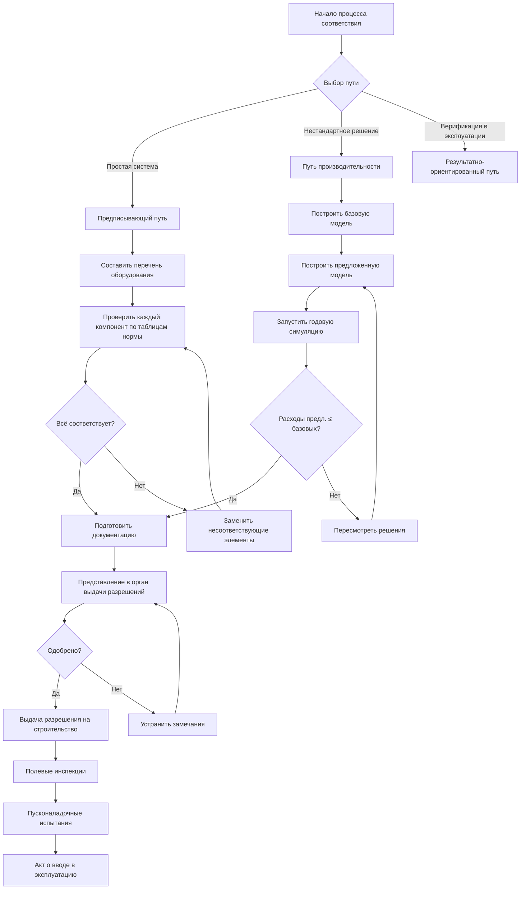

Строительные энергетические нормы (building energy codes) устанавливают минимальные требования к проектированию и строительству зданий в части энергоэффективности. Системы ОВКВ потребляют 40–60% энергии типичного здания (IEA, World Energy Outlook 2024), поэтому нормы предъявляют к ним наиболее детальные требования: минимальную эффективность оборудования, обязательные последовательности управления, требования к экономайзерам и рекуперации теплоты.

## Иерархия нормативных документов

В России аналогичная иерархия выглядит следующим образом: федеральные требования ФЗ-261 → своды правил (СП 50.13330, СП 60.13330) → региональные нормативные акты → технические условия проекта.

## Основные модельные кодексы

### ASHRAE 90.1

**Стандарт энергетической эффективности зданий (Energy Standard for Sites and Buildings Except Low-Rise Residential Buildings)** — технический базис для коммерческих энергетических кодов большинства стран. Охватывает:

- ограждающие конструкции (оболочку здания);
- системы ОВКВ (раздел 6 стандарта);
- горячее водоснабжение (раздел 7);
- электроснабжение и освещение (разделы 8–9);
- прочее оборудование (раздел 10).

Обновляется по трёхлетнему циклу; текущее издание — ASHRAE 90.1-2022. Федеральные здания США обязаны соответствовать ASHRAE 90.1 согласно Закону об энергетической политике и сохранении (EPCA).

### IECC

**Международный код энергосбережения (International Energy Conservation Code)** публикует Международный совет по кодам (ICC) по тому же трёхлетнему циклу. Коммерческий раздел IECC ссылается на ASHRAE 90.1 или содержит эквивалентные предписывающие требования. Жилой раздел использует собственную методологию, включая индекс энергетического рейтинга (Energy Rating Index, ERI).

### Российские нормы

Роль модельного кодекса в России выполняют СП 50.13330-2022 (тепловая защита зданий) и СП 60.13330-2020 (ОВКВ зданий). ФЗ-261 обязывает проводить энергетические обследования и присваивать классы энергоэффективности зданиям при вводе в эксплуатацию.

## Требования к системам ОВКВ

### Минимальная эффективность оборудования

Нормы задают минимальные коэффициенты для каждой категории оборудования в зависимости от мощности и вида (EER, IEER, SEER2, COP, IPLV). Воздухоохлаждаемые чиллеры мощностью более 500 кВт должны соответствовать минимальным значениям интегрированной частичной нагрузки (IPLV); крышные установки (RTU) — минимальным EER и IEER.

### Системные требования


| Требование | Условие обязательного применения | Норма |
|---|---|---|
| Воздушный экономайзер (air-side economizer) | Системы охлаждения > 8,8 кВт в зонах 3–8 | В зависимости от климатической зоны |
| Вентиляция с регулированием по требованию (DCV) | Помещения с переменной занятостью > 25 чел./100 м² | CO₂-управление или расчёт по ASHRAE 62.1 |
| Рекуперация теплоты вентиляции (ERV/HRV) | Доля наружного воздуха > 70% от подачи | КПД ≥ 50–70% (по зонам) |
| Сброс температуры подачи (supply air temperature reset) | Все системы переменного расхода воздуха | По наружной температуре |
| Переменный расход воды (VWF) | Насосные системы > 7,5 кВт | Насосы с ЧРП (VFD) |
| Мёртвые зоны термостата (deadband) | Все зональные регуляторы | Не менее 2,8 °C между нагревом и охлаждением |


### Интеграция с ASHRAE 62.1

Нормы требуют одновременного соответствия ASHRAE 62.1 по нормам наружного воздуха и минимизации энергетических потерь на обработку вентиляционного воздуха. Выделенные системы подачи наружного воздуха (DOAS, Dedicated Outdoor Air System) и рекуперация теплоты являются типичными решениями.

## Пути соответствия

### Предписывающий путь

Проектировщик выполняет каждый поэлементный норматив: значения U для ограждений, минимальная эффективность оборудования, наличие экономайзера, последовательности управления. Этот путь:

- не требует энергетического моделирования;
- обеспечивает предсказуемость при проверке разрешения;
- ограничивает гибкость — нельзя компенсировать отставание в одном компоненте за счёт превышения в другом.

### Путь производительности

Годовое энергопотребление предлагаемого здания (proposed building) сравнивается с базовым зданием (baseline building), выполненным по предписывающим требованиям. При использовании метода бюджета стоимости энергии (Energy Cost Budget Method) по приложению G ASHRAE 90.1:

- обе модели имеют идентичную геометрию и графики занятости;
- базовая модель использует предписывающие параметры систем;
- предлагаемая модель содержит фактические спецификации;
- соответствие достигнуто, если годовые расходы на энергию предлагаемого здания ≤ расходов базового.

Этот путь требует программного комплекса (EnergyPlus, eQUEST, IES VE) и значительно большего объёма документации, но позволяет учитывать межсистемные компромиссы.

### Результатно-ориентированный путь

Верификация фактического потребления через постоянный мониторинг и измерения (M&V, Measurement and Verification) по протоколу IPMVP. Развивающийся подход; доступен в ограниченном числе юрисдикций.

## Статус принятия кодексов в штатах США


| Регион | ASHRAE 90.1-2019 / IECC 2021 | ASHRAE 90.1-2016 / IECC 2018 | Более ранние кодексы | Без кодекса на уровне штата |
|---|---|---|---|---|
| Северо-Восток | MA, VT, RI, NY, NJ | PA, ME, NH | CT | — |
| Юго-Восток | MD, VA, NC | FL, GA, SC | TN, AL | MS |
| Средний Запад | IL, OH | MI, WI, MN | IN, IA | MO, KS |
| Запад | CA, WA, OR | NV, CO | UT, ID | AZ, MT |


Калифорния работает по собственному ускоренному циклу (Title 24), как правило, опережая модельные кодексы.

## Применение норм и обеспечение соответствия

### Экспертиза проектной документации

Органы строительного надзора проверяют проектную документацию на соответствие нормам до выдачи разрешения. Неполный пакет документов (отсутствие расчётов, спецификаций оборудования с маркировкой эффективности или последовательностей управления) задерживает проект на недели и месяцы.

### Полевые инспекции

Инспектор проверяет:

- соответствие установленного оборудования утверждённым спецификациям (сравнение табличек и актов поставки);
- выполнение теплоизоляции воздуховодов и трубопроводов;
- корректность программирования систем управления (последовательности, уставки, мёртвые зоны).

Типичные нарушения: замена согласованного оборудования на более дешёвое с низкой эффективностью, отсутствие обязательных экономайзеров, неверное программирование ЧРП.

### Пусконаладка (Commissioning)

Последние издания ASHRAE 90.1 (начиная с версии 2010 г.) требуют функциональных испытаний для зданий площадью более 500 м² и систем ОВКВ производительностью выше установленных порогов. Пусконаладочный агент (commissioning agent, CxA) проверяет:

- работу оборудования в соответствии с проектным замыслом (Design Intent);
- калибровку датчиков;
- интегрированное функционирование всех подсистем.

По ISO 50001:2018 в рамках системы энергетического менеджмента пусконаладка документируется как элемент операционного контроля.

## Числовой пример: выбор системы при предписывающем пути

**Исходные данные.** Офисное здание, климатическая зона 4A (Вашингтон), система кондиционирования 105 кВт (холодопроизводительность). Применяется ASHRAE 90.1-2022.

**Шаг 1.** По таблице 6.8.1-1 ASHRAE 90.1-2022 для воздухоохлаждаемой крышной установки мощностью 19–40 кВт: минимальный EER = 11,2; минимальный IEER = 12,2.

**Шаг 2.** Проектная система состоит из трёх RTU по 35 кВт. По данным производителя: EER = 11,8, IEER = 13,5 — превышение обоих минимумов подтверждено.

**Шаг 3.** Система охлаждения 105 кВт > 8,8 кВт → обязателен воздушный экономайзер в климатической зоне 4A. Проверяем: экономайзер дифференциального типа по сухому термометру включён в спецификацию.

**Шаг 4.** Потребление вентилятора: проектный расход воздуха 3 200 м³/ч, мощность вентилятора 2,2 кВт. Удельная мощность: 2200/3200 = 0,69 Вт/(м³/ч) — норматив ASHRAE 90.1-2022 раздел 6.5.3 для коммерческих систем составляет 0,82 Вт/(м³/ч). Требование выполнено.

Все компоненты соответствуют предписывающим требованиям → проектная документация направляется на экспертизу.

## Будущие направления развития норм

Разработчики кодексов движутся к более агрессивным целям:

- интеграция концепции сетевых интерактивных эффективных зданий (Grid-interactive Efficient Buildings, GEB);
- углеродные метрики, дополняющие энергетические показатели;
- расширенные требования к тепловым насосам в новых зданиях;
- обязательная верификация фактической производительности.

## Ключевые нормативные источники

- ASHRAE 90.1-2022: Energy Standard for Sites and Buildings Except Low-Rise Residential Buildings.
- IECC 2021: International Energy Conservation Code.
- ASHRAE 62.1-2022: Ventilation and Acceptable Indoor Air Quality in Nonresidential Buildings.
- ISO 50001:2018: Energy management systems.
- СП 60.13330-2020. Отопление, вентиляция и кондиционирование воздуха.
- СП 50.13330-2022. Тепловая защита зданий.
- ФЗ-261 «Об энергосбережении и о повышении энергетической эффективности».
- DOE Building Energy Codes Program: energycodes.gov.
