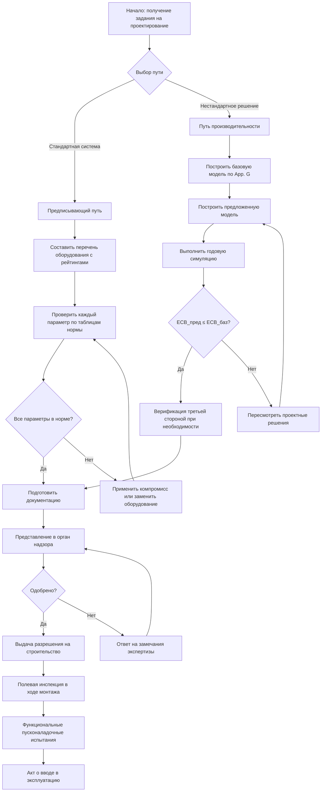

Соответствие строительному энергетическому коду демонстрирует, что проект системы ОВКВ удовлетворяет минимальным требованиям энергоэффективности, установленным в IECC (International Energy Conservation Code) или ASHRAE 90.1. Выбор пути соответствия определяет объём документации, гибкость проектных решений и методологию взаимодействия с органом выдачи разрешений.

## Сравнение путей соответствия


| Путь соответствия | Гибкость проекта | Объём документации | Типичное применение | Требуется моделирование |
|---|---|---|---|---|
| Предписывающий | Низкая | Минимальный | Стандартные типовые системы | Нет |
| Компромиссный | Средняя | Умеренный | Оптимизация отдельных компонентов | Ограниченное |
| Производительности | Высокая | Значительный | Инновационные и нестандартные решения | Да |
| Бюджета стоимости энергии | Максимальная | Наиболее обширный | Сложные многосистемные проекты | Да |


## Предписывающий путь соответствия

Предписывающий путь (prescriptive path) требует, чтобы каждый компонент системы здания соответствовал или превышал конкретное поэлементное требование нормы. Один несоответствующий элемент дисквалифицирует весь путь — если только не применяется метод компромисса.

### Основные проверяемые параметры

**Требования к оборудованию ОВКВ:**

- минимальные рейтинги эффективности по типу и диапазону мощности (SEER2, EER, IEER, COP, IPLV, AFUE);
- обязательные воздушные экономайзеры (air-side economizers) для систем охлаждения выше пороговых размеров в заданных климатических зонах;
- теплоизоляция воздуховодов: значения R — в зависимости от расположения (в кондиционируемой или некондиционируемой зоне) и разности температур;
- ограничения удельной мощности вентиляторов: не более 0,82 Вт/(м³/ч) для типичных коммерческих систем по ASHRAE 90.1-2022;
- последовательности управления: переключение режимов термостата, вентиляция с регулированием по требованию (DCV, Demand-Controlled Ventilation), оптимальный запуск.

### Числовой пример: проверка требования к экономайзеру

**Исходные данные.** Климатическая зона 4A (смешанный влажный климат), коммерческая система кондиционирования холодопроизводительностью 25 кВт.

По таблице 6.5.1.1 ASHRAE 90.1-2022 экономайзер обязателен для систем > 8,8 кВт в зонах 3–8. Минимальный расход наружного воздуха через экономайзер — 100% от проектной подачи воздуха при благоприятных наружных условиях.

**Проверка.** Проектная система предусматривает дифференциальный воздушный экономайзер по сухому термометру с диапазоном переключения: режим экономайзера при T_нар < T_подачи − 1,1 °C. Привод воздушной заслонки с позиционированием 0–100%. Условие соблюдено.

**Дополнительно** по предписывающему пути: при наличии экономайзера интегрирование с управлением механического охлаждения должно обеспечивать запрет включения компрессора при достаточной охлаждающей способности наружного воздуха (раздел 6.5.1.3 ASHRAE 90.1-2022).

## Компромиссный путь соответствия

Компромиссный путь (trade-off path) допускает снижение эффективности в одном компоненте при компенсирующем превышении в другом в рамках одной системы.

### Метод суммарного коэффициента теплопередачи UA по IECC

Для ограждающей оболочки метод позволяет отступить от требования к отдельному компоненту (например, окну) при условии, что суммарная тепловая проводимость UA предлагаемого здания не превышает UA базового:


UA_{\text{пред}} \leq UA_{\text{баз}}


где $UA$ [Вт/К] — произведение коэффициента теплопередачи и площади для каждого элемента ограждения, суммируемое по всем элементам.

### Компромиссы по приложению G ASHRAE 90.1

Приложение G допускает компромиссы только внутри одной категории систем (оболочка — к — оболочке; ОВКВ — к — ОВКВ), но не между категориями без полного анализа производительности.


| Тип компромисса | Допустимые обмены | Метод расчёта | Ограничения |
|---|---|---|---|
| Ограждающая оболочка | Коэффициент U стены ↔ U остекления | Суммирование UA | Одна и та же климатическая зона |
| ОВКВ | Эффективность оборудования ↔ наличие экономайзера | Энергетическая эквивалентность | Тот же тип системы |
| Освещение | КПД светильника ↔ управление освещением | Вт/м² | Тот же тип помещения |


## Путь производительности

Путь производительности (performance path) основан на полногодовом энергетическом моделировании здания и сравнении предлагаемого проекта с базовым зданием.

### Метод бюджета стоимости энергии (ASHRAE 90.1, приложение G)

Годовые расходы на энергию предлагаемого здания (proposed design) должны быть не выше расходов базового здания (baseline building):


\text{ECB}_{\text{пред}} \leq \text{ECB}_{\text{баз}}


Условия моделирования:

- обе модели имеют идентичную геометрию и графики занятости по приложению G ASHRAE 90.1;
- базовое здание использует предписывающие параметры всех систем;
- предлагаемое здание использует фактические спецификации;
- к обеим моделям применяются одинаковые тарифы на энергию;
- ориентация базовой модели усредняется по четырём поворотам на 90°.

### Требования к предлагаемой модели

- Фактические рейтинги эффективности оборудования и конфигурация системы.
- Фактические последовательности управления и уставки (supply air temperature reset, demand-controlled ventilation и т. д.).
- Документированные допущения для нестандартных систем с обоснованием.

### Выбор программного обеспечения

Для соответствия по пути производительности допускаются программы, прошедшие верификацию по ASHRAE 140 (Standard Method of Test for the Evaluation of Building Energy Analysis Computer Programs): EnergyPlus, eQUEST, IES VE, DesignBuilder. Российские органы экспертизы дополнительно допускают расчёты по методологии СП 50.13330-2022.

## Блок-схема процесса соответствия

## Требования к документации

### Предписывающий путь

- спецификации оборудования с номерами моделей и сертифицированными рейтингами эффективности (AHRI Certified Directory);
- расчёты теплоизоляции воздуховодов и трубопроводов;
- последовательности управления (Sequences of Operation);
- заполненные формы соответствия нормы (compliance forms) — обычно предоставляет орган выдачи разрешений.

### Путь производительности

- полный отчёт об энергетическом моделировании: исходные данные, результаты, допущения;
- входные файлы моделей базовой и предлагаемой конструкции;
- спецификации оборудования для обеих моделей;
- описание методологии моделирования и обоснование нестандартных допущений;
- при требовании юрисдикции — заключение верификатора третьей стороны.

## Требования к пусконаладке

ASHRAE 90.1-2022 (раздел 8 приложения к главе 6) обязывает выполнять пусконаладку (commissioning) для зданий площадью более 232 м² (2 500 ft²), а для определённых типов оборудования — без ограничений по площади. Минимальный объём пусконаладки:

1. Проверка проектной документации (design review) на соответствие последовательностям управления.
2. Предпусковая инспекция оборудования на заводе и на объекте.
3. Функциональные испытания всех управляющих последовательностей, включая аварийные режимы.
4. Калибровка датчиков температуры, давления, расхода воздуха и воды.
5. Документирование результатов испытаний и обучение операторов.

В России аналогичные требования содержатся в ГОСТ Р 53300-2009 (контроль воздухопроницаемости) и ведомственных нормах технической приёмки систем ОВКВ.

## Числовой пример: путь производительности

**Объект.** Офисное здание 3 000 м² в климатической зоне 5A (Чикаго). Предлагается система VRF (Variable Refrigerant Flow) с рекуперацией теплоты вместо стандартных крышных установок (RTU) с газовыми нагревателями.

**Шаг 1: базовая модель.** По ASHRAE 90.1-2022 приложение G базовая система для офисного здания зоны 5A площадью > 2 300 м² — воздушные системы переменного расхода (VAV) с повторными нагревателями и газовым котлом.

- Базовый EER крышных RTU: 11,2 (предписывающий минимум).
- Базовый КПД котла: 80% AFUE.

**Шаг 2: предлагаемая модель.** VRF с рекуперацией теплоты:

- Суммарный IEER системы VRF: 17,6 Btu/(Вт·ч) ≈ COP_охл = 5,16.
- COP нагрева в режиме теплового насоса: 3,8 при −8 °C наружного воздуха.
- Рекуперация теплоты между зонами охлаждения и отопления: снижение пиковой нагрузки на котёл на ~35%.

**Шаг 3: симуляция.** Годовые расходы на энергию:

- Базовое здание (EnergyPlus): 142 000 USD/год.
- Предлагаемое здание: 108 000 USD/год.

Соотношение: 108 000 / 142 000 = 0,76 — предлагаемое здание потребляет на 24% меньше. Соответствие подтверждено, поскольку ECB_пред < ECB_баз.

## Общие проблемы при обеспечении соответствия

**Проверка эффективности оборудования.** Необходимо использовать рейтинги из сертифицированного каталога AHRI (AHRI Certified), а не из маркетинговых материалов. Рейтинги при частичной нагрузке (IPLV, IEER) и полной нагрузке (EER, COP) применяются в разных контекстах и не взаимозаменяемы.

**Определение климатической зоны.** Требования ASHRAE 90.1 и IECC существенно различаются между зонами 1–8. Ошибка в определении зоны проекта делает всю документацию соответствия недействительной.

**Требования к экономайзеру.** Пороги мощности, разрешённые типы управления (дифференциальный по сухому термометру, дифференциальный по энтальпии, фиксированный по сухому термометру) и исключения (высокогорные места, влажный климат) различаются между IECC и ASHRAE 90.1 — необходимо внимательно читать применимую редакцию.

**Мёртвые зоны термостата.** Отсутствие мёртвой зоны (deadband) ≥ 2,8 °C между уставками нагрева и охлаждения — одно из наиболее частых нарушений при полевой инспекции.

## Применение и правоприменение

Органы строительного надзора применяют соответствие через проверку планов и инспекцию на объекте. Несоответствие, выявленное в ходе инспекции, требует корректирующих мероприятий до выдачи акта о вводе в эксплуатацию. Постоянные изменения после ввода в эксплуатацию (замена оборудования, изменение управляющих уставок) также должны поддерживать соответствие нормам.

## Нормативные источники

- ASHRAE 90.1-2022: Energy Standard for Sites and Buildings Except Low-Rise Residential Buildings. — Atlanta: ASHRAE, 2022.
- IECC 2021: International Energy Conservation Code.
- ASHRAE 140-2017: Standard Method of Test for the Evaluation of Building Energy Analysis Computer Programs.
- EN 16247-2:2014: Energy audits — Part 2: Buildings.
- СП 60.13330-2020. Отопление, вентиляция и кондиционирование воздуха.
- ФЗ-261 «Об энергосбережении и о повышении энергетической эффективности».
