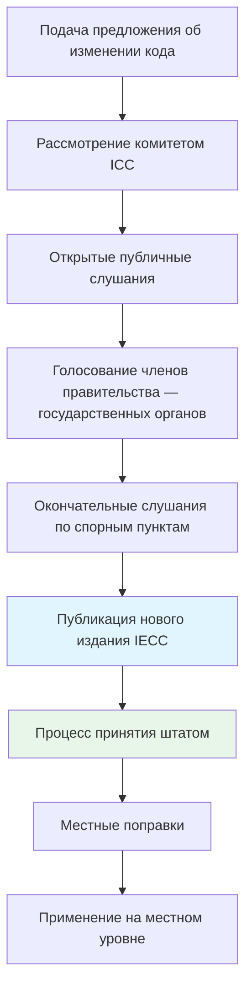
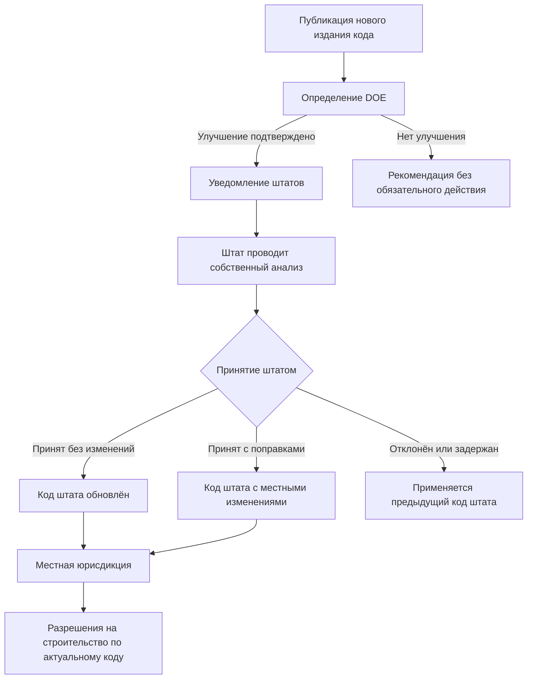

Модельные энергетические коды (model energy codes) устанавливают минимальные требования к ограждающим конструкциям, механическим системам, освещению и горячему водоснабжению. Они разрабатываются консенсусными организациями, принимаются штатами и местными юрисдикциями с поправками и служат технической базой для выдачи разрешений на строительство. В США доминируют два кода: **IECC** (International Energy Conservation Code) Международного совета по кодам (ICC) и **ASHRAE 90.1** Американского общества инженеров по отоплению, охлаждению и кондиционированию воздуха (ASHRAE).

## Сравнение IECC и ASHRAE 90.1


| Аспект | IECC | ASHRAE 90.1 |
|---|---|---|
| Организация-разработчик | ICC (International Code Council) | ASHRAE |
| Тип документа | Предписывающий модельный строительный код | Консенсусный стандарт на основе производительности |
| Цикл обновления | 3 года (2021, 2024, 2027) | 3 года (2019, 2022, 2025) |
| Область применения | Жилые и коммерческие здания | Коммерческие здания и многоэтажные жилые дома |
| Механизм принятия | Прямое принятие юрисдикциями | Ссылка в федеральных нормах; альтернатива IECC |
| Пути соответствия | Предписывающий, производительности, ERI | Предписывающий, производительность здания, ECB |
| Язык документа | Обязательный («должен») | Стандарт с обязательными положениями |
| Федеральный статус | Основа кодексов многих штатов | Обязателен для федеральных зданий |
| Охват разделов | Оболочка, механика, освещение, ГВС | Оболочка, ОВКВ, ГВС, электроснабжение, освещение, прочее |


Ключевое различие: IECC — это строительный код с языком «должен выполнить», принимаемый как закон. ASHRAE 90.1 — технический стандарт, который становится обязательным только при ссылке на него в кодексе или законодательстве.

## Процессы разработки кодов

### Разработка IECC (ICC)

ICC использует **консенсус правительства**: предложения об изменениях вправе подавать любые лица; финальное голосование принадлежит представителям органов власти (government members). Это обеспечивает участие регуляторов и строительных чиновников в формировании требований.

### Разработка ASHRAE 90.1

ASHRAE следует одобренным ANSI процедурам консенсуса:

1. Любое лицо может подать предложение (addendum) в любое время — процесс непрерывный.
2. Постоянный комитет стандартного проекта (SSPC 90.1) рассматривает предложения на регулярных заседаниях.
3. 45-дневный период открытых комментариев для каждого предложенного дополнения.
4. SSPC рассматривает все полученные комментарии и публикует ответы.
5. Правление ASHRAE утверждает стандарт.
6. Новые издания выходят примерно каждые три года.

Непрерывный процесс позволяет выпускать промежуточные дополнения (addenda) между полными изданиями — инженеры должны отслеживать как даты выхода изданий, так и отдельные дополнения.

## Определение DOE и цикл принятия штатами

Министерство энергетики США (DOE) проводит **определение** (determination) каждого нового издания модельного кода: устанавливает, улучшает ли новое издание энергоэффективность по сравнению с предыдущим. Положительное определение запускает обязательный процесс: штаты в течение двух лет обязаны подтвердить, что их нормы соответствуют или превышают новое издание.

### Типичные схемы принятия


| Схема принятия | Примеры штатов | Типичное отставание | Примечания |
|---|---|---|---|
| Обязательный кодекс штата | CA, FL, NY, WA, OR, MA | 1–3 года | Единый код для всех юрисдикций штата |
| Кодекс штата с местной опцией | TX, NC, VA, CO | 2–4 года | Местные органы могут принять или ужесточить |
| Только местное принятие | MS, MO, KS | Варьируется | Нет единого кода штата |
| Нет энергетического кода | Части MS | — | Ограниченные или отсутствующие требования |


Калифорния применяет собственный ускоренный цикл (Title 24, Part 6), обновляемый каждые два года и, как правило, опережающий модельные коды.

## Пути соответствия

### Методы IECC

**Предписывающий путь.** Соответствие поэлементным требованиям к ограждениям, остеклению, воздухопроницаемости, эффективности механических систем и плотности мощности освещения. Не требует энергетического моделирования.

**Путь производительности.** Предлагаемое здание потребляет не более энергии базового здания. Для жилых зданий применяется индекс энергетического рейтинга (Energy Rating Index, ERI).

**Дополнительные пакеты эффективности (Additional Efficiency Packages).** Выбор мер из предустановленного меню (раздел C406 IECC 2021) для достижения соответствия через сочетание мероприятий.

### Методы ASHRAE 90.1

**Предписывающий путь.** Соответствие минимальным требованиям каждого основного раздела: оболочка здания (раздел 5), механика (раздел 6), ГВС (раздел 7), электроснабжение (раздел 8), освещение (раздел 9), прочее оборудование (раздел 10).

**Метод производительности здания (Building Performance Rating Method).** Годовой анализ стоимости энергии; предлагаемый проект обходится не дороже базового.

**Метод бюджета стоимости энергии (Energy Cost Budget Method, ECB).** Наиболее гибкий подход: допускает межсистемные компромиссы при условии, что суммарные расходы на энергию здания не превышают расходов базового.

## Сравнение строгости изданий


| Сравниваемые издания | Относительная строгость | Примечательные различия |
|---|---|---|
| IECC 2009 vs. ASHRAE 90.1-2007 | Примерно эквивалентны | ASHRAE 90.1 детализированнее |
| IECC 2012 vs. ASHRAE 90.1-2010 | IECC немного строже | Требования к оболочке IECC жёстче в ряде зон |
| IECC 2015 vs. ASHRAE 90.1-2013 | Примерно эквивалентны | Схожие результаты, разные методы расчёта |
| IECC 2018 vs. ASHRAE 90.1-2016 | ASHRAE 90.1 немного строже | Требования к освещению ASHRAE 90.1 охватывают больше ситуаций |
| IECC 2021 vs. ASHRAE 90.1-2019 | IECC строже | IECC вводит требования к возобновляемой энергии (C406) |


По оценкам DOE, издания, начиная с ASHRAE 90.1-2013, достигают экономии энергии 30–50% по сравнению с базовым уровнем ASHRAE 90.1-2004.

## Числовой пример: экономия от перехода к более строгому изданию

**Задача.** Оценить снижение расчётного энергопотребления при переходе с ASHRAE 90.1-2007 на ASHRAE 90.1-2019 для офисного здания площадью 5 000 м² в климатической зоне 4A.

**Данные из отчёта DOE (Pacific Northwest National Laboratory, 2020):**

- ASHRAE 90.1-2007 → 2010: −18,5% суммарного энергопотребления
- ASHRAE 90.1-2010 → 2013: −8,4%
- ASHRAE 90.1-2013 → 2016: −7,6%
- ASHRAE 90.1-2016 → 2019: −4,7%

Суммарная экономия 2007 → 2019 (кумулятивно по данным DOE):


\Delta E_{\text{кум}} \approx 1 - \prod_{i}(1 - \Delta E_i) = 1 - (1 - 0{,}185)(1 - 0{,}084)(1 - 0{,}076)(1 - 0{,}047) \approx 33{,}4\%


При базовом потреблении 200 кВт·ч/(м²·год) по ASHRAE 90.1-2007 и площади 5 000 м²:

- Базовое потребление: 200 × 5 000 = 1 000 000 кВт·ч/год
- По ASHRAE 90.1-2019: 1 000 000 × (1 − 0,334) ≈ 666 000 кВт·ч/год
- Экономия: 334 000 кВт·ч/год

При тарифе 0,12 USD/кВт·ч — годовая экономия: 40 080 USD. Для штатов, перешедших с ASHRAE 90.1-2007 на 2019, это прямой экономический эффект от своевременного обновления нормативной базы.

## Федеральные ссылки и обязательный характер

Федеральные объекты США обязаны соответствовать ASHRAE 90.1 по EPCA (Energy Policy and Conservation Act) и последующим нормативным актам. Федеральные агентства не вправе строить здания менее эффективными, чем последнее действующее издание стандарта. Многие государственные программы стимулирования (налоговый кредит 179D, программа LEED) ссылаются на IECC или ASHRAE 90.1 как на базовый уровень для расчёта сверхнормативной эффективности.

Программа DOE Building Energy Codes Program предоставляет техническую поддержку, инструменты соответствия и обучение для реализации кодексов на государственном и местном уровнях (energycodes.gov).

## Ключевые нормативные источники

- ASHRAE 90.1-2022: Energy Standard for Sites and Buildings Except Low-Rise Residential Buildings. — Atlanta: ASHRAE, 2022.
- IECC 2021: International Energy Conservation Code. — Country Club Hills: ICC, 2021.
- PNNL-30846: ASHRAE 90.1-2019 Determination Analysis. — Pacific Northwest National Laboratory, 2021.
- EN 16247-1:2012: Energy audits — Part 1: General requirements.
- СП 60.13330-2020. Отопление, вентиляция и кондиционирование воздуха.
- DOE Building Energy Codes Program: energycodes.gov.
