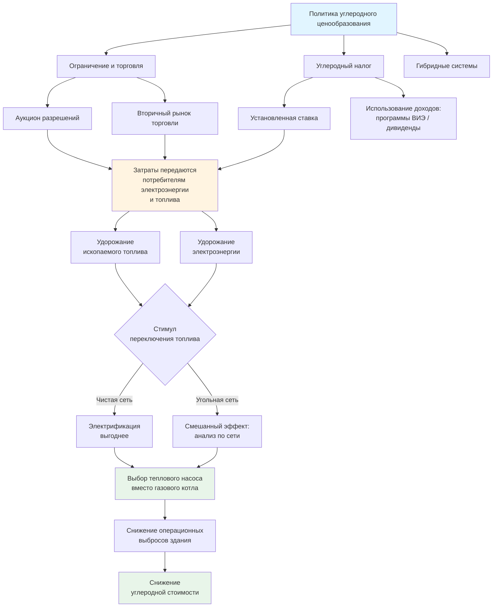

Углеродное ценообразование (carbon pricing) переводит экологические издержки выбросов парниковых газов в рыночный ценовой сигнал, который непосредственно отражается на операционных расходах зданий. Для систем ОВКВ это означает удорожание ископаемого топлива и создание финансового преимущества для электрификации — при условии, что углеродная интенсивность электросети достаточно низка. По оценке Всемирного банка (State and Trends of Carbon Pricing 2024), более 70 программ углеродного ценообразования охватывают около 23% мировых выбросов парниковых газов.

## Механизмы углеродного ценообразования

### Системы ограничения и торговли (cap-and-trade)

Система cap-and-trade устанавливает максимально допустимый совокупный объём выбросов (cap) и создаёт торгуемые разрешения. Компании, сокращающие выбросы ниже выделенного лимита, продают избыток тем, кто его превышает.

**Ключевые характеристики:**
- экологическая определённость: совокупный объём выбросов зафиксирован;
- ценовая неопределённость: цены на разрешения определяет рынок;
- экономическая эффективность: сокращения достигаются там, где это дешевле всего.

### Углеродный налог (carbon tax)

Углеродный налог устанавливает фиксированную ставку за тонну CO₂-эквивалента, как правило, в точке добычи или импорта топлива.

**Ключевые характеристики:**
- ценовая определённость: ставка установлена законом;
- административная простота по сравнению с системой торговли;
- доходы могут финансировать программы чистой энергии или возвращаться налогоплательщикам;
- экологический результат зависит от адекватности ставки.

### Гибридные механизмы и компенсационные кредиты

Ряд юрисдикций комбинирует элементы обоих подходов — например, устанавливает ценовой коридор (price floor и price ceiling) в системе торговли. Программы углеродных компенсаций (carbon offsets) позволяют зачёт верифицированных сокращений выбросов в других секторах, включая модернизацию ОВКВ, лесовосстановление или развитие ВИЭ.

## Глобальные программы углеродного ценообразования


| Регион | Механизм | Охват | Цена (2024) | Канал воздействия на ОВКВ |
|---|---|---|---|---|
| Европейский союз | EU ETS (cap-and-trade) | Электроэнергия, промышленность | €60–90/т CO₂ | Косвенно через тариф на электроэнергию |
| Калифорния | Cap-and-trade | Электроэнергия, топливо, промышленность | 30–40 USD/т CO₂ | Электроэнергия и природный газ |
| Канада (федеральный) | Углеродный налог | Все виды топлива | 80 CAD/т CO₂ | Прямой сбор при покупке топлива |
| RGGI (Северо-Восток США) | Cap-and-trade | Электроэнергетика | 10–15 USD/т CO₂ | Тариф на электроэнергию |
| Великобритания | Carbon Price Support | Производство электроэнергии | £18/т CO₂ | Тариф на электроэнергию |
| Швейцария | Углеродный налог | Топливо для отопления | 120 CHF/т CO₂ | Прямой сбор за отопительное топливо |
| Южная Корея | ETS | Электроэнергия, промышленность, здания | 10–20 USD/т CO₂ | Прямое для крупных зданий |


## Влияние на топливные затраты систем ОВКВ

### Удорожание ископаемого топлива

При цене углерода P_c [USD/т CO₂] добавочная стоимость единицы топлива:


\Delta C_{\text{топл}} = I_{\text{топл}} \cdot P_c


где I_топл — углеродная интенсивность топлива [т CO₂/ГДж].


| Вид топлива | I_топл, т CO₂/ГДж | Добавка, USD/ГДж | Добавка, % к рыночной цене |
|---|---|---|---|
| Природный газ | 0,0531 | 2,65 | 15–25% |
| Мазут № 2 | 0,0732 | 3,66 | 20–30% |
| Пропан | 0,0629 | 3,15 | 18–26% |
| Уголь | 0,0953 | 4,77 | 30–50% |


### Влияние на электроэнергию

Для электрической системы воздействие зависит от структуры генерации в энергосистеме (electricity grid carbon intensity):


| Тип энергосистемы | Углеродная интенсивность, кг CO₂/кВт·ч | Удорожание, USD/кВт·ч |
|---|---|---|
| Угольная доминирует | 0,90–1,10 | 0,045–0,055 |
| Природный газ | 0,40–0,50 | 0,020–0,025 |
| Смешанная с ВИЭ | 0,20–0,30 | 0,010–0,015 |
| Гидро/атомная | 0,02–0,05 | 0,001–0,003 |


## Числовой пример: точка безубыточности углеродного налога

**Исходные данные.** Здание с годовой тепловой нагрузкой Q = 100 000 кВт·ч/год. Альтернативы: газовый котёл (η = 0,95) или тепловой насос (COP = 3,0).

Энергопотребление:
- Газовый котёл: E_gas = 100 000 / 0,95 = 105 263 кВт·ч
- Тепловой насос: E_elec = 100 000 / 3,0 = 33 333 кВт·ч

Годовые выбросы:
- Газ: 105 263 × 0,053 т CO₂/ГДж × (1 ГДж / 278 кВт·ч) = 20,1 т CO₂
- Электроэнергия (I_elec = 0,40 кг/кВт·ч): 33 333 × 0,40 / 1 000 = 13,3 т CO₂

Точка безубыточности — цена углерода P_be, при которой суммарные затраты равны:


P_{be} = \frac{(E_{\text{elec}} \cdot C_{\text{elec}}) - (E_{\text{gas}} \cdot C_{\text{gas}})}{E_{\text{gas}} \cdot I_{\text{gas}} - E_{\text{elec}} \cdot I_{\text{elec}}}


При C_elec = 0,12 USD/кВт·ч, C_gas = 0,08 USD/кВт·ч (≈ 2,28 USD/м³):

- Годовые затраты без углеродной цены: газ — 8 421 USD, ТН — 4 000 USD.
- Ситуация уже в пользу теплового насоса без углеродной цены (при данном соотношении тарифов).

При C_gas = 0,03 USD/кВт·ч (низкий тариф на газ):

- Газ: 105 263 × 0,03 = 3 158 USD; ТН: 4 000 USD.
- Разность стоимости: 4 000 − 3 158 = 842 USD/год в пользу газа.
- Разность выбросов: 20,1 − 13,3 = 6,8 т CO₂/год в пользу ТН.
- P_be = 842 / 6,8 = **124 USD/т CO₂** — при такой цене ТН становится равновыгодным.

При I_elec = 0,10 кг/кВт·ч (декарбонизированная сеть):
- Выбросы ТН: 33 333 × 0,10 / 1 000 = 3,33 т CO₂.
- P_be = 842 / (20,1 − 3,33) = 842 / 16,8 = **50 USD/т CO₂** — электрификация окупается уже при нынешних европейских ценах на углерод.

## Влияние на выбор хладагента

Ряд юрисдикций устанавливает отдельное ценообразование на выбросы хладагентов с высоким потенциалом глобального потепления (ПГП, GWP). Годовая углеродная стоимость утечки:


C_{\text{хладаг}} = M \cdot L \cdot \text{GWP} \cdot P_c


где M — масса заряда хладагента [кг], L — годовая доля утечки, GWP — потенциал глобального потепления [кг CO₂/кг].

**Пример.** Заряд 50 кг R-410A (GWP = 2 088), L = 5%/год, P_c = 100 USD/т CO₂:

- Годовая утечка: 50 × 0,05 = 2,5 кг
- CO₂-эквивалент: 2,5 × 2 088 = 5 220 кг = 5,22 т
- Углеродная стоимость: 5,22 × 100 = **522 USD/год**

Альтернатива R-32 (GWP = 675):
- CO₂-эквивалент: 2,5 × 675 = 1 688 кг = 1,69 т
- Углеродная стоимость: **169 USD/год**
- Экономия: 353 USD/год — дополнительный аргумент в пользу хладагентов с низким GWP.

## Анализ жизненного цикла при углеродном ценообразовании

Выбор системы ОВКВ при действующем углеродном ценообразовании требует анализа чистой приведённой стоимости (NPV) с учётом прогнозируемой траектории цен на углерод:


\text{NPV} = -C_0 + \sum_{t=1}^{n} \frac{\Delta E_t \cdot C_{\text{энерг}} + \Delta E_t^{\text{CO}_2} \cdot P_{c,t}}{(1 + r)^t}


где:
- C_0 — капитальный дифференциал (более дорогой ТН vs. газовый котёл), USD;
- ΔE_t — годовая экономия энергии в год t, кВт·ч;
- ΔE_t^CO₂ — годовое снижение выбросов, т CO₂;
- P_{c,t} — цена углерода в год t, USD/т;
- r — реальная ставка дисконтирования (обычно 3–7%);
- n — срок анализа, лет.

Углеродный налог Британской Колумбии: 10 CAD/т в 2008 г. → 65 CAD/т в 2023 г., с ежегодным ростом, закреплённым в законе. Аналогичная траектория запланирована в большинстве юрисдикций до 2030 г. Системы ОВКВ со сроком службы 15–25 лет должны учитывать ожидаемый рост цен на углерод при выборе технологии сегодня.

## Мировой ландшафт: блок-схема воздействия

## Стратегические выводы для проектировщика

1. **Проводить сценарный анализ** при P_c = 50, 100, 150 USD/т CO₂ — диапазон, ожидаемый к 2030 г. во всех крупных юрисдикциях.
2. **Учитывать декарбонизацию сети**: углеродная интенсивность электроэнергии будет снижаться, что делает тепловые насосы со временем всё более выгодными.
3. **Выбирать хладагенты с низким GWP**: R-32, R-454B, R-290, R-744 снижают непосредственные выбросы и риски будущего ценообразования на хладагенты.
4. **Проектировать с запасом по электрификации**: даже если сегодня выгоднее газ, закладывать в конструкцию возможность быстрой замены котла на тепловой насос.
5. **Интегрировать системы мониторинга выбросов**: точный учёт потребления и выбросов по источникам — обязательный инструмент при управлении углеродными рисками портфеля зданий.

## Ключевые источники

- Всемирный банк. State and Trends of Carbon Pricing 2024. — Washington, D.C.: World Bank, 2024.
- IEA. Energy Prices 2024. — Paris: IEA, 2024.
- IRENA. World Energy Transitions Outlook 2024. — Abu Dhabi: IRENA, 2024.
- BP Statistical Review of World Energy 2023. — London: BP, 2023.
- ASHRAE 90.1-2022: Energy Standard for Sites and Buildings Except Low-Rise Residential Buildings.
- СП 60.13330-2020. Отопление, вентиляция и кондиционирование воздуха.
- ФЗ-261 «Об энергосбережении и о повышении энергетической эффективности».
