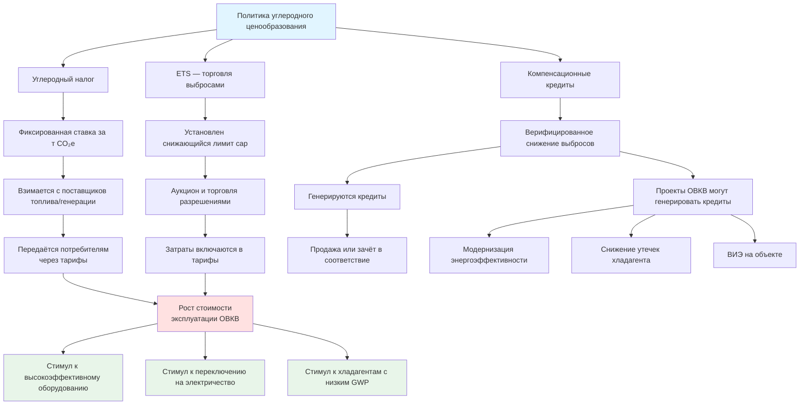

Механизмы углеродного ценообразования преобразуют выбросы парниковых газов в финансовые затраты, прямо или косвенно влияя на стоимость эксплуатации систем ОВКВ. Оператор здания сталкивается с двумя каналами воздействия: ростом тарифов на электроэнергию (через ценообразование на генерацию) и прямым удорожанием ископаемых видов топлива (через налог или обязательство приобрести разрешения на выбросы).

## Основные механизмы

### Углеродный налог

Углеродный налог устанавливает фиксированную ставку за метрическую тонну CO₂-эквивалента. Налог взимается с поставщиков топлива или энергии — производителей и дистрибьюторов — и переносится на конечных потребителей через тарифы.

**Как это работает для ОВКВ:**

Система отопления на природном газе: при ставке налога P_c [USD/т CO₂] и удельных выбросах природного газа 53,1 кг CO₂/ГДж добавочная стоимость топлива:


\Delta C_{\text{газ}} = \frac{53{,}1 \cdot P_c}{1\,000 \cdot 278} \approx 0{,}000191 \cdot P_c \quad [\text{USD/кВт·ч}]


При P_c = 80 USD/т: добавка ≈ 0,0153 USD/кВт·ч к цене газа — рост на 15–25% к типичным розничным ценам.

### Системы торговли выбросами (Emissions Trading Schemes, ETS)

Система ETS устанавливает снижающийся лимит совокупных выбросов (cap) и торгуемые разрешения. Регулируемые участники (электростанции, крупные промышленные предприятия) обязаны сдавать разрешения в объёме своих фактических выбросов.

**Как это работает для ОВКВ:** здания, как правило, не являются прямыми участниками ETS. Воздействие косвенное: поставщики электроэнергии и газа включают затраты на разрешения в тарифы.

### Углеродные компенсации (carbon offsets)

Программы компенсаций позволяют зачесть верифицированное сокращение выбросов в одном месте против обязательств в другом. Для ОВКВ доступны следующие типы проектов:

- энергетическая реконструкция зданий (Building Energy Efficiency);
- снижение утечек хладагентов (Refrigerant Management);
- установка возобновляемых источников энергии на объекте.

Для получения кредитов проекты должны соответствовать требованиям дополнительности (additionality) — сокращения, выходящие за рамки обычной практики — и проходить независимую верификацию по утверждённым протоколам (Verra VCS, Gold Standard, CAR).

## Сравнение механизмов


| Характеристика | Углеродный налог | ETS (торговля выбросами) | Гибридный механизм |
|---|---|---|---|
| Определённость цены | Фиксированная ставка | Рыночная волатильность | Ценовой коридор (floor/ceiling) |
| Определённость объёма выбросов | Неопределённый | Гарантированный лимит | Частичная гарантия |
| Административная сложность | Низкая (сбор у источника) | Высокая (мониторинг, верификация, торговля) | Средняя |
| Влияние на затраты ОВКВ | Стабильное, предсказуемое | Переменное, зависит от рынка | Ограниченная волатильность |
| Генерирование доходов | Прямые налоговые поступления | Аукционные доходы / бесплатное распределение | Аукционные доходы |
| Временной горизонт | Гибко изменяется | Жёсткий лимит cap-периода | Совмещённый |


## Действующие программы углеродного ценообразования

### EU ETS (Европейская система торговли выбросами)

Крупнейшая в мире программа ETS, охватывающая ~40% выбросов ЕС. В здания воздействует косвенно через тарифы на электроэнергию и тепло.

- Цена разрешений в 2024 г.: €55–80/т CO₂.
- Фаза 4 (2021–2030): ускоренное снижение лимита на 4,3% в год с 2024 г., на 4,4% — с 2028 г.
- Директива ЕС об энергоэффективности зданий (EPBD 2024) требует к 2030 г. нулевого операционного углерода для новых зданий.

### RGGI (Региональная инициатива по парниковым газам, США)

Система торговли выбросами для электроэнергетики 11 штатов Северо-Востока США.

- Охватывает: Коннектикут, Делавэр, Мэн, Мэриленд, Массачусетс, Нью-Гэмпшир, Нью-Джерси, Нью-Йорк, Пенсильвания, Род-Айленд, Вермонт, Виргиния.
- Цена разрешений в 2024 г.: $10–15/т CO₂.
- Доходы направляются на программы энергоэффективности зданий и снижения стоимости электроэнергии.
- Воздействие на ОВКВ: умеренное увеличение тарифа на электроэнергию для коммерческих зданий.

### Калифорния: комплексная система cap-and-trade

Наиболее широкая программа в США: охватывает ~85% выбросов штата, включая электроэнергию и поставщиков природного газа.

- Цена разрешений в 2024 г.: $30–40/т CO₂.
- Прямое воздействие как на электрические, так и на газовые системы ОВКВ.
- Сочетается со стандартами возобновляемой энергии (RPS): к 2045 г. — 100% ВИЭ.

**Числовой пример.** Коммерческое здание в Калифорнии потребляет 50 000 тер. ед. (therms) природного газа в год. При ставке разрешений $35/т CO₂ и содержании CO₂ 0,0053 т/терм:


C_{\text{carbon}} = 50\,000 \times 0{,}0053 \times 35 = 9\,275 \text{ USD/год}


Это ~7–10% типичного счёта за газ для коммерческого объекта. Эффект значительный и ежегодно растёт по мере ужесточения лимита.

### Федеральный углеродный налог Канады

Применяется к провинциям без эквивалентных систем. Параметры (2024–2030):

- 2024 г.: 80 CAD/т CO₂.
- Ежегодный рост: +15 CAD/т.
- Цель 2030 г.: 170 CAD/т CO₂.

Прямой эффект на стоимость природного газа для отопления: при 80 CAD/т и интенсивности газа 0,0191 кг CO₂/кВт·ч добавка = 80 × 0,0191 / 1 000 × 1 000 = 1,53 CAD/ГДж = примерно 0,006 CAD/кВт·ч или рост счёта на 10–15%.

### Углеродный налог Британской Колумбии

Провинциальный налог, введённый в 2008 г.:

- 2008 г.: 10 CAD/т; 2023 г.: 65 CAD/т; продолжает расти согласно федеральному графику.
- Применяется в точке покупки топлива, без освобождений для систем отопления зданий.
- Является одной из наиболее изученных программ с подтверждённым снижением выбросов без ущерба для ВВП провинции.

## Блок-схема механизмов и воздействия

## Влияние на проектирование и выбор оборудования

**Анализ жизненного цикла затрат (LCC).** При наличии углеродного ценообразования в LCC включается дополнительная переменная — прогнозируемые углеродные затраты. Более высокоэффективное оборудование (на 10–20% выше минимума) улучшает NPV инвестиций.

**Экономика переключения топлива.** По расчётам ASHRAE (2023): при P_c > 30–50 USD/т CO₂ и I_elec < 0,35 кг/кВт·ч тепловой насос становится экономически предпочтительным по LCC в большинстве климатических зон умеренного пояса.

**Выбор хладагента.** При ценообразовании на хладагенты (например, F-газовый регламент ЕС) переход с R-410A на R-454B или R-32 снижает углеродный риск при утечках на 50–80%, одновременно обеспечивая совместимость с оборудованием следующего поколения.

**Размер оборудования.** Углеродное ценообразование делает завышенный размер оборудования дорогостоящим: работа на частичной нагрузке снижает COP, что увеличивает потребление энергии и, следовательно, углеродные затраты. Точные расчёты тепловых нагрузок по EN 12831 или ASHRAE 183 становятся ещё более критичными.

## Возможности генерации компенсационных кредитов

Для организаций, управляющих портфелем зданий, проекты ОВКВ могут генерировать верифицированные углеродные кредиты:

**Протоколы энергоэффективности.** Модернизация систем ОВКВ, снижающая верифицированное потребление энергии, квалифицируется при выполнении условия дополнительности. Оценка сокращений — по протоколу IPMVP (International Performance Measurement and Verification Protocol), опция A, B или C.

**Управление хладагентами.** Программы снижения утечек, надлежащее извлечение при обслуживании и конвертация на хладагенты с низким GWP генерируют кредиты по протоколам CAR (Climate Action Reserve) или Verra VCS. Требуется документирование базовой скорости утечки и её верификация по каждому объекту.

**Интеграция ВИЭ на объекте.** Системы солнечных батарей и геотермальных тепловых насосов, связанные с ОВКВ, могут монетизировать снижение выбросов при наличии соответствующей юрисдикционной базы.

## Стратегическое планирование для управляющих портфелями

Организации с крупными портфелями зданий должны включить углеродное ценообразование в:

- **Капитальное бюджетирование**: при P_c = 50–150 USD/т к 2030–2040 гг. — моделирование сценариев замены оборудования;
- **Закупки энергии**: оценка долгосрочных контрактов на ВИЭ (PPA), опционов на углеродно-нейтральную энергию и стратегий хеджирования цены углерода;
- **Программы технического обслуживания**: строгий контроль утечек хладагента, обязательное документирование по каждому объекту;
- **Технологические дорожные карты**: плановая электрификация котельных, переход на хладагенты с низким GWP, внедрение управления спросом — с привязкой к срокам действия нормативных программ.

## Ключевые нормативные источники

- Всемирный банк. State and Trends of Carbon Pricing 2024. — Washington: World Bank, 2024.
- IEA. Global Energy and Climate Model. — Paris: IEA, 2024.
- ASHRAE 90.1-2022: Energy Standard for Sites and Buildings Except Low-Rise Residential Buildings.
- ISO 14064-2:2019: Greenhouse gases — Quantification, monitoring and reporting of GHG reductions at the project level.
- Verra VCS Standard v4.5 (2024): Verified Carbon Standard.
- EN 14825:2023: Air conditioners, liquid chilling packages and heat pumps — Testing under part load conditions.
- СП 60.13330-2020. Отопление, вентиляция и кондиционирование воздуха.
- ФЗ-261 «Об энергосбережении и о повышении энергетической эффективности».
