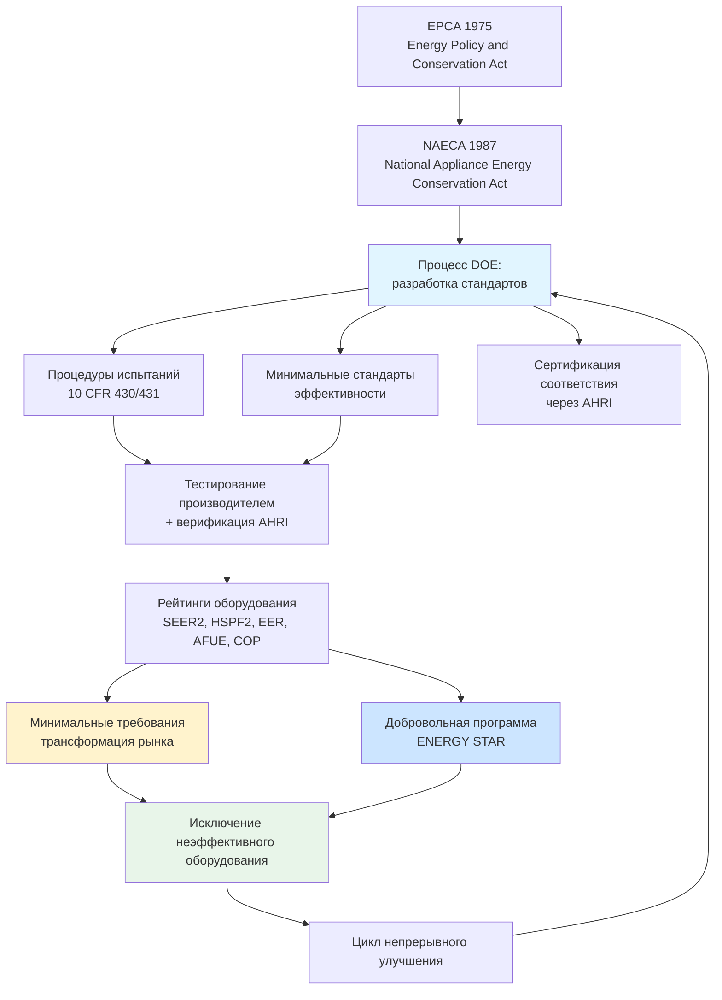

Федеральные стандарты минимальной энергоэффективности запрещают производство и ввоз на американский рынок оборудования ОВКВ, не достигающего установленных порогов. Аналогичные механизмы действуют в ЕС (директива Ecodesign / ErP), Японии (Top Runner) и ряде других юрисдикций. По оценке DOE, стандарты, введённые с 1987 по 2030 г., сэкономят потребителям 2,1 трлн USD на счетах за энергию при сокращении выбросов CO₂ на 7,6 млрд т.

## Нормативно-правовая база

В России аналогичную роль выполняют технические регламенты Таможенного союза (ТР ТС 010/2011 и 016/2011) и требования ФЗ-261 к энергетической маркировке. На рынке ЕС действует регламент Ecodesign (ErP Directive 2009/125/EC) и регламент о маркировке (Energy Labelling Regulation 2017/1369).

## Действующие жилые стандарты (США, 2023)


| Тип оборудования | Регион | Минимальная эффективность | Дата введения |
|---|---|---|---|
| Центральный кондиционер (сплит) | Север | 14,0 SEER2 / 11,2 EER2 | 01.01.2023 |
| Центральный кондиционер (сплит) | Юг и Юго-запад | 15,0 SEER2 / 11,7 EER2 | 01.01.2023 |
| Центральный кондиционер (моноблок) | Все | 13,4 SEER2 / 10,6 EER2 | 01.01.2023 |
| Тепловой насос (сплит) | Все | 14,3 SEER2 / 7,5 HSPF2 | 01.01.2023 |
| Тепловой насос (моноблок) | Все | 13,4 SEER2 / 6,7 HSPF2 | 01.01.2023 |
| Газовая печь (воздушная) | Север | 95% AFUE | Введено ранее |
| Газовая печь (воздушная) | Юг | 80% AFUE | Действующее |


Обновление 2023 г. — наиболее значительный пересмотр за более чем десятилетие: введены новые процедуры испытаний (SEER2, EER2, HSPF2), более точно отражающие реальные условия эксплуатации.

## Коммерческое оборудование


| Категория оборудования | Диапазон мощности | Минимум EER | Минимум IEER |
|---|---|---|---|
| Кондиционер с воздушным охлаждением | < 19 кВт | 11,2 | 12,2 |
| Кондиционер с воздушным охлаждением | 19–40 кВт | 11,0 | 12,0 |
| Кондиционер с воздушным охлаждением | 40–70 кВт | 10,0 | 11,6 |
| Кондиционер с водяным охлаждением | < 19 кВт | 12,1 | 13,1 |
| Кондиционер с водяным охлаждением | ≥ 19 кВт | 12,5 | 13,9 |
| Тепловой насос (воздух-воздух) | < 19 кВт | 11,2 | 12,2 |


## Переход от SEER к SEER2

С 1 января 2023 г. DOE перешёл на метрики SEER2, EER2 и HSPF2, разработанные по обновлённому стандарту ASHRAE 210/240-2023. Ключевое изменение — увеличение внешнего статического давления в испытательной установке с 0,0 до 0,5 дюйма в.ст. (125 Па), что лучше отражает реальное сопротивление воздуховодных систем.

Соотношение рейтингов:
- SEER 13 → SEER2 ≈ 13,4 (для моноблоков)
- SEER 14 → SEER2 ≈ 14,0 (для сплит-систем)

**Важно:** рейтинги SEER2 примерно на 1 единицу ниже эквивалентных SEER, но это отражает более строгие условия испытаний, а не снижение фактической эффективности.

## Процесс разработки стандартов DOE

DOE следует формализованному многолетнему процессу:

1. **Документ с основной концепцией (Framework Document)** — описание области охвата, классов продукции и аналитического подхода.
2. **Предварительный технический анализ (Preliminary Technical Support Document)** — оценка технически достижимых уровней эффективности.
3. **Уведомление о предлагаемом нормотворчестве (NOPR)** — публичное обсуждение предлагаемых стандартов.
4. **Окончательный нормативный акт (Final Rule)** — публикация после рассмотрения всех комментариев.
5. **Дата соответствия** — обычно через 3–5 лет после публикации окончательного акта.

Этот цикл позволяет производителям перепроектировать продукты и перестроить производственные мощности без нарушения цепочек поставок.

## Числовой пример: экономия от повышения стандарта

**Задача.** Оценить годовую экономию энергии при замене кондиционера SEER2 14,0 на SEER2 20,0 в офисном здании площадью 200 м² на юге США.

**Данные:**
- Годовые часы охлаждения: 1 800 ч/год
- Расчётная мощность охлаждения: 10,5 кВт (3 тонны)
- Коэффициент использования по мощности (load factor): 0,65

Годовое потребление электроэнергии:


E = \frac{Q_{\text{охл}} \cdot \tau \cdot LF}{\text{SEER2} \cdot C_{\text{перевод}}}


где Q_охл [Btu/ч], τ [ч/год], LF — коэффициент использования, C_перевод = 1 (если SEER2 в Btu/(Вт·ч)).

При Q_охл = 10,5 кВт × 3,412 Btu/Вт = 35 826 Btu/ч:

- SEER2 14,0: E_14 = (35 826 × 1 800 × 0,65) / 14,0 = 2 996 800 / 14,0 ≈ 3 008 кВт·ч/год
- SEER2 20,0: E_20 = 2 996 800 / 20,0 ≈ 2 105 кВт·ч/год

Экономия: ΔE = 3 008 − 2 105 = **903 кВт·ч/год**

При тарифе 0,14 USD/кВт·ч: экономия = 903 × 0,14 = **126 USD/год**. За 15-летний срок службы при ставке дисконтирования 5%: NPV ≈ 126 × 10,38 = **1 308 USD** — как правило, перекрывает дополнительную стоимость высокоэффективного оборудования.

## Влияние стандартов на трансформацию рынка

**Технологическое развитие.** Стандарты стимулируют инвестиции в НИОКР: переменная скорость компрессора, улучшенные теплообменники, оптимизированные холодильные циклы. Технологии, считавшиеся премиальными 10 лет назад, сегодня входят в стандартную комплектацию.

**Средняя эффективность рынка.** Когда минимальный стандарт повышается, вся кривая рыночного распределения эффективности сдвигается вправо. Производители конкурируют по эффективности, что дополнительно поднимает среднюю планку выше минимума.

**Региональная дифференциация.** Различные минимумы для Севера и Юга США отражают климатические различия: инвестиции в охлаждение оправданы там, где велики годовые часы охлаждения; инвестиции в отопление — где высока нагрузка отопительного сезона. Этот принцип соответствует методологии EN 14825:2023 (испытания при частичной нагрузке в европейских климатических зонах).

## Программа ENERGY STAR

Добровольная программа EPA определяет продукты, превосходящие федеральный минимум на 7–19%. Сертификация ENERGY STAR:

- открывает доступ к коммунальным субсидиям (utility rebates);
- квалифицирует оборудование для налоговых кредитов по разделам 25C и 179D IRA;
- служит ориентиром для покупателей без глубокой технической экспертизы.

Спецификации ENERGY STAR пересматриваются примерно каждые 3 года, чтобы поддерживать порог верхнего квартиля рынка по мере роста средней эффективности.

## Будущие обновления стандартов

Ожидаемые разработки норм DOE (2025–2028):

- Коммерческие крышные установки: пересмотр EER/IEER (ожидается ужесточение ~2026–2027 г.).
- Жилые тепловые насосы: оценка более высоких минимумов SEER2 и HSPF2.
- Системы VRF (Variable Refrigerant Flow): разработка первых федеральных стандартов для многозонального оборудования.
- Водонагреватели-тепловые насосы: продолжение ужесточения требований.

## Нормативные источники

- ASHRAE 90.1-2022: Energy Standard for Sites and Buildings Except Low-Rise Residential Buildings. — Atlanta: ASHRAE, 2022.
- EN 14825:2023: Air conditioners, liquid chilling packages and heat pumps — Testing under part load conditions.
- EN 16247-2:2014: Energy audits — Part 2: Buildings.
- ISO 50001:2018: Energy management systems.
- 10 CFR Part 430: Energy Conservation Program for Consumer Products.
- 10 CFR Part 431: Energy Efficiency Program for Certain Commercial and Industrial Equipment.
- ФЗ-261 «Об энергосбережении и о повышении энергетической эффективности».
- СП 60.13330-2020. Отопление, вентиляция и кондиционирование воздуха.
