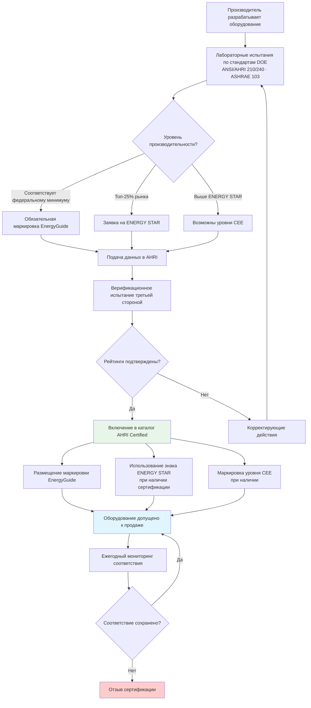

Программы маркировки энергоэффективности предоставляют стандартизированную информацию об энергопотреблении и рабочих характеристиках оборудования ОВКВ. Они выполняют две функции: обязательное раскрытие информации гарантирует получение базовых данных о производительности, а добровольная сертификация выделяет оборудование верхнего квартиля рынка. Эти программы формируют важнейший инструмент проектировщика при выборе оборудования и документировании соответствия нормам.

## Сравнение основных программ маркировки


| Программа | Тип | Администратор | Порог эффективности | Форма маркировки |
|---|---|---|---|---|
| EnergyGuide | Обязательная | DOE / FTC | Минимальный федеральный стандарт | Жёлтая этикетка с годовой стоимостью |
| ENERGY STAR | Добровольная | EPA | Топ-25% рынка | Синий логотип |
| Уровни CEE | Добровольная | Консорциум коммунальных предприятий | Уровни выше ENERGY STAR | Обозначение уровня 1–4 |
| AHRI Certified | Добровольная | AHRI | Верификация заявленных рейтингов | Запись в каталоге |


В России роль обязательной маркировки выполняет присвоение класса энергетической эффективности по ФЗ-261 и постановлению Правительства РФ № 1065 (2018). В ЕС — маркировка A–G по регламенту 2017/1369/EC в сочетании с испытаниями по EN 14825:2023.

## Обязательная маркировка EnergyGuide

Федеральная торговая комиссия (FTC) требует наличия жёлтой этикетки EnergyGuide на всём охватываемом оборудовании ОВКВ, реализуемом в США.

### Обязательные элементы этикетки

- Тип оборудования и диапазон мощности.
- Рейтинг эффективности (SEER2 для кондиционеров, HSPF2 для тепловых насосов, AFUE для печей и котлов, EER для коммерческого оборудования).
- Предполагаемое годовое потребление электроэнергии, кВт·ч/год.
- Предполагаемая годовая стоимость эксплуатации в USD на основе национального среднего тарифа.
- Сравнительная шкала: позиционирование модели в диапазоне наиболее/наименее эффективных аналогов.
- Идентификация производителя и модели.

Для центральных кондиционеров (с января 2023 г.) расчёт выполняется при SEER2 по ASHRAE 210/240-2023: 2 000 ч охлаждения в год при тарифе 0,13 USD/кВт·ч. Это позволяет прямое сравнение продуктов разных производителей.

## Сертификация ENERGY STAR

### Текущие требования (2024)


| Категория оборудования | Порог ENERGY STAR | Федеральный минимум | Превышение |
|---|---|---|---|
| Центральный кондиционер (сплит, Север) | 15,2 SEER2 | 14,0 SEER2 | +8,6% |
| Центральный кондиционер (сплит, Юг) | 16,0 SEER2 | 15,0 SEER2 | +6,7% |
| Тепловой насос (сплит) | 15,2 SEER2 / 8,1 HSPF2 | 14,3 SEER2 / 7,5 HSPF2 | +6,3% / +8,0% |
| Газовая печь (Север) | 95% AFUE | 95%* AFUE | Ограниченный зазор |
| Газовая печь (Юг) | 90% AFUE | 80% AFUE | +12,5% |
| Котёл газовый | 90% AFUE | 82–84% AFUE | +7–10% |
| Бесканальный мини-сплит | 15,2 SEER2 / 9,5 HSPF2 | Нет федерального минимума | — |


*Для ряда регионов.

### Процесс сертификации

Производители направляют оборудование на испытания в аккредитованные EPA лаборатории. Лаборатория проводит испытания по применимому стандарту DOE (10 CFR 430 или ANSI/AHRI 210/240). При соответствии пороговым значениям ENERGY STAR продукт включается в базу данных ENERGY STAR и получает право на использование знака.

Спецификации пересматриваются каждые 3 года для сохранения статуса «топ-25% рынка»: по мере роста средней эффективности порог ENERGY STAR повышается.

### Значение для проектировщика

Сертификация ENERGY STAR открывает доступ к:
- коммунальным субсидиям (utility rebates) — размер варьируется по регионам, как правило, 100–500 USD на единицу жилого оборудования;
- налоговым кредитам по разделу 25C IRA: до 2 000 USD для тепловых насосов при соответствии требованиям HSPF2 ≥ 7,8;
- требованиям государственных программ и закупочных стандартов.

## Уровни CEE

Консорциум по энергоэффективности (Consortium for Energy Efficiency, CEE) устанавливает добровольные уровни производительности, превышающие ENERGY STAR. Они создают дополнительные ступени для дифференцированных программ коммунальных субсидий.


| Уровень CEE | Минимум SEER2 | Минимум HSPF2 | Типичная субсидия, USD |
|---|---|---|---|
| ENERGY STAR (базис) | 15,2 | 8,1 | 100–200 |
| Уровень 1 | 16,0 | 8,5 | 200–400 |
| Уровень 2 | 17,0 | 9,0 | 400–700 |
| Уровень 3 | 18,0 | 9,5 | 700–1 000 |
| Уровень 4 | ≥ 20,0 | ≥ 10,5 | 1 000–1 500+ |


Многоуровневый подход стимулирует непрерывное улучшение и учитывает убывающую отдачу на высших уровнях эффективности. Конкретные пороги и суммы субсидий устанавливает каждое коммунальное предприятие или региональная программа эффективности.

## Сертификация AHRI

AHRI (Air-Conditioning, Heating, and Refrigeration Institute) ведёт независимую программу верификации, подтверждающую, что заявленные производителем рейтинги соответствуют результатам независимых испытаний.

### Каталог AHRI Certified (ahridirectory.org)

Каталог содержит:
- рейтинги SEER2, EER2 и HSPF2 для охлаждающего оборудования;
- рейтинги AFUE для печей и котлов;
- акустические рейтинги жилого оборудования;
- производительность согласованных систем для сплит-конфигураций;
- параметры при стандартных условиях испытания.

**Важно:** для сплит-систем рейтинг действителен только для конкретной сертифицированной комбинации наружного блока и воздухообрабатывающего агрегата. Нельзя принимать рейтинг наружного блока как рейтинг системы без верификации в каталоге AHRI.

### Контрольное тестирование

AHRI проводит случайное контрольное тестирование: отобранные образцы оборудования испытываются в независимых лабораториях. Допустимый разброс: ±5% по производительности и ±5% по эффективности. Обнаружение несоответствия влечёт отзыв сертификации.

## Блок-схема процесса сертификации

## Числовой пример: расчёт стоимости по маркировке EnergyGuide

**Задача.** Сравнить предполагаемую годовую стоимость эксплуатации двух тепловых насосов по данным маркировки EnergyGuide.

**Параметры расчёта (методология FTC):**
- Охлаждение: 1 000 ч × (холодопроизводительность в Btu/ч) / SEER2 × тариф.
- Отопление: 2 500 ч × (тепловая мощность в Btu/ч) / HSPF2 × тариф.
- Нормативный тариф: 0,13 USD/кВт·ч.

**Вариант A (SEER2 15,0 / HSPF2 8,2)**, 12 кВт (40 944 Btu/ч) охлаждения:

- Потребление охлаждение: 40 944 × 1 000 / (15,0 × 1 000) = 2 730 кВт·ч/год
- Потребление отопление: 40 944 × 2 500 / (8,2 × 1 000) = 12 483 кВт·ч/год
- Итого: 15 213 кВт·ч/год; стоимость: 15 213 × 0,13 = **1 978 USD/год**

**Вариант B (SEER2 18,0 / HSPF2 10,0)**:

- Охлаждение: 40 944 × 1 000 / 18 000 = 2 275 кВт·ч/год
- Отопление: 40 944 × 2 500 / 10 000 = 10 236 кВт·ч/год
- Итого: 12 511 кВт·ч/год; стоимость: 12 511 × 0,13 = **1 626 USD/год**

Разность: **352 USD/год** — именно это число фигурирует на маркировке EnergyGuide и формирует решение конечного покупателя.

## Влияние на решения о покупке

Исследования EPA показывают, что предполагаемая годовая стоимость эксплуатации на этикетке EnergyGuide значительно эффективнее влияет на решения о покупке, чем абстрактные рейтинги SEER2: покупатель воспринимает доллары, а не безразмерный коэффициент. Знак ENERGY STAR служит ориентиром для покупателей без технической экспертизы. Уровни CEE позволяют опытным покупателям и проектировщикам однозначно идентифицировать оборудование для получения максимальных субсидий.

Сочетание маркировки и субсидий создаёт «двойной стимул»: прозрачность информации снижает неопределённость, а финансовые поощрения снижают барьер первоначальных инвестиций — вместе они ускоряют переход рынка к высокоэффективному оборудованию ОВКВ.

## Надзор и правоприменение

FTC обеспечивает соблюдение требований маркировки EnergyGuide: штрафы до 46 517 USD за каждое нарушение. EPA контролирует использование знака ENERGY STAR: оборудование, неправомерно претендующее на сертификацию, подлежит отзыву и исключению из базы данных.

Производители обязаны уведомить органы сертификации в течение 15 дней об изменениях конструкции, влияющих на рейтинг. Ежегодное повторное тестирование и контроль качества производства — обязательные условия поддержания действующей сертификации.

## Нормативные источники

- 16 CFR Part 305: Appliance Labeling Rule (FTC EnergyGuide).
- 40 CFR Part 82 / EPA ENERGY STAR Product Specifications (energystar.gov).
- ANSI/AHRI 210/240-2023: Performance Rating of Unitary Air-Conditioning and Air-Source Heat Pump Equipment.
- EN 14825:2023: Air conditioners, liquid chilling packages and heat pumps — Testing under part load conditions.
- ASHRAE 90.1-2022: Energy Standard for Sites and Buildings Except Low-Rise Residential Buildings.
- ФЗ-261 «Об энергосбережении и о повышении энергетической эффективности».
- Постановление Правительства РФ № 1065 от 25.09.2018 «О требованиях к маркировке товаров с указанием класса их энергетической эффективности».
- СП 60.13330-2020. Отопление, вентиляция и кондиционирование воздуха.
