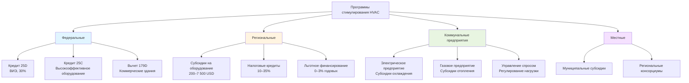

Программы финансового стимулирования снижают капитальные затраты на высокоэффективное оборудование HVAC (Heating, Ventilation and Air Conditioning — отопление, вентиляция и кондиционирование) и ускоряют внедрение энергосберегающих технологий. Программы действуют на федеральном, региональном и местном уровнях, каждая с индивидуальными критериями квалификации и структурой льгот. Экономически грамотный выбор оборудования требует учёта совокупного эффекта от наложения нескольких программ.

## Федеральные программы налоговых льгот

### Кредит на энергоэффективное имущество для жилых помещений (раздел 25D)

Налоговый кредит (tax credit) по разделу 25D применяется к оборудованию, использующему возобновляемые источники энергии (ВИЭ), при установке в существующих и новых жилых зданиях на территории США.

Квалифицируемое оборудование:
- геотермальные тепловые насосы (вода-вода, вода-воздух);
- системы солнечного теплоснабжения для обогрева помещений и горячего водоснабжения;
- малые ветровые турбины жилого назначения.

Структура кредита:
- 30% от совокупных затрат на оборудование и монтаж без годового или пожизненного ограничения;
- действителен до 31 декабря 2032 года;
- снижается до 26% в 2033 году и 22% в 2034 году;
- остаток неиспользованного кредита переносится на следующий налоговый год.

### Кредит на энергоэффективное улучшение жилья (раздел 25C)

Раздел 25C распространяется на высокоэффективное оборудование HVAC в существующих жилых помещениях. Критерии квалификации на 2024 год:

| Тип оборудования | Показатель эффективности | Максимальный кредит |
|---|---|---|
| Центральный кондиционер | SEER2 (Seasonal Energy Efficiency Ratio 2) ≥ 16,0 | 600 USD |
| Тепловой насос с воздушным источником | SEER2 ≥ 16,0, HSPF2 (Heating Seasonal Performance Factor 2) ≥ 9,0 | 2 000 USD |
| Бесканальный мини-сплит | SEER2 ≥ 16,0, HSPF2 ≥ 9,0 | 2 000 USD |
| Газовая печь | AFUE (Annual Fuel Utilization Efficiency) ≥ 97% | 600 USD |
| Газовый котёл | AFUE ≥ 95% | 600 USD |

Годовой лимит по домохозяйству составляет 1 200 USD, за исключением тепловых насосов: для них самостоятельный лимит равен 2 000 USD.

### Коммерческий вычет за энергоэффективность здания (раздел 179D)

Вычет (tax deduction) по разделу 179D применяется к системам HVAC коммерческих зданий при снижении расчётного потребления энергии не менее чем на 25% относительно базового уровня ASHRAE 90.1-2007.

Параметры вычета:
- максимальный вычет — 5,00 USD/м² при снижении энергозатрат на 50%;
- частичный вычет — от 0,50 до 1,00 USD/м² за каждую квалифицируемую систему;
- обязательна сертификация независимой третьей стороной при вычете свыше 0,50 USD/м²;
- расчёт — полное энергетическое моделирование здания в программах DOE-2.2 или EnergyPlus.

### Числовой пример: вычет 179D

Офисное здание площадью 4 000 м². Модернизация системы HVAC обеспечивает снижение потребления энергии на 35% относительно базового уровня ASHRAE 90.1. Применяемый вычет:


V = 4\,000 \;\text{м}^2 \times \frac{(35-25)}{(50-25)} \times (5{,}00 - 0{,}50) + 4\,000 \times 0{,}50 = 4\,000 \times 1{,}80 + 2\,000 = 9\,200 \;\text{USD}


(упрощённая линейная интерполяция согласно IRC §179D; фактический расчёт производится по утверждённой модели).

## Государственные программы стимулирования

Государственный уровень значительно варьируется по юрисдикциям. Большинство штатов (для США) и регионов предлагают прямые субсидии или налоговые льготы.


| Тип программы | Механизм | Типичный диапазон льгот | Примеры юрисдикций |
|---|---|---|---|
| Субсидии на оборудование | Прямая выплата после установки | 200–2 500 USD/ед. | Калифорния, Нью-Йорк, Массачусетс |
| Налоговый кредит штата | Уменьшение регионального налога | 10–35% стоимости оборудования | Аризона, Орегон, Монтана |
| Льгота по налогу с продаж | Скидка в точке продажи | Снижение цены на 4–10% | Флорида, Мэриленд, Нью-Джерси |
| Льгота по налогу на имущество | Пониженная оценочная стоимость | Многолетняя экономия | Колорадо, Невада, Нью-Гэмпшир |
| Льготный кредит | Субсидированное финансирование | 0–3% годовых, срок 5–15 лет | Иллинойс, Мичиган, Висконсин |


Программы с наиболее высоким эффектом:

**California TECH Clean California Initiative** — субсидии на системы HVAC с тепловым насосом составляют 3 000–7 500 USD за систему; на тепловые насосы для нагрева воды — 2 000–4 000 USD; для домохозяйств с доходом ниже медианного применяется множитель 1,5–2,0.

**New York Clean Heat Program** — тепловые насосы с воздушным источником: 1 000–3 000 USD; геотермальные тепловые насосы: 3 000–6 000 USD; бонус за переход с ископаемого топлива: дополнительно 500–1 000 USD.

**Massachusetts Mass Save Program** — бесканальные тепловые насосы: 500–1 200 USD за зону (не более 5 зон); беспроцентный заём HEAT Loan до 25 000 USD сроком 7 лет.

## Программы коммунальных предприятий

Электрические и газовые коммунальные предприятия используют программы управления спросом (demand-side management) для снижения пиковых нагрузок.

### Жилой сектор


| Тип оборудования | Диапазон субсидии | Пороговое значение эффективности |
|---|---|---|
| Центральный кондиционер | 200–800 USD | SEER2 ≥ 16,0–17,0 |
| Тепловой насос с воздушным источником | 500–1 500 USD | SEER2 ≥ 16,0, HSPF2 ≥ 9,0 |
| Бесканальный мини-сплит | 300–1 000 USD/зону | SEER2 ≥ 18,0 |
| Геотермальный тепловой насос | 1 000–4 000 USD | EER (Energy Efficiency Ratio) ≥ 17,0, COP ≥ 3,5 |
| Газовая печь | 100–500 USD | AFUE ≥ 95–97% |
| Электродвигатель ECM для вентилятора | 50–150 USD | Замена на electronically commutated motor |
| Умный термостат | 50–150 USD | Совместимость с управлением спросом |


### Коммерческий сектор

Нормативные субсидии (prescriptive rebates) — фиксированная выплата за тонну мощности охлаждения или установленную единицу оборудования; типичный диапазон — 50–300 USD/т (тонна мощности охлаждения).

Индивидуальные стимулы (custom incentives) — выплата на основе расчётной экономии энергии; типичная ставка — 0,08–0,25 USD/кВт·ч сэкономленной электроэнергии в год. Требуется базовое энергетическое моделирование и верификация после установки согласно протоколу M&V (measurement and verification).

## Ландшафт программ стимулирования

## База данных DSIRE

DSIRE (Database of State Incentives for Renewables & Efficiency — База данных государственных стимулов для возобновляемых источников энергии и энергоэффективности) является основным национальным ресурсом для поиска программ стимулирования.

Функциональность базы данных:
- поиск по штату, технологии и сектору потребителя;
- ежемесячное обновление при изменении программ;
- критерии квалификации, размеры льгот и процедуры подачи заявок;
- прямые ссылки на администраторов программ и порталы заявок.

Параметры поиска:
- категория технологии (оборудование HVAC, строительная оболочка, системы автоматизации);
- тип льготы (субсидия, налоговый кредит, кредит, грант);
- сектор (жилой, коммерческий, промышленный, сельскохозяйственный);
- вид энергоносителя (электроэнергия, природный газ, ВИЭ).

## Стратегия подачи заявок

Несколько программ стимулирования допускается совмещать для одного проекта. Типовые комбинации:

1. Федеральный кредит 25C + региональная субсидия + субсидия коммунального предприятия.
2. Вычет 179D + индивидуальный стимул коммунального предприятия + льготное финансирование.
3. Региональный налоговый кредит + муниципальная программа + субсидия производителя.

Рекомендуемая последовательность:
1. Определить все применимые программы через базу данных DSIRE.
2. Убедиться, что оборудование соответствует требованиям эффективности каждой программы.
3. Подать предварительную заявку в коммунальное предприятие (часто требуется до закупки оборудования).
4. Завершить монтаж с привлечением квалифицированного подрядчика.
5. Подать документы на региональную субсидию с требуемыми приложениями.
6. Заявить федеральные налоговые льготы в годовой декларации.

Документация, как правило, включает:
- сертификат AHRI (Air-Conditioning, Heating and Refrigeration Institute) с рейтингами изделия;
- подтверждение лицензии подрядчика и страховки;
- развёрнутый счёт-фактура с номерами моделей оборудования;
- доказательство оплаты;
- фотографии установки (по требованию ряда программ);
- отчёт об энергетическом моделировании (для индивидуальных коммерческих стимулов).

## Критерии квалификации

**Квалификация оборудования.** Федеральные кредиты ссылаются на сертификацию ENERGY STAR или на конкретные показатели эффективности. Программы коммунальных предприятий, как правило, устанавливают более высокие пороги для ориентации на технически совершенное оборудование.

**Квалификация подрядчика.** Большинство программ требуют монтажа лицензированными специалистами HVAC с подтверждёнными сертификатами:
- NATE (North American Technician Excellence);
- учебная квалификация производителя конкретного оборудования;
- действующая государственная лицензия подрядчика;
- полис гражданской ответственности и страхование работников.

**Программы с учётом дохода.** Повышенные уровни льгот для домохозяйств с низким и средним доходом (не более 150–200% медианного дохода по региону, AMI); размер субсидии увеличивается в 1,5–3,0 раза относительно стандартного уровня.

## Числовой пример: совокупная экономия при замене теплового насоса

Жилой тепловой насос с воздушным источником, SEER2 = 18,0, HSPF2 = 9,5. Стоимость оборудования и монтажа — 14 000 USD.

| Программа | Сумма льготы | Источник |
|---|---|---|
| Федеральный кредит 25C | −2 000 USD | IRC §25C |
| Субсидия коммунального предприятия | −1 500 USD | Региональная программа |
| Региональный налоговый кредит (10%) | −1 400 USD | Штат |
| Итого льготы | −4 900 USD | |
| Чистые затраты | 9 100 USD | 35% экономии |

При годовой экономии электроэнергии 1 800 кВт·ч (ориентировочно) и тарифе 0,14 USD/кВт·ч простой срок окупаемости дополнительных вложений составит:


T = \frac{9\,100 - 7\,000}{1\,800 \times 0{,}14} = \frac{2\,100}{252} \approx 8{,}3 \;\text{лет}


(7 000 USD — ориентировочная стоимость стандартного оборудования SEER2 14 без льгот).

Совокупность федеральных, региональных и коммунальных стимулов может компенсировать 30–60% от общих затрат на установку квалифицирующегося оборудования HVAC, сокращая период окупаемости с 10–15 до 3–7 лет.

## Нормативные ссылки

- ASHRAE 90.1-2022: Energy Standard for Sites and Buildings Except Low-Rise Residential Buildings.
- IRC §25C, §25D, §179D (Inflation Reduction Act, Public Law 117-169, 2022).
- ISO 50001:2018: Energy management systems.
- ФЗ-261 «Об энергосбережении и о повышении энергетической эффективности» (Российская Федерация).
- DSIRE: dsireusa.org — база данных программ стимулирования по штатам США.
