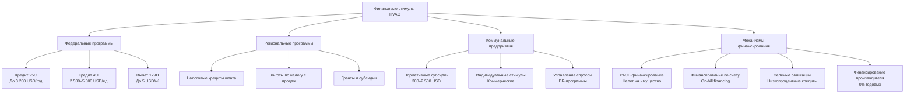

Финансовые стимулы снижают первоначальные затраты на высокоэффективное оборудование HVAC (Heating, Ventilation and Air Conditioning) и экономически обосновывают переход на энергосберегающие технологии. Закон об инфляционном сокращении (Inflation Reduction Act, IRA) 2022 года расширил и продлил до 2032 года действие большинства налоговых льгот, связанных с HVAC. Знание структуры этих программ позволяет проектировщику оптимально выбрать оборудование с учётом совокупного финансового эффекта.

## Федеральные налоговые кредиты

### Кредит на энергоэффективное улучшение жилья (раздел 25C)

Кредит 25C применяется к существующим жилым объектам. Оборудование должно быть установлено в основном месте жительства налогоплательщика в период с 1 января 2023 по 31 декабря 2032 года.


| Тип оборудования | Требования к эффективности | Максимальный кредит |
|---|---|---|
| Центральный кондиционер | SEER2 ≥ 16,0; EER2 (Energy Efficiency Ratio 2) ≥ 12,5 | 600 USD |
| Тепловой насос с воздушным источником | SEER2 ≥ 16,0; EER2 ≥ 12,5; HSPF2 (Heating Seasonal Performance Factor 2) ≥ 9,0 | 2 000 USD |
| Газовая печь или котёл | AFUE (Annual Fuel Utilization Efficiency) ≥ 95% | 600 USD |
| Масляная печь или котёл | AFUE ≥ 90% | 600 USD |
| Биомассовая печь (коэффициент эффективности ≥ 75%) | — | 2 000 USD |
| Профессиональный энергоаудит дома | — | 150 USD |


Годовой совокупный лимит: 3 200 USD в год (из них не более 1 200 USD на квалифицированное оборудование кроме тепловых насосов, и отдельно до 2 000 USD на тепловые насосы).

Обязательные условия:
- оборудование должно соответствовать сертификации ENERGY STAR Most Efficient или превышать её;
- необходимо заявление производителя о соответствии (manufacturer's certification statement) при заполнении формы IRS 5695;
- установка должна быть произведена квалифицированным подрядчиком.

### Кредит застройщика за энергоэффективное новое жильё (раздел 45L)

Кредит 45L предоставляется застройщику за каждую введённую жилую единицу, соответствующую требованиям энергоэффективности.


| Уровень производительности | Размер кредита | Основание |
|---|---|---|
| Сертификация ENERGY STAR | 2 500 USD/ед. | Соответствие требованиям программы ENERGY STAR |
| DOE Zero Energy Ready Home | 5 000 USD/ед. | Сертификация DOE ZERH |
| Многоквартирный дом (с соблюдением требований к заработной плате) | 5 000 USD/ед. | Prevailing wage compliance |


Кредит требует сертификации независимой третьей стороной на основе рейтинга RESNET HERS (Home Energy Rating System) или эквивалентного инструмента.

### Коммерческий вычет за энергоэффективность здания (раздел 179D)

Вычет применяется к системам HVAC, освещению и строительной оболочке коммерческих зданий.

Основные параметры:
- максимальный вычет — 5,00 USD/м² (при снижении энергозатрат на 50% по сравнению с базой ASHRAE 90.1-2007);
- частичный вычет — от 0,50 до 5,00 USD/м² при снижении на 25–50%;
- требование к заработной плате: пятикратный множитель при выполнении условий prevailing wage;
- проектировщики государственных зданий могут претендовать на вычет, хотя сами здания освобождены от уплаты налогов.

## Субсидии коммунальных предприятий

### Жилой сектор

Электрические и газовые коммунальные предприятия предоставляют прямые субсидии для снижения пиковой нагрузки и совокупного потребления. Структура субсидий варьируется в зависимости от территории обслуживания, однако следует общим закономерностям.


| Тип программы | Диапазон субсидии | Распространённые требования |
|---|---|---|
| Замена центрального кондиционера | 300–1 000 USD | SEER2 ≥ 15–16 |
| Установка теплового насоса | 500–2 500 USD | SEER2 ≥ 16, HSPF2 ≥ 9 |
| Умный термостат | 50–150 USD | Сертификация ENERGY STAR |
| Модернизация печи | 200–800 USD | AFUE ≥ 95% |
| Герметизация воздуховодов | 150–500 USD | Профессиональная проверка |
| Устройства управления нагрузкой | 50–200 USD | Регистрация в программе управления спросом |


### Коммерческий сектор

Для коммерческих потребителей применяются два основных подхода:

**Нормативные субсидии** (prescriptive rebates) — фиксированная выплата на единицу оборудования или кВт установленной мощности; типично 100–400 USD/кВт для кровельных установок (rooftop units).

**Индивидуальные стимулы** (custom incentives) — выплата на основе расчётной экономии энергии; ставка 0,08–0,15 USD/кВт·ч ежегодной экономии за 10-летний жизненный цикл меры. Требуется базовое моделирование и верификация по протоколу IPMVP (International Performance Measurement and Verification Protocol).

Ключевые условия программ:
- предварительное одобрение, как правило, требуется до закупки оборудования;
- обязательна профессиональная установка с верификацией;
- минимальные пороги эффективности превышают кодексовые требования на 10–25%;
- субсидии можно совмещать с федеральными налоговыми льготами.

## Региональные и местные программы

Региональные программы дополняют федеральные льготы:

- налоговые кредиты штата — 10–25% стоимости оборудования, не более 500–1 500 USD;
- льготы по налогу с продаж — освобождение квалифицированного HVAC-оборудования от налога (экономия 4–10%);
- льготы по налогу на имущество — исключение стоимости модернизации из налоговой базы на срок 5–10 лет;
- гранты для малоимущих домохозяйств и социально значимых учреждений.

Штаты с наиболее агрессивными программами: Калифорния, Нью-Йорк, Массачусетс, Коннектикут, Колорадо. DSIRE (dsireusa.org) является основным агрегатором актуальной информации по всем юрисдикциям.

## Ускоренная амортизация для коммерческих объектов

### Система MACRS

Модифицированная система ускоренного возмещения затрат (Modified Accelerated Cost Recovery System, MACRS) позволяет амортизировать капитальные вложения в HVAC в сокращённые сроки.


| Тип актива | Период возмещения | Метод амортизации |
|---|---|---|
| HVAC как часть здания | 39 лет | Линейный |
| Отдельное HVAC-оборудование | 5–7 лет | 200% убывающего остатка |
| Энергетическое имущество (§48) | 5 лет | 200% убывающего остатка |


### Bonus depreciation

Начиная с 2023 года бонусная амортизация составляет 80% от стоимости квалифицируемого HVAC-оборудования в год ввода в эксплуатацию (с плановым снижением на 20% ежегодно до 2027 года). Применяется только к оборудованию со сроком амортизации 20 лет и менее.

## Механизмы финансирования

### Финансирование PACE

PACE (Property Assessed Clean Energy — финансирование чистой энергии через налог на имущество) позволяет владельцу погасить стоимость модернизации через ежегодный налоговый взнос в течение 10–25 лет.

Преимущества:
- нулевые первоначальные наличные затраты;
- обязательство по погашению переходит при продаже имущества;
- процентная ставка — 5–8% годовых;
- доступно для жилых и коммерческих объектов.

Ограничения:
- создаёт приоритетный залог на имущество (senior lien), что может конфликтовать с существующей ипотекой;
- недоступно во всех юрисдикциях;
- может осложнить рефинансирование.

### Финансирование по счёту (on-bill financing)

Программы кредитования, администрируемые коммунальными предприятиями, с погашением через ежемесячные счета за коммунальные услуги:
- сроки — 2–10 лет;
- процентная ставка — 0–6% годовых;
- лимит для жилых объектов — 2 500–25 000 USD; для коммерческих — 50 000–500 000 USD;
- андеррайтинг на основе истории платежей, а не кредитного рейтинга.

### Финансирование производителей и подрядчиков

Производители оборудования HVAC предлагают промоционное финансирование:
- 0% годовых на 12–60 месяцев (при наличии квалифицированного кредита);
- программы отложенных процентов (проценты начисляются, если кредит не погашен полностью в установленный срок);
- расширенные планы платежей с конкурентными ставками.

## Стратегии комбинирования стимулов

Максимальное финансовое преимущество достигается стратегическим сочетанием программ:

1. Подать заявку на предварительное одобрение субсидии коммунального предприятия до закупки оборудования.
2. Выбрать оборудование, соответствующее наивысшим порогам квалификации (25C, 25D, 179D).
3. Проверить право на региональные стимулы и изучить процедуру подачи заявок.
4. При необходимости использовать PACE или on-bill financing для покрытия чистой стоимости после льгот.
5. Документировать все требования: заявления производителя, акты инспекции, счета-фактуры.
6. Подать федеральные льготы в форме IRS 5695 в год ввода оборудования в эксплуатацию.
7. Применять коммерческие стратегии амортизации с привлечением налогового консультанта.

### Числовой пример: жилой тепловой насос

Тепловой насос с воздушным источником, SEER2 = 18,0, HSPF2 = 9,5. Суммарная стоимость оборудования и монтажа — 12 000 USD.

| Программа | Льгота |
|---|---|
| Федеральный кредит 25C | −2 000 USD |
| Субсидия коммунального предприятия | −1 500 USD |
| Региональный налоговый кредит | −500 USD |
| Итого льготы | −4 000 USD |
| Чистые затраты | 8 000 USD |

Совокупная скидка составляет 33%. При годовой экономии электроэнергии 2 200 кВт·ч (в сравнении с заменяемым оборудованием SEER2 14) и тарифе 0,14 USD/кВт·ч:


T_{\text{окуп}} = \frac{8\,000 - 6\,500}{2\,200 \times 0{,}14} = \frac{1\,500}{308} \approx 4{,}9 \;\text{лет}


(6 500 USD — ориентировочная стоимость стандартного оборудования SEER2 14).

## Ресурсы

Федеральные программы:
- Форма IRS 5695 (Residential Energy Credits).
- Инструкция IRS к форме 5695.
- DOE ENERGY STAR Rebate Finder: energystar.gov/rebate-finder.

Программы коммунальных предприятий:
- официальные сайты программ соответствующего коммунального предприятия;
- каталог торговых партнёров (trade allies) коммунального предприятия.

Региональные программы:
- DSIRE: dsireusa.org;
- государственные энергетические агентства штата;
- региональные организации по энергоэффективности.

## Нормативные ссылки

- ASHRAE 90.1-2022: Energy Standard for Sites and Buildings Except Low-Rise Residential Buildings.
- IRC §25C, §25D, §45L, §179D (Inflation Reduction Act, Public Law 117-169, 2022).
- ISO 50001:2018: Energy management systems — Requirements with guidance for use.
- EN 16247-1:2012: Energy audits — Part 1: General requirements.
- IPMVP: International Performance Measurement and Verification Protocol, EVO 10000-1:2016.
- ФЗ-261 «Об энергосбережении и о повышении энергетической эффективности» (Российская Федерация).
