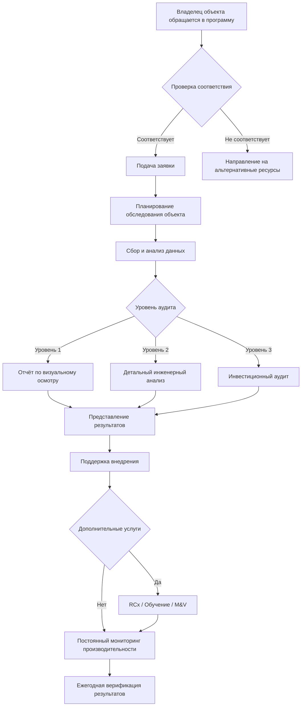

Программы технической поддержки предоставляют нефинансовую помощь владельцам объектов, управляющим зданиями и специалистам HVAC (Heating, Ventilation and Air Conditioning), стремящимся повысить энергетическую эффективность. Программы администрируются Министерством энергетики США (DOE), коммунальными предприятиями и государственными энергетическими агентствами. Они снижают барьеры для внедрения энергосберегающих мер, предоставляя экспертное руководство, инструменты анализа и профессиональное обучение — часто бесплатно или по существенно субсидированным ценам.

## Категории программ технической поддержки


| Тип программы | Область применения | Типичная продолжительность | Результаты |
|---|---|---|---|
| Энергетический аудит | Оценка объекта, анализ нагрузок | 2–8 недель | Отчёт с рекомендациями |
| Ретро-комиссионирование (RCx) | Оптимизация систем управления | 3–6 месяцев | План RCx, отчёт по внедрению |
| Бенчмаркинг | Сбор данных, сравнительный анализ | 1–3 месяца | Рейтинг ENERGY STAR, анализ сравнения |
| Техническое обучение | Эксплуатация, обслуживание | 1–5 дней | Сертификат, учебные материалы |
| Помощь в проектировании | Анализ проекта системы, экспертная оценка | 2–4 недели | Рекомендации, расчёты |
| Измерение и верификация (M&V) | Отслеживание производительности, подтверждение экономии | 6–24 месяца | Отчёт M&V, документация экономии |


## Энергетические аудиты

Энергетический аудит — систематическая оценка потребления энергии зданием и производительности системы HVAC. ASHRAE (American Society of Heating, Refrigerating and Air-Conditioning Engineers) определяет три уровня аудита.

**Уровень 1 — Визуальный осмотр (Walk-Through Survey).**
Визуальная инспекция, анализ счетов за энергоносители, предварительное выявление мер по снижению затрат. Типичная стоимость: 0,54–1,08 USD/м².

**Уровень 2 — Энергетическое обследование (Energy Survey and Analysis).**
Подробная инвентаризация оборудования, измерения системы, инженерный анализ с финансовой оценкой каждой меры. Типичная стоимость: 1,61–3,23 USD/м².

**Уровень 3 — Инвестиционный аудит (Investment Grade Audit).**
Полный мониторинг на месте, компьютерное моделирование, детальный анализ затрат-выгод. Типичная стоимость: 3,23–6,46 USD/м².

Центры промышленной оценки DOE (Industrial Assessment Centers, IAC) предоставляют бесплатные аудиты уровня 2 для малых и средних производственных предприятий через партнёрство с университетами. Программа IAC завершила более 19 000 оценок; средняя выявленная экономия — 5–15% от потребления энергии объекта.

### Числовой пример: потенциал экономии по итогам аудита

Коммерческое здание площадью 5 000 м² с установленным потреблением HVAC 480 МВт·ч/год. Аудит уровня 2 выявил пять мероприятий.


| Мероприятие | Расчётная экономия, МВт·ч/год | Стоимость внедрения, USD | Срок окупаемости, лет |
|---|---|---|---|
| Сброс уставки подачи приточного воздуха | 38 | 2 000 | 0,7 |
| Установка VFD на насосах | 27 | 18 000 | 8,7 |
| Оптимизация графика работы AHU | 19 | 500 | 0,3 |
| Замена ремней на зубчатые | 8 | 3 500 | 5,7 |
| Утепление трубопроводов холодоснабжения | 14 | 6 000 | 5,6 |
| Итого | 106 | 30 000 | 3,7 |


Расчёт периода окупаемости суммарного пакета при тарифе 0,12 USD/кВт·ч:


T = \frac{30\,000}{106\,000 \times 0{,}12} = \frac{30\,000}{12\,720} \approx 2{,}4 \;\text{года}


Экономия составит 22% от базового потребления HVAC.

## Ретро-комиссионирование (RCx)

Ретро-комиссионирование — системный процесс оптимизации существующих систем HVAC без крупных капиталовложений. Типичная экономия — 5–20% от потребления энергии здания за счёт устранения операционных дефектов: неверных уставок, неработающих последовательностей управления, разрегулированного баланса потоков воздуха и воды.

Процесс RCx состоит из четырёх фаз:

1. **Планирование.** Определение области охвата, ролей команды, целевых показателей производительности.
2. **Обследование.** Анализ документации, функциональные испытания, выявление дефектов.
3. **Внедрение.** Реализация мер с низкими или нулевыми затратами, разработка рекомендаций по капитальным улучшениям.
4. **Передача.** Документирование результатов, обучение эксплуатационного персонала, установка непрерывного мониторинга.

Многие программы коммунальных предприятий субсидируют 50–100% затрат на RCx для коммерческих клиентов. Типичные инвестиции в RCx составляют 2,15–4,30 USD/м²; срок окупаемости — 1–3 года (ASHRAE Guideline 0-2019, BCxA Retro-Commissioning Guide).

## Бенчмаркинг и раскрытие данных об энергопотреблении

Бенчмаркинг (energy benchmarking) — сравнение удельного потребления энергии здания с аналогичными объектами. Техническая поддержка обеспечивает сбор данных, анализ и соответствие требованиям ординансов о раскрытии информации.

Ключевые показатели бенчмаркинга:


| Показатель | Единицы | Применение |
|---|---|---|
| Интенсивность использования энергии (EUI) | МДж/м²/год | Общее сравнение здания |
| Исходный EUI (site EUI to source EUI) | МДж/м²/год | Учёт потерь при генерации и передаче |
| Рейтинг ENERGY STAR | 1–100 | Перцентильный ранг среди аналогичных зданий |
| Нормализованный по климату EUI | МДж/м²/год | Исключение влияния климатических вариаций |


Portfolio Manager (бесплатный онлайн-инструмент EPA) является основной платформой для бенчмаркинга коммерческих зданий в США. Более 40 городов США обязывают ежегодно публиковать данные бенчмаркинга для зданий площадью свыше 2 322–4 645 м².

В России основой для оценки энергоэффективности зданий служат СП 50.13330.2017 (Тепловая защита зданий), СП 60.13330.2020 (Отопление, вентиляция и кондиционирование воздуха) и ФЗ-261 «Об энергосбережении», обязывающий проводить энергетические обследования ряда объектов.

## Рабочий процесс технической поддержки

## Обучение и развитие компетенций

Программы технического обучения формируют навыки, необходимые для правильного проектирования, монтажа, эксплуатации и обслуживания систем HVAC.

Инициативы DOE:
- **Better Buildings Workforce Accelerator** — сертификационное обучение операторов зданий и технических специалистов;
- **CHP Technical Assistance Partnerships** — региональная поддержка по технико-экономическому обоснованию и внедрению когенерации (combined heat and power, CHP);
- **Advanced Manufacturing Office** — обучение оптимизации промышленных систем: сжатый воздух, промышленное теплоснабжение, насосные системы.

Государственные энергетические агентства предлагают субсидированное обучение по темам:
- программирование и оптимизация систем автоматизации зданий (BAS — Building Automation Systems);
- применение и комиссионирование преобразователей частоты (VFD — Variable Frequency Drive);
- настройка экономайзеров и диагностика неисправностей;
- управление хладагентами и обнаружение утечек (EN 378);
- внедрение вентиляции с управлением по спросу (DCV — Demand Controlled Ventilation).

## Доступ к программам и критерии участия

**Программы коммунальных предприятий.** Доступны клиентам-участникам соответствующего предприятия, нередко с ограничениями по размеру объекта или сектору (только коммерческий/промышленный). Для клиента — без прямых затрат; финансируются через тарифный сбор.

**Программы государственных энергетических агентств.** Ориентированы на государственный сектор, малый бизнес и некоммерческие учреждения. Может требоваться сооплата — от 0 до 50% в зависимости от типа организации.

**Федеральные программы DOE IAC.** Обслуживают производителей с годовым оборотом менее 100 млн USD и штатом 250–500 сотрудников. Программа Better Buildings Technical Assistance — для крупных коммерческих портфелей.

## Как максимизировать ценность программы

1. Подготовить данные объекта: счета за энергоносители за 12–24 месяца, паспорта оборудования, записи о техническом обслуживании.
2. Привлечь эксплуатационный персонал, владеющий информацией о работе систем и имеющихся проблемах.
3. Сформулировать чёткие задачи: снижение операционных затрат, улучшение комфорта, планирование замены оборудования.
4. Требовать от аудитора конкретных результатов: затраты на реализацию, расчётную экономию, приоритизацию мер.
5. Выделить ресурсы на внедрение высокоценных рекомендаций — как капитальные, так и операционные.
6. Верифицировать результаты: отслеживать потребление после внедрения, сравнивая с базовым значением по протоколу M&V.

Программы технической поддержки представляют высокоценный и низкорисковый путь к повышению энергоэффективности HVAC. Использование этих услуг обеспечивает экспертное руководство при минимальных или нулевых прямых затратах, ускоряя выявление и реализацию экономически обоснованных мер.

## Нормативные ссылки

- ASHRAE Guideline 0-2019: The Commissioning Process.
- ASHRAE Standard 211-2018: Commercial Building Energy Audits.
- ISO 50001:2018: Energy management systems.
- EN 16247-1:2012: Energy audits — Part 1: General requirements.
- EN 16247-2:2014: Energy audits — Part 2: Buildings.
- IPMVP EVO 10000-1:2016: International Performance Measurement and Verification Protocol.
- СП 50.13330.2017: Тепловая защита зданий.
- СП 60.13330.2020: Отопление, вентиляция и кондиционирование воздуха.
- ФЗ-261 «Об энергосбережении и о повышении энергетической эффективности» (Российская Федерация).
