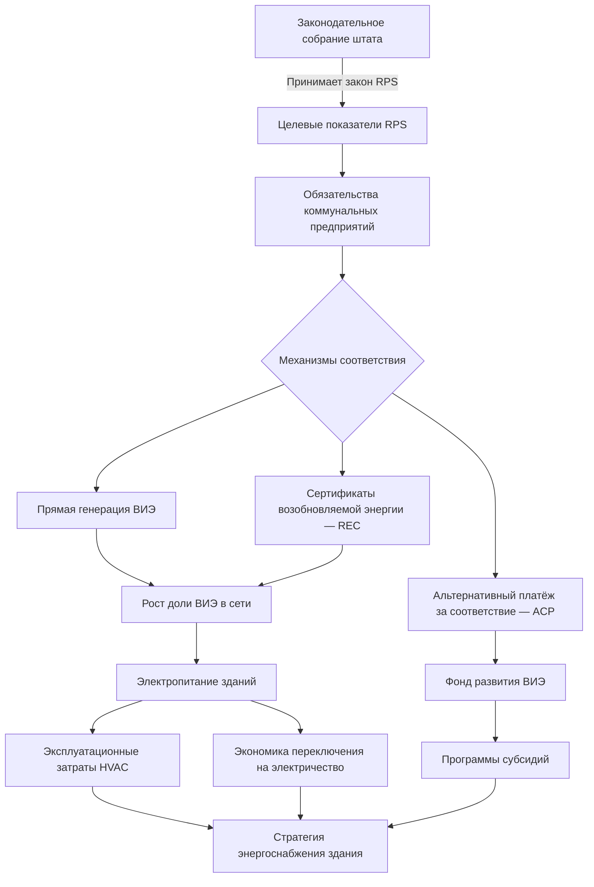

Стандарты портфеля возобновляемых источников энергии (Renewable Portfolio Standards, RPS) устанавливают обязательные целевые показатели для поставщиков электроэнергии по закупке определённой доли генерации из возобновляемых источников. Эти нормативные акты уровня штата коренным образом меняют структуру электросети, напрямую влияя на эксплуатационные затраты систем HVAC (Heating, Ventilation and Air Conditioning), решения по выбору топлива и экономику электрификации зданий.

По состоянию на начало 2025 года 30 штатов США и округ Колумбия имеют действующие программы RPS с целевыми показателями от 10% до 100% возобновляемой энергии. DSIRE (Database of State Incentives for Renewables & Efficiency) ведёт исчерпывающий реестр этих программ по всем юрисдикциям.

## Нормативно-правовая база RPS

## Целевые показатели RPS по штатам


| Штат | Целевой показатель | Год | Примечания |
|---|---|---|---|
| Калифорния | 100% без CO₂ | 2045 | 60% ВИЭ к 2030; 100% чистых к 2045 |
| Нью-Йорк | 70% ВИЭ | 2030 | 100% без выбросов к 2040 |
| Массачусетс | 40% ВИЭ | 2030 | Рост на 1%/год после 2030 |
| Нью-Джерси | 50% ВИЭ | 2030 | Отдельная квота на солнечную энергию 11% |
| Иллинойс | 50% ВИЭ | 2040 | 40% к 2030 |
| Колорадо | 100% чистых | 2050 | 80% к 2030 для IOU |
| Вашингтон | 100% чистых | 2045 | 80% к 2030; вывод угля к 2025 |
| Виргиния | 100% чистых | 2050 | 65% RPS к 2035 для IOU |
| Орегон | 50% ВИЭ | 2040 | 100% чистых к 2040 |
| Невада | 50% ВИЭ | 2030 | Квота на солнечную энергию 12% к 2025 |


Примечание: IOU (investor-owned utilities) — коммунальные предприятия с инвесторским участием. Ряд штатов различает RPS (только возобновляемые) и CES (clean energy standards — включают атомную энергию и другие источники без выбросов).

## Механизмы соответствия

Коммунальные предприятия и субъекты, обслуживающие нагрузку (load-serving entities), применяют три основных механизма выполнения обязательств RPS.

**1. Прямая генерация возобновляемой энергии.**
Коммунальные предприятия строят или заключают соглашения о покупке электроэнергии (power purchase agreements, PPA) с объектами ВИЭ: ветровыми, солнечными фотоэлектрическими, биомассовыми и геотермальными электростанциями. Этот подход напрямую увеличивает долю ВИЭ в электросети.

**2. Сертификаты возобновляемой энергии (Renewable Energy Certificates, REC).**
Один REC удостоверяет экологические атрибуты одного МВт·ч генерации из возобновляемых источников. Коммунальные предприятия приобретают REC отдельно от физической электроэнергии для выполнения обязательств RPS. Рынки REC создают ценовые сигналы, стимулирующие развитие новых проектов ВИЭ.

**3. Альтернативный платёж за соответствие (Alternative Compliance Payment, ACP).**
При недостаточном объёме закупок ВИЭ или REC коммунальные предприятия осуществляют штрафные платежи в государственные фонды. Ставки ACP, как правило, составляют 25–75 USD/МВт·ч, устанавливая эффективный ценовой потолок для рынков REC.

## Влияние RPS на системы HVAC зданий

### Снижение углеродоёмкости электроэнергии

По мере роста доли ВИЭ в сети электрическое отопление и охлаждение производят всё меньше выбросов парниковых газов. В штатах, где доля ВИЭ превышает 50%, тепловые насосы в годовом исчислении производят меньше выбросов CO₂, чем газовые печи, — даже с учётом потерь при генерации и транспортировке электроэнергии.

### Дифференциация тарифов по времени суток

Соответствие RPS нередко сопровождается ростом выработки солнечной электроэнергии в дневные часы. Это формирует ценовой провал в полуденное время и удорожание в вечерние и ночные часы. Системы HVAC с накоплением тепловой энергии (thermal energy storage, TES) могут использовать этот дифференциал, предварительно охлаждаясь в периоды дешёвой солнечной генерации.

### Экономика электрификации зданий

Высокие целевые показатели RPS улучшают экономическое обоснование полностью электрических зданий. По мере снижения стоимости ВИЭ тепловые насосы становятся более конкурентоспособными по сравнению с газовым оборудованием — особенно в сочетании с собственной солнечной генерацией на объекте.

### Финансирование программ субсидий

Поступления от ACP и иные средства, связанные с RPS, нередко направляются на финансирование программ повышения энергоэффективности зданий: субсидий на тепловые насосы, герметизацию оболочки и возобновляемое теплоснабжение.

## Числовой пример: влияние RPS на выбросы теплового насоса

Жилой тепловой насос потребляет 5 000 кВт·ч/год. Сравниваются три сценария электросети.


| Сценарий | Углеродоёмкость сети, г CO₂/кВт·ч | Выбросы теплового насоса, кг CO₂/год | Газовая печь (AFUE 95%), кг CO₂/год |
|---|---|---|---|
| Текущая сеть США (ср.) | 386 | 1 930 | 2 100 |
| Сеть с 50% ВИЭ (2030) | 190 | 950 | 2 100 |
| Сеть с 80% ВИЭ (2040) | 70 | 350 | 2 100 |


При 50% ВИЭ выбросы теплового насоса снижаются до 950 кг CO₂/год — менее половины выбросов газовой печи (2 100 кг CO₂/год). Формула расчёта:


E_{\text{ТН}} = W_{\text{потр}} \times e_{\text{сеть}} = 5\,000 \;\text{кВт·ч} \times 190 \;\text{г/кВт·ч} = 950\,000 \;\text{г} = 950 \;\text{кг CO}_2/\text{год}


## RPS и интеграция солнечной энергии на объекте

Встроенные в здание фотоэлектрические системы взаимодействуют с политикой RPS через механизмы чистого счётчика (net metering) и владения REC.

Ключевые аспекты:
- **Владение REC:** ряд программ коммунальных предприятий требует передачи REC от систем on-site солнечной генерации в обмен на финансовые стимулы;
- **Ставки компенсации за net metering:** целевые показатели RPS могут обеспечивать более высокие коэффициенты компенсации, отражая ценность декарбонизации сети;
- **Ограничения самоснабжения:** несколько штатов исключают on-site генерацию клиентов из соответствия RPS, концентрируя требования на объектах коммунальных предприятий.

## Рекомендации для проектировщиков систем HVAC

При проектировании в штатах с амбициозными целевыми показателями RPS:

1. Проводить оценку стоимости жизненного цикла тепловых насосов с использованием прогнозируемых снижений углеродоёмкости сети, а не текущих показателей топливного микса.
2. Рассматривать накопление тепловой энергии для использования тарифных дифференциалов по времени суток, обусловленных ростом солнечной генерации.
3. Рассчитывать электрическую инфраструктуру с запасом для будущей электрификации по мере улучшения экономики электрического отопления.
4. Изучать программы субсидий коммунальных предприятий, финансируемые через механизмы ACP.
5. Проводить анализ TCO (total cost of ownership — совокупная стоимость владения) на 15–20-летний горизонт с учётом прогнозируемого тренда электрических тарифов, обусловленного RPS.

## Тенденции политики RPS

- **Переход на стандарты чистой энергии (Clean Energy Standards, CES):** расширение требований за пределы только возобновляемых источников — включение атомной энергии, технологий улавливания углерода (CCS) и иных источников без выбросов;
- **Ужесточение целевых показателей:** систематическое законодательное увеличение процентных долей и ускорение графиков соответствия;
- **Квоты на морскую ветроэнергетику:** прибрежные штаты устанавливают конкретные целевые показатели offshore-ресурсов;
- **Интеграция накопителей энергии:** новые требования к сочетанию ВИЭ-генерации с батарейным хранением для устранения проблемы прерывистости.

Эти тенденции ускоряют декарбонизацию электросети, последовательно улучшая экологический профиль электрического HVAC-оборудования и укрепляя экономическое обоснование стратегий электрификации зданий.

## Нормативные ссылки и источники данных

- DSIRE (dsireusa.org): комплексный мониторинг политик RPS штатов, требований соответствия и допустимых технологий.
- NCSL (National Conference of State Legislatures): законодательный анализ государственных стандартов возобновляемой энергии.
- Форма EIA-861: годовые данные по электроэнергетической отрасли, показатели соответствия RPS по штатам.
- IEA, Renewables 2024: актуальные данные о доле ВИЭ в мировой генерации.
- IRENA, Renewable Power Generation Costs 2023: тенденции стоимости возобновляемой генерации.
- ASHRAE 90.1-2022: Energy Standard for Sites and Buildings — базовый уровень для оценки воздействия RPS на выбор оборудования.
