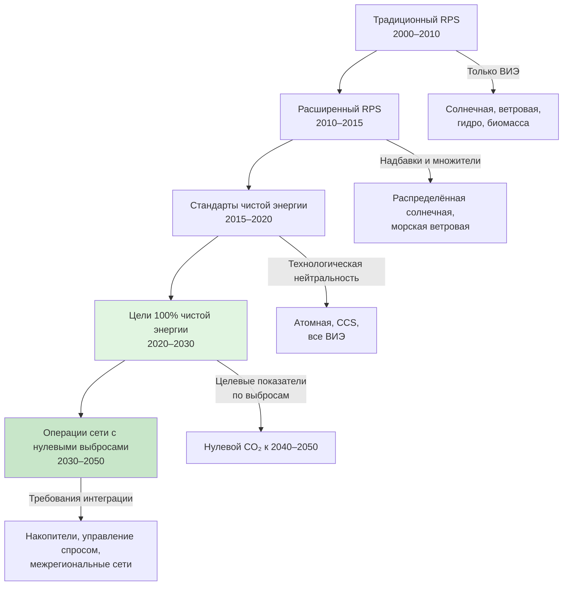

Стандарты чистой энергии (Clean Energy Standards, CES) представляют собой эволюцию традиционных стандартов портфеля возобновляемых источников энергии (Renewable Portfolio Standards, RPS). CES устанавливают технологически нейтральную нормативную базу, которая признаёт все источники электроэнергии с нулевым содержанием углерода: ядерную энергию, возобновляемые источники, технологии улавливания и хранения углерода (carbon capture and storage, CCS), возобновляемый водород. В отличие от RPS, предписывающих конкретный процент возобновляемой генерации, CES сосредоточены на результатах — интенсивности выбросов или доле генерации без CO₂, — позволяя конкурировать широкому спектру технологий. Для проектировщика систем HVAC это означает растущую экономическую привлекательность электрического оборудования по мере приближения сети к нулевым выбросам.

## Эволюция политики от RPS к CES

## RPS и CES: ключевые отличия


| Параметр | RPS | CES |
|---|---|---|
| Приемлемые технологии | Солнечная, ветровая, биомасса, геотермальная, гидро (ограничения варьируются) | Все источники с нулевым CO₂, включая атомную, CCS, водород |
| Политический показатель | Доля ВИЭ в генерации (%) | Интенсивность выбросов (г CO₂/кВт·ч) или доля генерации без выбросов |
| Атомная энергия | Как правило, исключена | Включена как чистая энергия |
| Существующие ресурсы | Только новые мощности ВИЭ | Существующая генерация без CO₂ засчитывается |
| Технологическая нейтральность | Ограничена подмножеством ВИЭ | Полная |
| Механизм соответствия | Сертификаты ВИЭ (REC) | Кредиты чистой энергии (CEC) или соответствие интенсивности выбросов |
| Надёжность сети | Может требоваться дополнительная диспетчеризуемая мощность | Допускает диверсифицированный портфель без CO₂ |
| Потенциал снижения затрат | Ограничен — только конкуренция ВИЭ | Выше — конкурирует широкий спектр технологий |


## Целевые показатели CES по штатам

### Калифорния (SB 100)

- 60% ВИЭ к 2030 году.
- 100% электроэнергия без CO₂ к 2045 году.
- Мандаты на электрификацию для нового строительства (запрет газовых систем отопления для жилых зданий в ряде округов).
- Рассмотрение продления работы атомной станции Diablo Canyon в интересах надёжности.

### Вашингтон (SB 5116)

- 100% электроэнергия с углеродной нейтральностью к 2030 году.
- 100% без CO₂ к 2045 году.
- Существующая гидроэнергетика и атомная генерация засчитываются как чистая энергия.
- Стандарты эффективности зданий для существующих конструкций.

### Нью-Йорк (Climate Leadership and Community Protection Act, CLCPA)

- 70% ВИЭ к 2030 году.
- 100% без выбросов к 2040 году.
- Атомная генерация явно включена в зачёт.
- Крупномасштабные инициативы по электрификации зданий Нью-Йорка.

### Виргиния (Virginia Clean Economy Act, VCEA)

- 100% без CO₂ к 2050 году для IOU (investor-owned utilities).
- 100% ВИЭ к 2045 году для кооперативов и муниципальных предприятий.
- Интегрированные целевые показатели энергоэффективности.

### Нью-Мексико (Energy Transition Act)

- 50% ВИЭ к 2030 году.
- 80% ВИЭ к 2040 году.
- 100% без CO₂ к 2045 году.
- Положения о справедливом переходе для затронутых сообществ.

## Преимущества технологической нейтральности

**Повышение надёжности.**
Атомная базовая мощность и диспетчеризуемая гидрогенерация обеспечивают твёрдую мощность, дополняющую непостоянные ВИЭ. Эта надёжность поддерживает масштабную электрификацию тепловых нагрузок без необходимости избыточных резервных мощностей. Операторы сети могут поддерживать стабильность напряжения и частоты при высокой концентрации нагрузок тепловых насосов.

**Оптимизация затрат.**
Конкуренция среди всех технологий с нулевым CO₂ стимулирует инновации и снижение затрат в секторе чистой энергии в целом. Штаты с действующими атомными станциями избегают преждевременного вывода низкоуглеродных активов, что предотвращает рост тарифов. Конкурентное распределение гарантирует электрификацию зданий при минимальной общественной стоимости.

**Гибкость для интеграции в сеть.**
Рамки CES допускают диверсифицированные региональные портфели: штаты Тихоокеанского Северо-Запада используют гидроэнергетику, Среднего Запада — атомную генерацию, Юго-Запада — солнечную. Географическое разнообразие укрепляет выгоды от межрегиональной передачи.

## Последствия для электрификации зданий

### Прогнозирование роста нагрузки

Мандаты 100% CES требуют учёта существенного прироста потребления электроэнергии по мере электрификации отопления, горячего водоснабжения и приготовления пищи.


| Вид нагрузки | Жилое здание, кВт | Коммерческое здание, кВт |
|---|---|---|
| Тепловой насос для отопления помещений | 2–4 на единицу | 10–50+ |
| Тепловой насос для ГВС | 1,5–5 на единицу | 5–30 |
| Электрическая кухня | 3–8 (пиковая) | 10–60 |
| Зарядка EV | 7–19 (жилой) | 50–350 (коммерческий) |


### Управление пиковым спросом

Электрификация отопления в холодном климате формирует новые зимние пиковые нагрузки. Политика CES должна координироваться с программами управления спросом (demand response), стимулами накопления тепловой энергии и тарифами с временной дифференциацией для эффективного выравнивания пиков.

### Метрики учёта выбросов

**Годовое соответствие** (annual matching) — традиционный подход: зачитывается любое чистое производство в течение года против потребления зданий. Прост в администрировании, но допускает временное несовпадение производства и потребления.

**Почасовое соответствие, 24/7 CFE** (carbon-free energy) — передовой подход: чистое производство должно совпадать с потреблением на почасовой основе. Google, Microsoft и другие крупные потребители применяют этот стандарт, гарантируя, что электрифицированные нагрузки HVAC работают именно на безуглеродной электроэнергии в каждый час суток.

## Числовой пример: атомная станция и электрификация отопления

Атомная электростанция мощностью 1 000 МВт при коэффициенте использования мощности 90%:


W_{\text{год}} = 1\,000 \;\text{МВт} \times 8\,760 \;\text{ч} \times 0{,}90 = 7{,}88 \;\text{млн МВт·ч/год}


Типичный тепловой насос (SEER2 18, HSPF2 9,5) потребляет около 3 000 кВт·ч/год на отопление жилого дома. Число домов, которые может обеспечить станция:


N = \frac{7{,}88 \times 10^6 \;\text{МВт·ч}}{3\,0 \;\text{МВт·ч}} = 2{,}6 \;\text{млн домов}


Сохранение действующей атомной базовой мощности обеспечивает надёжную низкоуглеродную электроэнергию для крупномасштабной электрификации без необходимости кратного избытка ВИЭ-мощностей.

## Кредиты с нулевыми выбросами (ZEC)

Многие политики CES устанавливают программы Zero Emission Credits (ZEC) для сохранения существующей атомной генерации.

**Механика ZEC:**
Регуляторы определяют экологическую ценность действующих атомных станций через расчёт предотвращённых выбросов CO₂. Владельцы станций получают платежи ZEC пропорционально выработке (USD/МВт·ч), компенсируя недостаточные рыночные доходы. Это предотвращает преждевременный вывод низкоуглеродных активов, который повысил бы углеродоёмкость сети и осложнил достижение целей CES.

**Влияние на HVAC:**
Сохранение атомной базовой мощности стабилизирует тариф на электроэнергию и гарантирует низкую углеродоёмкость в базовые часы, когда тепловые насосы работают с наибольшей нагрузкой (зимние утренние и вечерние часы пик).

## Интенсивность выбросов как целевой показатель


| Штат | Целевой показатель 2030 | Целевой показатель 2040 | Целевой показатель 2050 | Метрика |
|---|---|---|---|---|
| Калифорния | 60% ВИЭ | — | 100% без CO₂ | Доля в предложении |
| Нью-Йорк | 70% ВИЭ | 100% без выбросов | — | Доля в предложении |
| Вашингтон | Углеродная нейтральность | — | 100% без CO₂ | Доля в предложении |
| Колорадо | −80% CO₂ | — | 100% без CO₂ | Интенсивность выбросов |
| Невада | 50% ВИЭ | — | 100% без CO₂ | Доля в предложении |


Подход на основе интенсивности выбросов (Колорадо) допускает гибкие стратегии: ВИЭ, атомная генерация, CCS, возобновляемый природный газ, меры по управлению спросом. Электрификация HVAC становится всё более привлекательной по мере снижения интенсивности выбросов сети.

## Вызовы реализации

**Сезонное несовпадение производства и нагрузки.**
Пиковая солнечная генерация приходится на летние месяцы, тогда как тепловые нагрузки зданий — на зимние. Достижение истинного 100% режима чистой энергии требует значительного сезонного хранения, гибкости спроса или диверсификации межрегиональных передач. Производство водорода в периоды избыточной ВИЭ-генерации — одно из перспективных решений.

**Достаточность мощности (resource adequacy).**
Обеспечение твёрдой мощности для покрытия пиков отопления и охлаждения в периоды низкой ВИЭ-генерации. Требования адекватности ресурсов должны выходить за рамки чисто энергетических целевых показателей, гарантируя надёжность в условиях экстремальных погодных событий, когда системы HVAC испытывают максимальный стресс.

**Вопросы справедливости (energy equity).**
Затраты на переход непропорционально затрагивают домохозяйства с низким доходом и арендаторов, не имеющих доступа к стимулам электрификации. Политика CES всё чаще включает положения о справедливом переходе, программы развития рабочей силы и усиленную поддержку уязвимых сообществ.

## Рекомендации для проектировщиков HVAC

1. Использовать прогнозируемую углеродоёмкость сети (а не текущую) при сравнении электрического оборудования с газовым в анализе жизненного цикла.
2. Включать в проекты накопление тепловой энергии для управления пиковыми нагрузками и использования тарифной дифференциации.
3. Рассчитывать электрическую инфраструктуру зданий с учётом поэтапной электрификации: предусматривать запас по мощности подстанций и вводных устройств.
4. При проектировании для юрисдикций с 24/7 CFE-требованиями предусматривать локальные накопители и интеграцию с батарейными системами.
5. Консультироваться с DSIRE и местными регуляторами о программах субсидий, связанных с ZEC и ACP.

Стандарты чистой энергии обеспечивают комплексную политическую базу для глубокой декарбонизации электросети, необходимой для устойчивой электрификации зданий. Технологически нейтральные подходы максимизируют гибкость, минимизируют затраты и обеспечивают надёжность в ходе перехода к системам с 100% чистой электроэнергией.

## Нормативные ссылки

- ASHRAE 90.1-2022: Energy Standard for Sites and Buildings Except Low-Rise Residential Buildings.
- IEA, World Energy Outlook 2024: сценарии декарбонизации электросети.
- IRENA, World Energy Transitions Outlook 2024.
- BP Statistical Review of World Energy 2023: данные о составе генерации по странам.
- DSIRE (dsireusa.org): реестр CES и RPS программ по штатам США.
- ФЗ-261 «Об энергосбережении и о повышении энергетической эффективности» (Российская Федерация).
