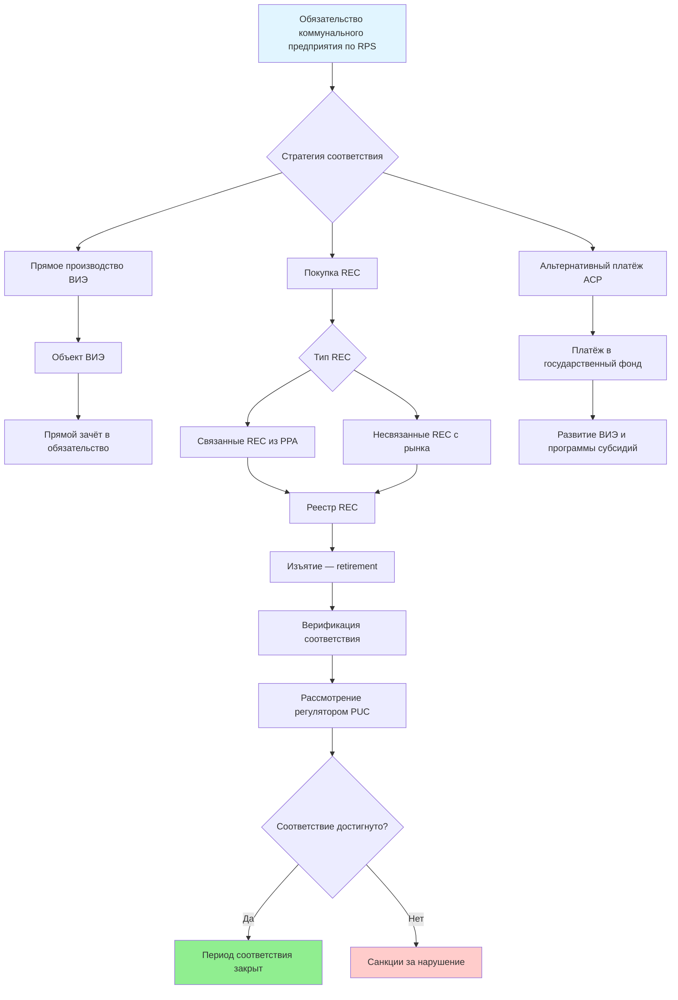

## Обзор государственных программ RPS

Стандарты возобновляемых портфелей (Renewable Portfolio Standards, RPS) — нормативные акты уровня штата, обязывающие поставщиков электроэнергии обеспечивать определённую долю генерации из возобновляемых источников к установленным целевым датам. Эти требования напрямую влияют на системы HVAC (Heating, Ventilation and Air Conditioning) через изменение состава электросети: растущая доля возобновляемой энергии снижает углеродоёмкость электрического отопления и охлаждения, улучшая экологические характеристики тепловых насосов.

По состоянию на январь 2025 года 30 штатов США и округ Колумбия имеют действующие программы RPS с диапазоном целевых показателей от 10% до 100% возобновляемой энергии. База данных DSIRE (Database of State Incentives for Renewables & Efficiency) ведёт исчерпывающий реестр этих программ по всем юрисдикциям, включая историю поправок и данные о соответствии.

## Целевые показатели RPS штатов


| Штат | Целевой показатель | Год достижения | Отдельная солнечная квота | Примечания |
|---|---|---|---|---|
| Калифорния | 100% | 2045 | Да | 60% к 2030, нулевой CO₂ к 2045 |
| Нью-Йорк | 70% | 2030 | Да | 100% без выбросов к 2040 |
| Массачусетс | 35% | 2030 | 3 500 МВт | Прирост 1%/год после 2020 |
| Нью-Джерси | 50% | 2030 | 5 316 МВт | Приоритет классу I ВИЭ |
| Иллинойс | 50% | 2040 | 3 000 МВт | Программа угольных переходов |
| Мэриленд | 50% | 2030 | 14,5% | Квота на морскую ветровую энергию |
| Коннектикут | 48% | 2030 | Да | Нулевой CO₂ к 2040 |
| Невада | 50% | 2030 | Да | Ранее добровольный, с 2019 обязательный |
| Виргиния | 100% | 2050 | Да | IOU (investor-owned utilities) |
| Вашингтон | 100% | 2045 | Да | Нулевое углеродное электричество |
| Колорадо | 100% | 2050 | Да | 80% к 2030 для IOU |
| Мэн | 80% | 2030 | Да | 100% к 2050 |
| Орегон | 50% | 2040 | Да | 100% чистых к 2040 |
| Аризона | 15% | 2025 | 30% от квоты | Добровольная цель чистой энергии |
| Пенсильвания | 18% | 2021 | 0,5% | Ресурсы класса I и II |


## Сертификаты возобновляемой энергии (REC)

REC (Renewable Energy Certificate) — стандартизованный документ, удостоверяющий экологические атрибуты одного МВт·ч возобновляемой электрогенерации. Разделение физической электроэнергии и её экологических атрибутов создаёт торгуемый инструмент для соответствия RPS и корпоративной отчётности по выбросам (scope 2).

Характеристики REC:
- **Производство:** 1 REC = 1 МВт·ч возобновляемой генерации;
- **Отслеживание:** централизованные электронные реестры — NEPOOL GIS (Новая Англия), PJM-GATS (Средний Запад и Атлантика), WREGIS (западные штаты), M-RETS (Средний Запад);
- **Срок действия:** год производства влияет на приемлемость и стоимость;
- **Торговля:** межрегиональная торговля разрешена в некоторых зонах;
- **Изъятие:** REC, использованные для соответствия, постоянно аннулируются во избежание двойного зачёта.

### Солнечные сертификаты (SREC)

Штаты с отдельной солнечной квотой создают самостоятельные рынки SREC (Solar Renewable Energy Certificates):


| Штат | Рыночная цена SREC, USD/МВт·ч | Период соответствия | ACP (ценовой потолок), USD/МВт·ч |
|---|---|---|---|
| Массачусетс | 250–320 | Июнь–май | 339 |
| Нью-Джерси | 85–95 | Июнь–май | 91,72 |
| Мэриленд | 70–85 | Июнь–май | 95 |
| Пенсильвания | 30–40 | Июнь–май | 45 |
| Округ Колумбия | 350–400 | Янв.–дек. | 500 |


Цена SREC определяется соотношением предложения солнечной генерации и обязательного спроса. Избыток предложения тяготеет к нижней границе (минимальный ACP), дефицит — к верхней (максимальный ACP). Владельцы коммерческих солнечных установок на объектах HVAC получают доход от SREC дополнительно к экономии на электроэнергии.

## Механизмы соответствия

Коммунальные предприятия применяют три пути выполнения обязательств RPS:

### 1. Прямая генерация возобновляемой энергии

Коммунальные предприятия владеют и управляют объектами ВИЭ; производство автоматически засчитывается в обязательства RPS. Преимущества:
- долгосрочная определённость затрат;
- прямой операционный контроль;
- защита от волатильности рынка REC;
- выгоды от владения активами.

### 2. Закупка REC

Покупка REC у сторонних производителей обеспечивает гибкость:
- **связанные REC** — приобретаются вместе с базовой электроэнергией через соглашения PPA (power purchase agreement);
- **несвязанные REC** — только экологические атрибуты, отдельно от физической электроэнергии;
- **двусторонние контракты** — прямые соглашения между сторонами;
- **биржевые операции** — спотовые сделки через брокеров.

### 3. Альтернативные платежи за соответствие (ACP)

Ставки ACP устанавливают де-факто ценовой потолок рынка REC: рациональные коммунальные предприятия не будут платить за REC больше, чем стоимость ACP.

## Влияние RPS на системы HVAC

**Экономика тепловых насосов.** По мере роста доли ВИЭ тепловые насосы демонстрируют всё лучшие экологические показатели по сравнению с оборудованием на ископаемом топливе. В штатах, приближающихся к 50% ВИЭ, выбросы CO₂ тепловых насосов за год эксплуатации становятся ниже выбросов газовых печей — даже с учётом потерь при генерации.

**Тарифная оптимизация по времени суток.** Рост солнечной генерации для выполнения RPS создаёт дневной избыток и вечерний дефицит электроэнергии. Системы теплового накопления (ice storage, water TES) могут смещать охлаждающие нагрузки на солнечные часы, снижая операционные затраты HVAC.

**Когенерация (CHP).** Политика RPS может включать или исключать CHP (combined heat and power) из зачёта возобновляемой энергии. В штатах, исключающих CHP из RPS, относительное экономическое преимущество эффективных когенерационных систем снижается.

**Интеграция управления спросом.** Коммунальные предприятия, управляющие портфелями REC, всё выше оценивают DR-ресурсы. Системы с переменным расходом хладагента (variable refrigerant flow, VRF) и умные термостаты с DR-функционалом обеспечивают гибкость в часы прерывистости ВИЭ-генерации.

## Числовой пример: стоимость SREC для коммерческой солнечной установки

Офисное здание площадью 3 000 м² в Массачусетсе устанавливает солнечную установку мощностью 200 кВт. Годовая выработка при удельном производстве 1 300 кВт·ч/кВт:


W_{\text{год}} = 200 \;\text{кВт} \times 1\,300 \;\text{кВт·ч/кВт} = 260\,000 \;\text{кВт·ч} = 260 \;\text{МВт·ч}


При цене SREC 285 USD/МВт·ч (среднее значение рынка Массачусетса за 2024 год):


D_{\text{SREC}} = 260 \;\text{МВт·ч} \times 285 \;\text{USD/МВт·ч} = 74\,100 \;\text{USD/год}


Совокупный доход от SREC и экономии электроэнергии (260 МВт·ч × 0,13 USD/кВт·ч = 33 800 USD) составит 107 900 USD/год, что существенно улучшает инвестиционные показатели кровельной солнечной установки.

## Положения о накоплении и заимствовании

**Накопление (banking).** Избыточные REC, произведённые сверх требований текущего года, сохраняются для использования в будущих периодах соответствия. Типичный период накопления — 1–4 года; обеспечивает гибкость и сглаживает рыночную волатильность.

**Заимствование (borrowing).** Ряд юрисдикций разрешает зачитывать будущие REC на текущие обязательства, как правило, не более 10–15% годовых требований. Механизм предотвращает массовое несоответствие при краткосрочных рыночных шоках.

## Верификация и правоприменение

Государственные комиссии по коммунальным услугам (Public Utility Commissions, PUC) администрируют программы RPS через:

1. Ежегодные отчёты о соответствии с документацией об объёмах закупок ВИЭ.
2. Верификацию изъятия REC в реестрах (подтверждение retirement).
3. Сертификацию объектов ВИЭ и проверку показаний счётчиков.
4. Применение штрафов за несоответствие — ACP плюс дополнительные санкции.
5. Рассмотрение передачи затрат на соответствие потребителям через тарифные заявки.

## Будущие тенденции

Программы RPS эволюционируют в сторону всё более амбициозных целей. Тренд к требованиям 100% чистой энергии к 2040–2050 годам коренным образом меняет долгосрочное планирование HVAC. Проектировщики должны учитывать снижающуюся углеродоёмкость сетевой электроэнергии при жизнецикловом анализе крупных систем со сроком эксплуатации 20–30 лет:

- в 2025 году углеродоёмкость средней американской сети — около 386 г CO₂/кВт·ч;
- при 50% ВИЭ (прогноз 2030–2035) — около 150–190 г CO₂/кВт·ч;
- при 80% ВИЭ (прогноз 2040–2045) — менее 80 г CO₂/кВт·ч.

Это означает, что тепловой насос, установленный сегодня, за свой жизненный цикл произведёт значительно меньше выбросов, чем показывают расчёты по текущей углеродоёмкости сети.

## Нормативные ссылки

- DSIRE (dsireusa.org): исчерпывающая база данных программ RPS и CES по всем штатам США.
- NCSL (National Conference of State Legislatures): аналитика законодательства о возобновляемой энергии.
- Форма EIA-861: годовые данные электроэнергетики, показатели соответствия RPS.
- IEA, Renewables 2024: глобальный обзор рынка возобновляемой энергии.
- IRENA, Renewable Power Generation Costs 2023.
- BP Statistical Review of World Energy 2023.
- ASHRAE 90.1-2022: Energy Standard for Sites and Buildings.
- ФЗ-261 «Об энергосбережении и о повышении энергетической эффективности» (Российская Федерация).
