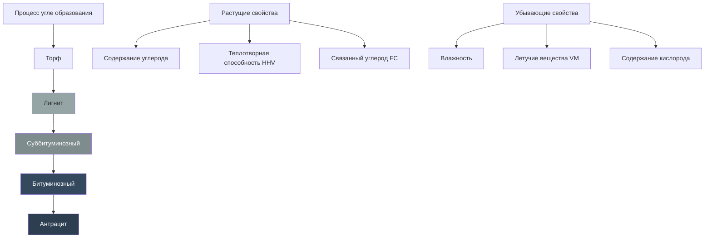

Уголь остаётся значимым топливом для промышленных систем теплоснабжения и выработки электроэнергии. Понимание физических и химических свойств угля необходимо для правильного выбора котельного оборудования, расчёта горелок, организации газоочистки и соответствия нормативным требованиям по выбросам в системах HVAC (Heating, Ventilation and Air Conditioning).

По данным IEA (World Energy Statistics 2023), уголь обеспечивает около 40% мировой выработки электроэнергии, используется на теплоснабжающих объектах и когенерационных установках, служащих источниками тепловой энергии для зданий. В России уголь остаётся основным видом топлива для централизованного теплоснабжения в ряде регионов Сибири и Дальнего Востока.

## Классификация и ранг угля

Классификация угля основана на системе рангов в соответствии со стандартом ASTM D388 (Standard Classification of Coals by Rank). Ранг определяется содержанием углерода, летучих веществ и теплотворной способностью.

## Проксимальный анализ

Проксимальный анализ (proximate analysis) по ASTM D3172 определяет четыре ключевых параметра, характеризующих поведение угля при сгорании.

**Влажность (Moisture, M)** — содержание воды влияет на теплотворную способность и требования к сушке при транспортировке и хранении. Высокая влажность снижает теплотворную способность и требует дополнительной энергии на испарение воды.

**Летучие вещества (Volatile Matter, VM)** — газообразные углеводороды, выделяемые при нагревании без доступа воздуха. Высокое содержание VM облегчает воспламенение, но требует удлинённых камер сгорания для полного выгорания.

**Связанный углерод (Fixed Carbon, FC)** — твёрдый горючий остаток после выделения летучих веществ; сгорает на колосниковой решётке или в слое кокса.

**Зольность (Ash, A)** — минеральный негорючий остаток, требующий удаления и утилизации; влияет на загрязнение теплообменных поверхностей и выбросы.

Уравнение материального баланса:


M + VM + FC + A = 100\%


## Сравнение углей по рангу


| Свойство | Антрацит | Битуминозный | Суббитуминозный | Лигнит |
|---|---|---|---|---|
| Связанный углерод FC, % | 86–98 | 45–86 | 35–45 | 25–35 |
| Летучие вещества VM, % | 2–14 | 14–45 | 45–55 | 55–65 |
| Влажность M, % | 2–5 | 2–8 | 10–25 | 30–40 |
| HHV (higher heating value), МДж/кг | 29,1–35,1 | 25,6–32,6 | 19,8–26,9 | 14,0–19,8 |
| Зольность A, % | 6–12 | 4–12 | 4–10 | 6–15 |
| Температура воспламенения, °C | 496–521 | 449–482 | 399–449 | 349–399 |
| Содержание серы S, % | 0,5–1,5 | 0,7–4,0 | 0,3–1,0 | 0,4–1,0 |
| Типичное применение | Коммунальное отопление | Энергетика | Промышленные котлы | ТЭС вблизи шахт |


## Расчёт теплотворной способности

Высшая теплотворная способность (HHV — higher heating value) включает теплоту конденсации водяного пара продуктов сгорания. Низшая теплотворная способность (LHV — lower heating value) исключает эту составляющую и лучше соответствует фактически используемой тепловой энергии в большинстве котлов.

Формула Дюлонга для оценки HHV по элементарному анализу (массовые доли):


HHV = 14\,544 \cdot C + 62\,028 \left(H - \frac{O}{8}\right) + 4\,050 \cdot S \quad \text{[кДж/кг]}


где C, H, O, S — массовые доли углерода, водорода, кислорода и серы соответственно.

Перевод HHV в LHV с учётом конденсации водяного пара:


LHV = HHV - 2\,442 \cdot (9H + M) \quad \text{[кДж/кг]}


где коэффициент 2 442 кДж/кг — удельная теплота парообразования воды при стандартных условиях; H и M в долях от единицы.

### Числовой пример: теплотворная способность битуминозного угля

Уголь Кузнецкого бассейна, проксимальный анализ (рабочее состояние):
- влажность M = 7%;
- зольность A = 10%;
- содержание серы S = 0,5%.

Элементарный анализ (пересчёт на горючую массу): C = 76%, H = 5%, O = 8%.

Применяем формулу Дюлонга для рабочего состояния с учётом поправки на влажность и зольность:


HHV_{\text{ar}} = \left[14\,544 \times 0{,}76 + 62\,028\left(0{,}05 - \frac{0{,}08}{8}\right) + 4\,050 \times 0{,}005\right] \times (1 - 0{,}07 - 0{,}10)



HHV_{\text{ar}} = \left[11\,053 + 3\,722 + 20\right] \times 0{,}83 = 14\,795 \times 0{,}83 \approx 12\,280 \;\text{кДж/кг}


Примечание: фактический расчёт по ASTM D5865 (калориметр) даёт значение около 27 000–30 000 МДж/т для кузнецких углей средней марки.

## Стехиометрия сгорания: расчёт воздуха

Теоретическая потребность в воздухе для полного сгорания угля:


A_0 = 11{,}5 \cdot C + 34{,}5 \left(H - \frac{O}{8}\right) + 4{,}3 \cdot S \quad \text{[кг воздуха/кг топлива]}


Фактически подаваемый воздух с коэффициентом избытка α:


A_{\text{факт}} = \alpha \cdot A_0 \quad (\alpha = 1{,}15\text{–}1{,}30 \text{ для угольных котлов})


Избыток воздуха (excess air, EA) влияет на КПД котла через потери с уходящими газами. Оптимальное значение α балансирует полноту сгорания против тепловых потерь в дымоходе. При α = 1,20 и A₀ = 10,0 кг/кг:


A_{\text{факт}} = 1{,}20 \times 10{,}0 = 12{,}0 \;\text{кг воздуха/кг угля}


## Свойства золы и шлакование

Температура плавления золы (ash fusion temperature) определяет склонность к шлакованию в топке. ASTM D1857 устанавливает четыре характерные точки:

- **IDT** — Initial Deformation Temperature, температура начальной деформации;
- **ST** — Softening Temperature, температура размягчения;
- **HT** — Hemispherical Temperature, полусферическая температура;
- **FT** — Flow Temperature, температура текучести.

Температура в топке должна оставаться ниже IDT для предотвращения образования шлаковых отложений на теплообменных поверхностях. Коэффициент шлакования — отношение основных оксидов к кислотным в составе золы — используется для прогноза шлакующих свойств угля.

## Особенности применения в системах HVAC

**Выбор типа котла.** Угольные котлы для HVAC используют:
- механизированные топки (движущаяся решётка, распыливаемая решётка) для малых и средних установок мощностью до 10 МВт;
- системы пылевидного угля (pulverized coal, PC) для крупных объектов свыше 10 МВт.

**Управление горением.** Угли с высоким содержанием летучих веществ требуют тщательного распределения воздуха по зонам топки для предотвращения пристеночных ударов пламени. Угли с низким содержанием VM требуют высоких температур в топке и увеличенного времени пребывания частиц.

**Теплообмен и загрязнение.** Отложение золы на трубах котла снижает коэффициенты теплопередачи; системы паровой и дробеструйной очистки (soot blowing) поддерживают эффективность за счёт периодической очистки поверхностей.

**Контроль выбросов.** Современные угольные котлы оснащаются:
- электрофильтрами (ESP) или рукавными фильтрами для улавливания твёрдых частиц;
- системами мокрой или сухой десульфурации дымовых газов (FGD) для снижения SO₂;
- низкоNOx-горелками и системами SNCR/SCR для ограничения выбросов NOx.

**Обращение с топливом.** Высокая влажность обусловливает специальные требования к хранению: закрытые склады и подогреваемые бункеры в условиях холодного климата. В соответствии с СП 60.13330.2020 системы подачи твёрдого топлива должны обеспечивать нормируемый расчётный расход без перерывов в подаче.

## Стандарты ASTM для угольного анализа

| Стандарт | Область применения |
|---|---|
| ASTM D388 | Классификация углей по рангу |
| ASTM D3172 | Проксимальный анализ угля и кокса |
| ASTM D3173 | Влажность в аналитической пробе |
| ASTM D3174 | Зольность аналитической пробы |
| ASTM D3175 | Летучие вещества аналитической пробы |
| ASTM D3176 | Элементарный анализ угля и кокса |
| ASTM D5865 | Высшая теплота сгорания |
| ASTM D1857 | Плавкость золы угля |
| ASTM D4239 | Общая сера в аналитической пробе |

## Нормативные ссылки

- ASTM D388, D3172, D3176, D5865, D1857, D4239.
- ASHRAE 90.1-2022: Energy Standard for Sites and Buildings.
- IEA, World Energy Statistics 2023.
- СП 60.13330.2020: Отопление, вентиляция и кондиционирование воздуха.
- US EPA AP-42, Ch. 1: External Combustion Sources (Coal Combustion).
- ФЗ-261 «Об энергосбережении и о повышении энергетической эффективности» (Российская Федерация).
