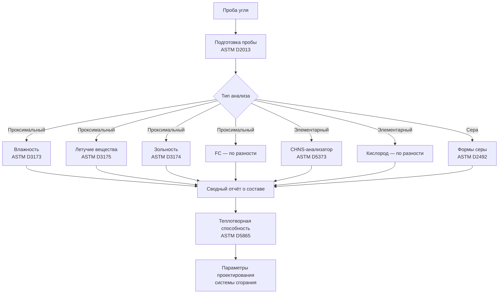

## Обзор

Состав угля определяет эффективность сгорания, характеристики выбросов и теплотворную способность в котельных установках. Знание методов проксимального и элементарного анализа позволяет инженеру HVAC (Heating, Ventilation and Air Conditioning) обоснованно выбирать топливо, правильно рассчитывать оборудование и обеспечивать выполнение нормативных требований по выбросам.

В Российской Федерации угли классифицируются по ГОСТ 25543 (на основе ASTM D388) и по отраслевым стандартам. Технические условия котельных установок, как правило, приводятся для угля в рабочем состоянии (ar — as received).

## Проксимальный анализ

Проксимальный анализ (proximate analysis) по ASTM D3172 количественно определяет четыре фундаментальных параметра, характеризующих топливо с точки зрения практического использования.

**Влажность (Moisture, M):** содержание воды в угле указывается в пересчёте на рабочее (ar) или сухое (d) состояние. Избыточная влажность снижает теплотворную способность и увеличивает расход топлива.


Q_{\text{net,ar}} = Q_{\text{net,dry}} \times \left(1 - \frac{M}{100}\right)


**Летучие вещества (Volatile Matter, VM):** компоненты, выделяемые в виде газа при нагревании без доступа воздуха (ASTM D3175). Высокое содержание VM облегчает воспламенение, но требует большей длины камеры сгорания для полного выгорания.

**Связанный углерод (Fixed Carbon, FC):** твёрдый горючий остаток после выделения летучих веществ; рассчитывается по разности:


FC = 100 - (M + VM + A)


**Зольность (Ash, A):** негорючий минеральный остаток после полного сгорания (ASTM D3174). Высокая зольность снижает теплотворную способность и увеличивает затраты на золоудаление.

Уравнение материального баланса:


M + VM + FC + A = 100\%


## Элементарный анализ

Элементарный анализ (ultimate analysis) по ASTM D3176 определяет элементный состав угля, что необходимо для расчётов сгорания и прогнозирования выбросов.


| Элемент | Типичный диапазон, мас.% (сухое состояние) | Значимость для сгорания |
|---|---|---|
| Углерод C | 65–95 | Основной источник тепла |
| Водород H | 2–6 | Вторичное тепло; образование H₂O |
| Кислород O | 2–25 | Снижает теплотворную способность |
| Азот N | 0,5–2 | Образование выбросов NOx |
| Сера S | 0,3–8 | Образование SO₂; кислотная коррозия |
| Зола A | 4–40 | Загрязнение, шлакование |


## Состав угля по рангу


| Ранг | FC, % | VM, % | M, % | HHV, МДж/кг |
|---|---|---|---|---|
| Антрацит | 86–92 | 3–8 | 2–4 | 30–34 |
| Битуминозный | 45–86 | 20–40 | 2–10 | 24–32 |
| Суббитуминозный | 35–50 | 40–50 | 15–30 | 18–26 |
| Лигнит | 25–35 | 40–50 | 30–45 | 10–20 |


## Стехиометрический расчёт воздуха

Теоретическая потребность в воздухе для полного сгорания (по данным элементарного анализа):


A_0 = 11{,}5 \cdot C + 34{,}5 \left(H - \frac{O}{8}\right) + 4{,}3 \cdot S \quad \text{[кг воздуха/кг топлива]}


где C, H, O, S — массовые доли в долях от единицы.

Фактически подаваемый воздух с коэффициентом избытка α:


A_{\text{факт}} = \alpha \cdot A_0


Для угольных котлов α = 1,15–1,30 (EN 303-1). Оптимальное α минимизирует сумму потерь от химического недожога и потерь с уходящими газами.

## Содержание серы и классификация

Сера в угле присутствует в трёх формах:

1. **Пиритная сера (FeS₂):** минеральный сульфид железа; частично удаляется при физическом обогащении угля.
2. **Органическая сера:** химически связана со структурой угольного вещества; не удаляется при обогащении.
3. **Сульфатная сера:** пренебрежимо мала в свежем угле; нарастает при выветривании.

Классификация по общему содержанию серы:
- низкосернистый: S < 1,0%;
- среднесернистый: S = 1,0–3,0%;
- высокосернистый: S > 3,0%.

Расчёт массового потока выбросов SO₂:


\dot{m}_{\text{SO}_2} = \dot{m}_{\text{уголь}} \cdot \frac{S}{100} \cdot \frac{64}{32} \cdot (1 - \eta_{\text{FGD}})


где η_FGD — КПД системы десульфурации дымовых газов (flue gas desulfurization); 64/32 — молярное отношение SO₂ к S.

### Числовой пример: выбросы SO₂

Котёл мощностью 10 МВт сжигает битуминозный уголь (S = 2,5%, HHV = 28 МДж/кг) при КПД 88%. Расход угля:


\dot{m}_{\text{уголь}} = \frac{10\,000 \;\text{кВт}}{28\,000 \;\text{кДж/кг} \times 0{,}88} = 0{,}406 \;\text{кг/с} = 1\,460 \;\text{кг/ч}


Выбросы SO₂ без очистки (η_FGD = 0):


\dot{m}_{\text{SO}_2} = 1\,460 \cdot \frac{2{,}5}{100} \cdot 2 = 73 \;\text{кг/ч} = 0{,}640 \;\text{г/с}


Со скруббером FGD (η_FGD = 0,92):


\dot{m}_{\text{SO}_2,\text{очищ.}} = 73 \times (1 - 0{,}92) = 5{,}8 \;\text{кг/ч}


## Методы анализа: обзор процедур

## Свойства золы и шлакование

Состав золы влияет на загрязнение теплообменных поверхностей, шлакование и высокотемпературную коррозию котла.

**Температура плавления золы (ASTM D1857):**

- IDT (Initial Deformation Temperature) — температура начальной деформации: 1 050–1 300°C.
- ST (Softening Temperature) — температура размягчения: 1 100–1 400°C.
- HT (Hemispherical Temperature) — полусферическая: 1 150–1 450°C.
- FT (Flow Temperature) — температура текучести: 1 200–1 500°C.

Температура в топке должна быть ниже IDT, чтобы избежать образования шлаковых наплывов на экранных трубах.

**Силикатный коэффициент (slagging index):**


R_s = \frac{\text{SiO}_2}{\text{SiO}_2 + \text{Fe}_2\text{O}_3 + \text{CaO} + \text{MgO}}


При R_s < 0,6 — высокий потенциал шлакования; при R_s > 0,72 — низкий.

## Следовые элементы и экологические ограничения


| Элемент | Типичное содержание | Значимость |
|---|---|---|
| Ртуть Hg | 0,01–1,5 ppm | Нормируется стандартами MACT (США), директивой IED (ЕС) |
| Мышьяк As | 0,5–80 ppm | Токсичные выбросы; подлежит мониторингу |
| Хлор Cl | 50–5 000 ppm | Высокотемпературная коррозия пароперегревателей |
| Селен Se | 0,5–10 ppm | Регулируется водоохранным законодательством |


## Особенности проектирования котлов HVAC по типу угля

**Антрацит (высокий FC, низкий VM):** требует высоких температур воздуха для горения (400–500°C) и увеличенного времени пребывания частиц в топке. Более медленное воспламенение; при неправильном распределении воздуха возможен недожог.

**Суббитуминозный и лигнит (высокий VM, высокая влажность):** легко воспламеняются; требуют предварительной сушки при M > 25%. Увеличенные объёмы мельниц и вентиляторов для компенсации влажности. Более высокая реактивность золы приводит к ускоренному загрязнению поверхностей.

**Высокосернистые угли:** температура точки росы кислоты в уходящих газах составляет 120–150°C; воздухоподогреватели необходимо проектировать с температурным запасом не менее 10–15°C выше точки росы кислоты (ASHRAE Handbook — Fundamentals).

**Высокозольные угли:** требуют систем золоудаления повышенной производительности, большего межтрубного пространства в конвективном пучке и более частых циклов обдувки.

Теплотворная способность в рабочем состоянии с учётом всех влияний состава:


HHV_{\text{ar}} = HHV_{\text{daf}} \times \left(1 - \frac{M + A}{100}\right)


где HHV_daf — теплотворная способность в пересчёте на сухое беззольное состояние (daf — dry ash free).

## Нормативные ссылки

- ASTM D388: Standard Classification of Coals by Rank.
- ASTM D3172: Proximate Analysis of Coal and Coke.
- ASTM D3173: Moisture in the Analysis Sample.
- ASTM D3174: Ash in the Analysis Sample.
- ASTM D3175: Volatile Matter in the Analysis Sample.
- ASTM D3176: Ultimate Analysis of Coal and Coke.
- ASTM D2492: Forms of Sulfur in Coal.
- ASTM D5865: Gross Calorific Value of Coal and Coke.
- ASTM D1857: Fusibility of Coal and Coke Ash.
- EN 14825:2022: Air conditioners, liquid chilling packages and heat pumps (методология сравнения топлив).
- СП 60.13330.2020: Отопление, вентиляция и кондиционирование воздуха.
- ФЗ-261 «Об энергосбережении и о повышении энергетической эффективности».
- US EPA AP-42, Section 1.1: Bituminous and Subbituminous Coal Combustion.
