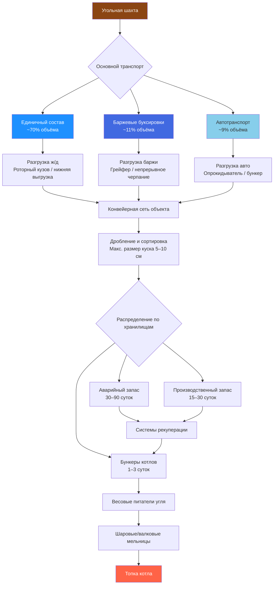

## Обзор способов транспортировки

Инфраструктура распределения угля — критический элемент цепи поставки топлива для угольных котлов и когенерационных установок CHP (combined heat and power). В США ежегодно транспортируется около 1 млрд т угля; железнодорожный транспорт обеспечивает приблизительно 70% этого объёма по данным EIA. В России уголь перемещается преимущественно железной дорогой (ОАО «РЖД»), а в западносибирских бассейнах также речным транспортом по Оби и Иртышу.

Выбор способа транспортировки зависит от дальности перевозки, доступной инфраструктуры, требуемых объёмов и экономических факторов — стоимости топлива для транспортировки и капитальных вложений в оборудование обработки материалов.

## Системы железнодорожного транспорта

Железнодорожные перевозки обеспечивают наиболее экономичный метод транспортировки угля на дальние расстояния. Единичные составы (unit trains) — специализированные поезда из 100–120 вагонов-бункеров — перевозят 10 000–15 000 т угля за один рейс.


| Параметр | Значение | Примечания |
|---|---|---|
| Количество вагонов | 100–120 | Типовая конфигурация |
| Грузоподъёмность вагона | 100–120 т | Современные алюминиевые бункеры |
| Общая грузоподъёмность | 10 000–15 000 т | За одну ходку |
| Частота доставки | 1–3 состава/сутки | Крупные электростанции и ТЭЦ |
| Скорость движения | 40–80 км/ч | Средняя для гружёного состава |
| Время оборота | 3–5 суток | Цикл туда-обратно |


Инфраструктура на объекте приёма включает:
- петлевые пути (loop tracks) для непрерывного движения состава во время разгрузки без остановки локомотива;
- системы нижней выгрузки или роторных кузовов;
- конвейерные сети для подачи угля на хранение или в бункеры котлов.


| Тип системы | Производительность, т/ч | Применение | Относительная стоимость |
|---|---|---|---|
| Нижняя выгрузка (bottom dump) | 5 300–7 100 | Единичные составы, непрерывная работа | Умеренная |
| Роторный кузов (rotary dumper) | 7 100–10 600 | Высокопроизводительные объекты | Высокая |
| Вибропитатель с поддоном | 2 000–4 000 | Малые котельные | Низкая |
| Система подавления пыли | — | Водяное распыление, укрытия | Низкая |


В условиях холодного климата (Сибирь, северные регионы России) требуются тепляки (оттепельные сараи) для размораживания смёрзшегося угля перед выгрузкой.

## Барже-транспортировка

Барже-транспорт обслуживает объекты, расположенные на судоходных водных путях, и обеспечивает наименьшую стоимость тонно-километра. Одна баржевая буксировка из 15 барж вмещает 22 500 т угля — эквивалент 225 железнодорожных вагонов или 900 автомобилей-углевозов.


| Компонент | Спецификация | Детали |
|---|---|---|
| Стандартная баржа (США) | 1 500 т | 59,4 м × 10,7 м × 3,7 м |
| Большая баржа (США) | 2 000 т | 61,0 м × 10,7 м × 4,0 м |
| Буксировка | 15–40 барж | В зависимости от реки и осадки |
| Скорость хода | 6,4–12,9 км/ч | Зависит от течения |
| Удельная стоимость | 0,005–0,015 USD/т·км | Наименьшая среди видов транспорта |


Объекты барже-разгрузки требуют причальной инфраструктуры, грейферных кранов или систем непрерывного черпания (bucket chain unloader). Типичные скорости разгрузки — 500–2 000 т/ч; погодные условия и сезонный уровень воды в реке влияют на режим операций.

## Доставка автотранспортом

Автомобильный транспорт целесообразен при дальности до 80 км, для небольших объектов и в качестве резервного канала при сбоях железнодорожных или речных поставок.


| Параметр | Значение | Примечания |
|---|---|---|
| Грузоподъёмность | 20–25 т | Стандартный углевоз |
| Экономичная дальность | до 80 км | Зависит от цены топлива |
| Суточная доставка | 100–400 т | Малые объекты |
| Стоимость | 0,10–0,30 USD/т·км | Наиболее высокая |
| Инфраструктура объекта | Выгрузочные бункеры, весы | Минимальные требования |


## Объекты хранения

Хранение угля обеспечивает буферный запас для компенсации неравномерности поставок, управления сезонными рисками и поддержания непрерывности работы котлоагрегатов.


| Тип хранилища | Запас | Назначение | Конструктивные особенности |
|---|---|---|---|
| Аварийный резервный запас | 30–90 суток | На случай форс-мажора | Уплотнение, защита от самовозгорания |
| Производственный запас | 15–30 суток | Оперативный резерв | Оборудование рекуперации |
| Бункеры котлов | 1–3 суток | Непосредственная подача | Непрерывные питатели |
| Закрытый склад | По климату | Контроль влажности | Капиталоёмкое решение |
| Открытые штабели | — | Крупные объекты | Система дренажа ливневых вод |


Максимальная высота штабеля — 12–18 м; уплотнение бульдозерами снижает инфильтрацию воздуха, вызывающую окислительное самонагревание. Уголь с высоким содержанием летучих веществ (суббитуминозный, лигнит) более склонен к самовозгоранию, чем антрацит.

В соответствии с требованиями нормативной документации РФ (СП 89.13330, «Котельные установки») запас топлива на складе должен обеспечивать расчётное число суток работы с учётом географии объекта и надёжности транспортного плеча.

## Системы обработки материалов

Конвейерные системы передают уголь от точек разгрузки через дробление и сортировку на склад или непосредственно в котлы. Ленточные конвейеры работают при скорости ленты 2–4,4 м/с с производительностью 500–3 000 т/ч.

Состав конвейерной системы:
- желобчатые ленточные конвейеры для горизонтального и наклонного транспорта;
- молотковые дробилки для снижения максимального размера кусков до 5–10 см перед подачей в мельницы;
- магнитные сепараторы для удаления металлических включений;
- рукавные фильтры или водяные форсунки для пылеподавления в точках перегрузки;
- паропроводы или электрообогрев желобов для защиты от смерзания в холодном климате.

## Сеть логистики распределения угля

## Числовой пример: расчёт запаса топлива

ТЭЦ тепловой мощностью 50 МВт с КПД котла 85%, работающая на битуминозном угле HHV = 28 МДж/кг. Нормируемый запас — 30 суток.

**Расход угля:**


\dot{m}_{\text{уголь}} = \frac{50\,000 \;\text{кВт}}{28\,000 \;\text{кДж/кг} \times 0{,}85} = 2{,}10 \;\text{кг/с} = 7\,560 \;\text{кг/ч}


**Суточный расход:**


m_{\text{сутки}} = 7\,560 \;\text{кг/ч} \times 24 \;\text{ч} = 181\,440 \;\text{кг/сут} \approx 181 \;\text{т/сут}


**Нормируемый запас на 30 суток:**


m_{\text{запас}} = 181 \;\text{т/сут} \times 30 = 5\,430 \;\text{т}


При насыпной плотности битуминозного угля 800 кг/м³ и высоте штабеля 12 м требуемая площадь склада открытого типа:


S_{\text{склад}} = \frac{5\,430\,000 \;\text{кг}}{800 \;\text{кг/м}^3 \times 12 \;\text{м}} = 565 \;\text{м}^2


## Соображения по планированию инфраструктуры

**Ключевые параметры проектирования:**
- производительность разгрузки — на 25–50% выше среднего потребления для компенсации неравномерности поставок;
- объём хранилища — обеспечивает 30–90-суточный запас в зависимости от надёжности транспортного плеча;
- резервные пути обработки материалов для обслуживания и аварийных ситуаций;
- защита от воздействия атмосферных осадков в регионах с высоким годовым количеством осадков;
- системы пылеподавления в соответствии с нормативами качества атмосферного воздуха;
- ливнеотводная инфраструктура для предотвращения загрязнения грунтовых вод от угольных штабелей.

**Экономическая оптимизация.** Крупные базовые объекты (ТЭЦ, промышленные котельные) оправдывают инвестиции в железнодорожные петлевые пути и роторные кузова. Малые котельные используют автомобильную доставку с минимальной складской инфраструктурой.

**Природоохранные требования.** Требования экологического законодательства (ФЗ-96 «Об охране атмосферного воздуха», ФЗ-7 «Об охране окружающей среды») всё более жёстко регулируют закрытое хранение, системы пылеподавления и обращение со стоками, добавляя 15–30% к капитальным затратам на инфраструктуру, однако снижая выбросы взвешенных веществ и воздействие на водные объекты.

## Нормативные ссылки

- IEA, World Energy Statistics 2023: данные о структуре транспортировки угля.
- BP Statistical Review of World Energy 2023: объёмы мировой торговли углём.
- US EIA, Annual Coal Report 2023: структура транспортировки угля в США.
- ASHRAE 90.1-2022: Energy Standard for Sites and Buildings.
- СП 89.13330.2016: Котельные установки (включая требования к складам топлива).
- СП 60.13330.2020: Отопление, вентиляция и кондиционирование воздуха.
- ФЗ-261 «Об энергосбережении и о повышении энергетической эффективности».
- ФЗ-96 «Об охране атмосферного воздуха» (требования к выбросам пыли).
