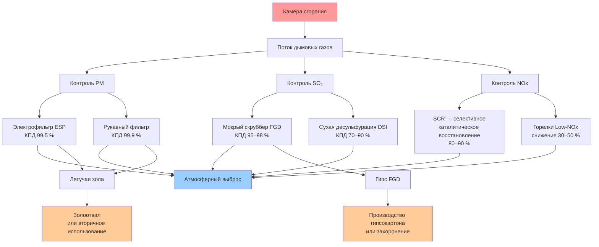

Сжигание угля в системах теплоснабжения сопровождается выделением ряда загрязняющих веществ, контроль которых обязателен по нормативным требованиям. При полном сгорании образуются диоксид углерода, диоксид серы, оксиды азота, твёрдые частицы и соединения тяжёлых металлов. Знание расчётных коэффициентов выбросов и требований к системам газоочистки необходимо как для проектирования систем сжигания, так и для обеспечения соответствия экологическому законодательству (ФЗ-261, СП 60.13330).

## Выбросы диоксида углерода

Уголь даёт наибольшие удельные выбросы CO₂ среди ископаемых топлив вследствие высокого соотношения углерод/водород. Содержание углерода возрастает от 70 % (масс.) у бурого угля до 95 % у антрацита.

Удельные выбросы CO₂ при полном сгорании определяются из углеродного баланса:


E_{\mathrm{CO_2}} = \frac{44}{12} \cdot C \cdot \eta_c


где:
- $E_{\mathrm{CO_2}}$ — удельные выбросы CO₂, кг/кг угля;
- $C$ — массовая доля углерода в топливе;
- $\eta_c$ — степень окисления углерода (обычно 0,99);
- $44/12$ — отношение молярных масс CO₂ и C.

### Числовой пример

Битуминозный уголь: $C = 0{,}75$, $\eta_c = 0{,}99$, теплота сгорания (НТС) $Q_\mathrm{н} = 28{,}5$ МДж/кг.


E_{\mathrm{CO_2}} = \frac{44}{12} \times 0{,}75 \times 0{,}99 = 2{,}73 \times 0{,}75 \times 0{,}99 \approx 1{,}24 \text{ кг CO}_2\text{/кг угля}


Приводя к энергетическому базису:


e_{\mathrm{CO_2}} = \frac{1{,}24 \text{ кг/кг}}{28{,}5 \text{ МДж/кг}} = 0{,}0435 \text{ кг CO}_2\text{/МДж} = 43{,}5 \text{ г/МДж}


Для сравнения: природный газ даёт около 55–56 г CO₂/МДж (НТС), то есть на 22–24 % меньше, чем битуминозный уголь (источник: IEA, World Energy Outlook 2023).

## Выбросы диоксида серы

Сера в угле при сгорании окисляется до SO₂ — основного прекурсора кислотных осадков. Содержание серы варьируется от 0,3 до 5,0 % (масс.) в зависимости от месторождения и подготовки топлива.

Теоретические удельные выбросы SO₂:


E_{\mathrm{SO_2}} = \frac{64}{32} \cdot S \cdot (1 - \eta_{\mathrm{FGD}})


где:
- $S$ — массовая доля серы;
- $\eta_{\mathrm{FGD}}$ — КПД системы десульфурации дымовых газов (Flue Gas Desulfurization, FGD);
- $64/32$ — отношение молярных масс SO₂ и S.

**Пример.** Уголь с $S = 0{,}025$ (2,5 %), без газоочистки ($\eta_{\mathrm{FGD}} = 0$):


E_{\mathrm{SO_2}} = 2 \times 0{,}025 = 0{,}050 \text{ кг SO}_2\text{/кг угля}


При НТС = 28,5 МДж/кг это составляет $0{,}050 / 28{,}5 = 1{,}75$ г SO₂/МДж. Современный мокрый скруббер FGD (КПД 95–98 %) снижает выброс до 0,035–0,088 г SO₂/МДж.

## Образование оксидов азота

NOx (оксиды азота) образуется двумя механизмами:

- **Термический NOx** — из молекулярного азота воздуха при температурах пламени выше 1 500 °C (механизм Зельдовича);
- **Топливный NOx** — из азотсодержащих соединений угля (обычно 1–2 % масс.).

Скорость образования термического NOx описывается кинетическим уравнением:


\frac{d[\mathrm{NO}]}{dt} = k_f \sqrt{\frac{T}{1000}} \exp\!\left(-\frac{69\,090}{T}\right) [\mathrm{O_2}]^{0{,}5} [\mathrm{N_2}]


где $T$ — температура, К; $k_f$ — константа скорости прямой реакции.

При сжигании угля доминирует топливный NOx. Степень конверсии топливного азота в NOx:


\eta_{\mathrm{fuel\text{-}NOx}} = 0{,}20 \div 0{,}40


Неконтролируемые выбросы составляют 0,18–0,54 г NOx/МДж. Горелки с пониженным выходом NOx (Low-NOx burners) снижают этот показатель на 30–50 %, система SCR (Selective Catalytic Reduction, селективное каталитическое восстановление) — на 80–90 %.

## Выбросы твёрдых частиц

Выбросы твёрдых частиц (Particulate Matter, PM) складываются из летучей золы и несгоревшего углерода. Содержание золы в угле — 5–35 % масс.; при пылеугольном сжигании 70–90 % золы переходит в летучую фракцию.


E_{\mathrm{PM}} = A \cdot f_{\mathrm{fly}} \cdot (1 - \eta_{\mathrm{control}})


где:
- $A$ — массовая доля золы;
- $f_{\mathrm{fly}}$ — доля летучей золы (0,70–0,90);
- $\eta_{\mathrm{control}}$ — КПД системы пылегазоочистки.

Рукавные фильтры достигают $\eta_{\mathrm{control}} = 0{,}999$, снижая выбросы PM до 0,005–0,013 г/МДж. Электрофильтры (Electrostatic Precipitator, ESP) — до 0,01–0,02 г/МДж.

## Сводные коэффициенты выбросов


| Загрязнитель | Без контроля, г/МДж | С контролем, г/МДж | Технология контроля |
|---|---|---|---|
| CO₂ | 90–98 | 90–98 | — |
| SO₂ | 0,7–2,3 | 0,045–0,27 | Мокрый FGD (КПД 95–98 %) |
| NOx | 0,27–0,55 | 0,045–0,11 | SCR / SNCR |
| PM₁₀ | 0,18–0,45 | 0,005–0,013 | Рукавный фильтр |
| PM₂,₅ | 0,036–0,14 | 0,002–0,007 | Рукавный фильтр |
| Hg | 0,36–0,54 нг/МДж | 0,044–0,13 нг/МДж | ACI + рукавный фильтр |


*Источник: расчёт автора по методологии IEA Emission Factors 2023; значения НТС — ASTM D5865.*

## Управление отходами сжигания угля

Твёрдые отходы сжигания (Coal Combustion Residuals, CCR) включают:
- золу из топки (шлак) — 10–30 % от суммарного объёма;
- летучую золу — 70–90 %;
- гипс от сухой и полусухой десульфурации.

Годовое накопление золы при работе котла мощностью 100 МВт·ч тепловой (КПД 88 %, уголь с зольностью $A = 10$ %):


\dot{m}_{\mathrm{coal}} = \frac{100 \times 10^6 \text{ Вт}}{0{,}88 \times 28{,}5 \times 10^6 \text{ Дж/кг}} \approx 3{,}99 \text{ кг/с}



M_{\mathrm{ash}} = 3{,}99 \times 0{,}10 \times 3\,600 \times 6\,000 \approx 8\,600 \text{ т/год}


(при 6 000 ч годовой работы).

Золоотвалы должны отвечать требованиям мониторинга подземных вод и геотехнической устойчивости согласно СП 50.13330 и ФЗ-261.

## Схема системы газоочистки

## Выбросы тяжёлых металлов

Уголь содержит микропримеси: ртуть (0,05–1,0 мг/кг), мышьяк, селен, хром, свинец. При сгорании ртуть распределяется на три формы:

- элементарная Hg⁰ — 40–70 %, трудно улавливается;
- окисленная Hg²⁺ — 20–50 %, растворима в воде;
- сорбированная на частицах — 5–20 %, удаляется с летучей золой.

Суммарный выброс ртути без контроля:


E_{\mathrm{Hg}} = [\mathrm{Hg}]_{\mathrm{coal}} \cdot (1 - f_{\mathrm{ash}})


где $f_{\mathrm{ash}}$ — доля ртути, связанной с летучей золой (0,10–0,30).

Активированный угольный инжект (Activated Carbon Injection, ACI) в сочетании с рукавным фильтром обеспечивает удаление ртути на 70–90 %.

## Кислотное осаждение

SO₂ и NOx реагируют в атмосфере с образованием кислот:


\mathrm{SO_2} + \mathrm{OH} + \mathrm{O_2} \rightarrow \mathrm{H_2SO_4}



2\,\mathrm{NO_2} + \mathrm{H_2O} \rightarrow \mathrm{HNO_3} + \mathrm{HNO_2}


Кислотные осадки (pH < 5,6) наносят ущерб экосистемам, строительным конструкциям и качеству водоёмов. Буферная ёмкость принимающей среды определяет степень последствий.

## Системы непрерывного мониторинга выбросов

Системы непрерывного мониторинга выбросов (Continuous Emission Monitoring System, CEMS) фиксируют:
- концентрации SO₂, NOx, CO₂ (ppm по объёму);
- оптическую плотность дымовых газов (% поглощения);
- объёмный расход (м³/ч);
- содержание O₂ для пересчёта к нормальным условиям.

Усреднение данных — 15 минут; квартальная отчётность в надзорный орган подтверждает соответствие разрешённым нормативам согласно ФЗ-261 и СП 60.13330.

## Нормативная база

Проектирование угольных котлов и систем газоочистки должно учитывать:

- **СП 60.13330.2020** — отопление, вентиляция и кондиционирование воздуха;
- **СП 50.13330.2012** — тепловая защита зданий;
- **ФЗ-261** — об энергосбережении и о повышении энергетической эффективности;
- **ISO 50001:2018** — системы энергетического менеджмента;
- **ASHRAE 90.1-2022** — Energy Standard for Buildings (справочно для импортного оборудования).

Новые установки промышленного сжигания практически во всех юрисдикциях требуют многокомпонентных систем газоочистки, что увеличивает капитальные затраты на 15–30 % по сравнению с котельным оборудованием без очистки.
