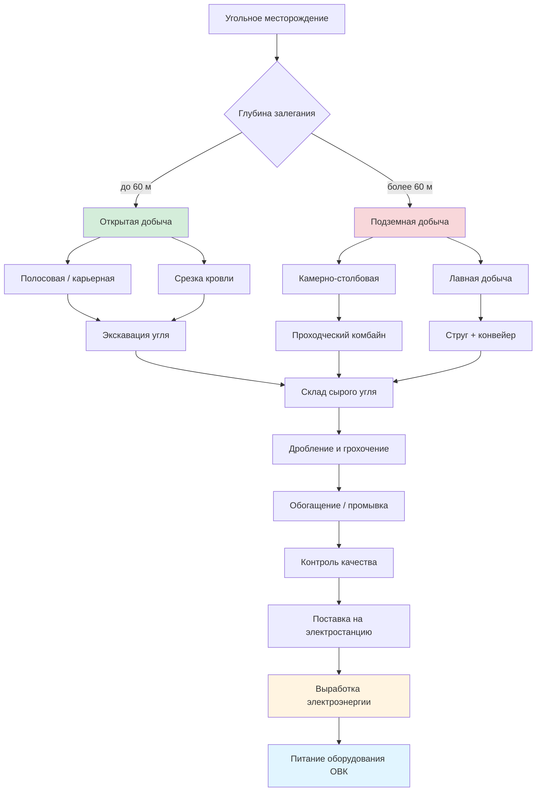

Метод добычи угля напрямую определяет себестоимость, доступность и качество топлива, используемого на электростанциях, которые питают системы ОВК (отопление, вентиляция, кондиционирование). Понимание технологических схем угледобычи даёт специалистам по ОВК необходимый контекст для оценки надёжности топливоснабжения, формирования затрат и экологических ограничений, влияющих на стоимость электроэнергии.

## Открытая добыча (Surface Mining)

Открытая добыча применяется при залегании угольных пластов на глубинах до 60–70 м. По данным Международного энергетического агентства (IEA, World Energy Outlook 2023), открытая добыча обеспечивает около 65 % мировой добычи энергетического угля. Метод основан на удалении вскрышных пород (overburden) над угольным пластом.

### Полосовая (контурная) добыча

На равнинном и слабохолмистом рельефе разработка ведётся параллельными полосами шириной 30–46 м. Последовательность операций:

1. Снятие растительного слоя и верхнего горизонта почвы (складируется для последующей рекультивации).
2. Буровзрывные работы по вскрышным породам.
3. Удаление вскрыши драглайнами (ковши до 170 м³).
4. Экскавация обнажённого угля гидравлическими экскаваторами.
5. Отсыпка вскрыши в отработанную полосу.
6. Рекультивация нарушенных земель.

### Карьерная добыча

При мощных угольных залежах (более 30 м) формируются террасированные карьеры с одновременной разработкой нескольких горизонтов. Метод характерен для крупных угольных бассейнов с пологим залеганием пластов.

### Добыча со срезкой кровли

Применяется в горных районах. Взрывные работы удаляют 120–240 м вскрыши, открывая несколько угольных пластов. Метод экономически производительный, но несёт значительное воздействие на ландшафт и гидрологию.

## Подземная добыча (Underground Mining)

Подземная добыча применяется при глубинах залегания свыше 60–70 м. Метод обеспечивает меньшее нарушение поверхности, но требует более сложных инженерных решений, высоких капитальных затрат и строгих мер безопасности.

### Камерно-столбовая система (Room-and-Pillar)

Традиционный метод, при котором проходческий комбайн формирует сеть выработок, разделённых угольными целиками (pillars), несущими кровлю шахты.

Ключевые параметры:

- ширина выработки: 5,5–6,7 м;
- размер целика: 12–18 м в плане;
- коэффициент извлечения пласта: 50–60 %;
- мощность пласта: 0,9–3,7 м.

При «отступающей» выемке целиков (retreat mining) коэффициент извлечения возрастает до 75–85 %, однако позади зоны добычи допускается контролируемое обрушение кровли.

### Лавная добыча (Longwall Mining)

Лавная добыча обеспечивает наибольшую производительность при подземной разработке. Механизированный комплекс перемещается вдоль угольного забоя длиной 240–460 м, панели достигают 4,8 км в длину.

Основные компоненты:
- **Струг (shearer)** — машина мощностью 370–750 кВт, совершает возвратно-поступательные проходы вдоль забоя, срезая уголь слоями до 0,9 м;
- **Гидравлические секции крепи** — 150–200 самопередвигающихся опор грузоподъёмностью до 180 т каждая;
- **Забойный скребковый конвейер (AFC)** — транспортирует уголь от струга к панельному конвейеру;
- **Панельный конвейер** — доставляет уголь в главную транспортную систему шахты.

Кровля за секциями крепи преднамеренно обрушается (контролируемое обрушение), что позволяет извлекать 75–90 % запасов в панели.

## Сравнение методов добычи


| Показатель | Открытая | Камерно-столбовая | Лавная |
|---|---|---|---|
| Типичная глубина, м | 0–60 | 60–300 | 90–460 |
| Коэффициент извлечения, % | 90–95 | 50–75 | 75–90 |
| Производительность, т/(чел·ч) | 9–27 | 2,7–5,4 | 7–14 |
| Капитальные затраты, млн USD | 75–225 | 30–60 | 225–450 |
| Нарушение поверхности | 100 % площади | 5–10 % (осадка) | 30–50 % (осадка) |
| Выделение метана | минимальное | умеренное | высокое |
| Уровень травматизма (на 200 000 ч) | 2,5–3,5 | 3,5–5,0 | 2,0–3,0 |


*Источник: IEA Coal Information 2023; BP Statistical Review of World Energy 2023.*

## Численный пример: себестоимость и цена угля для котельной

**Условие.** Котельная ОВК мощностью 10 МВт тепловой работает 6 000 ч/год с КПД 88 %. Уголь: битуминозный, НТС = 28,5 МДж/кг.

**Расход топлива:**


\dot{m}_{\mathrm{coal}} = \frac{Q_{\mathrm{kotl}}}{\eta \cdot Q_{\mathrm{н}}} = \frac{10 \times 10^6}{0{,}88 \times 28{,}5 \times 10^6} \approx 0{,}399 \text{ кг/с} = 1\,436 \text{ кг/ч}


**Годовой расход:**


M_{\mathrm{year}} = 1\,436 \times 6\,000 \approx 8\,616 \text{ т/год}


**Затраты на топливо** при цене $45 USD/т (открытая добыча, регион с низкосернистым углём):


C_{\mathrm{fuel}} = 8\,616 \times 45 \approx 387\,700 \text{ USD/год}


При переходе на подземную добычу (цена $70 USD/т) годовая разница составит порядка $215 000 USD — фактор, существенный при сравнении альтернатив топливоснабжения.

## Требования безопасности при подземной добыче

Подземные шахты обязаны обеспечивать:

- **Вентиляцию** — подача не менее 9 000 м³/ч на рабочую секцию для разбавления метана и угольной пыли;
- **Управление кровлей** — систематическое анкерное крепление с шагом 1,2–1,8 м;
- **Мониторинг метана** — непрерывные датчики с автоматическим отключением оборудования при концентрации CH₄ ≥ 1 %;
- **Подавление пыли** — водяные форсунки в зонах резания, концентрация вдыхаемой пыли < 2,0 мг/м³;
- **Аварийное дыхание** — изолирующие самоспасатели на 1 ч в расчёте на каждого горняка.

## Схема технологической цепочки

## Экологические требования и рекультивация

Добыча угля подлежит строгому экологическому регулированию:

- **Рекультивация нарушенных земель** — восстановление контуров рельефа и почвенно-растительного покрова; залоговые обязательства операторов обеспечивают выполнение работ.
- **Охрана водных объектов** — шахтные и карьерные воды очищаются до нормативных показателей (pH 6,0–9,0, взвешенные вещества < 35 мг/л, контроль тяжёлых металлов).
- **Контроль пылевыделения** — орошение дорог, укрепление откосов, локализация источников пыли.
- **Дегазация шахт** — скважины для извлечения шахтного метана (CBM, Coal Bed Methane) позволяют либо утилизировать его в качестве топлива, либо снизить эмиссию в атмосферу.

Соответствующие нормативы в РФ: СП 50.13330, ФЗ-261; на международном уровне — ISO 50001.

## Влияние метода добычи на стоимость электроэнергии для ОВК

Метод добычи формирует себестоимость у источника и в конечном счёте — тариф на электроэнергию:

- Открытая добыча в западных регионах обеспечивает уголь с низким содержанием серы по цене $22–44/т.
- Подземная добыча обходится в $44–73/т с учётом затрат на безопасность и вентиляцию.
- Экологические требования добавляют $7–22/т к себестоимости.

Для долгосрочного проектирования систем ОВК с угольным теплоснабжением или закупки электроэнергии от угольной генерации эти ценовые диапазоны служат исходными данными при технико-экономическом обосновании.
