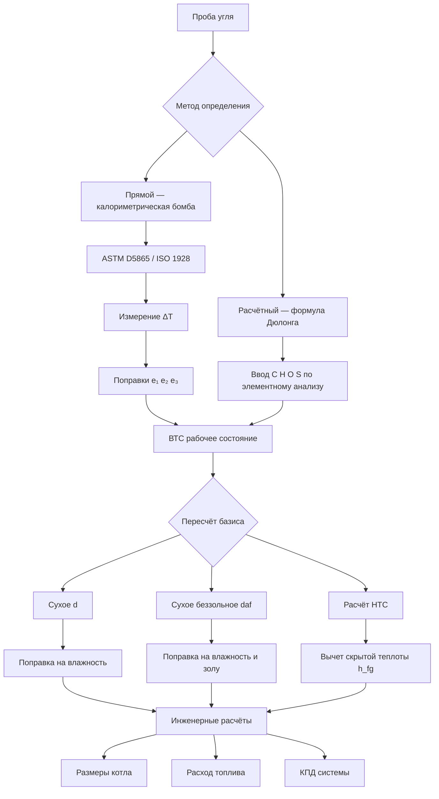

Теплота сгорания угля — это количество тепловой энергии, выделяемой на единицу массы при полном сгорании. Данный параметр является основным для расчёта размеров котла, расхода топлива и КПД системы в угольных установках ОВК. Теплота сгорания существенно варьируется в зависимости от ранга угля, влажности и содержания минеральных примесей, поэтому точное её определение обязательно при проектировании систем сжигания.

## Высшая и низшая теплота сгорания

Теплота сгорания угля выражается в двух формах.

**Высшая теплота сгорания (ВТС, Gross Calorific Value, GCV или Higher Heating Value, HHV)** — полное тепловыделение при полном сгорании с охлаждением продуктов до начальной температуры, при этом водяной пар в продуктах сгорания конденсируется. Значение включает скрытую теплоту конденсации водяного пара.

**Низшая теплота сгорания (НТС, Net Calorific Value, NCV или Lower Heating Value, LHV)** — тепловыделение без учёта скрытой теплоты конденсации. Это величина, практически достижимая в большинстве промышленных котлов, где дымовые газы уходят выше температуры точки росы.

Связь между ВТС и НТС:


\mathrm{НТС} = \mathrm{ВТС} - h_{fg} \cdot (W + 9H)


где:
- $h_{fg}$ — удельная теплота испарения воды (2,44 МДж/кг при 25 °C);
- $W$ — массовая доля влаги в угле;
- $H$ — массовая доля водорода в угле;
- коэффициент 9 учитывает воду, образующуюся при горении водорода (H₂ + ½O₂ → H₂O, молярное соотношение масс 18/2 = 9).

## Формула Дюлонга для оценки ВТС

Формула Дюлонга позволяет оценить ВТС угля по данным элементного анализа:


\mathrm{ВТС} = 33{,}83\,C + 144{,}4\!\left(H - \frac{O}{8}\right) + 9{,}42\,S


где $C$, $H$, $O$, $S$ — массовые доли углерода, водорода, кислорода и серы соответственно (д. е.); ВТС — в МДж/кг.

Поправка $(O/8)$ исключает из расчёта водород, уже связанный с кислородом в составе угля и не участвующий в тепловыделении.

### Числовой пример

**Условие.** Битуминозный уголь марки Д: $C = 0{,}74$; $H = 0{,}049$; $O = 0{,}088$; $S = 0{,}025$; $W = 0{,}09$ (влажность рабочая).

**Шаг 1. ВТС по формуле Дюлонга** (сухое беззольное состояние):


\mathrm{ВТС}_{\mathrm{daf}} = 33{,}83 \times 0{,}74 + 144{,}4 \times \!\left(0{,}049 - \frac{0{,}088}{8}\right) + 9{,}42 \times 0{,}025



= 25{,}03 + 144{,}4 \times 0{,}038 + 0{,}236 = 25{,}03 + 5{,}49 + 0{,}24 \approx 30{,}76 \text{ МДж/кг}


**Шаг 2. НТС в рабочем состоянии:**


\mathrm{НТС}_{\mathrm{ar}} = 30{,}76 - 2{,}44 \times (0{,}09 + 9 \times 0{,}049) = 30{,}76 - 2{,}44 \times 0{,}531 \approx 29{,}47 \text{ МДж/кг}


Расчётное значение совпадает с типичными данными для угля марки Д (28,5–30,5 МДж/кг НТС, ГОСТ 25543).

## Калориметрическое определение по ASTM D5865 / ISO 1928

Стандарт ASTM D5865 (и его международный аналог ISO 1928) регламентирует точное измерение ВТС методом калориметрической бомбы.

Порядок испытания:
1. Измельчить уголь до крупности 250 мкм (60 mesh).
2. Сжечь навеску ~1 г в кислородной атмосфере (давление O₂ ≈ 3,0 МПа) в калориметрической бомбе.
3. Зафиксировать повышение температуры воды $\Delta T$ с точностью ±0,001 °C.
4. Ввести поправки на сгорание запальной проволоки, образование HNO₃ и H₂SO₄.

Расчёт ВТС:


\mathrm{ВТС} = \frac{\Delta T \cdot W_{\mathrm{cal}} - e_1 - e_2 - e_3}{m}


где:
- $\Delta T = T_f - T_i$ — перепад температуры воды, °C;
- $W_{\mathrm{cal}}$ — теплоэквивалент калориметра, Дж/°C;
- $e_1$ — поправка на сгорание запальной проволоки;
- $e_2$ — поправка на образование HNO₃;
- $e_3$ — поправка на образование H₂SO₄;
- $m$ — масса навески, г.

## Пересчёт по базисам

Теплота сгорания угля приводится к различным аналитическим базисам.

**Рабочее состояние (as received, ar)** — фактический состав поступающего угля, включая рабочую влагу и золу. Используется в расчётах расхода топлива.

**Сухое состояние (dry basis, d)** — исключена только влага:


\mathrm{ВТС}_{d} = \frac{\mathrm{ВТС}_{\mathrm{ar}}}{1 - W_{\mathrm{ar}}}


**Сухое беззольное состояние (dry ash-free, daf)** — исключены влага и зола; используется для классификации ранга:


\mathrm{ВТС}_{\mathrm{daf}} = \frac{\mathrm{ВТС}_{\mathrm{ar}}}{1 - W_{\mathrm{ar}} - A_{\mathrm{ar}}}


где $A_{\mathrm{ar}}$ — массовая доля золы в рабочем состоянии.

## Теплота сгорания по рангам угля


| Ранг угля | ВТС, МДж/кг | Влажность, % | Зольность, % | Типичное применение |
|---|---|---|---|---|
| Антрацит | 30,2–34,9 | 2–15 | 5–20 | Промышленные котлы высокой мощности |
| Битуминозный | 27,9–34,9 | 5–15 | 5–25 | Котельные ОВК, когенерация |
| Суббитуминозный | 19,8–26,7 | 15–30 | 5–20 | Пылеугольные котлы, тепловые станции |
| Бурый (лигнит) | 15,1–19,8 | 30–45 | 5–30 | Электростанции «у шахты» |


*Источник: ASTM D388; BP Statistical Review of World Energy 2023.*

## Влияние влажности на теплоту сгорания

Влага снижает эффективную теплоту сгорания двумя путями:

1. **Эффект разбавления** — вода вытесняет горючий материал, уменьшая энергоёмкость единицы массы.
2. **Штраф на испарение** — часть теплоты расходуется на испарение влаги.

Совокупное влияние:


\mathrm{ВТС}_{\mathrm{ar}} = \mathrm{ВТС}_{d} \cdot (1 - W) - h_{fg} \cdot W


Для бурого угля с $W = 0{,}40$ и $\mathrm{ВТС}_{d} = 22$ МДж/кг:


\mathrm{ВТС}_{\mathrm{ar}} = 22 \times 0{,}60 - 2{,}44 \times 0{,}40 = 13{,}20 - 0{,}976 \approx 12{,}22 \text{ МДж/кг}


Влага снизила теплоту сгорания на 44 % по сравнению с сухим состоянием — критически важный фактор при выборе топлива для малых котельных.

## Схема определения теплоты сгорания

## Применение в расчётах котельного оборудования

Теплота сгорания угля определяет следующие параметры проектирования котлов ОВК:

- **Расход топлива** при заданной тепловой мощности (кг/ч или кг/с);
- **Теоретически необходимое количество воздуха** — из стехиометрии горения;
- **Объём дымовых газов** — для расчёта газоходов и тяги;
- **КПД котла** по ГОСТ 3619 (котлы паровые) или по EN 14825 (тепловые насосы для сравнения).

Для расчётов следует использовать значение НТС в рабочем состоянии, так как оно соответствует реально достижимой теплоотдаче в некондесационных котлах. При работе с конденсационными котлами, где дымовые газы охлаждаются ниже точки росы, в основу принимают ВТС.

## Нормативные ссылки

- **ASTM D5865** — стандартный метод определения ВТС угля и кокса калориметрической бомбой;
- **ISO 1928:2009** — твёрдые минеральные топлива; определение ВТС калориметрической бомбой;
- **ASTM D3172** — проксимальный анализ угля и кокса;
- **ASTM D3176** — элементный анализ угля и кокса;
- **ГОСТ 25543-2013** — угли бурые, каменные и антрацит; классификация;
- **СП 60.13330.2020** — отопление, вентиляция и кондиционирование воздуха;
- **ASHRAE 90.1-2022** — энергетический стандарт для зданий (для сравнения с зарубежным оборудованием);
- **ISO 50001:2018** — системы энергетического менеджмента.
