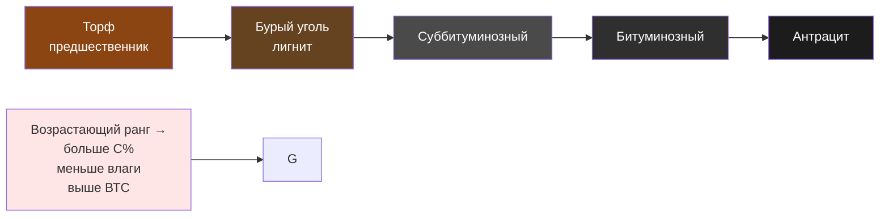

Классификационные системы углей предоставляют критические параметры для выбора топлива в промышленных установках отопления и системах производства электроэнергии. Стандарт ASTM D388 и его российский аналог ГОСТ 25543-2013 устанавливают схемы классификации по содержанию связанного углерода, летучих веществ и теплоте сгорания. Понимание ранговой прогрессии — от бурого угля к антрациту — позволяет инженерам оптимизировать системы сжигания, прогнозировать характеристики горения и проектировать соответствующую инфраструктуру топливоподготовки.

## Принципы классификации по ASTM D388

Стандарт ASTM D388 разделяет уголь на четыре основных ранга по степени метаморфизма и энергетическому содержанию. Эта классификация непосредственно влияет на характеристики горения: температуру воспламенения, устойчивость пламени, температуру плавления золы и скорость тепловыделения.

Основные классификационные параметры:

- **Содержание связанного углерода** (Fixed Carbon, FC) — сухое беззольное состояние (daf);
- **Содержание летучих веществ** (Volatile Matter, VM) — daf;
- **Высшая теплота сгорания** (ВТС) — влажное беззольное состояние (mmmf);
- **Спекаемость** (caking/coking behavior) — для битуминозных углей.

### Прогрессия ранга углификации

По мере повышения ранга (процесс углификации) содержание углерода растёт, влажность снижается, теплота сгорания увеличивается, а количество летучих веществ падает.

## Сводная таблица свойств по рангам


| Ранг | FC, % daf | VM, % daf | ВТС, МДж/кг mmmf | Влажность, % ar | Температура плавления золы, °C |
|---|---|---|---|---|---|
| Антрацит | 86–98 | 2–14 | 30,2–34,9 | 2–15 | 1 427–1 538 |
| Битуминозный | 45–86 | 14–46 | 27,9–34,9 | 5–15 | 1 149–1 427 |
| Суббитуминозный | 35–45 | 40–55 | 19,8–26,7 | 15–30 | 1 093–1 316 |
| Бурый (лигнит) | 25–35 | 40–70 | 15,1–19,8 | 30–45 | 1 093–1 204 |


*daf — dry ash-free (сухое беззольное состояние); mmmf — moist mineral matter free; ar — as received (рабочее состояние).*

## Расчёт теплоты сгорания по формуле Дюлонга

Высшая теплота сгорания рассчитывается по формуле Дюлонга (МДж/кг):


\mathrm{ВТС} = 33{,}83\,C + 144{,}4\!\left(H - \frac{O}{8}\right) + 9{,}42\,S


Низшая теплота сгорания:


\mathrm{НТС} = \mathrm{ВТС} - 2{,}44\,(W + 9\,H_2)


где $W$ — влага (кг/кг), $H_2$ — водород, переходящий в воду при горении (кг/кг).

Пересчёт ВТС к влажному беззольному базису для целей классификации (ASTM):


\mathrm{ВТС}_{\mathrm{mmmf}} = \mathrm{ВТС}_{\mathrm{ar}} \times \frac{100 - (M + 1{,}08A + 0{,}55S_p)}{100 - M}


где $M$ — влажность ar, %; $A$ — зольность d, %; $S_p$ — пиритная сера d, %.

### Числовой пример

**Условие.** Битуминозный уголь: $C = 0{,}74$; $H = 0{,}049$; $O = 0{,}088$; $S = 0{,}025$; $W = 0{,}09$; $A = 0{,}08$.

**Шаг 1.** ВТС по Дюлонгу (беззольное):


\mathrm{ВТС} = 33{,}83 \times 0{,}74 + 144{,}4 \times \!\left(0{,}049 - \frac{0{,}088}{8}\right) + 9{,}42 \times 0{,}025
= 25{,}03 + 5{,}49 + 0{,}24 = 30{,}76 \text{ МДж/кг}


**Шаг 2.** НТС в рабочем состоянии:


\mathrm{НТС}_{\mathrm{ar}} = 30{,}76 - 2{,}44 \times (0{,}09 + 9 \times 0{,}049) \approx 29{,}47 \text{ МДж/кг}


**Шаг 3.** Расход угля для котла тепловой мощностью 5 МВт, КПД $\eta = 0{,}88$:


\dot{m} = \frac{5 \times 10^6}{0{,}88 \times 29{,}47 \times 10^6} \approx 0{,}193 \text{ кг/с} = 694 \text{ кг/ч}


## Антрацит

Антрацит — высший ранг угля с максимальным содержанием углерода (86–98 % FC daf). Твёрдый блестящий уголь с характерным раковистым изломом.

**Характеристики горения:**
- Температура воспламенения: 427–482 °C;
- Низкое содержание летучих веществ (2–14 %) требует предварительного подогрева воздуха;
- Горение чистое, практически без сажи;
- Температура пламени: 1 760–1 980 °C;
- Медленная скорость горения — специализированные колосниковые решётки.

**Применение в ОВК:**
- Жилые и промышленные котлы с ручным и автоматическим питанием;
- Промышленный нагрев с точным контролем температуры;
- Ограниченное применение в генерации электроэнергии из-за сложности розжига.

**Особенности обращения:**
- Минимальное поглощение влаги при хранении;
- Низкий риск самовозгорания;
- Твёрдость требует надёжного дробильного оборудования.

## Битуминозный уголь

Битуминозный уголь — наиболее широко применяемый ранг в энергетике и промышленном отоплении. Охватывает широкий диапазон подрангов: высоко-, средне- и низковолатильный (High/Medium/Low Volatile Bituminous, HVB/MVB/LVB).

**Характеристики горения:**
- Температура воспламенения: 343–399 °C;
- Летучие вещества: 14–46 %;
- Спекаемость у большинства марок;
- Температура пламени: 1 538–1 760 °C.

**Применение в ОВК:**
- Котельные центральных тепловых пунктов (ЦТП), промышленные объекты;
- Системы когенерации (Combined Heat and Power, CHP);
- Сети централизованного теплоснабжения;
- Промышленное паропроизводство.

**Особенности обращения:**
- Умеренный риск самовозгорания (особенно HVB);
- При измельчении требуется подавление пылевыделения;
- Уплотнение штабеля снижает окисление.

## Суббитуминозный уголь

Суббитуминозный уголь — переходный ранг между лигнитом и битуминозным, характеризуется умеренной теплотой сгорания и повышенной влажностью.

**Характеристики горения:**
- Температура воспламенения: 316–371 °C;
- Не спекается;
- Содержание кислорода 15–25 %;
- Низкое содержание серы (0,3–1,0 % масс.);
- Температура пламени: 1 316–1 538 °C.

**Применение в ОВК:**
- Пылеугольные котлы с системами управления влажностью;
- Котлы с циркулирующим кипящим слоем (Circulating Fluidized Bed, CFB);
- Электростанции с предварительной сушкой топлива.

**Особенности обращения:**
- Высокий риск самовозгорания вследствие реактивности;
- Значительные потери влаги при хранении (выветривание);
- Хрупкость ведёт к образованию мелочи.

## Бурый уголь (лигнит)

Бурый уголь (лигнит) — низший ранг со свойствами, близкими к торфу. Высокая влажность и низкая теплота сгорания ограничивают его экономику транспортировки.

**Характеристики горения:**
- Температура воспламенения: 260–316 °C;
- Содержание кислорода: 25–40 %;
- Не спекается;
- Высокая влажность (30–45 %) существенно снижает КПД;
- Температура пламени: 1 093–1 316 °C.

**Применение в ОВК:**
- Электростанции непосредственно у разреза;
- Системы централизованного теплоснабжения в угледобывающих регионах;
- Ограниченное применение в промышленном отоплении.

**Особенности обращения:**
- Высокая восприимчивость к самовозгоранию;
- Быстрое выветривание и распад при хранении;
- Специализированные системы хранения и транспортировки.

## Соотношение летучих веществ и связанного углерода

В пересчёте на сухое беззольное состояние:


VM + FC = 100\,\% \quad (\text{daf})


С ростом ранга VM снижается, FC растёт. Летучие вещества определяют лёгкость воспламенения и устойчивость пламени; связанный углерод — суммарное тепловыделение и длительность горения.

## Классификация спекаемости

ASTM D388 включает спекаемость в критерии классификации битуминозных углей. Индекс свободного вспучивания (Free Swelling Index, FSI):


| Класс | FSI | Влияние на конструкцию котла |
|---|---|---|
| Неспекаемый | 0–1 | Простые решётки; применимы суббитуминозный, лигнит, антрацит |
| Слабоспекаемый | 2–4 | Дополнительные воздушные каналы, разрушители спёка |
| Сильноспекаемый | 5–9 | Специальные питатели, распределение воздуха горения |


Спекаемые угли при нагревании образуют пластичную массу, влияющую на аэродинамику факела и конструкцию питателей. Неспекаемые угли допускают более простые решётки, но могут давать избыточную мелочь.

## Влияние ранга на проектирование системы ОВК

**Топливоподготовка:**
- Угли высокого ранга требуют мощного дробильного и мельничного оборудования;
- Угли низкого ранга — контроля влажности и оперативного расхода запасов;
- Ёмкость склада обратно пропорциональна риску самовозгорания.

**Оборудование сжигания:**
- Антрацит с низким VM — специализированные системы розжига и подогрев воздуха;
- Высоковолатильный битуминозный — пылеугольные горелки (Pulverized Coal, PC);
- Бурый уголь — предварительная или встроенная сушка.

**Контроль выбросов:**
- Содержание серы варьируется в пределах каждого ранга; влияет на требования к FGD;
- Угли низкого ранга в целом дают меньше SO₂, но больше PM и CO₂ на единицу энергии;
- Характеристики золы определяют размеры электрофильтров и рукавных фильтров.

Знание этих ранговых зависимостей позволяет инженеру подобрать тип угля для конкретной системы отопления, оптимизировав производительность, эксплуатационные затраты и соответствие нормативам (СП 60.13330, ФЗ-261, ASHRAE 90.1).
