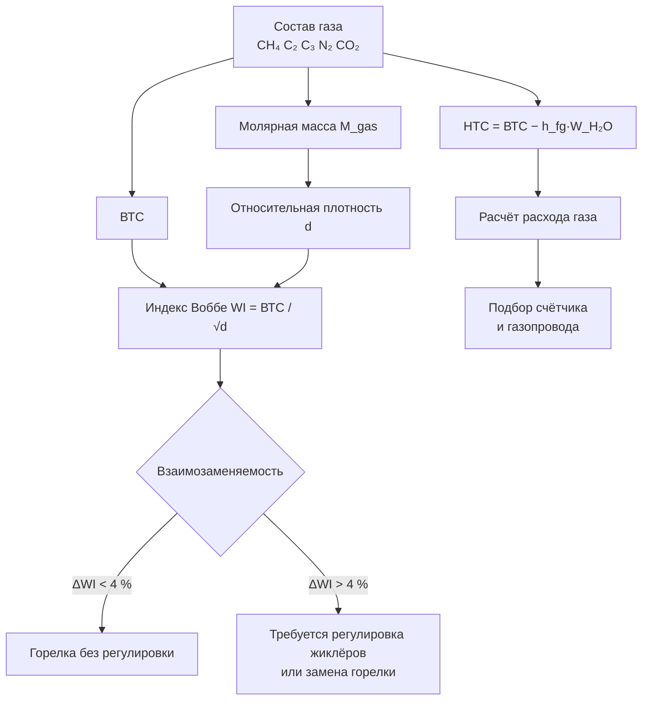

Состав природного газа и его физические свойства определяют характеристики горения, энергетическую ценность и совместимость с оборудованием. Географический источник, технология подготовки и сезонная практика смешивания поставок обусловливают вариабельность состава, влияющую на мощность горелки, форму пламени и теплоотдачу. Специалисты ОВК должны понимать эти свойства для правильного выбора оборудования, регулировки горелок и диагностики неисправностей.

## Метан как основной компонент

Метан (CH₄) составляет 70–90 % объёма магистрального природного газа — это основной энергоносящий компонент. Теплота сгорания чистого метана:

- ВТС: 55,5 МДж/кг (39,7 МДж/м³ при н.у. 15 °C, 101,3 кПа);
- НТС: 50,0 МДж/кг (35,7 МДж/м³ при н.у.).

Тетраэдрическая структура молекулы CH₄ и прочные связи C-H обусловливают характеристическую скорость распространения пламени (~0,40 м/с при стехиометрии) и адиабатическую температуру пламени ~1 950 °C. В реальном оборудовании ОВК температура пламени значительно ниже вследствие избытка воздуха и теплообмена.

Географические вариации содержания метана:
- Месторождения побережья Мексиканского залива: 85–90 % CH₄, повышенная доля C₂–C₄;
- Западно-Канадский бассейн: > 95 % CH₄;
- Западно-Сибирские месторождения (Уренгой, Ямбург): 97–98 % CH₄.

## Тяжёлые углеводороды C₂–C₄

Этан (C₂H₆), пропан (C₃H₈) и бутан (C₄H₁₀) вносят дополнительную теплотворную способность и изменяют характеристики горения.


| Компонент | Формула | ВТС, МДж/м³ (н.у.) | ВТС, МДж/кг | Типичное содержание, % об. |
|---|---|---|---|---|
| Метан | CH₄ | 39,7 | 55,5 | 70–90 |
| Этан | C₂H₆ | 69,7 | 52,0 | 5–15 |
| Пропан | C₃H₈ | 101,2 | 50,4 | 0–4 |
| Бутан | C₄H₁₀ | 133,8 | 49,7 | 0–2 |
| Азот | N₂ | 0 | 0 | 0–5 |
| CO₂ | CO₂ | 0 | 0 | 0–3 |


*Источник: ГОСТ 31369-2008; EN ISO 6976.*

Повышенное содержание пропана смещает характеристики пламени: снижается скорость горения, растёт лучистая теплопередача. Оборудование, откалиброванное на «лёгкий» газ, может при работе на «тяжёлом» давать неполное сгорание или осаждение сажи.

## Азот и углекислый газ как разбавители

Инертные компоненты снижают объёмную теплоту сгорания. Содержание N₂ обычно 0–5 % для магистрального газа, CO₂ — < 3 % после подготовки.

Уменьшение ВТС от присутствия азота:


\Delta \mathrm{ВТС} \approx -1\,\% \text{ на каждый 1\,\% } \mathrm{N_2}


Газ с 15 % N₂ поставит на 15 % меньше тепла, чем аналогичный объём чистого метана. Это требует увеличения диаметров жиклёров или площади портов горелки.

## Сероводород (H₂S) и кислый газ

Необработанный «кислый» газ содержит H₂S от долей процента до 5–30 % в экстремальных случаях. Магистральные спецификации ограничивают H₂S значением < 10 мг/м³ (примерно 7 ppm об.), что предотвращает коррозию оборудования и трубопроводов.

H₂S при сгорании даёт SO₂, образующий кислый конденсат, разрушающий теплообменники, дымоходы и арматуру. Специалисты ОВК, работающие вблизи газовых промыслов, должны проверять качество газа до монтажа оборудования.

Одоризация газа меркаптанами (порог восприятия запаха ~1 ppm) не указывает на присутствие H₂S, но сигнализирует об утечке.

## Теплота сгорания: спецификации

Магистральный природный газ нормируется по ВТС в диапазоне 34–40 МДж/м³ (15 °C, 101,3 кПа, сухое). Сезонные колебания 2–4 МДж/м³ возникают при смешивании поставок.

**Высшая теплота сгорания (ВТС, Gross Calorific Value, GCV)** — полное тепловыделение, включая конденсацию водяного пара; применяется при выставлении счетов и расчёте горения согласно нормативам РФ.

**Низшая теплота сгорания (НТС, Net Calorific Value, NCV)** — тепловыделение без скрытой теплоты конденсации; используется в европейских нормативах (EN 14825, EN 16247) и при расчёте конденсационного оборудования.

Разница между ВТС и НТС для природного газа составляет около 10 % и определяется скрытой теплотой испарения воды. Конденсационные котлы, охлаждающие дымовые газы ниже точки росы (~55–57 °C для газа), утилизируют значительную часть этой разницы — отсюда КПД выше 100 % в расчёте по НТС.

## Индекс Воббе и взаимозаменяемость

Индекс Воббе (Wobbe Index, WI) — ключевой параметр взаимозаменяемости газового топлива:


WI = \frac{\mathrm{ВТС}}{\sqrt{d}}


где $d$ — относительная плотность газа по воздуху.

При одинаковом WI два газа с различным составом обеспечивают одинаковое тепловыделение через фиксированное отверстие горелки.

### Числовой пример: проверка взаимозаменяемости

**Газ А** (основная поставка): ВТС = 38,3 МДж/м³; $d = 0{,}60$.


WI_A = \frac{38{,}3}{\sqrt{0{,}60}} = \frac{38{,}3}{0{,}775} = 49{,}4 \text{ МДж/м}^3


**Газ Б** (после смешивания с пропано-воздушной смесью): ВТС = 40,1 МДж/м³; $d = 0{,}65$.


WI_B = \frac{40{,}1}{\sqrt{0{,}65}} = \frac{40{,}1}{0{,}806} = 49{,}8 \text{ МДж/м}^3


Отклонение $\Delta WI = (49{,}8 - 49{,}4)/49{,}4 \times 100\,\% = 0{,}8\,\%$ — хорошая взаимозаменяемость (норма < 5 %). Регулировки горелки не требуется.

Критерии взаимозаменяемости по WI:
- Отклонение < ±4 % — работа горелки без регулировки;
- Низкий WI (↓ теплоотдача) — риск отрыва пламени, задержки розжига;
- Высокий WI (↑ теплоотдача) — «заброс» пламени на стенки, образование сажи.

## Относительная плотность газа

Относительная плотность по воздуху:


d = \frac{M_{\mathrm{gas}}}{M_{\mathrm{air}}} = \frac{M_{\mathrm{gas}}}{28{,}97}


где $M_{\mathrm{gas}}$ — молярная масса газовой смеси (г/моль), рассчитываемая по молярным долям компонентов.

Для типичного магистрального газа $d = 0{,}55–0{,}70$. Природный газ легче воздуха: при утечке поднимается вверх. Это принципиально отличает его от сжиженного углеводородного газа (СУГ / LPG), тяжелее воздуха.

Расчёт перепада давления в газопроводе по формуле Веймута требует точного $d$, так как потери на трение пропорциональны плотности. Проектировщики ОВК должны получать фактическое значение $d$ от местного ГРО, а не использовать усреднённые.

## Схема свойств и взаимосвязей

## Практические рекомендации для специалистов ОВК

1. **Уточняйте ВТС и WI у местного ГРО** — не используйте только паспортные данные на оборудование, которое могло быть изготовлено под другой состав газа.
2. **Учитывайте сезонную вариацию** (±2–4 МДж/м³) при расчёте максимальной тепловой нагрузки.
3. **Проверяйте WI при замене поставщика газа или при работе в период пиковых нагрузок** (подача СПГ или пропано-воздушной смеси коммунальным предприятием).
4. **Не путайте ВТС и НТС** при расчёте КПД: конденсационные котлы нормируются по ВТС (ГОСТ Р 54826, EN 14825).

## Нормативные ссылки

- **ГОСТ 5542-2014** — газы горючие природные для промышленного и коммунально-бытового назначения;
- **ГОСТ 31369-2008** — природный газ; вычисление теплоты сгорания, плотности, относительной плотности и числа Воббе;
- **EN ISO 6976:2016** — природный газ; расчёт теплотворной способности, плотности и числа Воббе;
- **СП 60.13330.2020** — отопление, вентиляция и кондиционирование воздуха;
- **EN 16247-1:2012** — энергетические аудиты; общие требования;
- **ISO 50001:2018** — системы энергетического менеджмента.
