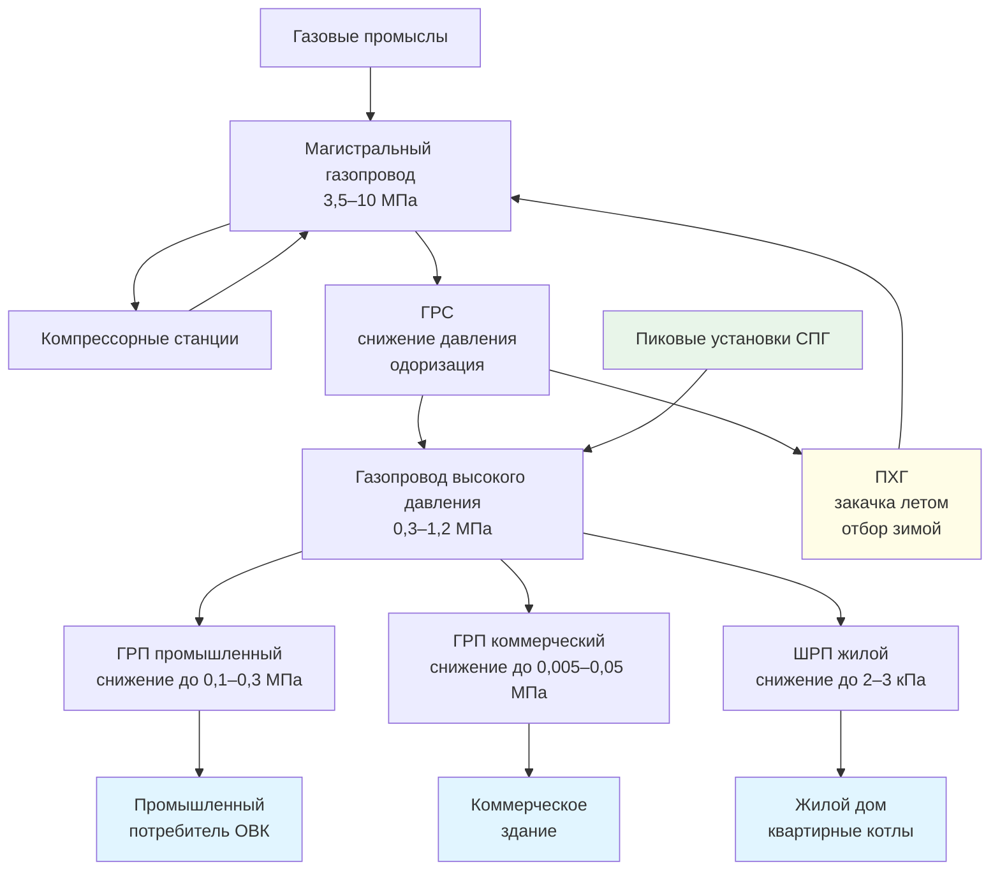

Система распределения природного газа включает магистральные газопроводы, компрессорные станции, подземные хранилища и многоступенчатые сети снижения давления, обеспечивающие доставку топлива от месторождений к конечным потребителям. Для специалистов ОВК, работающих с газовым оборудованием, понимание этой инфраструктуры критично: давление в системе, вариабельность состава и надёжность поставок непосредственно влияют на производительность и безопасность оборудования.

## Магистральный газовый транспорт

Магистральные газопроводы формируют хребет системы передачи природного газа на региональные и межгосударственные расстояния. Рабочие параметры:

- рабочее давление: 3,5–10 МПа;
- диаметры трубопроводов: 300–1 420 мм;
- скорость газа: 5–15 м/с.

Крупнейшие магистральные системы (Единая система газоснабжения России, трансевропейские коридоры) транспортируют газ на тысячи километров. Компрессорные станции (КС), расположенные через каждые 80–150 км, компенсируют потери давления на трение.

Для систем ОВК крупных промышленных объектов, подключённых напрямую к магистральному транспорту, давление и надёжность поставок зависят от режима работы магистрали — это должно учитываться при проектировании газовой обвязки.

## Газораспределительные станции (ГРС)

Газораспределительные станции (ГРС, Gas Gate Stations) осуществляют переход от высокого давления магистрального транспорта к давлениям региональных газораспределительных сетей. Функции ГРС:

- снижение давления (дросселирование);
- измерение расхода и качества газа;
- одоризация (введение одоранта — этилмеркаптана);
- газоподогрев перед дросселированием (предотвращение гидратообразования и обмерзания).

На выходе ГРС давление составляет обычно 0,3–1,2 МПа для газопроводов высокого давления или 0,005–0,3 МПа для среднего давления.

## Газораспределительные организации и внутрисистемные сети

Газораспределительные организации (ГРО, Local Distribution Companies, LDC) эксплуатируют конечную инфраструктуру доставки. Сети ГРО состоят из:

- газопроводов высокого давления II категории (0,3–0,6 МПа) — промышленные потребители;
- газопроводов среднего давления (0,005–0,3 МПа) — коммерческие потребители;
- газопроводов низкого давления (до 0,005 МПа = 5 кПа) — жилищный сектор.

Газорегуляторные пункты (ГРП) и шкафные регуляторные пункты (ШРП) снижают давление с уровня распределительной магистрали до требований приборов потребителей.

**Ответственность ГРО:**
- качество газа и стабильность давления в точке подключения;
- одоризация (норма — запах при концентрации 1 % газа в воздухе);
- аварийно-диспетчерская служба 24/7.

Подрядчики ОВК обязаны согласовывать с ГРО модернизацию вводов, подбор счётчиков и проверку давления при монтаже крупного газового оборудования (согласно СП 60.13330).

## Уровни давления в системе


| Уровень системы | Давление | Потребители |
|---|---|---|
| Магистральный транспорт | 3,5–10 МПа | Межрегиональная передача |
| ГРС / выход на регион | 0,3–1,2 МПа | Крупная промышленность |
| Высокое давление ГРО | 0,3–0,6 МПа | Промышленные объекты |
| Среднее давление ГРО | 0,005–0,3 МПа | Коммерческие здания |
| Низкое давление ГРО | до 0,005 МПа | Жилой сектор |
| Рабочее давление прибора | 1,3–2,5 кПа | Бытовые котлы, горелки |


*Источник: ГОСТ Р 54983-2012; СП 42-101-2003.*

Многоступенчатое снижение давления предотвращает чрезмерные скорости потока, снижает риск утечек и обеспечивает эксплуатационную гибкость. Специалисты ОВК должны проверять фактическое давление в точке подключения и правильно подбирать регуляторы давления газа в соответствии с требованиями оборудования и потерями в газопроводе обвязки.

## Числовой пример: подбор регулятора давления для котельной

**Условие.** Котельная ОВК суммарной мощностью 1,2 МВт (два котла по 600 кВт), КПД 90 %, газ с ВТС = 38,3 МДж/м³. Давление в точке подключения к ГРО — 0,15 МПа. Требуемое рабочее давление горелок — 2,0 кПа.

**Шаг 1.** Максимальный расход газа:


\dot{V}_{\mathrm{max}} = \frac{Q_{\mathrm{total}}}{\eta \cdot \mathrm{ВТС}} = \frac{1{,}2 \times 10^6}{0{,}90 \times 38{,}3 \times 10^6} \approx 0{,}0348 \text{ м}^3\text{/с} = 125 \text{ м}^3\text{/ч}


**Шаг 2.** Требуемое снижение давления: с 150 кПа до 2 кПа — перепад 148 кПа. Необходим двухступенчатый ГРП: первая ступень снижает до ~20 кПа, вторая — до 2,0 кПа.

**Шаг 3.** Диаметр газопровода обвязки (по допустимой скорости 10 м/с при низком давлении):


A = \frac{\dot{V}_{\mathrm{max}}}{v_{\mathrm{max}}} = \frac{0{,}0348}{10} = 3{,}48 \times 10^{-3} \text{ м}^2



D = \sqrt{\frac{4A}{\pi}} = \sqrt{\frac{4 \times 3{,}48 \times 10^{-3}}{3{,}14}} \approx 0{,}067 \text{ м} \rightarrow \text{Dy80 (стандартный ряд)}


## Компрессорные станции

Компрессорные станции (КС) поддерживают давление и скорость газа вдоль магистральных газопроводов. Поршневые и центробежные компрессоры с приводом от газовых двигателей или электродвигателей добавляют 0,3–1,0 МПа давления на каждой ступени.

Компрессия повышает температуру газа (по адиабатическому закону: $T_2 = T_1 \cdot (P_2/P_1)^{(\gamma-1)/\gamma}$), поэтому после КС устанавливают аппараты воздушного охлаждения. Для специалистов ОВК, обслуживающих объекты вблизи КС, важно учитывать температурные колебания газа в точках доставки.

## Подземные хранилища газа (ПХГ)

Подземные хранилища обеспечивают сезонное выравнивание поставок: в летний период (снижение потребления) газ закачивается, в зимний (рост отопительной нагрузки) — отбирается. Типы ПХГ:

**Истощённые газовые залежи** — бывшие продуктивные резервуары с доказанной герметичностью; наибольшая суммарная ёмкость. Рабочий (активный) газ — 50–80 % от суммарного объёма; остаток (буферный газ) поддерживает пластовое давление.

**Водоносные пласты-коллекторы (акваклады)** — заполненные водой пористые горные породы; требуют детальной геологической разведки.

**Соляные каверны** — выщелоченные полости в соляных массивах; обеспечивают высокую скорость закачки и отбора (пиковый режим), но меньший объём.

Суточная производительность ПХГ при пиковом отборе в Западной Европе (данные AGSI+, 2023) достигает 1,5–2,0 % от суммарного объёма хранилища — ключевой параметр для оценки надёжности снабжения в экстремальные морозы.

Нагрузки ОВК существенно влияют на сезонный цикл ПХГ: в климатических зонах с преобладанием отопительного сезона именно тепловые нагрузки зданий определяют пиковый отбор газа.

## Пиковые установки (Peak Shaving)

Пиковые установки дополняют трубопроводную поставку в периоды экстремального спроса (аномальные морозы, скачки потребления). К ним относятся:

- **Установки хранения и регазификации СПГ** — сжижение газа в летний период, испарение при пиках;
- **Смесительные установки пропан-воздух** — синтетический природный газ (SNG) для замещения магистральной поставки;
- **Сосуды высокого давления** — краткосрочное хранение сжатого газа.

Пропано-воздушная смесь должна быть откалибрована по индексу Воббе для совместимости с горелочным оборудованием потребителей. Значительные отклонения WI могут вызвать неполное сгорание или отрыв пламени в горелках ОВК.

## Схема системы газораспределения

## Требования к подключению газового оборудования ОВК

При проектировании газовой обвязки котельных и установок ОВК необходимо:

1. **Получить технические условия (ТУ) от ГРО** с указанием рабочего давления, расчётного расхода и состава газа в точке подключения.
2. **Подобрать счётчик газа** с учётом диапазона расходов (не менее 1:5 от минимального до максимального).
3. **Установить ГРП или ШРП** с требуемым снижением давления и защитой (ПЗК — предохранительно-запорный клапан, ПСК — предохранительно-сбросный клапан).
4. **Рассчитать диаметры газопроводов** по допустимой потере давления (не более 50–100 Па/м для низкого давления).
5. **Проверить минимальное давление на горелке** — с учётом всех потерь давления в обвязке.

## Нормативная база

- **СП 62.13330.2011** (актуализация СНиП 42-01-2002) — газораспределительные системы;
- **СП 60.13330.2020** — отопление, вентиляция и кондиционирование;
- **ГОСТ Р 54983-2012** — системы газораспределения; термины;
- **СП 42-101-2003** — общие положения по проектированию и строительству газораспределительных систем;
- **ФЗ-261** — об энергосбережении и повышении энергетической эффективности;
- **ISO 50001:2018** — системы энергетического менеджмента;
- **EN 16247-2:2014** — энергетические аудиты; здания.
