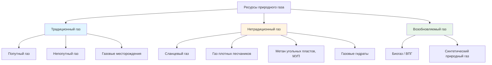

## Классификационная структура ресурсов природного газа

Ресурсы природного газа делятся на три категории по характеру залегания и методу добычи: традиционный газ, нетрадиционный газ и возобновляемый газ. Для инженера HVAC это различие практически значимо: состав газа определяет теплоту сгорания, требования к воздуху горения и допустимые диапазоны настройки горелочного оборудования.

---

## Традиционные ресурсы природного газа

### Попутный газ (associated gas)

Попутный газ выделяется вместе с нефтью при разработке нефтяных месторождений. При снижении пластового давления растворённые лёгкие углеводороды переходят в газовую фазу. Характерная черта — повышенное содержание тяжёлых углеводородов (этан C₂H₆, пропан C₃H₈, бутан C₄H₁₀), из-за чего высшая теплота сгорания (HHV, higher heating value) варьируется в диапазоне 39,0–42,8 МДж/м³.

Состав попутного газа рассчитывается по аддитивной модели:


HHV_{\text{газ}} = \sum_{i=1}^{n} y_i \cdot HHV_i


где $y_i$ — мольная доля компонента $i$, $HHV_i$ — высшая теплота сгорания чистого компонента (МДж/моль). Переменный состав означает, что горелочное оборудование, настроенное под один источник попутного газа, может работать нестабильно при переключении на другой.

### Непопутный газ (non-associated gas)

Накапливается в самостоятельных газовых ловушках вне нефтяных залежей. Отличается стабильным составом: метан CH₄ — 85–95 % об., минимум тяжёлых углеводородов. Теплота сгорания в диапазоне 37,5–39,1 МДж/м³ практически постоянна. Именно этот газ является основным сырьём для газотранспортных систем и газоснабжения жилых и коммерческих потребителей. Спецификации качества по ASTM D3588 ориентированы на показатели непопутного газа.

---

## Нетрадиционные ресурсы природного газа

### Сланцевый газ (shale gas)

Заключён в низкопроницаемых (менее 0,001 мД) глинистых сланцевых формациях. Промышленная добыча стала возможной благодаря горизонтальному бурению и многостадийному гидравлическому разрыву пласта (ГРП, hydraulic fracturing). Состав — 90–95 % CH₄, незначительное содержание C₂+, что обеспечивает HHV ≈ 37,3–38,4 МДж/м³ — близкое к непопутному газу. Сланцевый газ Пермского бассейна (США), сланцев Баженовской свиты (Россия) поступает в газотранспортные системы практически без дополнительной обработки.

### Газ плотных песчаников (tight gas)

Содержится в песчаниках или карбонатных коллекторах с проницаемостью менее 0,1 мД. Требует интенсивного ГРП или горизонтального бурения. По составу близок к непопутному газу, однако удельная себестоимость добычи выше. Это влияет на долгосрочное ценообразование при выборе топлива для крупных коммерческих систем HVAC.

### Метан угольных пластов (coal bed methane, CBM)

Образуется при метаморфизме угля и адсорбируется на угольной матрице. Добыча ведётся через осушку пласта и снижение давления: депрессуризация освобождает газ с поверхности углерода. Адсорбционная ёмкость угля описывается изотермой Ленгмюра:


V = \frac{V_L \cdot P}{P_L + P}


где $V$ — объём адсорбированного газа (м³/т), $V_L$ — предельный объём Ленгмюра, $P$ — пластовое давление (МПа), $P_L$ — давление Ленгмюра (МПа).

Содержание метана в МУП — 90–98 %, однако CO₂ может достигать 10 %, что снижает HHV до 35,4–39,0 МДж/м³. Перед подачей в газопровод требуется очистка от CO₂ и влаги.

### Газовые гидраты (gas hydrates)

Кристаллические клатратные структуры, в которых молекулы CH₄ удерживаются в решётке воды при высоком давлении и низкой температуре. Огромные запасы сосредоточены в придонных морских осадках и в зонах многолетней мерзлоты. По оценкам IEA (2023), ресурсный потенциал превышает все остальные виды ископаемых углеводородов вместе взятые. Коммерческая добыча в промышленном масштабе остаётся технически и экономически недостижимой по состоянию на 2025 год.

---

## Возобновляемый природный газ

### Биогаз и возобновляемый природный газ (renewable natural gas, RNG)

Биогаз получается при анаэробном сбраживании органического сырья: сельскохозяйственных отходов, осадка сточных вод, свалочного газа полигонов ТКО. Сырой биогаз содержит 50–70 % CH₄, 30–50 % CO₂ и следы H₂S. После очистки (абсорбция CO₂, удаление H₂S) получается возобновляемый природный газ с содержанием CH₄ > 95 % и HHV ≈ 37,3–38,4 МДж/м³. Такое топливо полностью совместимо с действующей газотранспортной инфраструктурой и оборудованием сжигания.

### Синтетический природный газ (synthetic natural gas, SNG)

Производится метанизацией водорода (из электролиза) и CO₂:


CO_2 + 4H_2 \xrightarrow{\text{кат.}} CH_4 + 2H_2O


Концепция Power-to-Gas позволяет использовать избыточную электроэнергию ВИЭ для синтеза SNG и хранения его в газовой инфраструктуре.

---

## Сравнение ресурсов для применения в HVAC


| Тип ресурса | CH₄, % об. | HHV, МДж/м³ | Стабильность состава | Совместимость с сетью | Метод добычи |
|---|---|---|---|---|---|
| Непопутный газ | 85–95 | 37,5–39,1 | Высокая | Отличная | Вертикальное бурение |
| Попутный газ | 70–90 | 39,0–42,8 | Умеренная | Хорошая (требует обработки) | Побочный продукт нефтедобычи |
| Сланцевый газ | 90–95 | 37,3–38,4 | Высокая | Отличная | ГРП + горизонтальное бурение |
| Газ плотных песчаников | 85–95 | 38,0–39,1 | Высокая | Отличная | Улучшенная добыча |
| МУП | 90–98 | 35,4–39,0 | Умеренная | Хорошая (очистка от CO₂) | Осушка пласта |
| Биогаз / ВПГ | ≥95 (после очистки) | 37,3–38,4 | Высокая (после очистки) | Отличная | Биоконверсия + очистка |


---

## Влияние состава газа на проектирование HVAC

### Индекс Воббе (Wobbe Index)

Индекс Воббе характеризует взаимозаменяемость газовых топлив и является главным критерием совместимости горелочных устройств:


WI = \frac{HHV}{\sqrt{d}}


где $HHV$ — высшая теплота сгорания (МДж/м³), $d$ — относительная плотность газа по воздуху (безразмерная). Согласно ANSI Z223.1 / NFPA 54, допустимое отклонение WI при замене источника газа не должно превышать ±5 %. Выход за этот предел вызывает нестабильность горения, изменение КПД и рост выбросов CO.

### Нормативные диапазоны для оборудования

Конденсационные котлы и печи, сертифицированные по ANSI Z21, рассчитаны на газ в диапазонах: HHV — 36,5–42,8 МДж/м³, относительная плотность — 0,55–0,70. Газоснабжающие организации смешивают поставки из различных источников для поддержания стабильного индекса Воббе на выходе в распределительную сеть.

---

## Числовой пример: расчёт HHV попутного газа

**Условие.** Попутный газ имеет состав (% об.): CH₄ — 82,0; C₂H₆ — 9,0; C₃H₈ — 5,0; CO₂ — 2,0; N₂ — 2,0. Определить HHV смеси и индекс Воббе. Принять стандартные значения HHV компонентов: CH₄ — 35,88 МДж/м³, C₂H₆ — 64,35 МДж/м³, C₃H₈ — 93,21 МДж/м³.

**Решение.**


HHV_{\text{смеси}} = 0{,}82 \times 35{,}88 + 0{,}09 \times 64{,}35 + 0{,}05 \times 93{,}21 + 0{,}02 \times 0 + 0{,}02 \times 0



HHV_{\text{смеси}} = 29{,}42 + 5{,}79 + 4{,}66 = 39{,}87 \; \text{МДж/м}^3


Относительная плотность смеси (молярные массы: CH₄ — 16,04; C₂H₆ — 30,07; C₃H₈ — 44,10; CO₂ — 44,01; N₂ — 28,01; воздух — 28,97):


M_{\text{смеси}} = 0{,}82 \times 16{,}04 + 0{,}09 \times 30{,}07 + 0{,}05 \times 44{,}10 + 0{,}02 \times 44{,}01 + 0{,}02 \times 28{,}01 = 19{,}84 \; \text{г/моль}



d = \frac{19{,}84}{28{,}97} = 0{,}685



WI = \frac{39{,}87}{\sqrt{0{,}685}} = \frac{39{,}87}{0{,}828} = 48{,}2 \; \text{МДж/м}^3


Для сравнения: типовой непопутный газ имеет WI ≈ 47–50 МДж/м³. Данный попутный газ укладывается в допустимый диапазон (±5 % от номинала горелки), что подтверждает его совместимость с оборудованием, настроенным на стандартный сетевой газ.

---

## Применимые стандарты

- **ASTM D3588** — расчёт теплоты сгорания, коэффициента сжимаемости и относительной плотности газовых топлив
- **ISO 6976** — природный газ: расчёт теплоты сгорания, плотности, относительной плотности и индекса Воббе
- **ANSI Z223.1 / NFPA 54** — Национальный кодекс по топливному газу (США)
- **ГОСТ 5542** — газы горючие природные для промышленного и коммунально-бытового назначения
- **СП 60.13330.2020** — отопление, вентиляция и кондиционирование воздуха
- **ФЗ-261** — об энергосбережении и о повышении энергетической эффективности
