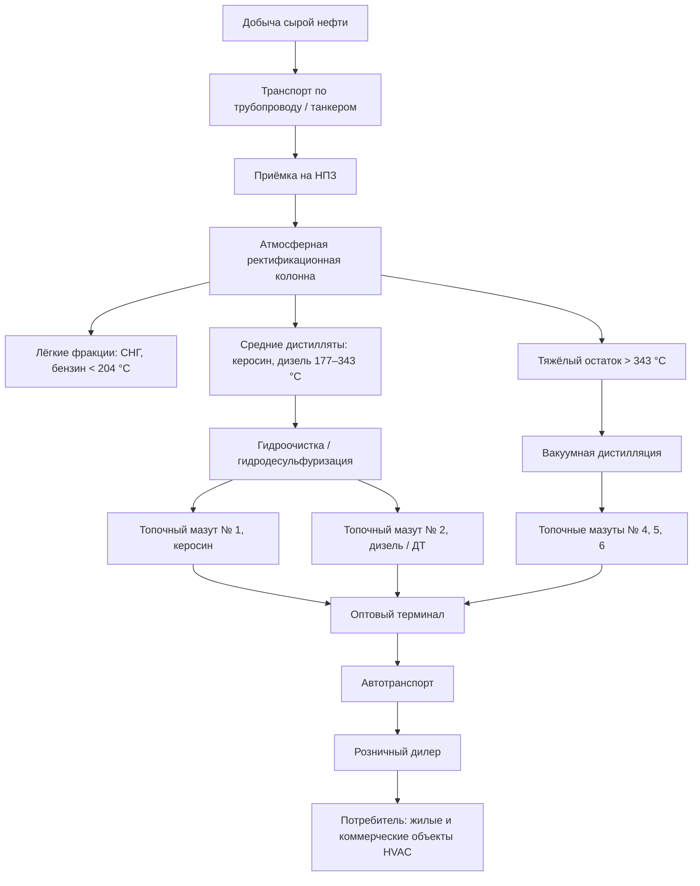

Нефть остаётся значимым источником тепловой энергии для систем HVAC — особенно в регионах с ограниченной газотранспортной инфраструктурой. Инженер, проектирующий или обслуживающий нефтяное теплоснабжение, должен понимать цепочку от добычи сырой нефти до физических свойств готового топлива.

---

## Классификация сырой нефти

Исходное сырьё для производства топочного мазута — сырая нефть (crude oil) — характеризуется двумя ключевыми параметрами: плотностью по шкале API (American Petroleum Institute) и содержанием серы.

### Шкала плотности API

Плотность по API — обратная функция удельного веса нефти при 15,6 °C:


\text{API} = \frac{141{,}5}{SG_{15{,}6}} - 131{,}5


где $SG_{15,6}$ — удельный вес нефти относительно воды при 15,6 °C. Чем выше API, тем легче нефть и тем больший выход дистиллятных фракций она даёт.


| Тип нефти | Плотность API, ° | Удельный вес | Характеристика | Выход дистиллята для HVAC |
|---|---|---|---|---|
| Особо лёгкая | > 39 | < 0,825 | Очень низкая вязкость | Высокий, минимальная переработка |
| Лёгкая | 31,1–39 | 0,825–0,870 | Хорошая текучесть | Высокий, оптимальное сырьё |
| Средняя | 22,3–31,1 | 0,870–0,920 | Умеренная вязкость | Средний, стандартный источник |
| Тяжёлая | 10–22,3 | 0,920–1,000 | Высокая вязкость, требует нагрева | Низкий, нужен крекинг |
| Сверхтяжёлая | < 10 | > 1,000 | Тяжелее воды | Минимальный, высокие затраты |


Лёгкая и средняя нефть производит более высокий выход средних дистиллятов (топочный мазут № 1 и № 2) при меньших энергетических затратах на переработку и является предпочтительным сырьём.

---

## Процесс переработки нефти

Сырая нефть поступает на нефтеперерабатывающий завод (НПЗ), где подвергается атмосферной фракционной дистилляции — разделению на фракции по температуре кипения в ректификационной колонне при давлении, близком к атмосферному.

Средние дистилляты кипят в диапазоне 177–343 °C и составляют основу топочных мазутов для HVAC. Тяжёлый остаток атмосферной перегонки направляется на вакуумную дистилляцию (VDU, vacuum distillation unit) для получения более тяжёлых марок.

---

## Марки топочного мазута по ASTM D396

Стандарт ASTM D396 «Standard Specification for Fuel Oils» определяет шесть марок топочного мазута. Каждая марка имеет нормированные диапазоны вязкости, температуры вспышки и застывания, содержания серы и золы.


| Марка | Наименование | Вязкость при 40 °C, мм²/с | Температура застывания, °C | HHV, кДж/л | Основное применение в HVAC |
|---|---|---|---|---|---|
| № 1 | Керосин | 1,3–2,2 | до −40 | ≈ 37 300 | Холодный климат, переносные обогреватели |
| № 2 | Топочный мазут | 2,0–3,6 | −6...+20 | ≈ 38 700 | Жилые и коммерческие печи, котлы |
| № 4 лёгкий | Дистиллят-остаток | 5,8–26,4 | −7 | ≈ 40 600 | Крупные коммерческие котлы |
| № 4 тяжёлый | Смесь остатка | 26,4–60,7 | −7 | ≈ 41 400 | Промышленные котлы, требуется подогрев |
| № 5 лёгкий | Остаточное | 42–118 | +10...+30 | ≈ 42 200 | Промышленные объекты |
| № 6 | Мазут Bunker C | 900+ | +24 | ≈ 43 400 | Крупная промышленность, ТЭС |


Топочный мазут № 2 занимает доминирующее положение на рынке жилого и коммерческого HVAC: по данным EIA (Energy Information Administration), на него приходится около 85 % потребления топочного мазута в жилом секторе США.

---

## Характеристики топлива и влияние на КПД системы

### Теплота сгорания

Теплотворная способность мазута № 2 составляет около 38 700 кДж/л по высшей теплоте сгорания (HHV). С учётом КПД конденсационного котла 95 % полезный выход — около 36 765 кДж/л. Для сравнения: природный газ при HHV 38,4 МДж/м³ и КПД 95 % даёт сопоставимую плотность по объёму (36 480 кДж/м³), однако учёт объёмов хранения и инфраструктуры принципиально различается.

### Вязкость

Вязкость мазута № 2 (2,0–3,6 мм²/с при 40 °C) обеспечивает стабильное распыление в форсунках с механическим распылением (давление насоса 690–1 035 кПа). При понижении температуры воздуха вязкость возрастает: при −10 °C она может достигать 6–8 мм²/с, что ухудшает качество факела. Хранение бака в отапливаемом помещении или применение нагревательных кабелей (heat trace) на топливопроводах исключает эту проблему.

### Содержание серы

Регламент EPA (Environmental Protection Agency) для ультранизкосернистого топочного мазута (ULSHO, ultra-low sulfur heating oil) ограничивает содержание серы до 15 мг/кг. Исторически в мазуте могло содержаться до 5 000 мг/кг серы; переход на ULSHO снизил выбросы SO₂ при сжигании примерно на 99 % и устранил проблему сернистой коррозии теплообменников.

---

## Числовой пример: годовой расход топлива

**Условие.** Коммерческое здание имеет расчётную тепловую нагрузку 120 кВт. Установлен котёл на мазуте № 2 с КПД η = 87 %. Годовой объём градусо-суток отопления (HDD, heating degree days) составляет 4 500 Кс/сут при базовой температуре 18 °C. Средняя мощность теплопотерь нормируется как 0,7 от расчётной нагрузки с учётом случайного характера температур. Определить годовой расход топлива.

**Решение.**

Оценочное годовое потребление тепла:


Q_{\text{год}} = Q_{\text{расч}} \times f_{\text{нагр}} \times t_{\text{год}} = 120 \; \text{кВт} \times 0{,}7 \times 4\,500 \times 24 \; \text{ч} = 9{,}072 \times 10^6 \; \text{кВт·ч}


Перевод в МДж: $9{,}072 \times 10^6 \times 3{,}6 = 3{,}266 \times 10^7$ МДж.

Расход топлива с учётом КПД котла:


V_{\text{топл}} = \frac{Q_{\text{год}}}{\eta \times HHV} = \frac{3{,}266 \times 10^7 \; \text{МДж}}{0{,}87 \times 38{,}7 \; \text{МДж/л}} = \frac{3{,}266 \times 10^7}{33{,}67} \approx 970\,000 \; \text{л/год}


Это 970 м³ мазута № 2 в год. При плотности ≈ 845 кг/м³ масса топлива составит около 820 т/год.

---

## Инфраструктура распределения

Нефтепродукты проходят многоуровневую цепочку от НПЗ до конечного потребителя:

1. **НПЗ** — производство и первичное хранение дистиллятов.
2. **Трубопровод готовой продукции** — магистральная транспортировка на расстояния 800–4 800 км со скоростью 5–8 км/ч.
3. **Оптовый терминал** — объекты хранения вместимостью 7 900–79 400 м³ вблизи крупных центров потребления.
4. **Розничный дилер** — местный распределитель топлива с автопарком грузовиков-бензовозов (вместимость 9 500–38 000 л).
5. **Конечное хранилище** — жилые баки (1 000–4 000 л) или коммерческие ёмкости (3 800–75 000 л и более).

Цепочка поставок работает сезонно: летом происходит накопление запасов на терминалах, зимой — интенсивный расход. EIA публикует еженедельный отчёт о запасах дистиллятного топлива в США; сезонные колебания составляют от 17,5 до 28,6 млн м³.

---

## Региональная специфика и холодный климат

Потребление топочного мазута сосредоточено в северо-восточных штатах США (около 80 % жилого рынка нефтяного отопления страны). Зимние смеси (winter blends) добавляют 10–50 % керосина № 1 к базовому мазуту № 2 для снижения температуры помутнения (cloud point) и предотвращения парафинизации топливных фильтров при сильных морозах.

---

## Перспективы: биотопливо на основе нефти

Смеси Bioheat — нефтяной мазут с добавкой биодизеля — обозначаются B5, B10, B20 (5, 10, 20 % биодизеля). Они совместимы с действующим оборудованием и трубопроводной инфраструктурой и снижают углеродоёмкость отопления без замены оборудования. Производители горелок и котлов в большинстве своём допускают смеси до B20 без изменения гарантийных условий. Прогноз BP Statistical Review of World Energy предполагает сохранение нефтяного отопления в регионах без доступа к природному газу на протяжении ближайших 20–30 лет.

---

## Нормативная база

- **ASTM D396** — Standard Specification for Fuel Oils
- **ASTM D3588** — расчёт теплоты сгорания газообразных и жидких топлив
- **ASHRAE 90.1** — Energy Standard for Buildings Except Low-Rise Residential Buildings
- **ISO 50001** — системы энергетического менеджмента
- **EN 16247** — энергетические аудиты
- **СП 60.13330.2020** — отопление, вентиляция и кондиционирование воздуха
- **ФЗ-261** — об энергосбережении и о повышении энергетической эффективности
