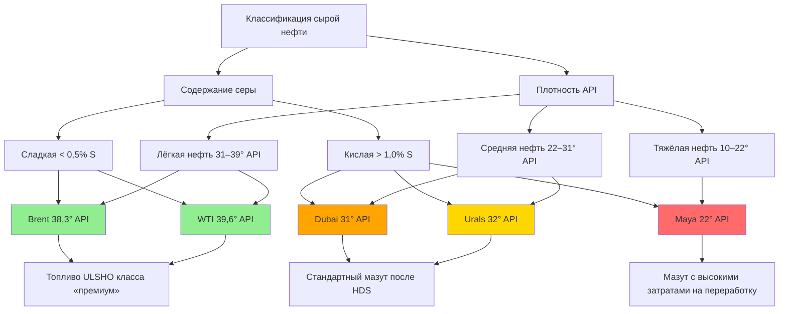

Классификация сырой нефти определяет эффективность нефтепереработки, выход дистиллятных топлив и качество топочного мазута для систем HVAC. Два ключевых параметра — плотность по шкале API и массовое содержание серы — формируют все последующие характеристики готового топлива.

---

## Классификация по плотности API

Шкала API (American Petroleum Institute) измеряет относительную плотность нефти. Расчётная формула:


\text{API} = \frac{141{,}5}{SG_{15{,}6}} - 131{,}5


где $SG_{15,6}$ — удельный вес нефти относительно воды при 15,6 °C (60 °F). Шкала обратная: чем выше значение API, тем легче нефть.


| Категория | API, ° | Удельный вес | Характеристика переработки |
|---|---|---|---|
| Сверхтяжёлая | < 10 | > 1,000 | Тяжелее воды; необходим интенсивный крекинг и разбавитель |
| Тяжёлая | 10–22,3 | 0,920–1,000 | Высокая вязкость; требует подогрева при транспортировке |
| Средняя | 22,3–31,1 | 0,870–0,920 | Умеренная сложность; стандартное сырьё НПЗ |
| Лёгкая | 31,1–39 | 0,825–0,870 | Низкая вязкость; высокий выход бензина и дистиллята |
| Сверхлёгкая | > 39 | < 0,825 | Очень лёгкая; максимальный выход светлых фракций |


Для производства топочного мазута № 2 наиболее пригодна лёгкая и средняя нефть: она даёт больший выход среднедистиллятной фракции (кипение 177–343 °C) без применения энергоёмкого каталитического крекинга.

---

## Классификация по содержанию серы

Содержание серы непосредственно влияет на выбросы SO₂, скорость коррозии в теплообменниках и затраты на вторичную переработку.


| Категория | Содержание серы, % масс. | Практические последствия для HVAC |
|---|---|---|
| Сладкая (sweet) | < 0,5 | Минимальная обработка; ULSHO без сложного оборудования |
| Промежуточная | 0,5–1,0 | Требует гидродесульфуризации |
| Кислая (sour) | > 1,0 | Высокая коррозионность; обязательная HDS |
| Сильно кислая | > 2,0 | Интенсивная многоступенчатая очистка |


**Сладкая нефть** (sweet crude) содержит мало H₂S и меркаптанов. Топливо из неё соответствует нормативу ULSHO (≤ 15 мг/кг серы) при минимальном объёме гидродесульфуризации (HDS, hydrodesulfurization). Оборудование HVAC, сжигающее ULSHO, практически не испытывает сернистой коррозии в теплообменниках и дымоходах.

**Кислая нефть** (sour crude) дешевле, но требует установок HDS большой мощности. Даже при полной очистке готовое топливо может сохранять остаточную сернистость, критичную для конденсационных котлов с кислотным конденсатом.

---

## Эталонные сорта нефти

Мировой рынок использует несколько маркерных сортов в качестве ценовых ориентиров. Их характеристики предопределяют качество дистиллятов на конкретных НПЗ.


| Маркер | API, ° | Сера, % | Тип | Регион | Связь с HVAC |
|---|---|---|---|---|---|
| WTI (West Texas Intermediate) | 39,6 | 0,24 | Лёгкая сладкая | США (Техас, Оклахома) | Лучшее сырьё для ULSHO |
| Brent Blend | 38,3 | 0,37 | Лёгкая сладкая | Северное море (Великобритания, Норвегия) | Мировой эталон; высококачественный дистиллят |
| Urals | 32 | 1,3 | Средняя кислая | Россия | Требует HDS; источник мазута в Европе |
| Dubai Crude | 31 | 2,0 | Средняя кислая | ОАЭ | Высокие затраты на очистку |
| Maya | 22 | 3,3 | Тяжёлая кислая | Мексика | Интенсивный крекинг; дорогой в переработке дистиллят |


---

## Влияние источника нефти на качество топочного мазута

### Продукты из лёгкой сладкой нефти

- Цетановый индекс (cetane index) > 45 — лучшие характеристики воспламенения и горения.
- Температура застывания (pour point) ниже −20 °C — надёжная работа при низких температурах хранения.
- Минимальное образование лакообразных отложений в форсунках.
- Выбросы твёрдых частиц (PM 2,5) и SO₂ минимальны без дополнительных мер очистки.

### Продукты из тяжёлой кислой нефти

- Требует гидроочистки и гидрокрекинга для получения дистиллятной фракции.
- Более высокое содержание ароматических углеводородов → повышенная склонность к образованию сажи и шлама.
- При недостаточной очистке — рост выбросов NO$_x$, PM и SO₂.
- Возможно образование нерастворимых осадков при смешивании с дистиллятами из других источников (проблема совместимости).

---

## Последствия для нефтеперерабатывающих заводов

Лёгкая нефть перерабатывается в атмосферной колонне. Среднедистиллятный срез (177–343 °C) даёт топочный мазут № 2 практически напрямую — HDS снижает серу до уровня ULSHO. Тяжёлая нефть требует:

1. **Вакуумной дистилляции (VDU)** — для извлечения дополнительного газойля из атмосферного остатка.
2. **Каталитического крекинга (FCC)** — разложение тяжёлых молекул до дистиллятной фракции.
3. **Гидрокрекинга (HC)** — глубокое превращение тяжёлых фракций с одновременным удалением серы.
4. **Гидродесульфуризации (HDS)** — приведение серы к норме ASTM D396 / ULSHO.

Каждый дополнительный этап увеличивает удельные затраты на переработку и снижает экономическую конкурентоспособность тяжёлой нефти как сырья для топочного мазута.

---

## Числовой пример: пересчёт плотности API в удельный вес

**Условие.** Нефть имеет плотность по шкале API = 35,2°. Определить её удельный вес при 15,6 °C и категорию по классификации.

**Решение.**


SG_{15{,}6} = \frac{141{,}5}{API + 131{,}5} = \frac{141{,}5}{35{,}2 + 131{,}5} = \frac{141{,}5}{166{,}7} = 0{,}848


Удельный вес 0,848 соответствует плотности (при расчёте $\rho = SG \times 1\,000$) — 848 кг/м³. По таблице классификации: API 35,2° попадает в диапазон лёгкой нефти (31,1–39°). Такая нефть является хорошим сырьём для производства топочного мазута № 2 без интенсивной вторичной переработки.

---

## Требования к топочному мазуту № 2 по ASTM D396

Оборудование HVAC на жидком топливе проектируется под топочный мазут № 2, параметры которого нормированы ASTM D396:

- Плотность API: 30–38°
- Содержание серы: ≤ 15 мг/кг (стандарт ULSHO)
- Температура вспышки: ≥ 38 °C (требование пожарной безопасности)
- Температура застывания: ≤ −6 °C (работа в холодном климате)
- Вязкость при 40 °C: 2,0–3,6 мм²/с (оптимум для распыления)

Соблюдение этих параметров зависит от правильного выбора сырья (лёгкая сладкая нефть или грамотно переработанная средняя нефть) и качества вторичных процессов на НПЗ. Инженер HVAC не управляет переработкой, но понимание связи «источник — свойство топлива» позволяет правильно оценивать риски при работе с нестандартным или альтернативным топливом.

---

## Нормативная база

- **ASTM D396** — Standard Specification for Fuel Oils
- **ASTM D4052** — определение плотности жидкостей методом осциллирующей пробирки
- **ASTM D5453** — определение серы в нефтепродуктах ультрафиолетовой флуоресценцией
- **ASTM D97** — определение температуры застывания нефтепродуктов
- **ISO 50001** — системы энергетического менеджмента
- **ASHRAE 90.1** — Energy Standard for Buildings Except Low-Rise Residential Buildings
- **СП 60.13330.2020** — отопление, вентиляция и кондиционирование воздуха
