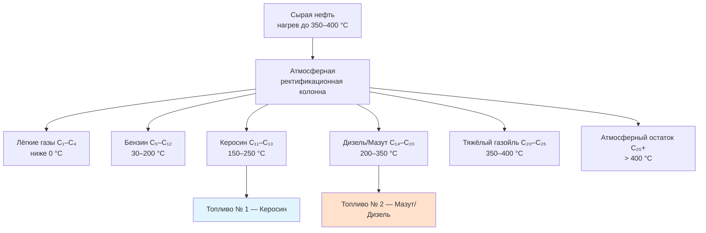

Дистиллятные топлива занимают средние фракции нефти — углеводородные цепочки C₁₁–C₂₀ с диапазоном кипения 150–350 °C. Это основа топочного мазута № 1 (керосин) и № 2 (мазут/дизель), обеспечивающих отопление жилых и коммерческих зданий. Понимание физических свойств, методов испытания и особенностей хранения позволяет инженеру HVAC правильно проектировать топливные системы и поддерживать стабильную эффективность горения.

---

## Процесс фракционной дистилляции

Разделение нефти основано на различии температур кипения молекул с разной длиной углеродной цепи. Атмосферная ректификационная колонна работает при градиентах: основание (нагрев до 350–400 °C) → верх (30–50 °C). Боковые отводы на промежуточных высотах улавливают нужные диапазоны кипения.

---

## Категории дистиллятов для HVAC

### Топливо № 1 — Керосин (kerosene)

Керосин — самый лёгкий дистиллят для отопления (C₁₁–C₁₃). Его температура застывания ниже −40 °C и низкая вязкость (1,3–2,2 мм²/с при 40 °C) обеспечивают уверенный запуск горелок при экстремальных морозах. Применяется в переносных обогревателях, фитильных (wick-type) горелках, системах аэропортового отопления. Высокая летучесть обеспечивает чистое горение с минимальным образованием сажи.

### Топливо № 2 — Мазут (heating oil / fuel oil No. 2)

Стандартный дистиллят для жилых и коммерческих систем (C₁₄–C₂₀). Обозначение охватывает как мазут по ASTM D396, так и автомобильное дизельное топливо по ASTM D975 — они близки по диапазонам дистилляции, но различаются пакетами присадок и нормативными требованиями. Мазут № 2 обеспечивает оптимальный баланс между энергетической плотностью, вязкостью и характеристиками безопасности. Современные формулировки содержат ≤ 15 мг/кг серы (ULSHO, ultra-low sulfur heating oil).

### Зимние смеси (winter blends)

В холодном климате к мазуту № 2 добавляют 10–50 % керосина для снижения температуры помутнения (cloud point) и предотвращения парафинизации фильтров. Соотношение подбирается исходя из расчётной зимней температуры наружного воздуха.

---

## Физические свойства и методы испытания


| Свойство | Топливо № 1 | Топливо № 2 | Метод испытания | Назначение параметра |
|---|---|---|---|---|
| Диапазон дистилляции | 150–250 °C | 200–350 °C | ASTM D86 | Фракционный состав |
| Температура вспышки | 38–72 °C | ≥ 38 °C | ASTM D93 | Безопасность хранения |
| Температура застывания | −40...−20 °C | −6...−15 °C | ASTM D97 | Холодная текучесть |
| Вязкость при 40 °C | 1,3–2,2 мм²/с | 2,0–3,6 мм²/с | ASTM D445 | Качество распыления |
| Удельный вес | 0,78–0,81 | 0,82–0,86 | ASTM D4052 | Плотность энергии |
| Содержание серы | ≤ 15 мг/кг | ≤ 15 мг/кг | ASTM D5453 | Выбросы SO₂ |
| Цетановое число | 40–45 | 40–55 | ASTM D613 | Качество воспламенения |
| Остаток углерода | < 0,01 % | < 0,35 % | ASTM D524 | Склонность к нагарообразованию |
| Вода и осадок | ≤ 0,05 % об. | ≤ 0,05 % об. | ASTM D2709 | Засорение форсунок |


---

## Теплотворная способность и содержание энергии

### Высшая и низшая теплота сгорания

Высшая теплота сгорания (HHV, higher heating value) включает скрытую теплоту конденсации водяного пара в продуктах горения:


HHV = LHV + h_{fg} \times m_{H_2O}


Низшая теплота сгорания (LHV, lower heating value) — без учёта конденсации:


LHV = HHV - h_{fg} \times (9 \times H)


где $h_{fg}$ — скрытая теплота испарения воды при стандартных условиях (2 257 кДж/кг), $H$ — массовая доля водорода в топливе (обычно 0,12–0,14 для дистиллятов), коэффициент 9 — масса воды на единицу массы водорода.


| Топливо | HHV, МДж/кг | HHV, МДж/л | LHV, МДж/кг | LHV, МДж/л |
|---|---|---|---|---|
| Топливо № 1 (керосин) | 46,4 | 37,3 | 43,2 | 34,7 |
| Топливо № 2 (мазут) | 45,5 | 38,7 | 42,5 | 36,2 |
| Дизельное топливо | 45,8 | 38,6 | 43,0 | 36,3 |


Объёмная теплотворная способность (МДж/л) важнее при проектировании HVAC, так как хранение и учёт топлива ведутся по объёму. Мазут № 2 на 4–5 % превосходит керосин по МДж/л, что компенсирует его более высокую удельную стоимость при жилом отоплении.

---

## Расчёт эффективности горения

Теоретическая эффективность горения:


\eta_{\text{сгор}} = \frac{\dot{Q}_{\text{полезн}}}{\dot{Q}_{\text{вход}}} = \frac{LHV \times \dot{m}_{\text{топл}} - \dot{Q}_{\text{уход}} - \dot{Q}_{\text{потери}}}{LHV \times \dot{m}_{\text{топл}}}


где $\dot{Q}_{\text{уход}}$ — потери с уходящими дымовыми газами, $\dot{Q}_{\text{потери}}$ — потери излучением и конвекцией с корпуса оборудования.

Потери с уходящими газами:


\dot{Q}_{\text{уход}} = \dot{m}_{\text{дым}} \times c_p \times (T_{\text{дым}} - T_{\text{нар}})


Конденсационные котлы, охлаждая дымовые газы ниже точки росы (≈ 55 °C для мазута № 2), восстанавливают скрытую теплоту из водяного пара и достигают КПД > 90 % по HHV (> 95 % по LHV).

---

## Числовой пример: расчёт расхода топлива котла

**Условие.** Жилой котёл на мазуте № 2 имеет тепловую мощность 40 кВт. КПД котла η = 85 % (по HHV). Определить массовый расход топлива и суточный расход за день с непрерывной работой.

**Решение.**

Принять HHV мазута № 2 = 45,5 МДж/кг.

Мощность на входе (расход тепла от сгорания):


\dot{Q}_{\text{вход}} = \frac{\dot{Q}_{\text{полезн}}}{\eta} = \frac{40 \; \text{кВт}}{0{,}85} = 47{,}1 \; \text{кВт}


Массовый расход топлива:


\dot{m}_{\text{топл}} = \frac{\dot{Q}_{\text{вход}}}{HHV} = \frac{47{,}1 \; \text{кВт}}{45{,}5 \; \text{МДж/кг}} = \frac{47{,}1 \; \text{кДж/с}}{45\,500 \; \text{кДж/кг}} = 0{,}001035 \; \text{кг/с} = 3{,}73 \; \text{кг/ч}


Суточный расход (24 ч непрерывной работы):


m_{\text{сут}} = 3{,}73 \times 24 = 89{,}5 \; \text{кг/сут}


При плотности мазута № 2 ≈ 845 кг/м³:


V_{\text{сут}} = \frac{89{,}5}{845} = 0{,}106 \; \text{м}^3/\text{сут} = 106 \; \text{л/сут}


Жилой бак объёмом 1 000 л обеспечивает около 9,4 суток работы при полной нагрузке.

---

## Хранение и обращение

### Материалы резервуаров

Наземные резервуары из стали (сертификат UL-142) или стеклопластика (FRP) — для подземной или надземной установки. Стальные подземные резервуары требуют катодной защиты или покрытия. Двустенные резервуары с межстенным мониторингом обязательны во многих юрисдикциях.

### Вентиляция и заполнение

Атмосферные резервуары оборудуются вентиляционными клапанами, рассчитанными по NFPA 30, для компенсации теплового расширения и темпа откачки топлива. Заливные трубы диаметром ≥ 50 мм выводятся наружу здания; вентиляционные трубы (≥ 32 мм) заканчиваются не менее чем в 600 мм от проёмов.

### Эксплуатация в холодную погоду

Температура помутнения (cloud point) мазута № 2 обычно составляет −3...+5 °C. При приближении к этому значению парафиновые воски кристаллизуются и забивают топливные фильтры. Меры: нагревательные кабели (heat trace) на топливопроводах, хранение бака в отапливаемом помещении, добавка депрессоров парафина или смешивание с керосином.

### Разделение воды и биообрастание

Дистиллятные топлива растворяют до 50–100 мг/кг воды. Превышение растворимости даёт свободную фазу воды на дне резервуара — питательную среду для сульфатредуцирующих бактерий. Дно резервуара должно иметь уклон к дренажному колодцу; ежегодный отбор проб выявляет биологическое загрязнение.

---

## Управление качеством топлива

Пакеты присадок повышают эксплуатационные характеристики дистиллятов:

- **Биоциды** — подавляют рост микроорганизмов в увлажнённом топливе.
- **Антиоксиданты / стабилизаторы** — предотвращают окисление при длительном хранении (более 12 месяцев).
- **Депрессоры температуры застывания** — модифицируют кристаллическую структуру парафина.
- **Улучшители смазываемости** — компенсируют снижение граничной смазки при удалении серы в ULSHO.
- **Катализаторы горения** — сокращают образование сажи и повышают КПД.

Испытание стабильности по ASTM D2274 обязательно для топлива с хранением свыше одного года.

---

## Применение в современных системах HVAC

**Жилые системы.** Котлы и печи на мазуте № 2 с КПД 82–95 % (конденсационные модели) — основная технология нефтяного отопления.

**Коммерческие объекты.** Централизованные котельные мощностью 0,5–15 МВт на мазуте № 2 или смешанном топливе обслуживают офисные здания, гостиницы, торговые центры.

**Аварийные дизель-генераторы.** Топливо № 2 (ASTM D975, Grade No. 2-D) одновременно соответствует требованиям к отопительному топливу и к топливу для ДВС, что упрощает унификацию хранения.

**Когенерационные установки (CHP).** Поршневые двигатели или микротурбины на дизельном топливе генерируют электроэнергию и одновременно утилизируют тепло, достигая суммарного КПД > 80 %.

---

## Нормативная база

- **ASTM D396** — Standard Specification for Fuel Oils
- **ASTM D975** — Standard Specification for Diesel Fuel Oils
- **ASTM D86** — дистилляция нефтепродуктов при атмосферном давлении
- **NFPA 30** — Flammable and Combustible Liquids Code
- **ASHRAE 90.1** — Energy Standard for Buildings
- **ISO 50001** — системы энергетического менеджмента
- **EN 16247** — энергетические аудиты
- **СП 60.13330.2020** — отопление, вентиляция и кондиционирование воздуха
- **ФЗ-261** — об энергосбережении и о повышении энергетической эффективности
