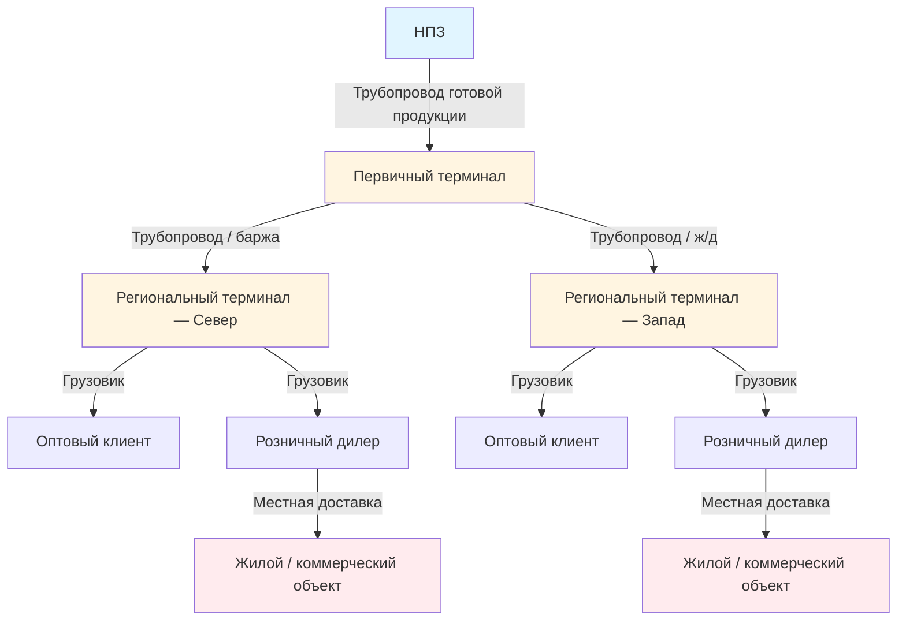

Инфраструктура распределения нефтепродуктов — критическое звено между нефтеперерабатывающими заводами (НПЗ) и конечными потребителями систем HVAC. Понимание этой цепочки позволяет инженеру правильно оценивать риски надёжности поставок, сезонные ценовые колебания и требования к резервному хранению на объекте.

---

## Структура сети распределения

Распределительная сеть нефтепродуктов в США включает около 321 000 км жидких трубопроводов, тысячи терминалов и развитую морскую и автомобильную транспортную систему. По данным EIA (Energy Information Administration), суммарный суточный поток переработанных нефтепродуктов превышает 460 млн л/сут, из которых топочный мазут составляет значительную долю в зимние месяцы на северо-востоке страны.

---

## Трубопроводный транспорт

### Принципы работы

Трубопроводы готовой продукции (product pipelines) перемещают переработанные нефтепродукты от НПЗ к распределительным терминалам. Рабочее давление — 2 760–8 270 кПа, скорость потока — 0,9–2,4 м/с, диаметры — 200–1 000 мм. Крупные магистрали обслуживают пропускную способность 1 260–7 570 м³/сут.

Ключевые особенности:
- **Последовательная перекачка** (batch mode): несколько продуктов чередуются в одном трубопроводе, разделённые контролируемыми переходными зонами (interface zones).
- **Энергоэффективность**: 0,03–0,04 кВт·ч/(м³·км) — значительно ниже, чем у автомобильного или железнодорожного транспорта.

### Инфраструктурные компоненты

- **SCADA** (Supervisory Control and Data Acquisition) — мониторинг расхода, давления и температуры в реальном времени.
- **Система обнаружения утечек (CPM)** — вычислительный мониторинг трубопровода с чувствительностью до 1 %.
- **Насосные станции** — через каждые 80–160 км для поддержания рабочего давления.
- **Клапанные секции** — изоляция участков каждые 16–32 км для оперативного перекрытия.

---

## Сравнение видов транспорта


| Вид транспорта | Вместимость | Дальность, км | Скорость, км/ч | Стоимость, $/м³·км | Типичное применение |
|---|---|---|---|---|---|
| Трубопровод | 1 260–7 570 м³/сут | 800–4 800 | 5–8 | 0,02–0,04 | НПЗ → терминал |
| Прибрежный танкер | 2 000–12 600 м³ | 800–8 000 | 18–28 | 0,03–0,06 | Прибрежное распределение |
| Речная баржа | 250–1 260 м³ | 160–3 200 | 8–13 | 0,04–0,08 | Внутренние водные пути |
| Ж/д цистерна | 60–70 м³/вагон | 800–4 800 | 40–64 | 0,10–0,20 | Терминал ↔ терминал |
| Автоцистерна | 19–38 м³ | 80–800 | 72–88 | 0,30–0,60 | Местная доставка |


---

## Морской транспорт

### Прибрежные танкеры

Прибрежные танкеры (coastal tankers) доставляют нефтепродукты между НПЗ и прибрежными терминалами. Дедвейт судов — 5 000–50 000 т, отгрузки топочного мазута концентрируются в октябре–марте (отопительный сезон). В США Закон о каботажном судоходстве (Jones Act) предписывает: суда между портами США должны быть под американским флагом, построены и укомплектованы американским экипажем.

### Речные барже

Системы речных барж эксплуатируют бассейн реки Миссисипи, Прибрежный водный канал и Великие озёра. Стандартная баржа перевозит 250–1 260 м³; составы из 15–40 барж обеспечивают высокую экономичность массовых перевозок.

---

## Инфраструктура хранения

Буферное хранение по всей сети гасит сезонные колебания спроса и перебои в поставках.


| Тип резервуара | Ёмкость | Конструкция | Применение |
|---|---|---|---|
| С конической крышей | 250–2 000 м³ | Углеродистая сталь, неподвижная крыша | Топочный мазут, дизель |
| С плавающей крышей | 1 250–12 600 м³ | Углеродистая сталь, плавающая крыша | Бензин, сырая нефть |
| Подземный (UST) | 6–30 м³ | Сталь / стеклопластик | Розница, АЗС |
| Надземный жилой | 1–4 м³ | Сталь | Одиночный объект HVAC |


**Конструктивные требования к терминальным резервуарам:**
- Проектирование по **API 650** (сварные стальные резервуары).
- Вторичное обвалование — вместимость не менее 110 % объёма резервуара.
- Система рекуперации паров (VRU) — улавливание при заполнении.
- Нагрев (паровые змеевики или электрические нагреватели) для тяжёлых марок в холодном климате.
- Межстенный мониторинг и учёт запасов — обнаружение утечек.

---

## Местная доставка конечным потребителям

### Автоцистерны

Современные бензовозы для доставки топочного мазута — от 9 500-литровых «местных» машин до 38 000-литровых транспортов большого объёма. Оснащение:
- Многосекционные цистерны — одновременная доставка нескольких продуктов.
- Электронные счётчики расхода с точностью ≤ 0,5 %.
- Сигнализация переполнения и автоматическое отключение.
- GPS-мониторинг и программная оптимизация маршрутов.

### Планирование доставки по HDD

Для автоматизации поставок широко применяется алгоритм на основе градусо-дней отопления (HDD, heating degree days):


V_{\text{доставки}} = \frac{HDD_{\text{накоп}} \times V_{\text{бака}} \times k_{\text{потребл}}}{HDD_{\text{сезон}}}


где $HDD_{\text{накоп}}$ — накопленные HDD с момента последней доставки, $k_{\text{потребл}}$ — коэффициент потребления (л/HDD), который определяется эмпирически по истории объекта.

### Показатели маршрутов

- Городской маршрут: 45 000–70 000 л/день (плотная застройка, короткие интервалы).
- Сельский маршрут: 20 000–35 000 л/день (большие расстояния).
- Зимний пик: объём доставок возрастает на 300–400 % по сравнению с базовым периодом.

---

## Числовой пример: расчёт объёма хранения на объекте

**Условие.** Коммерческий объект с котлом на мазуте № 2. Расчётная суточная потребность в пиковый день — 500 л/сут. Ближайший терминал находится в 120 км; доставка осуществляется еженедельно. Требуемый резерв — 14 дней при пиковом потреблении. Определить минимальную ёмкость резервуара.

**Решение.**

Пиковое потребление за период поставки (7 дней):


V_{\text{цикл}} = 500 \; \text{л/сут} \times 7 \; \text{сут} = 3\,500 \; \text{л}


Резервный запас (14 дней):


V_{\text{резерв}} = 500 \times 14 = 7\,000 \; \text{л}


Минимальная ёмкость резервуара (рабочий объём + резерв):


V_{\text{бака}} = V_{\text{цикл}} + V_{\text{резерв}} = 3\,500 + 7\,000 = 10\,500 \; \text{л}


С учётом коэффициента заполнения 0,90 (не допускается 100 % наполнение из-за теплового расширения):


V_{\text{номин}} = \frac{10\,500}{0{,}90} = 11\,667 \; \text{л} \rightarrow \text{выбрать бак 12\,000 л}


---

## Надёжность системы распределения

Инфраструктура нефтепродуктов обеспечивает высокую надёжность за счёт резервирования:

- **Несколько источников поставки**: терминалы принимают продукт из 2–4 независимых трубопроводов или морских источников.
- **Стратегический резерв Северо-Востока США** — 25 000 м³ топочного мазута для аварийного обеспечения.
- **Сезонное накопление**: уровень хранения на терминалах растёт с 500 000 м³ летом до 1 270 000 м³ перед зимним сезоном.
- **Альтернативная маршрутизация**: соединения между трубопроводами позволяют перенаправлять потоки при плановом обслуживании.

Узкие места возникают при одновременном совпадении нескольких факторов: аномальные морозы, повышенный спрос и логистические нарушения из-за погодных условий. Отрасль парирует это сезонным накоплением запасов и координацией в рамках программы EIA OPIS (Oil Price Information Service).

---

## Техническое обслуживание инфраструктуры

- **Программы контроля целостности трубопроводов (ILI)**: внутритрубные инспекционные снаряды (smart pigs) обнаруживают коррозию и дефекты металла раз в 7–10 лет.
- **Катодная защита**: предотвращает наружную коррозию подземных участков трубопровода.
- **Инспекция резервуаров по API 653**: внутренняя ревизия каждые 10–20 лет в зависимости от скорости коррозии.
- **Системы контроля паров**: регулярное тестирование на соответствие нормам EPA по летучим органическим соединениям.
- **Аварийное реагирование**: оборудование для ликвидации розливов и обученный персонал на каждом терминале.

---

## Нормативная база

- **API 650** — Welded Tanks for Oil Storage
- **API 653** — Tank Inspection, Repair, Alteration, and Reconstruction
- **NFPA 30** — Flammable and Combustible Liquids Code
- **NFPA 31** — Standard for the Installation of Oil-Burning Equipment
- **ASHRAE 90.1** — Energy Standard for Buildings
- **ISO 50001** — системы энергетического менеджмента
- **EN 16247** — энергетические аудиты
- **СП 60.13330.2020** — отопление, вентиляция и кондиционирование воздуха
- **ФЗ-261** — об энергосбережении и о повышении энергетической эффективности
