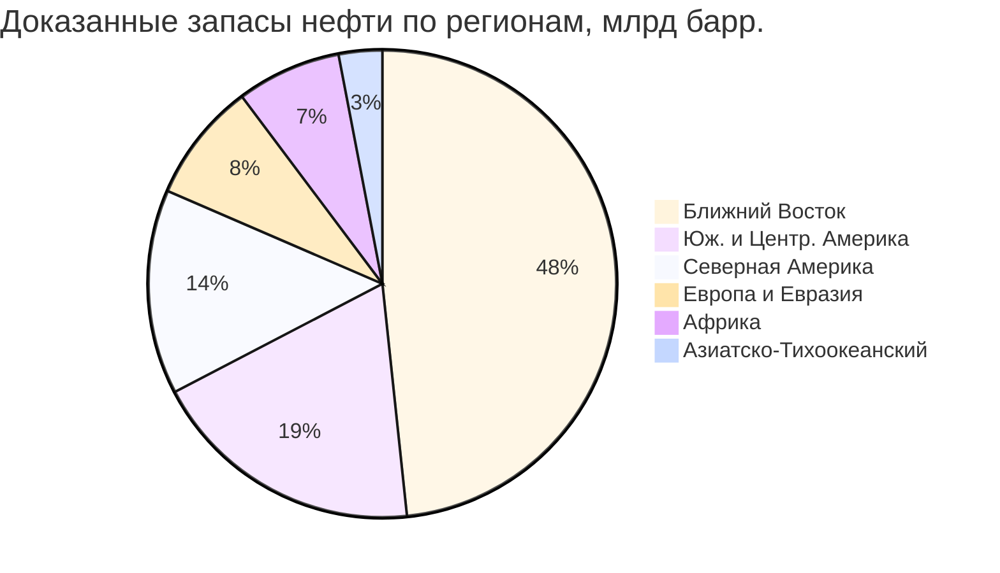

Глобальные запасы нефти формируют основу долгосрочного планирования систем HVAC на жидком топливе. Распределение запасов, темпы истощения и переход к нетрадиционным источникам определяют будущую доступность и стоимость топочного мазута — факторы, критичные при анализе жизненного цикла затрат (LCC, life cycle cost) на 20–30-летнем горизонте.

---

## Определения и методология

**Доказанные запасы (proven reserves, 1P)** — объёмы нефти, которые с разумной геологической и инженерной уверенностью (вероятность ≥ 90 %) могут быть извлечены при действующих экономических и технологических условиях.

**Вероятные запасы (probable reserves, 2P)** — с вероятностью ≥ 50 %; используются в стратегическом планировании.

**Коэффициент запас/добыча (R/P, reserves-to-production ratio)** — число лет, в течение которых запасы будут исчерпаны при текущем темпе добычи:


R/P = \frac{V_{\text{запас}}}{Q_{\text{добыча, год}}}


---

## Обзор глобальных доказанных запасов

По данным BP Statistical Review of World Energy 2023 и OPEC Annual Statistical Bulletin, глобальные доказанные запасы нефти составляют около 1 730 млрд баррелей (275 млрд м³), что при нынешнем уровне добычи (~100 млн баррелей/сут) обеспечивает горизонт R/P ≈ 47 лет. Этот показатель существенно варьируется по регионам.

---

## Региональное распределение запасов


| Регион | Запасы, млрд барр. | Доля, % | R/P, лет |
|---|---|---|---|
| Ближний Восток | 836 | 48,3 | 79 |
| Южная и Центральная Америка | 329 | 19,0 | 134 |
| Северная Америка | 245 | 14,2 | 28 |
| Европа и Евразия | 143 | 8,3 | 24 |
| Африка | 125 | 7,2 | 41 |
| Азиатско-Тихоокеанский регион | 52 | 3,0 | 15 |


Доминирование Ближнего Востока (48 % мировых запасов) создаёт концентрационный риск для рынков топочного мазута. Саудовская Аравия и Иран вместе располагают более чем 26 % глобальных запасов.

---

## Крупнейшие страны-держатели запасов


| Страна | Запасы, млрд барр. | Добыча, млн барр./сут | R/P, лет |
|---|---|---|---|
| Венесуэла | 303 | 0,76 | 1 092 |
| Саудовская Аравия | 298 | 10,5 | 77 |
| Канада | 168 | 5,2 | 89 |
| Иран | 158 | 3,8 | 114 |
| Ирак | 145 | 4,5 | 88 |
| Россия | 108 | 10,9 | 27 |
| США | 69 | 18,9 | 10 |


Низкий R/P США (около 10 лет) отражает интенсивную добычу из сланцевых формаций, а не скудость ресурсов. Технология ГРП обеспечивает рост добычи, но при этом вводит операционные риски (волатильность затрат, обводнённость скважин), влияющие на стабильность поставок.

---

## Традиционные и нетрадиционные запасы

### Традиционные запасы (~70 % мирового объёма)

- Конвенциональные скважины с вертикальной перфорацией.
- Удельные затраты на добычу: 10–30 $/барр.
- Более лёгкая нефть (API > 25°) — предпочтительное сырьё для дистиллятных топлив HVAC.

### Нетрадиционные запасы (~30 % мирового объёма)

- **Нефтяные пески** (oil sands): Канада — 168 млрд барр. Добыча битума требует разбавителя; удельные затраты 40–80 $/барр.
- **Сверхтяжёлая нефть**: Венесуэла — ~220 млрд барр. Требует обширного облагораживания (upgrading).
- **Плотная нефть / сланец** (tight oil / shale oil): США — ~45 млрд барр. ГРП + горизонтальное бурение; высокая чувствительность к ценам.

Переход производства на нетрадиционные запасы систематически повышает точку безубыточности — что напрямую сказывается на долгосрочной конкурентоспособности нефтяного отопления по сравнению с природным газом и электрическими тепловыми насосами.

---

## Прогнозы истощения: три сценария

**Базовый сценарий** (текущий темп добычи): горизонт ~ 47 лет при глобальном уровне, однако региональные ограничения могут создавать перебои задолго до исчерпания глобальных запасов.

**Ускоренное истощение** (рост добычи 2 % в год): практический горизонт сокращается до ~35 лет; нефтяное отопление встречает ценовое давление через 15–20 лет.

**Технологическая компенсация** (рост КИН, coefficient of oil recovery): методы увеличения нефтеотдачи (EOR, enhanced oil recovery) потенциально добавляют 15–30 % извлекаемых запасов, продлевая ресурс, но при более высоких удельных затратах.

---

## Числовой пример: оценка влияния горизонта R/P на LCC системы HVAC

**Условие.** Коммерческий объект выбирает между котлом на мазуте № 2 (срок службы 25 лет) и газовым котлом. Нужно оценить, насколько надёжно топочный мазут будет доступен на региональном рынке в течение всего расчётного срока службы.

**Решение.**

Регион рассматривается — Северо-Восток США. По таблице: Северная Америка, R/P ≈ 28 лет, но в регионе потребляется в основном импортный мазут из Европы и Персидского залива.

Зона уязвимости: когда R/P достигает 10–15 лет, рыночные цены на нефть исторически удваиваются из-за перехода к нетрадиционным источникам с высокими затратами. Для объекта с потреблением 100 000 л/год при росте цены мазута с 0,90 до 1,80 $/л:


\Delta \text{ОЗ}_{\text{год}} = (1{,}80 - 0{,}90) \times 100\,000 = 90\,000 \; \$/\text{год}


За 10 лет дополнительные операционные затраты составят $900 000. При стоимости перевода на газовое отопление $150 000 — срок окупаемости конверсии около 1,7 года. Этот расчёт обосновывает стратегию диверсификации топлива при проектировании новых объектов.

---

## Замещение запасов и новые открытия

Коэффициент замещения запасов (reserve replacement ratio, RRR) — отношение новых открытий к объёму добычи за год. По данным IEA и IRENA, с 2015 года глобальный RRR составляет в среднем 0,7–0,85, то есть новые открытия не успевают компенсировать добычу. Это обозначает долгосрочную тенденцию к дефицитному балансу.

Глубоководные и арктические открытия предлагают потенциал, но требуют капиталовложений в 60–120 $/барр. — вдвое дороже, чем традиционная добыча на Ближнем Востоке.

---

## Последствия для систем HVAC

**Волатильность цен.** Географическая концентрация запасов в политически нестабильных регионах создаёт периодические ценовые шоки, прямо влияющие на операционные затраты объектов с нефтяным отоплением.

**Долгосрочная доступность.** Глобальные запасы выглядят адекватными на 40–50 лет, однако региональные ограничения (ёмкость НПЗ, инфраструктура распределения) могут создавать локальный дефицит независимо от мирового баланса.

**Экономическая конкурентоспособность.** По мере роста доли нетрадиционных источников в структуре добычи удельные затраты на производство мазута повышаются, снижая конкурентоспособность нефтяного отопления относительно природного газа и тепловых насосов.

**Рекомендация при проектировании.** Анализ жизненного цикла затрат для нового строительства с горизонтом > 20 лет должен включать сценарный анализ цен на топочный мазут с шагом +50 % и +100 % относительно базового уровня. В регионах с альтернативным доступом к природному газу или тепловым насосам — приоритет газовому или электрическому отоплению.

---

## Нормативная база

- **BP Statistical Review of World Energy** (ежегодный)
- **OPEC Annual Statistical Bulletin** (ежегодный)
- **IEA World Energy Outlook** (ежегодный)
- **IRENA Renewable Energy Statistics** (ежегодный)
- **ASHRAE 90.1** — Energy Standard for Buildings
- **ISO 50001** — системы энергетического менеджмента
- **ФЗ-261** — об энергосбережении и о повышении энергетической эффективности
