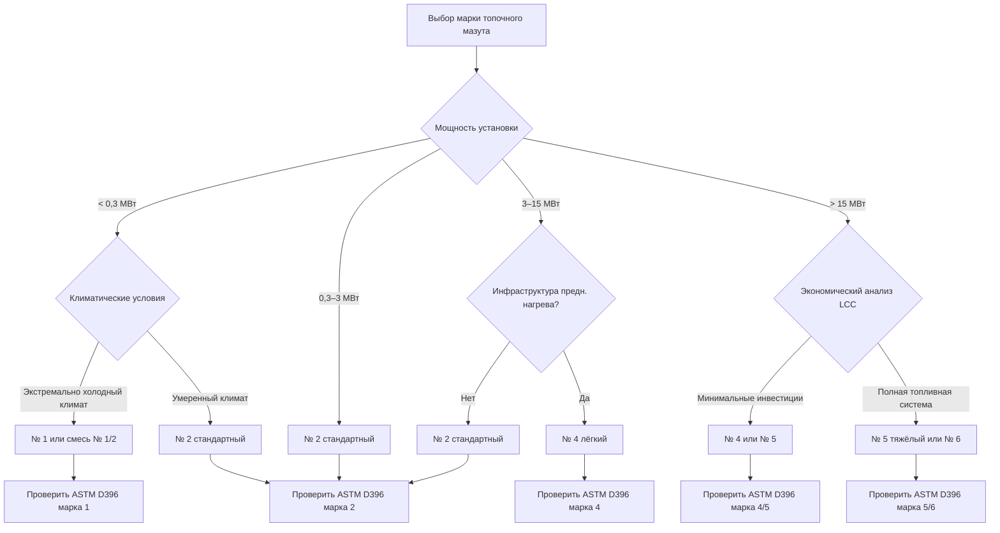

Стандарт ASTM D396 «Standard Specification for Fuel Oils» определяет шесть марок топочного мазута, классифицированных по вязкости, характеристикам дистилляции и области применения. Номер марки прямо коррелирует с вязкостью и плотностью энергии. Марки № 1 и № 2 — дистиллятные топлива; марки № 4–6 — остаточные или смешанные топлива, требующие всё более сложной инфраструктуры.

---

## Система классификации ASTM D396

Марки № 1 и № 2 образуются при атмосферной дистилляции нефти как средние фракции. Они легко испаряются и требуют минимального предварительного нагрева. Марки № 4–6 — остатки после извлечения дистиллятов; их переработка требует предварительного нагрева и специализированных горелочных систем.


| Марка | Вязкость при 37,8 °C, мм²/с | Удельный вес | HHV, кДж/л | Температура вспышки, °C | Температура застывания, °C |
|---|---|---|---|---|---|
| № 1 | 1,4–1,7 | 0,825–0,850 | 37 300 | 38–72 | −40...0 |
| № 2 | 1,7–2,5 | 0,850–0,880 | 38 700 | 52–96 | −15...−6 |
| № 4 лёгкий | 5,6–24,0 | 0,880–0,930 | 40 600 | 54–116 | −7 |
| № 4 тяжёлый | 24,0–60,0 | 0,930–0,970 | 41 400 | 54–116 | −7 |
| № 5 лёгкий | 42–118 | 0,950–0,980 | 42 200 | 71–121 | +10...+30 |
| № 5 тяжёлый | 118–338 | 0,960–1,000 | 42 900 | 71–121 | +15...+40 |
| № 6 | 640–4 600 | 0,970–1,050 | 43 400 | 60–132 | +24...+50 |


---

## Характеристики каждой марки

### Топочный мазут № 1 (керосин, kerosene)

Наименьшая вязкость и наилучшие характеристики холодного запуска. Температура застывания ниже −40 °C. Применяется в:
- Жилых обогревателях с испарительными горелками.
- Переносном отопительном оборудовании.
- Системах аэропортов и объектов в экстремально холодном климате.

Не требует предварительного нагрева. Содержание серы обычно ≤ 0,04 %. Теплотворная способность (HHV ≈ 37 300 кДж/л) несколько ниже, чем у № 2 из-за меньшей плотности.

### Топочный мазут № 2 (heating oil No. 2)

Наиболее распространённое топливо для жилых и лёгких коммерческих систем HVAC. Оптимален по совокупности: удельная энергия, стоимость, безопасность обращения. Применяется в:
- Жилых котлах и печах на мазуте.
- Коммерческих системах теплоснабжения до ≈ 3 МВт.
- Промышленном отоплении помещений.

Стандартные горелки с механическим распылением (pressure atomizing burners) работают без предварительного нагрева при температуре воздуха выше −6 °C. При более низких температурах — электрические кабели обогрева топливопровода.

### Топочный мазут № 4

Переходная марка: смесь дистиллятного (№ 2) и остаточного компонентов. Существует в двух подвидах: лёгкий (преимущественно дистиллят) и тяжёлый (преимущественно остаток). Требования:
- Предварительный нагрев до 38–54 °C для достижения рабочей вязкости.
- Специализированные форсунки для топлива с более высокой вязкостью.
- Нагрев резервуара в холодном климате.
- Применение в коммерческих и промышленных котлах от 1 до 15 МВт.

### Топочные мазуты № 5 и № 6 (остаточные масла)

Тяжёлые остаточные топлива для крупных промышленных установок, электростанций и морских судов. Требования растут с номером марки:

**№ 5 (лёгкий и тяжёлый):**
- Предварительный нагрев до 66–104 °C для прокачки и распыления.
- Паровые или электрические нагревательные змеевики в резервуаре.
- Теплоизолированные трубопроводы с тепловой трассировкой.

**№ 6 (Bunker C):**
- Предварительный нагрев до минимум 82–121 °C для распыления.
- Нагрев резервуара до 49–66 °C постоянно.
- Центробежная очистка для удаления воды и осадков.
- Многоступенчатая система обработки топлива.
- Применение: крупные промышленные котлы, ТЭС, морской флот.

---

## Алгоритм выбора марки

---

## Содержание серы и нормативные тенденции

Содержание серы существенно различается по маркам и определяет выбросы SO₂, коррозионность и совместимость с современным оборудованием:

- **ULSHO** (ultra-low sulfur heating oil) — ≤ 15 мг/кг серы — стандарт для жилых марок № 1 и № 2 в большинстве регионов США и Европы. Выбросы SO₂ снижаются на 99 % по сравнению с историческим топливом (2 000–5 000 мг/кг).
- **Марки № 5 и № 6** исторически содержали 1–3 % серы по массе. Экологические нормативы EPA и региональные программы по качеству воздуха всё активнее ограничивают применение этих марок.
- **Содержание золы** растёт с номером марки: № 1 — практически ноль, № 6 — до 0,10 %, что требует периодической чистки трубок котла.
- **Коксовый остаток** коррелирует с риском неполного сгорания: дистилляты — < 0,15 %, № 6 — может превышать 15 %, что требует высокотемпературных атомизирующих горелок.

---

## Числовой пример: сравнение стоимости тепла для марок № 2 и № 4

**Условие.** Промышленный объект потребляет 500 000 л топлива в год. Цена мазута № 2 — 0,95 $/л; цена мазута № 4 — 0,72 $/л. КПД котла на мазуте № 2 = 85 %; КПД котла на мазуте № 4 = 82 %. HHV: № 2 — 38,7 МДж/л; № 4 — 40,6 МДж/л. Дополнительные капитальные затраты на систему предварительного нагрева для мазута № 4 — $800 000; срок службы системы — 15 лет.

**Решение.**

Стоимость единицы полезного тепла для каждой марки:


C_{\text{тепла, №2}} = \frac{\text{Цена топлива}}{HHV \times \eta} = \frac{0{,}95 \; \$/\text{л}}{38{,}7 \; \text{МДж/л} \times 0{,}85} = \frac{0{,}95}{32{,}9} = 0{,}0289 \; \$/\text{МДж}



C_{\text{тепла, №4}} = \frac{0{,}72}{40{,}6 \times 0{,}82} = \frac{0{,}72}{33{,}3} = 0{,}0216 \; \$/\text{МДж}


Годовое полезное тепло (на базе мазута № 2):


Q_{\text{год}} = 500\,000 \; \text{л} \times 38{,}7 \; \text{МДж/л} \times 0{,}85 = 1{,}644 \times 10^7 \; \text{МДж}


Годовая экономия при переходе на мазут № 4:


\Delta C_{\text{год}} = Q_{\text{год}} \times (C_{\text{тепла, №2}} - C_{\text{тепла, №4}}) = 1{,}644 \times 10^7 \times (0{,}0289 - 0{,}0216) = 120\,000 \; \$/\text{год}


Простой срок окупаемости дополнительных капиталовложений:


SPP = \frac{800\,000}{120\,000} \approx 6{,}7 \; \text{лет}


За срок службы 15 лет суммарная экономия составит $1 800 000 при затратах $800 000 — решение экономически оправдано.

---

## Хранение и обращение

**Дистиллятные топлива (№ 1 и № 2)** хранятся в неотапливаемых стальных, стеклопластиковых или полиэтиленовых резервуарах. Срок стабильного хранения — 12–18 месяцев при условии отсутствия воды и микробного загрязнения.

**Остаточные топлива (№ 4–6)** требуют отапливаемого хранения. Рекомендуемые температуры:
- № 4: нагрев только в холодный период, до 24–29 °C.
- № 5: постоянный нагрев до 38–60 °C.
- № 6: постоянный нагрев до 49–66 °C в резервуаре; 82–121 °C перед форсункой.

**Разделение воды:** дистилляты разделяют воду отстаиванием или фильтрацией; остаточные топлива — только центробежной очисткой.

---

## Эксплуатационные интервалы обслуживания

- **Мазут № 2:** полное ежегодное техническое обслуживание горелки.
- **Мазут № 4:** ежеквартальная чистка компонентов горелки, проверка температур предварительного нагрева.
- **Мазут № 6:** ежемесячный цикл осмотра и чистки; ежедневный контроль температур хранения.

---

## Нормативная база

- **ASTM D396** — Standard Specification for Fuel Oils
- **ASTM D93** — температура вспышки (Пенски-Мартенс)
- **ASTM D97** — температура застывания
- **ASTM D445** — кинематическая вязкость
- **NFPA 31** — Standard for the Installation of Oil-Burning Equipment
- **ASHRAE 90.1** — Energy Standard for Buildings
- **ISO 50001** — системы энергетического менеджмента
- **EN 16247** — энергетические аудиты
- **СП 60.13330.2020** — отопление, вентиляция и кондиционирование воздуха
- **ФЗ-261** — об энергосбережении и о повышении энергетической эффективности
