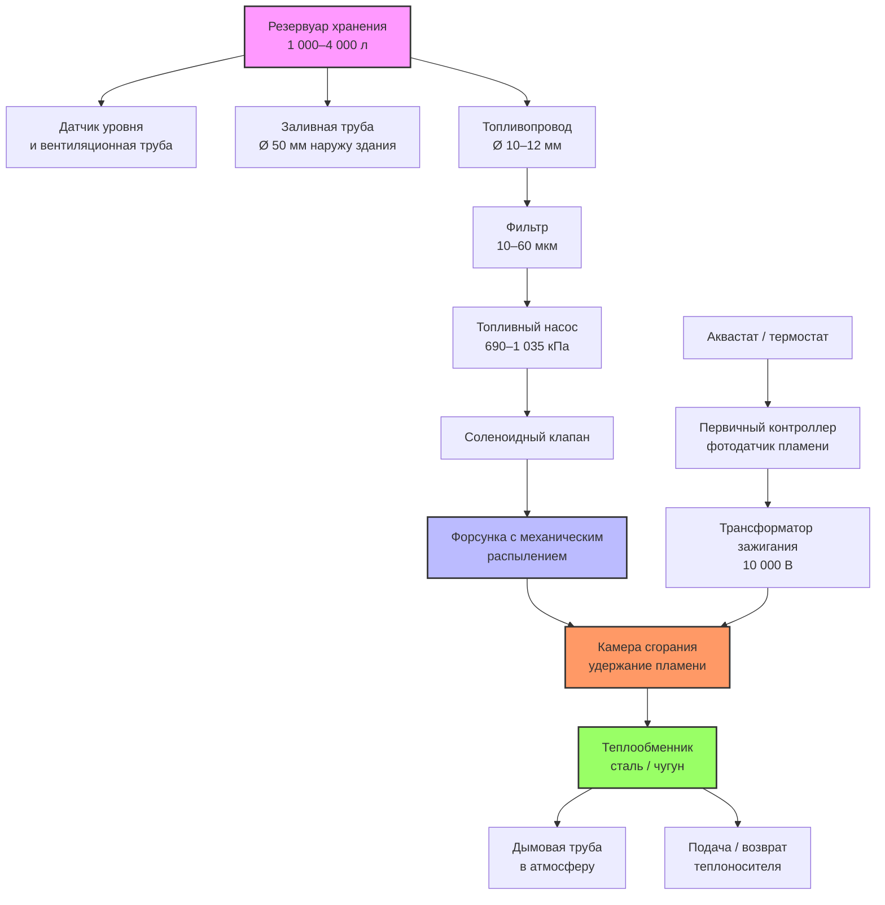

Мазут № 2 — наиболее распространённое жидкое топливо для жилых и лёгких коммерческих систем HVAC в регионах без доступа к природному газу. Среднедистиллятный нефтепродукт (фракция C₁₄–C₂₀) обеспечивает оптимальный баланс энергетической плотности, вязкости и характеристик безопасности, обеспечивающий надёжную работу котлов и печей на протяжении всего отопительного сезона.

---

## Спецификации ASTM D396


| Свойство | Спецификация | Метод испытания |
|---|---|---|
| Температура вспышки | ≥ 38 °C | ASTM D93 |
| Температура застывания | ≤ −6 °C | ASTM D97 |
| Вязкость при 40 °C | 1,9–3,0 мм²/с | ASTM D445 |
| Содержание серы (ULSHO) | ≤ 15 мг/кг | ASTM D5453 |
| Дистилляция 90 % | ≤ 338 °C | ASTM D86 |
| Коксовый остаток | ≤ 0,35 % масс. | ASTM D524 |
| Зола | ≤ 0,01 % масс. | ASTM D482 |
| Вода и осадок | ≤ 0,05 % об. | ASTM D2709 |
| Коррозия медной пластины | ≤ № 3 | ASTM D130 |
| Цетановое число | ≥ 40 | ASTM D613 |


---

## Физические свойства

**Теплотворная способность.** HHV мазута № 2 составляет 38,5–39,0 МДж/л (типичное значение — 38,7 МДж/л). LHV — около 36,2–36,5 МДж/л с учётом скрытой теплоты водяного пара в дымовых газах. Конденсационные котлы утилизируют эту скрытую теплоту, переходя на расчёт по LHV и достигая КПД выше 100 % по LHV.

**Плотность.** При 15,6 °C: 845–875 кг/м³ (удельный вес 0,845–0,875). Знание плотности необходимо для перевода между массовыми и объёмными расходами.

**Вязкость.** 1,9–3,0 мм²/с при 40 °C обеспечивает устойчивое распыление в форсунках с механическим распылением (давление насоса 690–1 035 кПа) без предварительного нагрева при температуре наружного воздуха выше −6 °C.

**ULSHO.** Ультранизкосернистый топочный мазут (≤ 15 мг/кг серы) снижает выбросы SO₂ на 99,7 % по сравнению с традиционным мазутом (≤ 5 000 мг/кг), устраняет сернистую коррозию теплообменников и продлевает срок их службы.

---

## Стехиометрия горения

Полное горение мазута № 2 (эмпирическая формула C₁₂H₂₃):


C_{12}H_{23} + 17{,}75\,O_2 \rightarrow 12\,CO_2 + 11{,}5\,H_2O


**Теоретический расход воздуха (стехиометрический):**


L_0 = \frac{17{,}75 \times M_{O_2}}{0{,}21 \times M_{\text{топл}}} \times \frac{M_{\text{воздух}}}{M_{O_2}} = \frac{17{,}75 \times 32}{0{,}21 \times 171{,}3} \times \frac{28{,}97}{32} \approx 14{,}1 \; \text{кг возд./кг топл.}


(Для дистиллятов принято $L_0 \approx 13{,}7$–14,1 кг воздуха / кг топлива.)

**Горение с избытком воздуха:**


\dot{m}_{\text{возд}} = L_0 \times (1 + \alpha) \times \dot{m}_{\text{топл}}


где $\alpha$ — коэффициент избытка воздуха (обычно 0,25–0,50 для жилых горелок).

**КПД горения:**


\eta_{\text{сгор}} = 1 - \frac{\dot{Q}_{\text{уход}} + \dot{Q}_{\text{кор}} + \dot{Q}_{\text{неполн}}}{\dot{Q}_{\text{вход}}}


Потери с уходящими газами (доминирующий фактор):


\dot{Q}_{\text{уход}} = \dot{m}_{\text{дым}} \times c_p \times (T_{\text{дым}} - T_{\text{нар}})


Современные жилые горелки в установившемся режиме достигают η_горения = 80–87 %. Конденсационные котлы охлаждают дымовые газы ниже точки росы (≈ 55 °C) и утилизируют скрытую теплоту — их η_горения по HHV составляет 90–95 %.

---

## Схема системы масляного отопления

---

## Хранение

**Типы резервуаров.**
- Наземные: стальные (сертификат UL-142 для внутреннего размещения) или стеклопластиковые (FRP).
- Подземные (UST): двустенные с межстенным мониторингом; катодная защита или диэлектрическое покрытие обязательны.
- Жилые наземные баки: 1 000–4 000 л; коммерческие: 4 000–75 000 л.

**Размещение резервуара:**
- Расстояние от источников тепла и открытого огня — не менее 1,5 м.
- Расстояние заливного отверстия до резервуара — не более 1,8 м.
- Ровное основание, выдерживающее вес заполненного бака (> 3 500 кг для бака 4 000 л).

**Вентиляция и заполнение:**
- Заливная труба Ø ≥ 50 мм, выход наружу здания.
- Вентиляционная труба Ø ≥ 32 мм; конец не менее чем в 600 мм от проёмов.

---

## Числовой пример: настройка горелки и расчёт КПД

**Условие.** Жилой котёл на мазуте № 2, номинальная тепловая мощность 30 кВт (по HHV). Анализ дымовых газов показывает: CO₂ = 8 %, T_дым = 280 °C, T_нар = 15 °C. Масса дымовых газов $\dot{m}_{\text{дым}} = 0{,}065$ кг/с при сжигании 0,00125 кг топлива/с. Теплоёмкость дымовых газов $c_p = 1{,}05$ кДж/(кг·К). Определить КПД горения и дать рекомендации.

**Решение.**

Тепловая мощность входа:


\dot{Q}_{\text{вход}} = \dot{m}_{\text{топл}} \times HHV = 0{,}00125 \; \text{кг/с} \times 45{,}5 \; \text{МДж/кг} = 56{,}9 \; \text{кВт}


Потери с уходящими газами:


\dot{Q}_{\text{уход}} = 0{,}065 \times 1{,}05 \times (280 - 15) = 0{,}065 \times 1{,}05 \times 265 = 18{,}1 \; \text{кВт}


КПД горения:


\eta_{\text{сгор}} = 1 - \frac{18{,}1}{56{,}9} = 1 - 0{,}318 = 68{,}2 \; \%


Вывод: КПД значительно ниже нормы. Причина — высокая температура дымовых газов (280 °C при норме ≤ 260 °C) и низкое CO₂ (8 % при оптимуме 10–12 %) — признак чрезмерного избытка воздуха. Рекомендации:
- Уменьшить избыток воздуха до CO₂ = 10–12 % (O₂ = 3–6 %).
- Проверить форсунку и угол распыла.
- Очистить теплообменник от сажи — каждый 1,6 мм нагара повышает T_дым на 10–15 °C и снижает η на 3–5 %.

После регулировки ожидаемый КПД: 82–87 % (неконденсационный котёл).

---

## Годовая эффективность AFUE


AFUE = \frac{E_{\text{выход, год}}}{E_{\text{вход, год}}} \times 100 \; \%


Ориентиры:
- Старые неконденсационные котлы (< 1990 г.): AFUE 60–70 %.
- Современные неконденсационные: AFUE 82–86 %.
- Конденсационные котлы: AFUE 90–95 %.

Замена котла с AFUE 65 % на конденсационный с AFUE 92 % сокращает расход топлива на 29 %.

---

## Целевые параметры анализа дымовых газов


| Параметр | Оптимум | Предельное значение | Причина отклонения |
|---|---|---|---|
| CO₂ | 10–12 % | < 8 % (избыток возд.) | Несоответствие воздух/топливо |
| O₂ | 3–6 % | > 8 % | Подсос воздуха или перенастройка |
| CO | < 100 мг/кг | > 400 мг/кг | Неполное горение |
| Сажа (шкала Бахараха) | 0–1 | > 2 | Обогащение смеси, засорение форс. |
| T дымовых газов | < 260 °C | > 280 °C | Загрязнение т/о, неправильный форсун. |


---

## Экологические аспекты

**Профиль выбросов ULSHO:**
- SO₂: практически нулевой при ≤ 15 мг/кг серы.
- NO$_x$: 40–100 мг/кг в зависимости от конструкции горелки.
- PM: снижаются при правильном распылении и регулировке воздуха.

**Смеси Bioheat (B5–B20).** ASTM D396, Appendix X1 допускает смеси до B20 (20 % биодизеля). Свойства холодной текучести B20 могут ухудшиться при температурах ниже −5 °C — необходима проверка температуры помутнения смеси. Хранение B20 — не более 3–6 месяцев из-за биодеградации.

---

## Нормативная база

- **ASTM D396** — Standard Specification for Fuel Oils
- **NFPA 31** — Standard for the Installation of Oil-Burning Equipment
- **ASHRAE 90.1** — Energy Standard for Buildings
- **ISO 50001** — системы энергетического менеджмента
- **EN 16247** — энергетические аудиты
- **EN 14825** — испытание тепловых насосов (для сравнительного анализа)
- **СП 60.13330.2020** — отопление, вентиляция и кондиционирование воздуха
- **СП 50.13330.2012** — тепловая защита зданий
- **ФЗ-261** — об энергосбережении и о повышении энергетической эффективности
