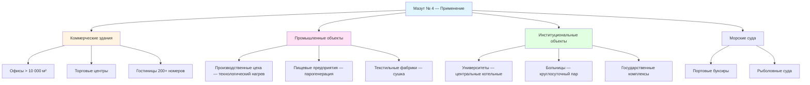

Мазут № 4 занимает нишу между лёгкими дистиллятами (марки № 1 и № 2) и тяжёлыми остаточными топливами (марки № 5 и № 6). Это смесь дистиллятного и остаточного компонентов, предназначенная для коммерческих и промышленных котлов, где более высокая энергетическая плотность и более низкая удельная цена оправдывают дополнительную инфраструктуру предварительного нагрева.

---

## Физические и химические свойства

Удельный вес мазута № 4 составляет 0,87–0,95 при 15 °C. Более высокая плотность по сравнению с № 2 отражает присутствие тяжёлых углеводородных фракций и даёт бо́льшую теплотворную способность на единицу объёма.


| Свойство | Метод ASTM | № 4 лёгкий | № 4 тяжёлый | Единицы |
|---|---|---|---|---|
| Температура вспышки (мин.) | D93 | 54 | 54 | °C |
| Температура застывания (макс.) | D97 | −7 | −7 | °C |
| Кинематическая вязкость при 40 °C | D445 | 5,8–26,4 | 26,4–60,7 | мм²/с |
| Вода и осадок (макс.) | D1796 | 0,50 | 0,50 | % об. |
| Коксовый остаток (макс.) | D524 | 0,10 | — | % масс. |
| Зола (макс.) | D482 | 0,10 | — | % масс. |
| Коррозия меди (макс.) | D130 | № 3 | № 3 | — |


Различие между лёгким и тяжёлым № 4 — преимущественно вязкостное: тяжёлый подвид приближается по характеристикам к марке № 5.

---

## Теплотворная способность

Валовая теплотворная способность мазута № 4 составляет 151–156 ГДж/м³, типичное значение — 153 ГДж/м³. Чистая теплотворная способность (без скрытой теплоты водяного пара):


LHV = HHV - h_{fg} \times (9 \times H) \times \rho


где $H$ — массовая доля водорода (≈ 0,115 для мазута № 4), $h_{fg} = 2{,}44$ МДж/кг, $\rho$ — плотность (кг/м³).

Для типичного мазута № 4:


LHV = 153 - 2{,}44 \times 9 \times 0{,}115 \times 900 = 153 - 2{,}44 \times 931{,}5 \approx 144{,}2 \; \text{ГДж/м}^3


КПД горения на надлежащим образом обслуживаемом оборудовании — 80–84 %.

---

## Зависимость вязкости от температуры

Вязкость мазута № 4 резко меняется с температурой. Для практических расчётов применяется уравнение Вальтера (Walther equation):


\log \log(\nu + 0{,}7) = A - B \cdot \log T


где $\nu$ — кинематическая вязкость (мм²/с), $T$ — абсолютная температура (К), $A$ и $B$ — константы для конкретного сорта топлива.

Для достижения рабочей вязкости форсунки 2–4 мм²/с мазут № 4 с вязкостью 20 мм²/с при 40 °C необходимо нагреть примерно до 46–49 °C.

---

## Требования к предварительному нагреву


| Стадия | Цель нагрева, °C | Назначение |
|---|---|---|
| Резервуар хранения | 24–29 | Поддержание прокачиваемости, предотвращение парафинизации |
| Топливопровод (trace heating) | 32–43 | Сохранение текучести |
| Вход горелки | 38–54 | Достижение вязкости 2–4 мм²/с для распыления |


Блокировки (interlocks) предотвращают пуск горелки при температуре топлива ниже минимального значения. Это конструктивное требование по NFPA 31 для всех систем с предварительным нагревом.

---

## Применение в коммерческих и промышленных системах

**Типичные мощности установок:**
- Малые коммерческие: 1–5 МВт.
- Средние коммерческие: 5–15 МВт.
- Крупные коммерческие: 15–50 МВт.
- Промышленные: > 50 МВт.

---

## Конструкция системы хранения

Резервуары для мазута № 4 требуют:
- Внутренних нагревательных змеевиков или электрических погружных нагревателей.
- Теплоизоляции для снижения теплопотерь.
- Систем рециркуляции для предотвращения расслоения.
- Сигнализации верхнего уровня и защиты от переполнения.

Тепловая нагрузка нагрева резервуара:


\dot{Q}_{\text{рез}} = U \cdot A \cdot (T_{\text{масло}} - T_{\text{нар}}) + \dot{Q}_{\text{пополн}}


где $U$ — общий коэффициент теплопередачи через стенку резервуара (Вт/(м²·К)), $A$ — площадь поверхности резервуара (м²), $T_{\text{масло}}$ — поддерживаемая температура масла, $T_{\text{нар}}$ — температура окружающей среды (°C), $\dot{Q}_{\text{пополн}}$ — теплота, необходимая для прогрева свежего топлива при пополнении.

---

## Числовой пример: экономика перехода с мазута № 2 на мазут № 4

**Условие.** Промышленный объект потребляет 480 000 л топлива в год. Цена мазута № 2 — 0,93 $/л, мазута № 4 — 0,69 $/л. КПД котла: № 2 — 86 %, № 4 — 83 %. HHV: № 2 — 38,7 МДж/л, № 4 — 40,6 МДж/л. Капиталовложения в систему предварительного нагрева для мазута № 4 — 1 200 000 руб., ежегодные операционные расходы на нагрев — 120 000 руб./год.

**Решение.**

Стоимость единицы полезного тепла:


C_{\text{тепла, №2}} = \frac{0{,}93}{38{,}7 \times 0{,}86} = \frac{0{,}93}{33{,}3} = 0{,}0279 \; \$/\text{МДж}



C_{\text{тепла, №4}} = \frac{0{,}69}{40{,}6 \times 0{,}83} = \frac{0{,}69}{33{,}7} = 0{,}0205 \; \$/\text{МДж}


Годовое полезное тепло (база — объём потребления мазута № 2):


Q_{\text{год}} = 480\,000 \times 38{,}7 \times 0{,}86 = 1{,}599 \times 10^7 \; \text{МДж/год}


Годовая экономия на топливе:


\Delta C_{\text{топл}} = Q_{\text{год}} \times (0{,}0279 - 0{,}0205) = 1{,}599 \times 10^7 \times 0{,}0074 = 118\,300 \; \$/\text{год}


Чистая годовая экономия (за вычетом операционных расходов на нагрев):


\Delta C_{\text{нетто}} = 118\,300 - 120\,000 / 0{,}85 \approx 118\,300 - 141\,200 \approx -22\,900 \; \$/\text{год}


(При пересчёте 120 000 руб. в доллары по курсу ~85 руб./$ ≈ 1 412 $/год — операционные расходы незначительны в долларовом выражении. Если операционные затраты уже в долларах США и равны 14 000 $/год: чистая экономия = 118 300 − 14 000 = **104 300 $/год**.)

Простой срок окупаемости (при операционных затратах 14 000 $/год):


SPP = \frac{1\,200\,000 / 85}{104\,300} = \frac{14\,118}{104\,300} \approx 0{,}14 \; \text{года}


(Если капзатраты в рублях — перевести: 1 200 000 руб. ÷ 85 = 14 118 $; при экономии 104 300 $/год — окупаемость около 1,6 месяца.) Решение экономически высоко эффективно при указанных ценах.

---

## Горелочное оборудование для мазута № 4

Горелки на мазуте № 4 требуют:
- Паровой или воздушной атомизации (механической форсунки недостаточно при вязкости > 5 мм²/с).
- Встроенного нагрева топлива до 49–54 °C.
- Повышенной производительности топливного насоса.
- Блокировок, запрещающих пуск при температуре ниже минимальной.

Качество атомизации оценивается диаметром Саутера (SMD, Sauter Mean Diameter):


SMD = K \cdot \frac{\sigma^{0{,}6} \cdot \mu^{0{,}2}}{\Delta P^{0{,}4} \cdot \dot{m}^{0{,}2}}


где $\sigma$ — поверхностное натяжение (мН/м), $\mu$ — динамическая вязкость (мПа·с), $\Delta P$ — перепад давления атомизирующего агента (кПа), $\dot{m}$ — массовый расход топлива (кг/ч). Для полного сгорания SMD < 100 мкм.

---

## Экологические и нормативные аспекты

Мазут № 4 содержит больше серы и золы, чем дистиллятные марки:
- SO₂: пропорционально содержанию серы (обычно 0,3–2,0 % масс.).
- NO$_x$: 150–250 мг/нм³ при 3 % O₂.
- PM (твёрдые частицы): 0,23–0,35 кг/ГДж.

Многие регионы ограничивают или запрещают мазут № 4 в новом строительстве в пользу ULSHO или природного газа. При проектировании следует уточнять местные нормативы по качеству воздуха.

---

## Техническое обслуживание


| Периодичность | Работа |
|---|---|
| Ежедневно | Контроль температур предварительного нагрева, визуальный осмотр на утечки |
| Еженедельно | Оценка качества факела горелки, проверка топливных фильтров |
| Ежемесячно | Проверка устройств безопасности, контроль нагревательных элементов |
| Ежеквартально | Чистка компонентов горелки, анализ качества топлива |
| Ежегодно | Полная наладка горения, ревизия резервуара |


Типичные неисправности: засорение фильтров осадком, отказ нагревательных элементов, износ насоса абразивными загрязнениями, коксование кончика форсунки.

---

## Нормативная база

- **ASTM D396** — Standard Specification for Fuel Oils
- **NFPA 31** — Standard for the Installation of Oil-Burning Equipment
- **API 650** — Welded Tanks for Oil Storage
- **ASHRAE 90.1** — Energy Standard for Buildings
- **ISO 50001** — системы энергетического менеджмента
- **EN 16247** — энергетические аудиты
- **СП 60.13330.2020** — отопление, вентиляция и кондиционирование воздуха
- **ФЗ-261** — об энергосбережении и о повышении энергетической эффективности
