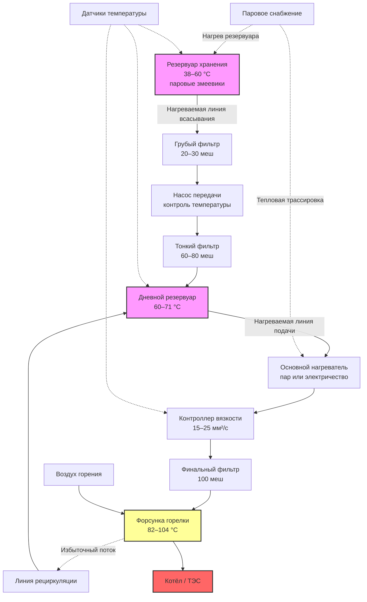

Мазут № 6 (также известный как Bunker C или остаточное топливо) — самая тяжёлая коммерческая марка, остающаяся после извлечения всех более лёгких фракций при переработке нефти. Высокая вязкость требует обширной инфраструктуры предварительного нагрева, что делает этот мазут пригодным только для крупных промышленных объектов и электростанций, где экономия масштаба оправдывает затраты на систему обработки топлива.

---

## Физические и химические свойства

### Спецификация ASTM D396


| Свойство | Спецификация | Метод испытания |
|---|---|---|
| Температура вспышки | ≥ 60 °C | ASTM D93 |
| Температура застывания | ≤ 24 °C | ASTM D97 |
| Вода и осадок | ≤ 1,0 % об. | ASTM D2709 |
| Коксовый остаток | ≤ 15 % масс. | ASTM D524 |
| Зола | ≤ 0,10 % масс. | ASTM D482 |
| Кинематическая вязкость при 50 °C | 42–162 мм²/с | ASTM D445 |
| Кинематическая вязкость при 100 °C | 5,5–26,4 мм²/с | ASTM D445 |


### Теплотворная способность и плотность


| Параметр | Диапазон | Единицы |
|---|---|---|
| HHV (высшая теплота сгорания) | 43,6–44,3 | МДж/л |
| LHV (низшая теплота сгорания) | 41,7–42,6 | МДж/л |
| Плотность при 15 °C | 980–1 020 | кг/м³ |
| Плотность API | 7–15 | ° |


Высокая плотность энергии (~43,9 МДж/л) превосходит мазут № 2 (38,7 МДж/л) на 13 %, что является основным экономическим стимулом при большом объёме потребления.

---

## Зависимость вязкости от температуры

Вязкость мазута № 6 меняется на несколько порядков в рабочем диапазоне температур. Зависимость описывается уравнением Вальтера:


\log \log(\nu + 0{,}7) = A - B \cdot \log T


где $\nu$ — кинематическая вязкость (мм²/с), $T$ — абсолютная температура (К), $A$ и $B$ — эмпирические константы для конкретного образца топлива.


| Режим | Целевая вязкость | Требуемая температура |
|---|---|---|
| Хранение (прокачиваемость) | 750–2 000 мм²/с | 38–60 °C |
| Перекачка по трубопроводу | 200–400 мм²/с | 60–82 °C |
| Атомизация в форсунке | 15–25 мм²/с | 82–104 °C |


Режим потока в трубопроводах горения контролируется числом Рейнольдса:


Re = \frac{v \cdot D}{\nu}


где $v$ — скорость потока (м/с), $D$ — диаметр трубы (м), $\nu$ — кинематическая вязкость (м²/с). При $Re < 2 300$ — ламинарный режим; при $Re > 4 000$ — турбулентный. Трубопроводы мазута № 6 обычно работают в ламинарном или переходном режиме при рабочих вязкостях.

---

## Система предварительного нагрева

### Нагрев резервуара

Резервуары хранения мазута № 6 требуют непрерывного нагрева. Тепловые потери резервуара:


\dot{Q}_{\text{пот}} = U \cdot A \cdot (T_{\text{рез}} - T_{\text{нар}})


Для изолированного наружного резервуара (изоляция 100 мм, пенополиуретан): $U \approx 0{,}45$–0,85 Вт/(м²·К). При резервуаре объёмом 500 м³ (диаметр 8 м, высота 10 м), $A \approx 452$ м², $T_{\text{рез}} = 55$ °C, $T_{\text{нар}} = -20$ °C:


\dot{Q}_{\text{пот}} = 0{,}6 \times 452 \times (55 - (-20)) = 0{,}6 \times 452 \times 75 = 20\,340 \; \text{Вт} \approx 20{,}3 \; \text{кВт}


### Нагрев топлива до температуры форсунки

Мощность нагревателя для подачи топлива к горелке:


\dot{Q}_{\text{нагр}} = \dot{m} \cdot c_p \cdot (T_{\text{форс}} - T_{\text{рез}})


Для котла мощностью 10 МВт с КПД 83 %, расход топлива:


\dot{m} = \frac{10\,000 \; \text{кВт}}{0{,}83 \times 42{,}2 \; \text{МДж/л} \times 1\,000 \; \text{кДж/МДж}} = \frac{10\,000}{35\,026} = 0{,}285 \; \text{л/с} = 1{,}026 \; \text{м}^3/\text{ч}


Масса: $\dot{m}_{\text{масс}} = 0{,}285 \times 1\,000 = 285$ кг/ч (при плотности ≈ 1 000 кг/м³). Мощность нагревателя для подъёма с 55 °C (резервуар) до 95 °C (форсунка) при $c_p = 1{,}9$ кДж/(кг·К):


\dot{Q}_{\text{нагр}} = \frac{285}{3\,600} \times 1{,}9 \times (95 - 55) = 0{,}0792 \times 1{,}9 \times 40 = 6{,}02 \; \text{кВт}


---

## Архитектура полной топливной системы

---

## Характеристики горения

### Требования к соотношению воздух/топливо

Теоретический расход воздуха (стехиометрический) для типичного мазута № 6 (85 % C, 11 % H, 3 % S):


L_0 = 11{,}5 \cdot \frac{\%C}{12} + 34{,}3 \cdot \frac{\%H}{1} + 4{,}3 \cdot \frac{\%S}{32}



L_0 = 11{,}5 \times \frac{85}{12} + 34{,}3 \times \frac{11}{1} + 4{,}3 \times \frac{3}{32} = 81{,}46 + 377{,}3 + 0{,}40 \approx 459 \; \text{кг возд./100 кг топл.}


Практический коэффициент избытка воздуха для мазута № 6: 15–25 % (α = 0,15–0,25). Это обусловлено необходимостью полного сгорания крупных капель при атомизации тяжёлого топлива.

### Выбросы SO₂

Выбросы диоксида серы прямо пропорциональны содержанию серы:


\dot{m}_{SO_2} = 8{,}83 \times \%S \times \dot{m}_{\text{топл}}


Для мазута № 6 с 2 % серы и расходом 285 кг/ч:


\dot{m}_{SO_2} = 8{,}83 \times 0{,}02 \times 285 = 50{,}3 \; \text{кг/ч}


Это 1 207 кг/сут SO₂. Для соответствия нормативам EPA требуется либо применение низкосернистого мазута № 6 (< 1 % S), либо газоочистка с известковым скруббером, снижающим выбросы SO₂ на 90–95 %.

---

## Применение и требования к объектам

### Крупные промышленные котлы

Объекты с непрерывным спросом на пар более 50 т/ч: целлюлозно-бумажные комбинаты, предприятия химической переработки, нефтеперерабатывающие заводы. Эти объекты могут экономически обосновать капиталовложения в систему обработки мазута № 6.

### Электростанции

Мазут № 6 применяется для базовой генерации в регионах с ограниченным доступом к природному газу, а также как резервное топливо двухтопливных установок (уголь + мазут, газ + мазут).

### Морские суда

Топливо Bunker C — стандартное судовое топливо для крупных грузовых судов. Требования IMO 2020 ограничивают серу в морском топливе до 0,5 % масс. глобально и до 0,1 % масс. в зонах контроля выбросов (ECA).

---

## Экономический анализ

Цена мазута № 6 обычно на 40–60 % ниже, чем мазута № 2 в пересчёте на литр, однако разница в теплотворной способности (43,9 vs 38,7 МДж/л) и потребность в инфраструктуре нагрева частично нивелируют это преимущество.


| Фактор | Требование |
|---|---|
| Годовое потребление | > 2 000 000 л/год |
| Капиталовложения в систему | 500 000–2 000 000 $ |
| Доступность природного газа | Прямая конкуренция |
| Экологические разрешения | Контроль SO$_x$ и PM |
| Обслуживающий персонал | Квалифицированные операторы |


---

## Числовой пример: сравнение стоимости тепла

**Условие.** ТЭС потребляет 3 000 000 л/год. Цена мазута № 6 — 0,55 $/л; цена мазута № 2 — 0,95 $/л. КПД котла: № 6 — 83 %, № 2 — 86 %. Определить годовую экономию на топливе.

**Решение.**


C_{\text{тепла, №6}} = \frac{0{,}55}{43{,}9 \times 0{,}83} = \frac{0{,}55}{36{,}4} = 0{,}01511 \; \$/\text{МДж}



C_{\text{тепла, №2}} = \frac{0{,}95}{38{,}7 \times 0{,}86} = \frac{0{,}95}{33{,}3} = 0{,}02853 \; \$/\text{МДж}


Годовое полезное тепло (на базе мазута № 6):


Q_{\text{год}} = 3\,000\,000 \times 43{,}9 \times 0{,}83 = 1{,}093 \times 10^8 \; \text{МДж/год}


Годовая экономия:


\Delta C_{\text{год}} = Q_{\text{год}} \times (0{,}02853 - 0{,}01511) = 1{,}093 \times 10^8 \times 0{,}01342 = 1\,467\,000 \; \$/\text{год}


Срок окупаемости системы за $1 500 000: около **1 года**. При сроке службы 20 лет — суммарная экономия превышает $27 млн.

---

## Конверсия на более лёгкое топливо

Многие объекты перешли с мазута № 6 на мазут № 2 или природный газ вследствие:
- Ужесточения экологических нормативов по SO$_x$ и PM.
- Сближения ценового спреда.
- Упрощения эксплуатации и технического обслуживания.

Конверсия требует: замены горелки, демонтажа систем предварительного нагрева, часто — переналадки котла под иное теплонапряжение и профиль пламени.

---

## Хранение: конструктивные требования

- **Нагревательная система**: паровые змеевики мощностью 18–36 Вт/л объёма резервуара или электрические погружные нагреватели.
- **Изоляция**: RSI-1,76 для наружных резервуаров; RSI-0,88 для внутренних.
- **Рециркуляция**: насосы для поддержания однородности температуры.
- **Мониторинг**: множество датчиков температуры для обнаружения стратификации.
- **Датчики уровня**: с температурной компенсацией для учёта изменения плотности.

---

## Системы безопасности

- Максимальная температура нагрева: ≤ 121 °C (предотвращение крекинга и образования газов).
- Сигнализация низкой температуры резервуара.
- Детектирование утечек на нагреваемых трубопроводах.
- Системы пожаротушения класса B (пенообразователь).
- Обвалованное удержание пролива с дренажом в нагреваемый коллектор.

---

## Нормативная база

- **ASTM D396** — Standard Specification for Fuel Oils
- **API 650** — Welded Tanks for Oil Storage
- **API 653** — Tank Inspection, Repair, Alteration, and Reconstruction
- **NFPA 30** — Flammable and Combustible Liquids Code
- **NFPA 31** — Standard for the Installation of Oil-Burning Equipment
- **ASHRAE 90.1** — Energy Standard for Buildings
- **ISO 50001** — системы энергетического менеджмента
- **EN 16247** — энергетические аудиты
- **СП 60.13330.2020** — отопление, вентиляция и кондиционирование воздуха
- **ФЗ-261** — об энергосбережении и о повышении энергетической эффективности
