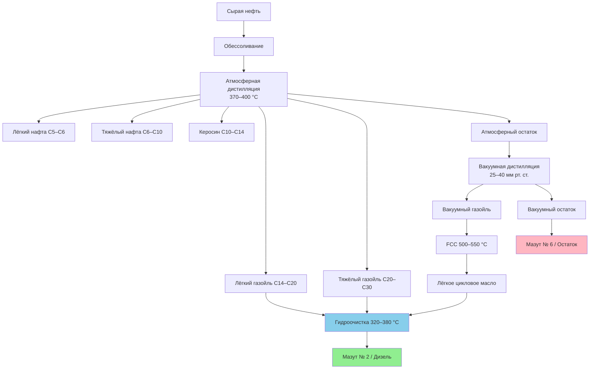

Нефтепереработка (oil refining) преобразует сырую нефть в товарные топлива для отопления посредством физического разделения и химического преобразования. Понимание принципов работы нефтеперерабатывающих заводов необходимо для оценки качества топлива, его доступности и требований к оборудованию HVAC с жидкотопливными горелками.

## Атмосферная дистилляция

Атмосферная дистилляция (atmospheric distillation) является первичным процессом разделения. Сырая нефть нагревается в трубчатой печи до 370–400 °C и поступает в ректификационную колонну (fractional distillation column), где разделяется по диапазонам температур кипения.

Колонна работает при давлении, близком к атмосферному. Углеводородные фракции конденсируются на различных высотах в зависимости от молярной массы и летучести. Мазут и дизельное топливо отбираются в зоне средних дистиллятов при 180–360 °C.

### Объёмный выход фракций


Y_{\text{фр}} = \frac{V_{\text{фр}}}{V_{\text{сырьё}}} \times 100\%


где $Y_{\text{фр}}$ — выход фракции, %; $V_{\text{фр}}$ — объём отобранного дистиллята; $V_{\text{сырьё}}$ — объём переработанной нефти.

Для средних дистиллятов (топлива для отопления):


Y_{\text{мазут}} = \int_{T_1}^{T_2} \frac{dV}{dT}\, dT


где $T_1 = 180\,°C$, $T_2 = 360\,°C$ — границы зоны кипения; $dV/dT$ — наклон кривой дистилляции.

## Вакуумная дистилляция

Тяжёлый остаток атмосферной дистилляции подаётся на вакуумную колонну (vacuum distillation unit), работающую при 25–40 мм рт. ст. абс. Пониженное давление снижает эффективные точки кипения на 40–60 °C, предотвращая термический крекинг тяжёлых молекул. Вакуумные газойли направляются на дальнейший крекинг; вакуумный остаток служит сырьём для мазутов марок № 4 и № 6.

## Каталитический крекинг

Жидкофазный каталитический крекинг (fluid catalytic cracking, FCC) преобразует тяжёлые нефтяные фракции C₂₀–C₄₀ в более лёгкие молекулы C₁₀–C₂₀, пригодные для дистиллятных топлив. Реакция крекинга описывается кинетикой первого порядка:


-\frac{dC_A}{dt} = k \cdot C_A, \qquad k = A \cdot e^{-E_a/(RT)}


где $C_A$ — концентрация тяжёлого сырья; $k$ — температурно-зависимая константа скорости; $E_a$ — энергия активации; $R$ — универсальная газовая постоянная.

Типичные условия работы установки FCC:
- Температура: 500–550 °C
- Давление: 1,7–2,8 бар (изб.)
- Катализатор: на основе цеолита Y
- Время контакта: 2–4 с

Степень конверсии:


X = \frac{m_{\text{сырьё}} - m_{\text{неконв}}}{m_{\text{сырьё}}} \times 100\%


Современные установки FCC достигают конверсии 70–80 %, при этом 15–25 % продукта приходится на фракцию дистиллятного диапазона.

## Гидрокрекинг

Гидрокрекинг (hydrocracking) сочетает каталитический крекинг с гидрогенизацией, производя высококачественные дистиллятные топлива с низким содержанием серы. Процесс ведётся при давлении 100–200 бар и температуре 350–450 °C в атмосфере водорода. Бифункциональный катализатор одновременно разрывает тяжёлые молекулы и насыщает ароматические соединения, обеспечивая мазут с отличными показателями сгорания.

## Гидроочистка

Гидроочистка (hydrotreating) удаляет серу, азот и металлические загрязнители из фракций мазута. Этот процесс критически важен для получения ультранизкосернистого дизеля (ULSD, ultra-low sulfur diesel) и соответствия нормам выбросов SO₂.

Реакция гидродесульфуризации:


\text{R-SH} + \text{H}_2 \xrightarrow{\text{кат}} \text{R-H} + \text{H}_2\text{S}


Содержание серы в продукте снижается по зависимости:


S_{\text{прод}} = S_{\text{сырьё}} \cdot e^{-k \cdot \text{LHSV}^{-1} \cdot T \cdot P_{\mathrm{H_2}}}


где LHSV — объёмная скорость подачи жидкости (liquid hourly space velocity); $T$ — температура; $P_{\mathrm{H_2}}$ — парциальное давление водорода.

Параметры работы:
- Температура: 320–380 °C
- Давление: 30–130 бар
- Катализатор: CoMo или NiMo на оксиде алюминия
- Снижение серы: >99 %; конечное содержание <15 ppm (ULSD) или <500 ppm (мазут № 2 стандартный)

## Технологическая схема нефтеперерабатывающего завода

## Выход продуктов переработки


| Фракция | Диапазон кипения, °C | Выход, % | Применение в HVAC |
|---|---|---|---|
| Газ нефтепереработки | < 40 | 3–5 | Газовое топливо |
| Лёгкий нафта | 40–100 | 8–12 | Смешивание бензина |
| Тяжёлый нафта | 100–180 | 10–15 | Смешивание бензина |
| Керосин / Авиатопливо | 180–240 | 8–12 | Авиация, отопление |
| **Мазут / Дизель** | **240–360** | **18–25** | **Отопление зданий** |
| Тяжёлый газойль | 360–500 | 12–18 | Сырьё FCC |
| Вакуумный газойль | 500–600 | 10–15 | Сырьё крекинга |
| Остаточное топливо | > 600 | 15–25 | Мазут № 6, асфальт |


## Спецификации мазута по процессу получения


| Процесс | Содержание серы | Цетановое число | Температура текучести, °C | Применение |
|---|---|---|---|---|
| Прямая перегонка | 2 000–5 000 ppm | 35–45 | от −10 до 0 | Мазут № 2 (устаревший) |
| Гидроочистка | < 500 ppm | 40–50 | от −15 до −5 | Мазут № 2 (современный) |
| Глубокая гидроочистка (ULSD) | < 15 ppm | 45–55 | от −20 до −10 | Премиальный мазут |
| Крекированный дистиллят | 500–2 000 ppm | 30–40 | от 0 до +10 | Компонент смеси |


## Индекс Нельсона и доступность мазута

Коэффициент сложности нефтеперерабатывающего завода (индекс Нельсона, Nelson complexity index) влияет на региональную доступность мазута:


NCI = \sum_{i=1}^{n} C_i \cdot \frac{F_i}{F_{\text{сырьё}}}


где $C_i$ — коэффициент сложности технологического блока $i$; $F_i$ — расход сырья на блок; $F_{\text{сырьё}}$ — суммарная мощность по сырой нефти.

Высокосложные заводы (NCI > 10) дают 30–40 % средних дистиллятов; простые заводы (NCI < 6) — лишь 15–25 %. Это напрямую определяет региональные цены и надёжность поставок мазута для объектов HVAC.

## Численный пример

**Условие.** Нефтеперерабатывающий завод перерабатывает 10 000 баррелей/сут нефти с выходом мазута 22 %. Установка гидроочистки работает при LHSV = 1,5 ч⁻¹, температуре 350 °C, парциальном давлении H₂ 80 бар, константе $k = 0{,}12$ (в условных единицах). Исходное содержание серы $S_{\text{сырьё}} = 4 000$ ppm.

**Решение.**

Объём мазута: $10\,000 \times 0{,}22 = 2\,200$ баррелей/сут.

Содержание серы в продукте:


S_{\text{прод}} = 4\,000 \cdot e^{-0{,}12 \cdot (1{,}5)^{-1} \cdot 350 \cdot 80}
= 4\,000 \cdot e^{-2\,240} \approx 0 \text{ ppm (фактически < 1 ppm)}


На практике при ULSD-режиме $S_{\text{прод}} < 15$ ppm обеспечивается при умеренных условиях гидроочистки. Снижение с 4 000 ppm до < 15 ppm соответствует глубине десульфуризации 99,6 %, что соответствует требованиям EN 590 и ASTM D975.

## Контроль качества

Готовый мазут должен соответствовать строгим спецификациям перед отгрузкой потребителям:

- **Кинематическая вязкость** при 40 °C: определяет качество распыления в форсунках горелок (ГОСТ 305, EN 590)
- **Температура вспышки**: минимум 38 °C (закрытый тигель) для безопасного хранения
- **Температура текучести**: критична для работы в условиях низких температур
- **Содержание серы**: нормируется для ограничения выбросов SO₂
- **Цетановый индекс**: характеризует качество воспламенения; значения ≥ 45 обеспечивают надёжный холодный пуск

## Энергоэффективность переработки

Нефтеперерабатывающий завод потребляет 5–7 % энергетического содержания перерабатываемой нефти. Современные заводы достигают энергоинтенсивности 0,5–0,8 ГДж/баррель за счёт рекуперации тепла в теплообменных сетях и когенерации. Эффективная переработка снижает углеродный след топлива для отопления на всём жизненном цикле (ISO 50001, ФЗ-261 об энергосбережении).

## Источники

- IEA. *Oil Market Report*. International Energy Agency, 2024.
- BP Statistical Review of World Energy 2023.
- ASHRAE 90.1-2022. *Energy Standard for Sites and Buildings Except Low-Rise Residential Buildings*.
- EN 590:2022. *Automotive fuels — Diesel*.
- ГОСТ 305-2013. Топливо дизельное. Технические условия.
