Возобновляемые энергоресурсы обеспечивают устойчивые альтернативы системам HVAC на ископаемом топливе. Эти технологии преобразуют естественно возобновляемые источники — солнечную радиацию, кинетическую энергию ветра, геотермальное тепло, гидравлический потенциал и химическую энергию биомассы — в тепловую или электрическую энергию для нужд отопления, охлаждения и вентиляции. По данным IRENA (2024), суммарная установленная мощность ВИЭ (renewable energy sources) в мире превысила 3 870 ГВт.

## Классификация возобновляемых энергоресурсов

```mermaid
graph TD
    A[Возобновляемые энергоресурсы] --> B[Солнечная энергия]
    A --> C[Ветровая энергия]
    A --> D[Гидроэнергия]
    A --> E[Геотермальная энергия]
    A --> F[Биомасса]

    B --> B1[Фотовольтаика — PV]
    B --> B2[Солнечные тепловые коллекторы]
    B --> B3[Концентрированная солнечная энергия — CSP]

    C --> C1[Промышленные ветротурбины]
    C --> C2[Распределённая ветроэнергетика]
    C --> C3[Интегрированные в здание системы]

    D --> D1[Крупные ГЭС]
    D --> D2[Малая гидроэнергетика]
    D --> D3[Микро-ГЭС]

    E --> E1[Тепловые насосы с грунтовым источником — GSHP]
    E --> E2[Прямое использование геотермального тепла]
    E --> E3[Глубокая геотермальная энергия — EGS]

    F --> F1[Пеллетные котлы и системы на щепе]
    F --> F2[Биогазовые когенерационные установки — CHP]
    F --> F3[Биомассовые котлы районного теплоснабжения]

    style A fill:#2c5aa0,stroke:#1a3a6b,color:#fff
    style B fill:#ff9933,stroke:#cc7700,color:#000
    style C fill:#66ccff,stroke:#3399cc,color:#000
    style D fill:#3366cc,stroke:#003399,color:#fff
    style E fill:#cc6600,stroke:#994400,color:#fff
    style F fill:#669900,stroke:#446600,color:#fff
```

## Солнечная энергия для HVAC

### Фотовольтаические системы

Фотовольтаические панели (photovoltaic panels, PV) преобразуют солнечную радиацию в электрический ток через фотоэлектрический эффект. Электричество используется для питания тепловых насосов, охладителей, вентиляторов и насосов. Мгновенная электрическая мощность:


P_{\mathrm{PV}} = A \cdot \eta_{\mathrm{PV}} \cdot G \cdot \left[1 - \beta(T_{\mathrm{cell}} - T_{\mathrm{ref}})\right]


где:
- $A$ — площадь панели, м²
- $\eta_{\mathrm{PV}}$ — номинальный КПД (0,15–0,22)
- $G$ — солнечная облучённость (irradiance), Вт/м²
- $\beta$ — температурный коэффициент (0,004–0,005 °C⁻¹)
- $T_{\mathrm{cell}}$ — температура ячейки, °C; $T_{\mathrm{ref}} = 25$ °C

### Солнечные тепловые коллекторы

Солнечный тепловой коллектор (solar thermal collector) поглощает радиацию и передаёт тепло рабочей жидкости. Уравнение Хоттеля–Уиллера–Блисса (Hottel–Whillier–Bliss) для плоского коллектора:


Q_{\mathrm{u}} = A_c \cdot F_R \left[G \cdot (\tau\alpha) - U_L(T_{\mathrm{in}} - T_{\mathrm{amb}})\right]


где:
- $Q_{\mathrm{u}}$ — полезная тепловая мощность, Вт
- $F_R$ — коэффициент удаления тепла (heat removal factor, 0,7–0,9)
- $(\tau\alpha)$ — оптический КПД (0,70–0,85)
- $U_L$ — суммарный коэффициент тепловых потерь (3–6 Вт/м²·К)
- $T_{\mathrm{in}}$ — температура входа теплоносителя; $T_{\mathrm{amb}}$ — температура окружающего воздуха

## Ветровая энергия

Теоретическая мощность, извлекаемая из ветра:


P_{\mathrm{wind}} = \frac{1}{2} \rho A v^3 C_p


где $\rho = 1{,}225$ кг/м³ (воздух на уровне моря); $A$ — ометаемая площадь ротора; $v$ — скорость ветра; $C_p$ — коэффициент мощности (power coefficient, максимум 0,593 по пределу Бетца).

Интегрированные в здания ветровые системы сталкиваются с турбулентностью городской застройки, снижающей $C_p$. Наиболее практично для нагрузок HVAC — подключение к сети крупных ветропарков.

## Геотермальные системы

### Тепловой насос с грунтовым источником

Тепловые насосы с грунтовым источником (ground-source heat pump, GSHP) используют стабильную температуру грунта (7–24 °C на глубине 3–120 м). Коэффициент производительности при отоплении:


\mathrm{COP}_{\mathrm{h}} = \frac{Q_{\mathrm{h}}}{W_{\mathrm{comp}}} = \frac{T_{\mathrm{конд}}}{T_{\mathrm{конд}} - T_{\mathrm{исп}}} \cdot \eta_{\mathrm{Карно}}


где $\eta_{\mathrm{Карно}}$ — доля от идеального цикла Карно (0,40–0,60). Реальные системы GSHP дают COP 3,0–5,0 при отоплении и EER (energy efficiency ratio) 15–25 при охлаждении, снижая потребление электроэнергии на 25–50 % по сравнению с воздушными тепловыми насосами.

Конфигурации грунтовых теплообменников (VDI 4640):
- Вертикальные скважины: 50–150 м, теплосъём 40–80 Вт/м
- Горизонтальные контуры: 1,5–2,0 м глубины, 20–50 Вт/м²
- Водоёмные контуры: погружённые спирали в прудах или озёрах

## Биомассовые системы

Сжигание биомассы высвобождает запасённую фотосинтетическую энергию. Теплотворная способность основных видов топлива:
- Древесные пеллеты (wood pellets): 17–19 МДж/кг (НТС, низшая теплотворная способность)
- Древесная щепа (wood chips): 10–14 МДж/кг (при влажности 25–40 %)
- Сельскохозяйственные остатки: 13–17 МДж/кг

Системы когенерации на биогазе или синтез-газе (combined heat and power, CHP) достигают суммарного КПД более 80 % при подаче тепловой мощности в контур HVAC.

## Установленная мощность ВИЭ


| Технология | Установленная мощность, ГВт | Коэффициент использования мощности, % | Применение в HVAC |
|---|---|---|---|
| Солнечная PV | 1 632 | 13–25 | Питание электрооборудования HVAC |
| Ветроэнергетика (промышленная) | 1 017 | 25–42 | Сетевое электроснабжение |
| Гидроэнергетика | 1 392 | 38–45 | Базовая сетевая нагрузка |
| Геотермальная (электрическая) | 15 | 74–90 | Стабильная сетевая мощность |
| Биомасса (электрическая) | 145 | 55–80 | Районное теплоснабжение, CHP |
| GSHP (тепловая) | ~ 600 | 20–40 | Прямое отопление / охлаждение |


Источник: IRENA Renewable Capacity Statistics 2023; IEA Renewables 2023.

## Доля возобновляемой энергии в балансе здания


f_{\mathrm{ВИЭ}} = \frac{E_{\mathrm{solar}} + E_{\mathrm{wind}} + E_{\mathrm{geo}} + E_{\mathrm{biomass}}}{E_{\mathrm{total}}}


Здания с нулевым чистым потреблением (nearly zero-energy buildings, NZEB) согласно EN 16247 достигают $f_{\mathrm{ВИЭ}} \geq 1{,}0$ на годовой основе. Требования к проектированию NZEB закреплены в СП 50.13330.2017 (Тепловая защита зданий).

## Коэффициент использования мощности

Коэффициент использования мощности (capacity factor, CF) характеризует реальную годовую выработку относительно номинальной:


CF = \frac{E_{\mathrm{actual}}}{P_{\mathrm{rated}} \cdot t_{\mathrm{год}}}


Типичные значения CF для систем ВИЭ в умеренном климате:
- Солнечное отопление: 15–25 %
- GSHP (по часам отопления/охлаждения): 20–40 %
- Биомассовые котлы: 30–70 % (зависит от профиля нагрузки)
- Солнечная PV: 11–28 % (варьируется по широте и ориентации)

## Численный пример

**Условие.** Жилой дом в Московской области имеет расчётную тепловую нагрузку 12 кВт. Предполагается установка GSHP с COP = 4,0 и вертикальными скважинами. Теплопроводность грунта $\lambda = 2{,}2$ Вт/(м·К). Требуемая тепловая мощность грунтового контура:


Q_{\mathrm{ground}} = Q_{\mathrm{h}} \cdot \left(1 - \frac{1}{\mathrm{COP}}\right) = 12 \cdot \left(1 - \frac{1}{4}\right) = 9 \text{ кВт}


При удельном теплосъёме 50 Вт/м (рекомендация VDI 4640 для суглинка) потребная длина скважин:


L = \frac{Q_{\mathrm{ground}}}{q_l} = \frac{9\,000}{50} = 180 \text{ м}


Это реализуется двумя скважинами по 90 м каждая — типовое решение для жилого дома по СП 60.13330.2020 (Отопление, вентиляция и кондиционирование воздуха).

## Стратегии интеграции

Успешная интеграция ВИЭ в системы HVAC предполагает:
- Согласование профилей нагрузки с характеристиками доступности ресурса
- Тепловые аккумуляторы для временного сдвига выработки и потребления
- Резервные традиционные системы для обеспечения надёжности теплоснабжения
- Интеллектуальные системы управления (BMS/SCADA) для оптимальной диспетчеризации
- Сетевое подключение для экспорта избыточной генерации

Гибридные системы, сочетающие несколько ВИЭ с обычным резервом, обеспечивают наивысшую надёжность и максимальное использование возобновляемого ресурса. Оптимальная конфигурация зависит от местных климатических условий, тарифной политики и национальных целей по снижению выбросов (ФЗ-261, ISO 50001, EN 16247).

## Источники

- IRENA. *Renewable Capacity Statistics 2023*. International Renewable Energy Agency.
- IEA. *Renewables 2023: Analysis and Forecast to 2028*. International Energy Agency.
- ASHRAE 90.1-2022. *Energy Standard for Sites and Buildings Except Low-Rise Residential Buildings*.
- VDI 4640-1:2021. *Thermal use of the underground — Fundamentals, approvals, environmental aspects*.
- СП 50.13330.2017. Тепловая защита зданий.
- СП 60.13330.2020. Отопление, вентиляция и кондиционирование воздуха.
- ФЗ-261 от 23.11.2009 «Об энергосбережении и о повышении энергетической эффективности».
