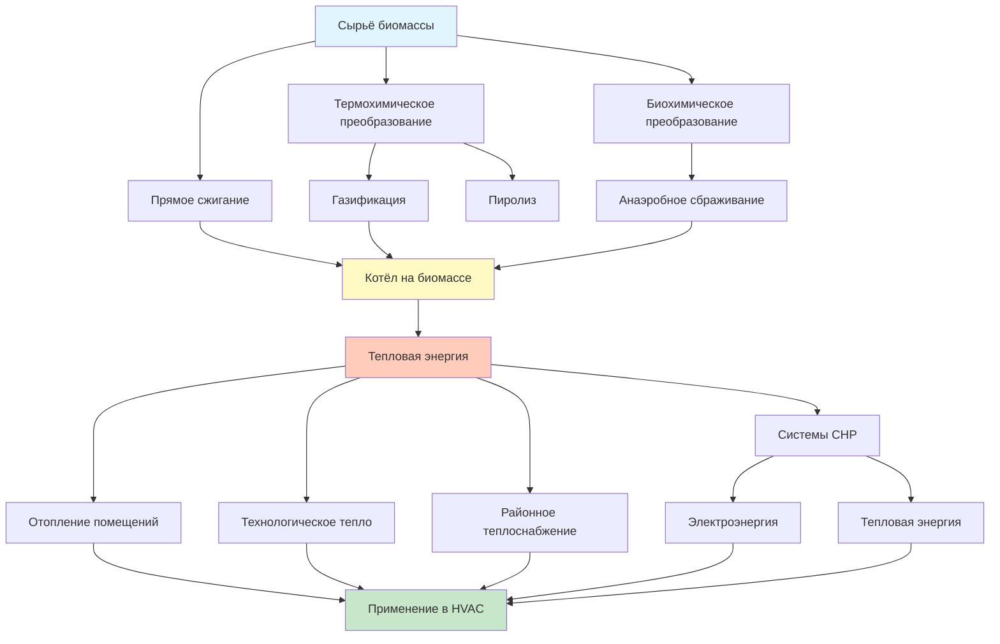

Биомасса аккумулирует солнечную энергию в органическом веществе через фотосинтез. При сжигании, газификации или анаэробном сбраживании (anaerobic digestion) эта энергия высвобождается в виде тепла или горючего газа. Ресурсы биомассы обеспечивают возобновляемую тепловую энергию для отопления помещений, горячего водоснабжения, промышленного технологического тепла и систем совместной выработки тепла и электроэнергии (combined heat and power, CHP), обслуживающих нагрузки HVAC.

По данным IEA (2023), биоэнергетика покрывает около 55 % мирового конечного потребления возобновляемой энергии в секторе отопления и охлаждения.

## Категории сырьевых материалов

### Древесная биомасса

Лесные остатки, отходы лесопиления и древесные энергетические культуры составляют крупнейший сегмент сырья для тепловых приложений. Теплотворная способность древесного топлива на сухую массу — 18,5–20,5 МДж/кг.

Влажность материала критически влияет на низшую теплотворную способность (НТС, lower heating value, LHV):


\mathrm{LHV}_{\mathrm{вл}} = \mathrm{LHV}_{\mathrm{с}} \cdot (1 - W) - \lambda \cdot W


где:
- $\mathrm{LHV}_{\mathrm{с}}$ — НТС сухого топлива, МДж/кг
- $W$ — массовая доля влаги (0…1)
- $\lambda \approx 2{,}44$ МДж/кг — удельная теплота испарения воды при 25 °C

Основные формы топлива:
- Древесные пеллеты (wood pellets): $W = 6{-}8\%$, $\mathrm{LHV} = 16{,}5{-}17{,}5$ МДж/кг
- Древесная щепа (wood chips): $W = 25{-}40\%$, $\mathrm{LHV} = 10{-}13$ МДж/кг
- Дровяная древесина (firewood): $W = 20{-}30\%$, $\mathrm{LHV} = 12{-}15$ МДж/кг

### Сельскохозяйственная биомасса

Растительные остатки (кукурузные стебли, пшеничная солома, мискантус) обеспечивают 12,8–17,4 МДж/кг на сухую массу. Тепловой потенциал:


E_{\mathrm{тепл}} = Y \cdot \mathrm{HHV} \cdot A \cdot \eta_{\mathrm{пр}}


где $Y$ — урожайность культуры, кг/(га·год); $\mathrm{HHV}$ — высшая теплотворная способность, МДж/кг; $A$ — площадь, га; $\eta_{\mathrm{пр}}$ — КПД преобразования.

### Биогаз

Анаэробное сбраживание органических отходов производит биогаз с содержанием метана 50–75 % и теплотворной способностью 18–26 МДж/нм³ (нормальный кубометр). Источники: навоз, иловые осадки очистных станций, пищевые отходы, мусорные полигоны.

## Технологии преобразования биомассы

### Прямое сжигание

Полное окисление целлюлозной биомассы:


\mathrm{C_6H_{10}O_5} + 6\,\mathrm{O_2} \rightarrow 6\,\mathrm{CO_2} + 5\,\mathrm{H_2O} + Q_{\mathrm{тепло}}


КПД сжигания (combustion efficiency):


\eta_{\mathrm{сж}} = \frac{Q_{\mathrm{вых}}}{Q_{\mathrm{вх}}} = \frac{\dot{m}_{\mathrm{топл}} \cdot \mathrm{LHV} - Q_{\mathrm{пот}}}{\dot{m}_{\mathrm{топл}} \cdot \mathrm{LHV}}


где $Q_{\mathrm{пот}}$ — суммарные потери с уходящими газами, излучением и неполным сгоранием. Современные котлы на биомассе достигают $\eta_{\mathrm{сж}} = 75{-}88\,\%$ при $W < 20\,\%$ и 25–50 % избытке воздуха.

## Установленная мощность биомассы (Россия и мир)


| Категория | Установленная мощность | Годовая выработка | Основное сырьё |
|---|---|---|---|
| Промышленные CHP-установки | 145 ГВт эл. | 650 ТВт·ч | Древесные остатки, чёрный щёлок |
| Жилое отопление древесиной | — (прямое тепло) | 6 600 ПДж | Дровяная древесина, пеллеты |
| Районное теплоснабжение | — | 850 ПДж | Щепа, пеллеты |
| Биогазовые установки | 20 ГВт эл. | 140 ТВт·ч | Навоз, пищевые отходы |


Источник: IEA World Energy Statistics 2023; IRENA Renewable Power Generation Costs 2023.

## Применение в системах HVAC

### Котлы на биомассе

Котлы на биомассе (biomass boilers) интегрируются с гидравлическими контурами отопления. Требуемая входная мощность котла:


Q_{\mathrm{к}} = \frac{Q_{\mathrm{проект}}}{\eta_{\mathrm{к}}} \cdot SF


где $Q_{\mathrm{проект}}$ — расчётная тепловая нагрузка, кВт; $\eta_{\mathrm{к}}$ — сезонный КПД котла; $SF$ — коэффициент запаса (1,15–1,25).

Расход топлива:


\dot{m}_{\mathrm{топл}} = \frac{Q_{\mathrm{к}}}{\mathrm{LHV} \cdot \eta_{\mathrm{сж}}}


### Пеллетные системы и CHP

Пеллетные котлы (pellet boilers) с шнековой подачей и лямбда-зондом достигают КПД 80–88 %. Требуемый объём бункера-хранилища:


V_{\mathrm{хр}} = \frac{\dot{m}_{\mathrm{топл,ср}} \cdot t_{\mathrm{хр}}}{\rho_{\mathrm{нас}}}


где $\dot{m}_{\mathrm{топл,ср}}$ — среднесуточный расход топлива, кг/сут; $t_{\mathrm{хр}}$ — расчётный период хранения, сут; $\rho_{\mathrm{нас}} = 360{-}405$ кг/м³ — насыпная плотность пеллет.

Системы CHP на биомассе обеспечивают суммарный КПД 70–85 %, покрывая нагрузки отопления, ГВС и абсорбционного охлаждения.

## Численный пример

**Условие.** Котельная на пеллетах мощностью $Q_{\mathrm{проект}} = 150$ кВт, $\eta_{\mathrm{к}} = 0{,}85$, $SF = 1{,}20$. Пеллеты: $\mathrm{LHV} = 17$ МДж/кг, $\eta_{\mathrm{сж}} = 0{,}87$. Хранение на 60 суток, режим работы — 14 ч/сут.

**Решение.**

Входная мощность котла:


Q_{\mathrm{к}} = \frac{150}{0{,}85} \times 1{,}20 = 211{,}8 \text{ кВт}


Часовой расход пеллет:


\dot{m}_{\mathrm{топл}} = \frac{211{,}8}{17\,000 / 3\,600 \times 0{,}87} = \frac{211{,}8}{4{,}713} \approx 44{,}9 \text{ кг/ч}


Суточный расход: $44{,}9 \times 14 \approx 629$ кг/сут.

Объём бункера на 60 суток:


V_{\mathrm{хр}} = \frac{629 \times 60}{380} \approx 99{,}3 \text{ м}^3


Типовое решение — два смежных бункера по 50 м³ с автоматическим шнековым транспортёром.

## Факторы производительности

**Качество топлива.** Влажность ниже 20 % обязательна для оптимального сжигания и предотвращения образования дёгтя. Хранение в закрытых, вентилируемых помещениях сохраняет качество (ГОСТ EN ISO 17225).

**Контроль выбросов.** Современные котлы на биомассе оснащаются циклонами или тканевыми фильтрами (ESP/bag filter). Допустимые выбросы: CO < 250 мг/нм³, PM < 20 мг/нм³, NOₓ < 200 мг/нм³ (EN 303-5:2021).

**Автоматизация.** Интеллектуальные системы управления контролируют состав дымовых газов (O₂, CO), модулируют подачу топлива и воздуха, интегрируются с BMS здания (ASHRAE 90.1-2022, ФЗ-261).

**Углеродный баланс.** Устойчиво заготовленная биомасса считается углеродно-нейтральной: CO₂, выделяемый при сжигании, равен CO₂, поглощённому при росте растений в рамках замкнутого биологического цикла.

## Источники

- IEA. *Bioenergy — Tracking Clean Energy Progress*. 2023.
- IRENA. *Renewable Energy Statistics 2023*.
- ASHRAE 90.1-2022. *Energy Standard for Sites and Buildings*.
- EN 303-5:2021. *Heating boilers for solid fuels*.
- EN ISO 17225-2:2021. *Solid biofuels — Fuel specifications and classes — Graded wood pellets*.
- VDI 4640-1:2021. *Thermal use of the underground*.
- СП 60.13330.2020. Отопление, вентиляция и кондиционирование воздуха.
- ФЗ-261 от 23.11.2009 «Об энергосбережении».
