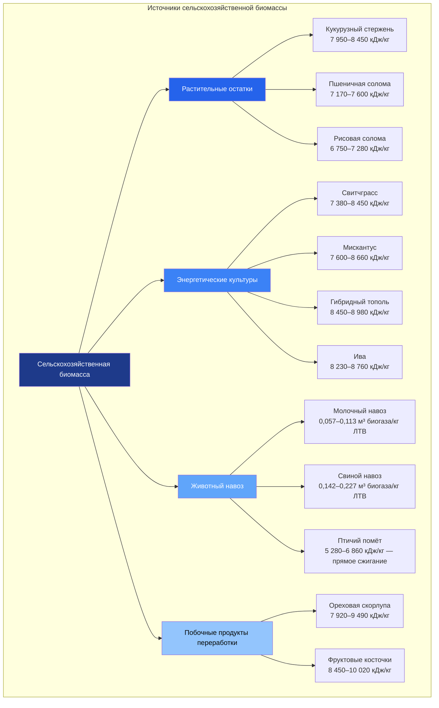

Сельскохозяйственная биомасса представляет значительный возобновляемый энергетический ресурс для HVAC-приложений, особенно в сельских регионах. Она включает растительные остатки (crop residues), специальные энергетические культуры (energy crops), животный навоз и побочные продукты агропереработки. Преобразование в тепловую энергию осуществляется прямым сжиганием, газификацией или анаэробным сбраживанием (anaerobic digestion). По оценке IEA (2023), сельскохозяйственная биомасса покрывает около 11 % глобального производства биоэнергии.

## Растительные остатки

Стебли, листья, шелуха и другие части растений, остающиеся после уборки, обладают значительным энергетическим потенциалом. Устойчивый сбор требует сохранения почвенного органического вещества.

### Теплотворная способность основных остатков


| Вид остатка | НТС, кДж/кг | Влажность при сборе, % | Насыпная плотность, кг/м³ | Зольность, % |
|---|---|---|---|---|
| Кукурузный стержень | 7 950–8 450 | 12–18 | 128–192 | 4–7 |
| Пшеничная солома | 7 170–7 600 | 10–15 | 96–160 | 5–9 |
| Рисовая солома | 6 750–7 280 | 8–12 | 80–128 | 14–20 |
| Соевые остатки | 7 600–8 020 | 12–16 | 112–176 | 4–6 |
| Хлопковые стебли | 8 230–8 660 | 10–14 | 192–256 | 3–5 |
| Багасса сахарного тростника | 7 380–7 920 | 45–55 | 128–224 | 2–6 |
| Рисовая шелуха | 6 120–6 750 | 8–10 | 160–224 | 18–22 |


### Расчёт доступной тепловой энергии


Q_{\mathrm{дост}} = Y \cdot R \cdot C_{\mathrm{сб}} \cdot \mathrm{HHV} \cdot \eta_{\mathrm{сб}}


где:
- $Y$ — урожайность культуры, кг/га
- $R$ — соотношение остаток/зерно (dimensionless)
- $C_{\mathrm{сб}}$ — собираемая доля (0,30–0,50)
- $\mathrm{HHV}$ — высшая теплотворная способность, кДж/кг (сухой вес)
- $\eta_{\mathrm{сб}}$ — КПД сбора (0,70–0,85)

Поправка на влажность:


\mathrm{HHV}_{\mathrm{вл}} = \mathrm{HHV}_{\mathrm{с}} \cdot (1 - W) - 2\,441 \cdot W


где $W$ — массовая доля влаги; 2 441 кДж/кг — скрытая теплота испарения воды.

## Энергетические культуры

Специальные энергетические культуры — многолетние травы и древесные культуры с коротким оборотом (short rotation coppice, SRC) — выращиваются целенаправленно для производства биомассы.

### Многолетние травы


| Культура | Урожайность, т СМ/(га·год) | НТС, кДж/кг | Энергоотдача, ГДж/(га·год) | Ротация |
|---|---|---|---|---|
| Свитчграсс (Panicum virgatum) | 2,0–3,2 | 7 380–8 450 | 14,8–27,0 | 10+ лет |
| Мискантус (Miscanthus × giganteus) | 2,4–4,8 | 7 600–8 660 | 18,1–41,5 | 15+ лет |
| Тростник обыкновенный (Phragmites australis) | 1,2–2,4 | 7 170–7 810 | 8,6–18,8 | 10+ лет |
| Гигантский тростник (Arundo donax) | 3,2–6,0 | 6 860–7 600 | 22,0–45,6 | 12+ лет |


### Древесные культуры с коротким оборотом


| Культура | Урожайность, т СМ/(га·ротация) | НТС, кДж/кг | Период ротации, лет | Влажность, % |
|---|---|---|---|---|
| Гибридный тополь | 4,8–8,0 | 8 450–8 980 | 3–5 | 45–55 |
| Ива (Salix spp.) | 4,0–7,2 | 8 230–8 760 | 3–4 | 50–60 |
| Эвкалипт | 6,0–10,0 | 8 660–9 280 | 5–7 | 40–50 |


## Системы на животном навозе

### Производство биогаза

Выход биогаза из навоза:


V_{\mathrm{биогаз}} = \mathrm{ЛТВ} \cdot Y_{\mathrm{биогаз}} \cdot \eta_{\mathrm{рект}}


где ЛТВ — нагрузка летучих твёрдых веществ (volatile solids, VS), кг/сут; $Y_{\mathrm{биогаз}}$ — удельный выход биогаза, м³/кг VS; $\eta_{\mathrm{рект}} = 0{,}70{-}0{,}85$ — КПД реактора.

Тепловая энергия биогаза:


Q_{\mathrm{биогаз}} = V_{\mathrm{биогаз}} \cdot x_{\mathrm{CH_4}} \cdot \mathrm{HHV}_{\mathrm{CH_4}}


где $x_{\mathrm{CH_4}}$ — объёмная доля метана (0,55–0,65); $\mathrm{HHV}_{\mathrm{CH_4}} = 39{,}8$ МДж/нм³.

### Характеристики навоза


| Вид | TS, % | VS/TS, % | Выход биогаза, м³/кг VS | CH₄, % |
|---|---|---|---|---|
| Молочный КРС | 10–14 | 75–85 | 0,057–0,113 | 55–65 |
| Мясной КРС | 12–18 | 80–88 | 0,071–0,128 | 55–60 |
| Свиньи | 8–12 | 70–80 | 0,142–0,227 | 60–70 |
| Птица (несушки) | 20–30 | 65–75 | 0,099–0,170 | 55–65 |
| Птица (бройлеры) | 18–25 | 70–80 | 0,113–0,198 | 60–65 |


TS — total solids (общее содержание твёрдых веществ), VS — volatile solids (летучие твёрдые вещества).

## Интеграция в системы HVAC

**Системы прямого сжигания.** Котлы на биомассе мощностью 15–15 000 кВт могут использовать растительные остатки, энергетические культуры или птичий помёт. Требуются хранилище топлива, автоматизированная подача и система удаления золы (EN 303-5:2021).

**Газификация.** Газификаторы преобразуют твёрдую биомассу в синтез-газ (syngas: CO + H₂ + CH₄) с теплотворной способностью 4–12 МДж/нм³. Синтез-газ сжигается в газовых двигателях CHP-установок или в прямых нагревателях.

**Биогазовая когенерация.** Типичная молочная ферма на 500 коров производит 230–340 нм³/сут биогаза, что эквивалентно 8–15 ГДж/сут по теплоте. Биогазовый CHP-модуль обеспечивает электроэнергией и теплом фермерские здания.

### КПД сжигания биомассы


Q_{\mathrm{пол}} = \dot{m}_{\mathrm{топл}} \cdot \mathrm{LHV}_{\mathrm{вл}} \cdot \eta_{\mathrm{сж}} \cdot \eta_{\mathrm{тп}}


где $\eta_{\mathrm{тп}} = 0{,}70{-}0{,}85$ — КПД теплопередачи в котле.

## Численный пример

**Условие.** Тепличное хозяйство с площадью кровли 2 га выращивает мискантус с урожайностью 3,5 т СМ/(га·год). НТС = 8 200 кДж/кг. Котёл с КПД 82 %. Определить годовой тепловой выход.

**Решение.**

Масса сырья в год: $2 \times 3{,}5 = 7{,}0$ т СМ.


Q_{\mathrm{год}} = 7\,000 \times 8\,200 \times 0{,}82 = 47{,}1 \text{ ГДж/год} = 13\,100 \text{ кВт·ч/год}


При среднем отопительном сезоне 210 сут это обеспечивает среднюю тепловую мощность $47{,}1\,\mathrm{ГДж} / (210 \times 24 \times 3\,600\,\mathrm{с}) \approx 2{,}6$ кВт — достаточно для поддержания дежурного отопления небольшого служебного помещения. Для покрытия тепловой нагрузки теплицы необходима организация плантации мискантуса на значительно большей площади или сочетание с иными источниками.

## Устойчивость использования

Устойчивый сбор растительных остатков предотвращает деградацию почвы. Рекомендации (IRENA, Минсельхоз РФ):
- Не изымать более 30–50 % растительных остатков с поля
- Поддерживать поверхностное покрытие не менее 1,3–1,8 т/га
- Контролировать уровень органического углерода в почве в многолетней динамике

Энергетическая отдача инвестиций (energy return on investment, EROI) для сельскохозяйственной биомассы составляет 3:1–8:1 в зависимости от вида топлива, расстояний транспортировки и влажности.

## Источники

- IEA. *Bioenergy — Tracking Clean Energy Progress*. 2023.
- IRENA. *Bioenergy for the Energy Transition*. 2021.
- EN 303-5:2021. *Heating boilers for solid fuels*.
- EN ISO 17225-6:2021. *Solid biofuels — Non-woody pellets*.
- ASHRAE 90.1-2022. *Energy Standard for Sites and Buildings*.
- СП 60.13330.2020. Отопление, вентиляция и кондиционирование воздуха.
- ФЗ-261 от 23.11.2009 «Об энергосбережении».
