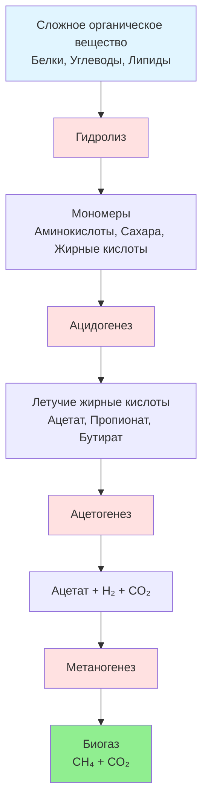

Биогаз — возобновляемый энергоноситель, получаемый при разложении органического вещества в анаэробных условиях. Богатая метаном смесь служит топливом для котлов, газовых двигателей, турбин и топливных элементов в системах HVAC, обеспечивая тепловую энергию и электричество одновременно со снижением выбросов парниковых газов. По данным IEA (2023), мировая выработка биогаза составляет около 35 млрд нм³ CH₄/год.

## Процесс анаэробного сбраживания

Анаэробное сбраживание (anaerobic digestion, AD) преобразует органическое вещество в биогаз посредством четырёх последовательных биохимических стадий.

### Кинетика метаногенеза

Скорость производства метана описывается кинетикой первого порядка:


\frac{d[\mathrm{CH_4}]}{dt} = k \cdot C_{\mathrm{VS}} \cdot \left(1 - e^{-k t}\right)


где $k$ — константа скорости первого порядка, сут⁻¹; $C_{\mathrm{VS}}$ — концентрация летучих твёрдых веществ (volatile solids, VS), кг/м³; $t$ — гидравлическое время удерживания (hydraulic retention time, HRT), сут.

Теоретический выход метана по уравнению Басвелла (Buswell):


C_n H_a O_b N_c + \frac{4n - a - 2b + 3c}{4}\,\mathrm{H_2O}
\rightarrow \frac{4n + a - 2b - 3c}{8}\,\mathrm{CH_4} + \frac{4n - a + 2b + 3c}{8}\,\mathrm{CO_2} + c\,\mathrm{NH_3}


Удельный выход метана для практических расчётов:


Y_{\mathrm{CH_4}} = B_0 \cdot \left(1 - \frac{k_d}{k_d + \mu_m}\right)


где $B_0 = 0{,}35{-}0{,}55$ нм³ CH₄/кг VS — предельная биоразлагаемость; $k_d = 0{,}02{-}0{,}04$ сут⁻¹ — коэффициент эндогенного распада; $\mu_m = 0{,}1{-}0{,}5$ сут⁻¹ — максимальная удельная скорость роста метаногенов.

## Состав биогаза


| Компонент | Свалочный газ | Реактор AD (навоз/пищ. отходы) | Осадок очистных сооружений |
|---|---|---|---|
| Метан CH₄, % | 45–60 | 55–75 | 60–70 |
| Диоксид углерода CO₂, % | 35–50 | 25–45 | 30–40 |
| Азот N₂, % | 0–5 | 0–2 | 0–1 |
| Кислород O₂, % | 0–2 | < 0,5 | < 0,5 |
| Сероводород H₂S, ppm | 10–200 | 100–8 000 | 500–3 000 |
| Аммиак NH₃, ppm | 0–5 | 0–100 | 10–50 |
| Силоксаны, мг/нм³ | 1–50 | 0–50 | 5–100 |


### Низшая теплотворная способность биогаза


\mathrm{LHV}_{\mathrm{биогаз}} = \mathrm{LHV}_{\mathrm{CH_4}} \cdot x_{\mathrm{CH_4}} = 35{,}8 \text{ МДж/нм}^3 \cdot x_{\mathrm{CH_4}}


Ориентировочные значения:
- Реакторный биогаз (65 % CH₄): 23,3 МДж/нм³
- Свалочный газ (50 % CH₄): 17,9 МДж/нм³
- Обогащённый RNG (≥ 95 % CH₄): ≥ 34,0 МДж/нм³
- Природный газ (для сравнения): 37,3 МДж/нм³

## Источники биогаза

### Сельскохозяйственные реакторы


| Сырьё | VS, % от TS | Выход CH₄, нм³/кг VS | Энергоэквивалент, МДж/кг VS |
|---|---|---|---|
| Навоз молочного КРС | 75–85 | 0,20–0,25 | 7,2–9,0 |
| Навоз свиней | 70–80 | 0,35–0,45 | 12,5–16,1 |
| Птичий помёт | 75–85 | 0,25–0,35 | 9,0–12,5 |
| Пищевые отходы | 85–95 | 0,45–0,60 | 16,1–21,5 |
| Растительные остатки | 90–95 | 0,30–0,45 | 10,7–16,1 |


### Захват свалочного газа

Муниципальные свалки твёрдых коммунальных отходов (ТКО) генерируют метан при разложении органических материалов. Образование свалочного газа описывается моделью распада первого порядка (модель LandGEM, EPA США):


Q_{\mathrm{CH_4}} = \sum_{i=1}^{n} \frac{k \cdot L_0 \cdot M_i \cdot e^{-k t_i}}{10}


где:
- $Q_{\mathrm{CH_4}}$ — скорость образования CH₄, нм³/год
- $k$ — константа скорости: 0,02–0,20 год⁻¹ (зависит от влажности климата)
- $L_0$ — потенциал образования CH₄: 100–170 нм³/т ТКО
- $M_i$ — масса отходов, принятых в год $i$, т
- $t_i$ — время с момента захоронения, лет

### Реакторы очистных сооружений

Муниципальные очистные сооружения используют анаэробное сбраживание осадка сточных вод. Производительность реактора:


V_{\mathrm{газ}} = \mathrm{VS}_{\mathrm{уд}} \cdot Y_{\mathrm{газ}} \cdot Q


где $\mathrm{VS}_{\mathrm{уд}} = 0{,}40{-}0{,}60$ — эффективность удаления VS; $Y_{\mathrm{газ}} = 1{,}0{-}1{,}4$ нм³/кг VS$_{\mathrm{уд}}$; $Q$ — расход осадка, м³/сут.

## Обогащение биогаза до уровня RNG

Сырой биогаз обогащается для соответствия параметрам сетевого газа (renewable natural gas, RNG) или стандартам моторного топлива. Технологии удаления CO₂, H₂S и влаги:


| Технология | Извлечение CH₄, % | Энергопотребление, кВт·ч/нм³ | Капзатраты | Эксплуатация |
|---|---|---|---|---|
| Адсорбция при перепаде давления (PSA) | 96–98 | 0,20–0,30 | Средние | Низкие |
| Мембранное разделение | 90–96 | 0,18–0,25 | Низко-средние | Средние |
| Водная абсорбция (WS) | 96–98 | 0,25–0,35 | Средние | Средние |
| Химическая абсорбция аминами | 97–99 | 0,15–0,25 | Высокие | Высокие |
| Криогенное разделение | 97–99 | 0,50–0,70 | Высокие | Средние |


Требования к закачке RNG в газораспределительную сеть (ГОСТ Р 55023-2012, EN ISO 16723-1):
- Содержание CH₄: ≥ 95 %
- ВТС: 36,0–40,5 МДж/нм³
- H₂S: < 4 ppm (6 мг/нм³)
- Точка росы воды: < −7 °C при давлении трубопровода
- O₂: < 0,2 %

## Применение биогаза в HVAC

**Прямое сжигание.** Биогазовые котлы (biogas boilers) достигают КПД 80–88 %. Сырой биогаз с содержанием H₂S > 200 ppm требует предварительной очистки во избежание коррозии теплообменников.

**Когенерация (CHP).** Биогазовые газопоршневые двигатели обеспечивают 32–42 % электрической и 40–50 % тепловой эффективности; газовые турбины — 25–35 % электрической и 50–60 % тепловой. Суммарный КПД CHP-системы достигает 75–90 % (ASHRAE 90.1-2022).

**Топливные элементы.** Перспективное применение с 45–55 % электрической и 35–45 % тепловой эффективностью при минимальных выбросах.

## Численный пример

**Условие.** Молочная ферма на 200 коров. Суточная нагрузка VS: $C_{\mathrm{VS}} = 200 \times 3{,}5$ кг/сут = 700 кг VS/сут (молочный навоз). Удельный выход биогаза $Y_{\mathrm{биогаз}} = 0{,}085$ нм³/кг VS; $x_{\mathrm{CH_4}} = 0{,}60$; $\eta_{\mathrm{рект}} = 0{,}78$. КПД котла 85 %.

Объём биогаза в сутки:


V_{\mathrm{биогаз}} = 700 \times 0{,}085 \times 0{,}78 \approx 46{,}4 \text{ нм}^3/\text{сут}


Тепловая мощность:


\dot{Q} = \frac{46{,}4 \times 35{,}8 \times 0{,}60 \times 0{,}85}{86\,400} \times 10^6 \approx 9{,}8 \text{ кВт}


Это покрывает отопление фермерского помещения площадью ~300 м² при удельной нагрузке 33 Вт/м² — типовое значение для животноводческого корпуса (СП 60.13330.2020).

## Экологические преимущества

- Захват CH₄ предотвращает выброс мощного парникового газа: GWP₁₀₀(CH₄) = 28 (IPCC AR6, 2021)
- Вытесняет ископаемое топливо, снижая выбросы CO₂
- Диэстат реактора — ценное органическое удобрение
- Снижает потребность в полигонах ТКО
- По данным EPA AgSTAR, ферма на 1 000 коров сокращает выбросы ПГ на эквивалент ~1 800 т CO₂-экв./год

## Источники

- IEA. *Outlook for Biogas and Biomethane*. 2020.
- IRENA. *Biogas for Road Vehicles: Technology Brief*. 2017.
- ASHRAE 90.1-2022. *Energy Standard for Sites and Buildings*.
- EN ISO 16723-1:2016. *Natural gas and biomethane for use in transport*.
- ГОСТ Р 55023-2012. Газ горючий природный. Технические условия.
- СП 60.13330.2020. Отопление, вентиляция и кондиционирование воздуха.
- ФЗ-261 от 23.11.2009 «Об энергосбережении».
