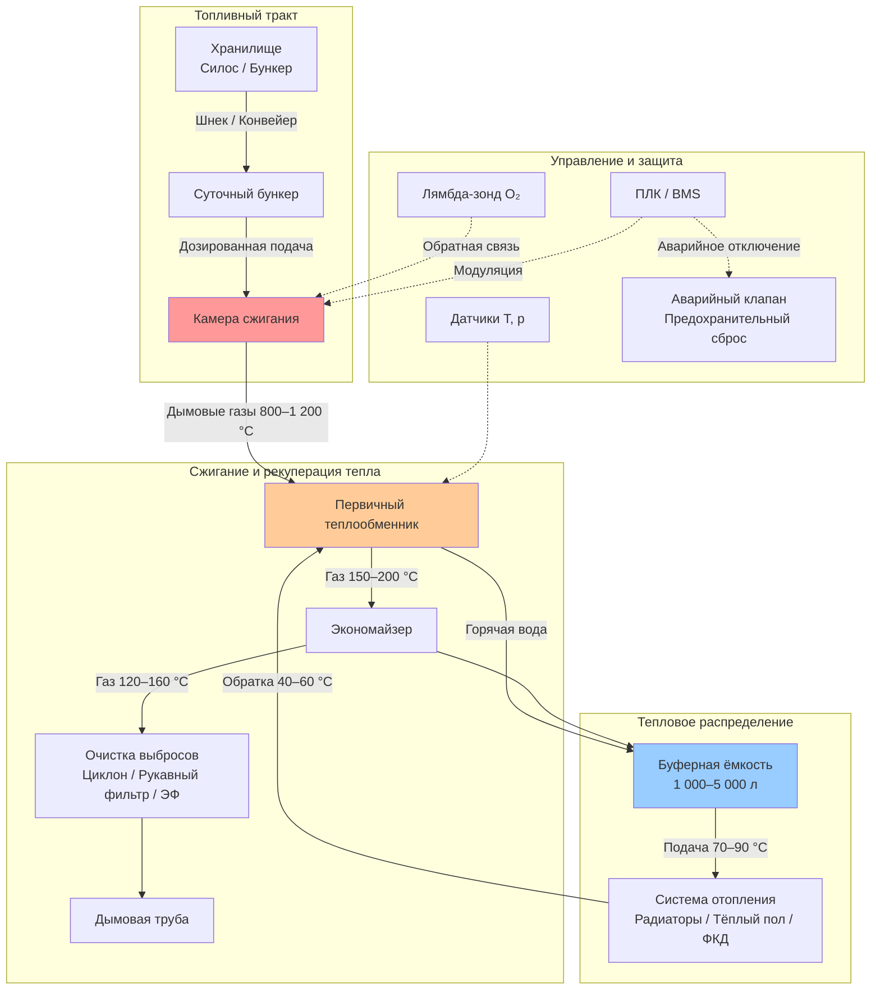

Системы отопления на биомассе (biomass heating systems) преобразуют органические материалы в тепловую энергию для отопления помещений, горячего водоснабжения (ГВС) и технологического тепла. Современные котлы на биомассе достигают тепловой эффективности 75–92 % в зависимости от вида топлива и технологии сжигания. По данным IEA (2023), биомассовое отопление обеспечивает около 10 % мирового конечного потребления тепловой энергии в зданиях.

## Характеристики биотоплива


| Топливо | Влажность, % | НТС, МДж/кг | Подача | Применение |
|---|---|---|---|---|
| Древесные пеллеты | 6–10 | 16,5–17,5 | Автоматическая (шнек) | Жилые и коммерческие котлы |
| Древесная щепа | 20–40 | 10–14 | Авто/полуавто | Районное отопление, крупные объекты |
| Дрова | 15–25 | 13–16 | Ручная / автоматическая | Жилые печи, малые котлы |
| Сельхозостатки | 10–20 | 14–18 | Автоматическая | Промышленное тепло |
| Энергетические культуры | 15–30 | 12–16 | Автоматическая | Крупные котельные |


## Пеллетные котлы

Пеллетные котлы (pellet boilers) — наиболее автоматизированная технология для жилых и коммерческих объектов. Пеллеты производятся из прессованных опилок по EN ISO 17225-2: диаметр 6–8 мм, длина 10–30 мм.

### Конструктивные особенности

- **Шнековая подача.** Пеллеты транспортируются из бункера в горелку без ручного труда
- **Модулирующая горелка.** Диапазон мощности 30–100 % от номинала
- **Лямбда-контроль.** Непрерывная оптимизация соотношения воздух/топливо по сигналу O₂-зонда
- **Автоматическое золоудаление.** Интервалы обслуживания 1–4 недели

### КПД котла


\eta_{\mathrm{кт}} = \frac{Q_{\mathrm{пол}}}{Q_{\mathrm{топл}}} = \frac{\dot{m}_w \cdot c_p \cdot (T_{\mathrm{под}} - T_{\mathrm{обр}})}{\mathrm{LHV}_{\mathrm{пел}} \cdot \dot{m}_{\mathrm{пел}}}


где:
- $\dot{m}_w$ — расход воды в контуре отопления, кг/с
- $c_p = 4{,}18$ кДж/(кг·К)
- $T_{\mathrm{под}}$, $T_{\mathrm{обр}}$ — температуры подачи и обратки, °C
- $\mathrm{LHV}_{\mathrm{пел}} \approx 16{,}5$ МДж/кг
- $\dot{m}_{\mathrm{пел}}$ — расход пеллет, кг/с

Современные пеллетные котлы достигают $\eta_{\mathrm{кт}} = 85{-}92\,\%$ по EN 303-5:2021.

## Щеповые системы

Котлы на щепе (wood chip boilers) обслуживают средние и крупные объекты: учебные кампусы, промышленные предприятия, сети районного теплоснабжения. Диапазон мощности — 200 кВт — 10+ МВт.

### Компоненты системы

- Подвижные бункеры с ворошителями (ёмкость 50–500 м³)
- Конвейеры движущегося пола или цепные транспортёры
- Топки на подвижной решётке (moving grate) или с нижней подачей
- Многоциклонная очистка (PM₁₀, PM₂,₅)

## Архитектура системы

## Расчёт потерь в дымоходе

КПД сжигания:


\eta_{\mathrm{сж}} = 100 - L_{\mathrm{дым}} - L_{\mathrm{нгор}}


Тепловые потери с уходящими газами (формула Зигерта):


L_{\mathrm{дым}} = \frac{K \cdot (T_{\mathrm{ух}} - T_{\mathrm{нар}})}{[\mathrm{CO_2}]_{\%}}


где $K \approx 0{,}5$ для древесной биомассы; $[\mathrm{CO_2}]_{\%}$ — концентрация CO₂ в дымовых газах (12–16 % для биомассы); $T_{\mathrm{ух}}$ — температура уходящих газов; $T_{\mathrm{нар}}$ — температура наружного воздуха.

Сезонный КПД:


\eta_{\mathrm{сез}} = \eta_{\mathrm{кт}} \cdot \left(1 - \frac{L_{\mathrm{цикл}} + L_{\mathrm{ожид}}}{100}\right)


Типичный диапазон: 75–85 %, зависит от профиля нагрузки и объёма буферной ёмкости.

## Интеграция CHP на биомассе


| Технология | Электрический КПД, % | Тепловой КПД, % | Суммарный КПД CHP, % | Диапазон мощности |
|---|---|---|---|---|
| Органический цикл Ренкина (ORC) | 12–18 | 65–75 | 80–88 | 200 кВт – 2 МВт |
| Паровая турбина | 15–25 | 60–70 | 80–90 | 1–50 МВт |
| Газификация + газопоршневой двигатель | 25–35 | 45–55 | 75–85 | 100 кВт – 5 МВт |
| Двигатель Стирлинга | 10–15 | 70–80 | 85–90 | 10–100 кВт |


Суммарный КПД CHP:


\eta_{\mathrm{CHP}} = \frac{E_{\mathrm{эл}} + Q_{\mathrm{тепл}}}{\mathrm{LHV}_{\mathrm{топл}} \cdot \dot{m}_{\mathrm{топл}}}


Соотношение электричество/тепло (power-to-heat ratio, PHR):


\mathrm{PHR} = \frac{E_{\mathrm{эл}}}{Q_{\mathrm{тепл}}}


Системы CHP требуют достаточной базовой тепловой нагрузки. Буферная ёмкость 10 000–50 000 л сглаживает дисбаланс между постоянной электрогенерацией и переменным тепловым спросом здания.

## Буферная ёмкость

Расчёт объёма буферной ёмкости (thermal buffer tank):


V_{\mathrm{б}} = \frac{P_{\mathrm{кт}} \cdot t_{\mathrm{мин}}}{\rho_w \cdot c_p \cdot \Delta T}


где:
- $P_{\mathrm{кт}}$ — тепловая мощность котла, кВт
- $t_{\mathrm{мин}}$ — минимальное время горения для стабильной работы (обычно 1–2 ч), с
- $\rho_w = 1\,000$ кг/м³
- $\Delta T$ — перепад температур хранения (20–30 К)

## Контроль выбросов

Современные котлы на биомассе выполняют нормы EN 303-5:2021 и требования ФЗ-261:

- **Первичные меры:** многоступенчатое сжигание, рециркуляция дымовых газов, ступенчатая подача воздуха
- **Вторичные меры:** электростатические фильтры (ESP), рукавные фильтры, многоциклонные блоки
- **Контроль NOₓ:** низконоксидные горелки, SNCR для крупных установок
- **Контроль CO:** лямбда-управление с поддержанием 6–10 % O₂ в дымовых газах

Типичные выбросы пеллетных котлов класса 5 (EN 303-5): PM < 20 мг/нм³, CO < 250 мг/нм³, NOₓ < 200 мг/нм³.

## Численный пример

**Условие.** Котёл на древесной щепе мощностью $P_{\mathrm{кт}} = 500$ кВт, $\eta_{\mathrm{кт}} = 0{,}83$, $\Delta T = 25$ К, минимальное время горения $t_{\mathrm{мин}} = 1{,}5$ ч = 5 400 с. Температура щепы: $\mathrm{LHV}_{\mathrm{вл}} = 11$ МДж/кг ($W = 30\,\%$), $\eta_{\mathrm{сж}} = 0{,}82$.

Объём буферной ёмкости:


V_{\mathrm{б}} = \frac{500 \times 5\,400}{1\,000 \times 4{,}18 \times 25} = \frac{2\,700\,000}{104\,500} \approx 25{,}8 \text{ м}^3


Принимается буферная ёмкость 30 м³ (один вертикальный бак или два по 15 м³).

Расход щепы:


\dot{m}_{\mathrm{щ}} = \frac{P_{\mathrm{кт}} / \eta_{\mathrm{кт}}}{\mathrm{LHV}_{\mathrm{вл}} \cdot \eta_{\mathrm{сж}}} = \frac{500 / 0{,}83}{11\,000 / 3\,600 \times 0{,}82} \approx \frac{602}{2{,}508} \approx 240 \text{ кг/ч}


## Сегменты применения


| Объект | Мощность | Вид топлива | Ключевые требования |
|---|---|---|---|
| Одноквартирный жилой дом | 10–30 кВт | Пеллеты | Автоматика, компактный бункер |
| МКД, малый офис | 50–200 кВт | Пеллеты, щепа | Буферная ёмкость, нормы выбросов |
| Коммерческое здание | 100–500 кВт | Щепа, пеллеты | Логистика топлива, техобслуживание |
| Районное теплоснабжение | 1–20 МВт | Щепа, остатки | Экономия масштаба, CHP |
| Промышленное тепло | 500 кВт – 10 МВт | Щепа, остатки | Интеграция с технологическим процессом |
| Сельскохозяйственные объекты | 200–1 000 кВт | Местная биомасса | Сезонный характер нагрузки |


## Источники

- IEA. *Bioenergy — Tracking Clean Energy Progress*. 2023.
- ASHRAE 90.1-2022. *Energy Standard for Sites and Buildings Except Low-Rise Residential Buildings*.
- EN 303-5:2021. *Heating boilers for solid fuels — Part 5: Heating boilers for solid fuels, manually and automatically stoked, nominal heat output of up to 500 kW*.
- EN ISO 17225-2:2021. *Solid biofuels — Fuel specifications and classes — Graded wood pellets*.
- СП 60.13330.2020. Отопление, вентиляция и кондиционирование воздуха.
- ФЗ-261 от 23.11.2009 «Об энергосбережении и повышении энергетической эффективности».
