Топливо из биомассы (biomass fuel) охватывает разнообразные органические материалы, применяемые в системах тепловой генерации HVAC. Знание классификации биомассы, её энергетических характеристик и поведения при горении позволяет правильно подбирать топливо для котлов, печей и CHP-установок (combined heat and power). По данным IRENA (2023), твёрдая биомасса остаётся крупнейшим отдельным источником возобновляемой тепловой энергии в мире.

## Классификация биомассы

```mermaid
graph TD
    A[Ресурсы биомассы] --> B[Древесная биомасса]
    A --> C[Травянистая биомасса]
    A --> D[Отходная биомасса]
    A --> E[Водная биомасса]

    B --> B1[Лесные остатки]
    B --> B2[Древесная щепа]
    B --> B3[Пеллеты и брикеты]
    B --> B4[Опилки и кора]

    C --> C1[Просо прутьевидное — свитчграсс]
    C --> C2[Мискантус]
    C --> C3[Сельхозостатки — солома, стебли]
    C --> C4[Энергетические травы]

    D --> D1[Твёрдые коммунальные отходы — ТКО]
    D --> D2[Животный навоз]
    D --> D3[Пищевые отходы]
    D --> D4[Промышленная органика]

    E --> E1[Микроводоросли]
    E --> E2[Макроводоросли]
    E --> E3[Водные растения]

    style A fill:#f9f9f9,stroke:#333,stroke-width:3px
    style B fill:#d4a373,stroke:#333,stroke-width:2px
    style C fill:#90c878,stroke:#333,stroke-width:2px
    style D fill:#e8b4b4,stroke:#333,stroke-width:2px
    style E fill:#7eb8da,stroke:#333,stroke-width:2px
```

## Древесная биомасса

Древесная биомасса состоит из целлюлозно-лигниновых материалов из лесохозяйственных операций, деревоперерабатывающих предприятий и специализированных энергетических плантаций. Она имеет наивысшую энергетическую плотность и наиболее благоприятные характеристики сжигания среди всех типов твёрдой биомассы.

### Состав и теплофизические свойства

Типичный химический состав древесины: 40–55 % целлюлозы, 20–35 % гемицеллюлозы, 15–30 % лигнина. Высокое содержание лигнина обеспечивает повышенную теплотворную способность по сравнению с травянистыми материалами.

Высшая теплотворная способность (HHV, higher heating value) влажного топлива:


\mathrm{HHV}_{\mathrm{вл}} = \mathrm{HHV}_0 \cdot \left(1 - \frac{W}{100}\right) - 2{,}443 \cdot \frac{W}{100}


где $\mathrm{HHV}_0$ — HHV при нулевой влажности (18–21 МДж/кг для древесины); $W$ — влажность, %; коэффициент 2,443 МДж/кг — удельная теплота испарения воды при 25 °C.

Объёмная энергетическая плотность:


\rho_E = \rho_b \cdot \mathrm{HHV}_d


где $\rho_b$ — насыпная плотность, кг/м³; $\mathrm{HHV}_d$ — HHV на сухую массу, МДж/кг.

### Характеристики древесного топлива


| Форма топлива | Насыпная плотность, кг/м³ | Влажность, % | HHV (сухое), МДж/кг | Зольность, % |
|---|---|---|---|---|
| Древесные пеллеты | 600–750 | 6–10 | 19,5–20,5 | 0,3–0,7 |
| Древесная щепа | 250–400 | 25–40 | 18,5–19,5 | 0,5–2,0 |
| Опилки | 180–280 | 15–25 | 19,0–20,0 | 0,4–1,5 |
| Кора | 200–350 | 30–50 | 18,0–19,0 | 2,0–6,0 |
| Дрова выдержанные | 350–500 | 15–25 | 19,0–20,0 | 0,5–1,0 |


## Травянистая биомасса

Травянистая биомасса включает травы, сельскохозяйственные остатки и однолетние энергетические культуры. Содержание лигнина ниже (10–20 %), зольность выше, что существенно влияет на поведение при горении и требования к оборудованию.

### Состав и особенности сжигания

Травянистые материалы содержат 30–45 % целлюлозы, 20–40 % гемицеллюлозы, 10–20 % лигнина. Повышенное содержание кремнезёма (SiO₂) и щелочных металлов (K, Na) снижает температуру плавления золы и увеличивает шлакообразование. Хлор в соломе и остатках провоцирует коррозию жаротрубных поверхностей.

Температура плавления золы зависит от состава оксидов:


T_{\mathrm{шл}} = f(\mathrm{SiO_2},\, \mathrm{Al_2O_3},\, \mathrm{CaO},\, \mathrm{Fe_2O_3},\, \mathrm{K_2O},\, \mathrm{Na_2O})


Травянистая биомасса: $T_{\mathrm{шл}} = 1\,000{-}1\,200\,°C$ — ниже, чем у древесины ($1\,200{-}1\,400\,°C$). Это требует применения решёточных топок с контролируемой температурой горения.

### Показатели травянистого топлива


| Тип | Насыпная плотность, кг/м³ | Влажность, % | HHV (сухое), МДж/кг | Зольность, % | Щелочной индекс, кг/ГДж |
|---|---|---|---|---|---|
| Просо прутьевидное | 100–200 | 10–15 | 17,5–18,5 | 3–6 | 0,25–0,45 |
| Мискантус | 120–220 | 12–18 | 17,8–18,8 | 2–4 | 0,18–0,35 |
| Пшеничная солома | 80–150 | 12–20 | 17,0–18,0 | 4–8 | 0,40–0,70 |
| Кукурузные стебли | 100–180 | 15–25 | 17,2–18,2 | 4–7 | 0,35–0,60 |
| Рисовая шелуха | 100–160 | 8–12 | 15,5–16,5 | 15–20 | 0,50–0,80 |


Щелочной индекс (alkali index) > 0,17 кг/ГДж указывает на риск шлакообразования; > 0,34 кг/ГДж — практически гарантированное шлакообразование.

## Отходная биомасса

Отходная биомасса включает твёрдые коммунальные отходы (ТКО), навоз, остатки пищевого производства и промышленную органику. Гетерогенность состава и переменная влажность — ключевые особенности этой категории.

### Потенциал рекуперации энергии


E_{\mathrm{рек}} = \sum_{i=1}^{n} m_i \cdot \mathrm{HHV}_i \cdot \eta_{\mathrm{сж}}


где $m_i$ — массовая доля компонента $i$; $\mathrm{HHV}_i$ — его теплотворная способность.


| Источник | Влажность, % | HHV (в рабочем состоянии), МДж/кг | Основная сложность |
|---|---|---|---|
| ТКО (сортированные) | 25–35 | 10–14 | Гетерогенность, загрязнители |
| Пищевые отходы | 70–85 | 3–6 | Высокая влажность, биоразложение |
| Навоз КРС | 75–85 | 2–4 | Требует подсушки или AD |
| Птичий помёт | 20–30 | 12–15 | Аммиак, высокий азот → NOₓ |
| Бумага и картон | 5–15 | 14–17 | Переменное качество |


## Водная биомасса

Водоросли и водные растения отличаются высокой удельной продуктивностью, но требуют значительного обезвоживания перед тепловым использованием.

### Энергетический баланс обезвоживания


E_{\mathrm{нетто}} = E_{\mathrm{тепл}} - E_{\mathrm{обезв}} - E_{\mathrm{проц}}


Экономическая жизнеспособность требует $E_{\mathrm{нетто}} > 0$, что достигается совместным производством (биогаз + твёрдое топливо) или использованием низкопотенциального тепла для сушки.


| Тип | Влажность при сборе, % | HHV (сухое), МДж/кг | Содержание белка, % | Применение |
|---|---|---|---|---|
| Микроводоросли | 85–95 | 20–24 | 40–60 | Биогаз, извлечение масел |
| Ламинария | 80–90 | 10–14 | 8–15 | Биогаз |
| Водяной гиацинт | 90–95 | 15–17 | 12–18 | Биогаз, компост |
| Ряска | 90–94 | 16–18 | 35–45 | Корм, биогаз |


## Критерии выбора топлива для HVAC

**Объёмная энергетическая плотность** определяет требования к хранению. Пеллеты дают 11–13 ГДж/м³ (компактное хранение); травянистые тюки — 2–3 ГДж/м³ (большие площади склада).

**Совместимость с оборудованием.** Древесина подходит для неподвижных и подвижных решёток. Травянистое высокозольное топливо требует специальных решёток и систем золоудаления. Отходная биомасса нуждается в контроле выбросов Cl и тяжёлых металлов.

**Управление влажностью.** Каждый процент влажности снижает LHV примерно на 0,025 МДж/кг через испарительные потери. Целевая влажность для котлов: ≤ 20 % (пеллеты — ≤ 10 %).

**Логистика поставок.** Локальная доступность, сезонность сбора, расстояние транспортировки влияют на экономику и надёжность топливоснабжения (СП 60.13330.2020).

## Численный пример

**Условие.** Сравнить объём склада для хранения 30-суточного запаса топлива котла мощностью 200 кВт при $\eta_{\mathrm{кт}} = 0{,}85$. Варианты: а) пеллеты ($\mathrm{LHV} = 16{,}5$ МДж/кг, $\rho_b = 650$ кг/м³); б) щепа ($\mathrm{LHV} = 11$ МДж/кг, $\rho_b = 300$ кг/м³). Работа 20 ч/сут.

Суточный расход топлива:


\dot{m}_{\mathrm{сут}} = \frac{P_{\mathrm{кт}} \cdot t_{\mathrm{раб}}}{\mathrm{LHV} \cdot \eta_{\mathrm{кт}} \cdot \eta_{\mathrm{сж}}}


Для пеллет ($\eta_{\mathrm{сж}} = 0{,}90$):


\dot{m}_{\mathrm{пел}} = \frac{200 \times 20 \times 3\,600}{16{,}5 \times 10^6 \times 0{,}85 \times 0{,}90} \approx 357 \text{ кг/сут}


Для щепы ($\eta_{\mathrm{сж}} = 0{,}82$):


\dot{m}_{\mathrm{щ}} = \frac{200 \times 20 \times 3\,600}{11 \times 10^6 \times 0{,}85 \times 0{,}82} \approx 563 \text{ кг/сут}


Объём склада на 30 суток:

- Пеллеты: $357 \times 30 / 650 \approx 16{,}5$ м³
- Щепа: $563 \times 30 / 300 \approx 56{,}3$ м³

Щепа требует склад в 3,4 раза больше при той же тепловой мощности. Выбор определяется наличием площади, ценой топлива и требованиями к автоматизации.

## Источники

- IRENA. *Renewable Energy Statistics 2023*.
- IEA. *Bioenergy — Tracking Clean Energy Progress*. 2023.
- EN ISO 17225-1:2021. *Solid biofuels — Fuel specifications and classes — General requirements*.
- EN 303-5:2021. *Heating boilers for solid fuels*.
- ASHRAE 90.1-2022. *Energy Standard for Sites and Buildings*.
- СП 60.13330.2020. Отопление, вентиляция и кондиционирование воздуха.
- ФЗ-261 от 23.11.2009 «Об энергосбережении».
