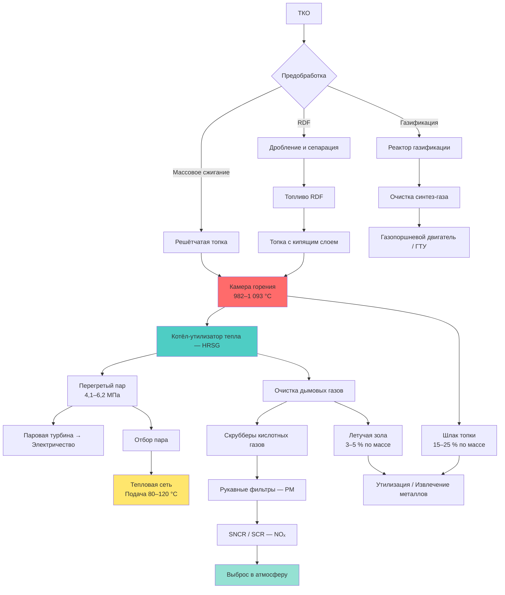

Объекты утилизации отходов (waste-to-energy, WTE) преобразуют твёрдые коммунальные отходы (ТКО) в тепловую и электрическую энергию посредством контролируемых процессов сжигания. Современные установки WTE решают двойную задачу: сокращают объём отходов на 90 % (масса — на 75 %) и генерируют возобновляемую базовую энергию. В Европе WTE-установки покрывают около 3 % суммарного производства тепловой энергии в системах централизованного теплоснабжения (IEA, 2023).

Температура горения 982–1 093 °C обеспечивает производство пара при давлении 4,1–6,2 МПа и температуре 399–454 °C, пригодного как для выработки электроэнергии, так и для подачи в сети теплоснабжения.

## Технология массового сжигания

Массовое сжигание (mass burn incineration) обрабатывает необработанные ТКО на движущихся решётчатых топках. Зоны сжигания:

1. **Зона сушки.** Испарение влаги (20–35 % влажность ТКО) при 149–260 °C
2. **Зона воспламенения.** Воспламенение летучих при 260–593 °C
3. **Зона горения.** Первичное окисление при 982–1 093 °C, избыток воздуха 80–100 %
4. **Зона догорания.** Полное окисление угарного остатка с увеличенным временем пребывания

Тепловая эффективность рекуперации энергии:


\eta_{\mathrm{тепл}} = \frac{\dot{m}_{\mathrm{пар}} \cdot (h_{\mathrm{пар}} - h_{\mathrm{пв}})}{\dot{m}_{\mathrm{ТКО}} \cdot \mathrm{LHV}_{\mathrm{ТКО}}}


где:
- $\dot{m}_{\mathrm{пар}}$ — паропроизводительность, кг/ч
- $h_{\mathrm{пар}}$, $h_{\mathrm{пв}}$ — удельные энтальпии пара и питательной воды, кДж/кг
- $\dot{m}_{\mathrm{ТКО}}$ — массовый расход ТКО, кг/ч
- $\mathrm{LHV}_{\mathrm{ТКО}}$ — низшая теплотворная способность ТКО, кДж/кг

Типичная тепловая эффективность современных топок с водяными экранами: 65–75 %.

## RDF-технология

Топливо из отходов (refuse-derived fuel, RDF) получают предварительной обработкой ТКО с удалением негорючих фракций (металлы, стекло, инертные). Цепочка переработки:

- Первичное дробление до 15–30 см
- Магнитная сепарация (удаление чёрных металлов, 5–8 % масс.)
- Воздушная классификация (отделение лёгкой горючей от тяжёлых инертов)
- Вторичное дробление до 5–10 см
- Уплотнение: пеллетирование повышает насыпную плотность до 480–640 кг/м³

LHV топлива RDF:


\mathrm{LHV}_{\mathrm{RDF}} = \mathrm{LHV}_{\mathrm{ТКО}} \cdot \frac{100 - W_{\mathrm{RDF}} - A_{\mathrm{RDF}}}{100 - W_{\mathrm{ТКО}} - A_{\mathrm{ТКО}}} \cdot \eta_{\mathrm{пр}}


где $W$ — влажность, %; $A$ — зольность, %; $\eta_{\mathrm{пр}} = 0{,}85{-}0{,}92$ — КПД переработки.

### Свойства ТКО и RDF


| Показатель | ТКО (в рабочем состоянии) | RDF (переработанное) | Единица |
|---|---|---|---|
| HHV | 18,8–27,2 | 25,1–35,6 | МДж/кг |
| LHV | 16,8–24,3 | 23,0–32,7 | МДж/кг |
| Влажность | 20–35 | 10–20 | % |
| Зольность | 20–30 | 10–18 | % (сухое) |
| Летучие вещества | 60–75 | 65–80 | % (сухое) |
| Содержание серы | 0,1–0,3 | 0,15–0,35 | % (сухое) |
| Содержание хлора | 0,3–0,8 | 0,4–1,0 | % (сухое) |


## Газификация ТКО

Газификация преобразует ТКО в синтез-газ (syngas) посредством частичного окисления при 649–982 °C с подачей 25–40 % от теоретического расхода воздуха/кислорода:


\text{ТКО} + \mathrm{O_2} + \mathrm{H_2O} \rightarrow \mathrm{CO} + \mathrm{H_2} + \mathrm{CO_2} + \mathrm{CH_4} + \text{смолы} + \text{уголь}


LHV синтез-газа:


\mathrm{LHV}_{\mathrm{sg}} = \sum_i y_i \cdot \mathrm{LHV}_i


Горючие компоненты: CO — 10,1 МДж/нм³, H₂ — 10,8 МДж/нм³, CH₄ — 35,8 МДж/нм³. Типичный состав синтез-газа: CO 15–25 %, H₂ 10–18 %, CO₂ 8–12 %, CH₄ 2–4 %; LHV = 6,3–8,4 МДж/нм³.

## Технологическая схема WTE

## Интеграция с теплоснабжением

Объекты WTE обеспечивают базовую тепловую мощность для сетей централизованного теплоснабжения (district heating):

- **Противодавленческие турбины.** Отбор пара при 0,34–1,03 МПа для теплоснабжения
- **Турбины с регулируемым отбором.** Переменный отбор в зависимости от теплового спроса
- **Прямой HRSG.** Рекуперация тепла без электрогенерации

КПД CHP-режима для WTE:


\eta_{\mathrm{CHP}} = \frac{W_{\mathrm{эл}} + Q_{\mathrm{тепл}}}{\dot{m}_{\mathrm{ТКО}} \cdot \mathrm{LHV}_{\mathrm{ТКО}}}


Современные WTE-CHP системы достигают суммарной эффективности 75–85 % против 18–25 % в режиме только электрогенерации.

## Численный пример

**Условие.** Завод обрабатывает $\dot{m}_{\mathrm{ТКО}} = 500$ т/сут ТКО с $\mathrm{LHV} = 9\,800$ кДж/кг. Тепловая эффективность рекуперации $\eta_{\mathrm{тепл}} = 0{,}70$. Рассчитать тепловую мощность для теплоснабжения.


\dot{Q}_{\mathrm{тепл}} = \frac{\dot{m}_{\mathrm{ТКО}} \cdot \mathrm{LHV} \cdot \eta_{\mathrm{тепл}}}{t_{\mathrm{сут}}} = \frac{500\,000 \times 9\,800 \times 0{,}70}{86\,400} \approx 39\,700 \text{ кВт} \approx 39{,}7 \text{ МВт}


Эта мощность обеспечивает теплоснабжение микрорайона с жилым фондом ~1 500–2 000 квартир при удельном теплопотреблении 0,02–0,025 МВт/квартиру (СП 50.13330.2017).

## Нормативы выбросов


| Загрязняющее вещество | Предел | Технология контроля |
|---|---|---|
| Твёрдые частицы | < 10 мг/нм³ (EU-BAT) | Рукавный фильтр + ЭФ |
| SO₂ | < 50 мг/нм³ | Сухой / мокрый скруббер, известь |
| NOₓ | < 200 мг/нм³ | SNCR (мочевина), SCR |
| CO | < 50 мг/нм³ | Оптимизация горения |
| HCl | < 10 мг/нм³ | Активированный уголь, скруббер |
| Диоксины / Фураны | < 0,1 нг/нм³ TEQ | Активированный уголь |
| Hg | < 0,05 мг/нм³ | Активированный уголь, мокрый скруббер |


Нормативы ЕС: Директива 2010/75/EU (IED), документ BAT-AEL для мусоросжигания (2019). В России: постановление Правительства РФ № 1431 от 2019 г.

КПД удаления кислотных газов в полусухих скрубберах:


\eta_{\mathrm{уд}} = \frac{C_{\mathrm{вх}} - C_{\mathrm{вых}}}{C_{\mathrm{вх}}} \times 100\,\%


Современные полусухие известковые скрубберы: 95–98 % по HCl, 85–92 % по SO₂ при стехиометрическом коэффициенте 1,2–1,5.

## Производительность и экономика

Объекты WTE (200–3 000 т/сут ТКО) генерируют:
- Электроэнергия: 0,55–0,66 кВт·ч/кг ТКО (валовая), 0,38–0,50 кВт·ч/кг (нетто)
- Теплоснабжение: 6,3–10,5 МДж/кг ТКО в CHP-режиме
- Зольный остаток: 115–135 кг/т ТКО (шлак + летучая зола)

Плата за обращение с отходами (тариф «ворота», gate fee) в сочетании с доходом от продажи тепла и электроэнергии обеспечивает экономическую состоятельность WTE в регионах с дефицитом полигонных мощностей.

## Ключевые аспекты проектирования

- Поддерживать температуру топки > 982 °C и время пребывания газов ≥ 2 с для деструкции диоксинов
- Предусматривать системы CEMS (continuous emission monitoring systems) для онлайн-контроля выбросов
- Учитывать сезонную изменчивость теплового спроса при согласовании с сетями теплоснабжения
- Рассматривать извлечение металлов из шлака (чёрные и цветные) для повышения экономики
- Интегрировать резервные котлы или тепловые аккумуляторы для покрытия пиковых нагрузок (СП 124.13330.2012)

## Источники

- IEA. *District Heating: Tracking Report*. 2023.
- IRENA. *Renewable Energy in District Heating and Cooling*. 2022.
- Директива 2010/75/EU Европейского парламента об промышленных выбросах (IED).
- ЕС BAT-Conclusions для мусоросжигания, 2019.
- ASHRAE 90.1-2022. *Energy Standard for Sites and Buildings*.
- СП 50.13330.2017. Тепловая защита зданий.
- СП 60.13330.2020. Отопление, вентиляция и кондиционирование воздуха.
- СП 124.13330.2012. Тепловые сети.
- ФЗ-261 от 23.11.2009 «Об энергосбережении».
