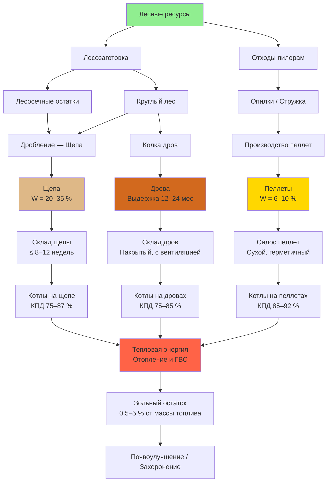

Древесная биомасса — один из старейших возобновляемых источников тепловой энергии. Современные котлы на древесном топливе достигают КПД сжигания 75–92 % при правильно высушенном сырье, что делает древесную биомассу конкурентоспособной альтернативой ископаемому топливу в жилых, коммерческих и промышленных системах HVAC. По данным IEA (2023), твёрдая древесная биомасса обеспечивает около 40 % глобального конечного потребления возобновляемой тепловой энергии.

## Формы древесного топлива

### Древесные пеллеты

Пеллеты (wood pellets) производятся прессованием опилок и стружки при давлении 70–100 МПа: диаметр 6–8 мм, длина 15–30 мм. Насыпная плотность 640–720 кг/м³ (против 160–240 кг/м³ у сырых опилок).

Преимущества пеллет:
- Единообразные размер и энергосодержание — автоматизированная подача
- Низкая влажность (6–10 %) — максимизация LHV
- Высокая объёмная плотность — компактное хранение
- Зольность 0,3–0,7 % (класс A1 по EN ISO 17225-2) — минимальная периодичность золоудаления

### Древесная щепа

Щепа (wood chips) производится измельчением брёвен, лесозаготовительных остатков и отходов пилорам. Размер частиц — 5–50 мм, насыпная плотность 240–400 кг/м³.

Щепа применяется в установках мощностью от 200 кВт, где более низкая стоимость топлива перекрывает усложнение системы подачи. Качество щепы определяется:
- Однородностью размера (влияет на расходомеры и горение)
- Степенью загрязнения (кора, земля, камни)
- Влажностью (15–40 % в рабочем состоянии)
- Сроком хранения (деградация начинается через 8–12 недель)

### Дрова

Дрова (firewood / split wood) — расколотые брёвна длиной 30–60 см. Один складочный кубометр (складометр) содержит около 0,55–0,70 м³ плотной древесины. Оптимальные требования:
- Выдержка 12–24 месяца до влажности ≤ 20 %
- Толщина полена 7–15 см для равномерной сушки и сгорания
- Предпочтительны плотные лиственные породы (дуб, ясень, берёза): объёмная энергоёмкость выше, чем у хвойных

## Теплотворная способность

### Высшая теплотворная способность (ВТС, HHV)

ВТС включает полную энергию при сгорании, в том числе скрытую теплоту конденсации водяного пара:


\mathrm{HHV}_{\mathrm{dry}} = 36\,000 + 60{,}7 \cdot L


где $L$ — содержание лигнина, % (масс.), типично 25–35 %; $\mathrm{HHV}_{\mathrm{dry}}$ — в кДж/кг на сухую массу. Для большинства пород $\mathrm{HHV}_{\mathrm{dry}} \approx 35\,600{-}39\,800$ кДж/кг.

### Низшая теплотворная способность (НТС, LHV)

НТС — полезная энергия в обычных котлах без конденсации водяного пара:


\mathrm{LHV}_{\mathrm{dry}} = \mathrm{HHV}_{\mathrm{dry}} - 2\,444 \cdot H


где $H$ — содержание водорода, % (масс.), $\approx 6\,\%$ для древесины. Результат: $\mathrm{LHV}_{\mathrm{dry}} \approx 32\,900{-}37\,100$ кДж/кг.

### Влияние влажности на LHV


\mathrm{LHV}_{\mathrm{wet}} = \mathrm{LHV}_{\mathrm{dry}} \cdot \frac{100 - W}{100} - 2\,444 \cdot \frac{W}{100}


где $W$ — влажность по рабочей массе (wet basis), %; 2 444 кДж/кг — теплота испарения воды.

Числовой расчёт для $\mathrm{LHV}_{\mathrm{dry}} = 37\,700$ кДж/кг:
- При $W = 20\,\%$: $\mathrm{LHV}_{\mathrm{wet}} = 37\,700 \times 0{,}80 - 2\,444 \times 0{,}20 = 30\,160 - 489 = 29\,671$ кДж/кг
- При $W = 40\,\%$: $\mathrm{LHV}_{\mathrm{wet}} \approx 20\,750$ кДж/кг — снижение на 45 % от сухой древесины

## Сравнительные характеристики


| Показатель | Древесные пеллеты | Древесная щепа | Выдержанные дрова |
|---|---|---|---|
| Влажность, % | 6–10 | 20–35 | 15–25 |
| Насыпная плотность, кг/м³ | 640–720 | 240–400 | 400–560 (складом) |
| LHV рабочее, кДж/кг | 15 200–16 500 | 9 600–13 200 | 11 400–14 500 |
| Зольность, % | 0,5–1,5 | 1–5 | 0,5–2,0 |
| Размер частиц | 6–8 мм диам. | 5–50 мм | 30–60 см длина |
| Объёмная энергоёмкость, МДж/м³ | 980–1 190 | 230–530 | 460–810 |
| Система подачи | Автоматический шнек | Шнек / конвейер | Ручная / автоматическая |
| Хранение | Сухое, герметичное | Накрытое, вентилируемое | Накрытое, приподнятое |


## Измерение влажности

**Влажность по рабочей массе (wet basis):**


W_{\mathrm{wb}} = \frac{m_{\mathrm{вода}}}{m_{\mathrm{вл}}} \times 100


**Влажность по сухой массе (dry basis):**


W_{\mathrm{db}} = \frac{m_{\mathrm{вода}}}{m_{\mathrm{с}}} \times 100


Перевод между базами:


W_{\mathrm{db}} = \frac{W_{\mathrm{wb}}}{100 - W_{\mathrm{wb}}} \times 100


Полевое измерение: резистивные или диэлектрические влагомеры. Референс-метод: сушка при 103–105 °C в течение 24 ч по ASTM D4442 (EN ISO 18134).

## Цикл производства и использования

## Требования к сжиганию

Эффективное сжигание древесины требует одновременного выполнения трёх условий: достаточная температура (≥ 593 °C в зоне первичного горения), достаточный кислород (коэффициент избытка воздуха $\lambda = 1{,}4{-}2{,}0$) и достаточное время пребывания (2–4 с при температуре).

### Теоретический расход воздуха


L_0 \approx 4{,}5 \text{ кг воздуха / кг сухой древесины}


Практический расход:


L_{\mathrm{действ}} = L_0 \cdot \lambda


### Выбросы

Котлы класса 5 (EN 303-5:2021) обеспечивают: PM < 20 мг/нм³, CO < 250 мг/нм³, NOₓ < 200 мг/нм³.

Влажность топлива > 25 % резко увеличивает выбросы PM и снижает температуру горения — ниже 593 °C возможно образование дёгтя и смол.

## Хранение и обращение

**Пеллеты.** Хранить в водонепроницаемых силосах при относительной влажности воздуха < 60 %. Угол конуса воронки ≥ 45° для самотёчной выгрузки. Взрывобезопасность: пыль пеллет взрывоопасна при концентрации > 40 г/м³.

**Щепа.** Накрытое, вентилируемое хранилище. Кучи > 1,8 м несут риск самовозгорания из-за биологической активности. Максимальный срок хранения — 8–12 недель.

**Дрова.** Штабелировать на поддонах или лагах, открытой стороной к преобладающему ветру. Верхнее укрытие от дождя при сохранении боковой вентиляции. Минимум 6–12 месяцев сушки после колки.

## Численный пример

**Условие.** Требуется определить расход пеллет для котла мощностью 50 кВт ($\eta_{\mathrm{кт}} = 0{,}88$) и рассчитать объём силоса на отопительный сезон 180 суток (7 ч/сут работа на полной мощности). Пеллеты: $\mathrm{LHV}_{\mathrm{wet}} = 16\,200$ кДж/кг, $\rho_b = 660$ кг/м³.


\dot{m}_{\mathrm{пел}} = \frac{P_{\mathrm{кт}}}{\mathrm{LHV} \cdot \eta_{\mathrm{кт}}} = \frac{50}{16{,}2 \times 0{,}88} \approx 3{,}51 \text{ кг/ч}


Суточный расход: $3{,}51 \times 7 \approx 24{,}6$ кг/сут.

Объём силоса:


V_{\mathrm{сил}} = \frac{24{,}6 \times 180}{660} \approx 6{,}7 \text{ м}^3


Принимается стандартный пластиковый силос ёмкостью 7,5–10 м³ с коэффициентом заполнения 0,85. Годовая потребность в пеллетах — $24{,}6 \times 180 \approx 4{,}4$ т.

## Источники

- IEA. *Bioenergy — Tracking Clean Energy Progress*. 2023.
- ASTM D4442-20. *Standard Test Methods for Direct Moisture Content Measurement of Wood and Wood-Based Materials*.
- EN ISO 17225-2:2021. *Solid biofuels — Fuel specifications and classes — Graded wood pellets*.
- EN ISO 18134-2:2017. *Solid biofuels — Determination of moisture content*.
- EN 303-5:2021. *Heating boilers for solid fuels*.
- ASHRAE 90.1-2022. *Energy Standard for Sites and Buildings*.
- VDI 4640-1:2021. *Thermal use of the underground*.
- СП 60.13330.2020. Отопление, вентиляция и кондиционирование воздуха.
- ФЗ-261 от 23.11.2009 «Об энергосбережении».
