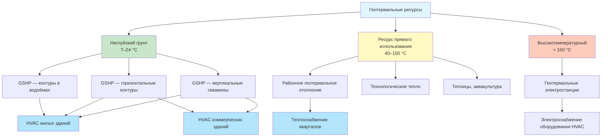

Геотермальные ресурсы представляют тепловую энергию, накопленную в земной коре. Они доступны как через стабильные температуры неглубокого грунта, так и через высокотемпературные глубокие резервуары. В зависимости от температурного уровня геотермальное тепло используется в тепловых насосах с грунтовым источником (ground-source heat pump, GSHP), системах прямого теплоснабжения и для производства электроэнергии. По данным IRENA (2023), установленная геотермальная мощность в мире превышает 15 ГВт электрической и 100 ГВт тепловой.

## Типы геотермальных ресурсов

### Неглубокий геотермальный ресурс

Температура грунта на глубинах 3–120 м остаётся относительно постоянной в течение года — 7–24 °C в зависимости от географического расположения. Эта стабильность является основой для систем GSHP. Температура грунта на глубине $z$:


T_g(z, t) = T_{\mathrm{ср}} + A_s \cdot e^{-z\sqrt{\frac{\pi}{365\alpha}}} \cdot \cos\!\left[\frac{2\pi}{365}\!\left(t - t_0 - \frac{z}{2}\sqrt{\frac{365}{\pi\alpha}}\right)\right]


где:
- $T_{\mathrm{ср}}$ — среднегодовая температура воздуха, °C
- $A_s$ — амплитуда колебания температуры поверхности, °C
- $z$ — глубина, м
- $\alpha$ — коэффициент температуропроводности грунта, м²/сут
- $t$ — текущий день года; $t_0$ — сдвиг фазы

На глубине ≥ 10–15 м сезонные колебания температуры практически исчезают.

### Глубокий геотермальный ресурс

Системы глубокой геотермальной энергии (enhanced geothermal systems, EGS) используют температуры > 150 °C на глубинах 3–5 км. Геотермальный градиент (geothermal gradient):


\frac{dT}{dz} = \frac{q_E}{k}


где $q_E$ — тепловой поток из недр Земли (средний континентальный: 60–80 мВт/м²); $k$ — теплопроводность горных пород. Нормальный градиент: 1,0–1,5 °C/100 м; в вулканических регионах — более 5 °C/100 м.

## Расчёты геотермального теплового потока

Скорость передачи тепла через грунтовые теплообменники подчиняется закону Фурье:


q = -\lambda \cdot A \cdot \frac{dT}{dx}


Требуемая суммарная длина вертикальных скважин (по методике ASHRAE):


L_{\mathrm{скв}} = \frac{q_a \cdot R_g + (q_c - W_c) \cdot R_{gc} + (q_h + W_h) \cdot R_{gh}}{T_g - \tfrac{1}{2}(T_{wi,c} + T_{wi,h})}


где:
- $q_a$ — среднегодовая тепловая нагрузка, Вт
- $R_g$ — эффективное тепловое сопротивление грунта, (м·К)/Вт
- $q_c$, $q_h$ — расчётные нагрузки охлаждения и отопления, Вт
- $W_c$, $W_h$ — электрическая потребляемая мощность теплового насоса в режимах охлаждения и отопления, Вт
- $T_g$ — невозмущённая температура грунта, °C
- $T_{wi,c}$, $T_{wi,h}$ — температура воды на входе в тепловой насос, охлаждение и отопление, °C

## Приложения HVAC

### Конфигурации GSHP

**Вертикальные скважины (vertical borehole heat exchangers).** Глубина 50–150 м, диаметр скважины 115–152 мм, расстояние между скважинами ≥ 6 м. Удельный теплосъём 40–80 Вт/м в зависимости от теплопроводности грунта (VDI 4640-2:2021).

**Горизонтальные контуры.** Глубина 1,2–1,8 м, 20–50 Вт/м² в зависимости от климата и типа грунта. Требуют большую площадь, но дешевле бурения.

**Водоёмные контуры.** Погружённые спирали в прудах или озёрах, минимальная глубина 2,4–3 м. Высокая эффективность при достаточном объёме водоёма.

**Системы с открытым контуром.** Водозаборная и возвратная скважины в водоносном горизонте (0,11–0,18 л/с на кВт тепловой мощности). Требуют гидрогеологического обоснования и разрешения водопользования.

### Производительность GSHP

Коэффициент производительности при отоплении (heating COP):


\mathrm{COP}_h = \frac{Q_h}{W_{\mathrm{comp}}} = \frac{T_{\mathrm{конд}}}{T_{\mathrm{конд}} - T_{\mathrm{исп}}} \cdot \eta_{\mathrm{Карно}}


где температуры в К; $\eta_{\mathrm{Карно}} = 0{,}40{-}0{,}60$ — доля от идеального цикла Карно. Реальные значения: COP₍ₕ₎ = 3,0–5,0 при отоплении, EER = 15–25 при охлаждении (ASHRAE 90.1-2022).

Снижение потребления электроэнергии по сравнению с воздушными тепловыми насосами — 25–50 %.

## Прямое использование геотермального тепла

Геотермальные жидкости при 40–150 °C используются без тепловых насосов для:
- Районного теплоснабжения и ГВС
- Отопления теплиц (оптимальная температура 30–60 °C)
- Технологических процессов (сушка, пастеризация)
- Аквакультуры (оптимальная температура 15–30 °C)

**Каскадное использование тепла** последовательно извлекает энергию при снижающихся температурах:

1. 80–95 °C → отопление зданий / промышленный процесс
2. 60–70 °C → горячее водоснабжение
3. 40–50 °C → подогрев талой воды / аквакультура
4. 25–35 °C → источник теплового насоса

## Тепловые свойства грунта

Точное знание теплопроводности и температуропроводности грунта необходимо для проектирования контура. На объектах мощностью > 30 кВт рекомендуется тепловое испытание отклика (thermal response test, TRT) по VDI 4640-4.


| Тип грунта / породы | Теплопроводность $\lambda$, Вт/(м·К) | Температуропроводность $a$, 10⁻⁶ м²/с |
|---|---|---|
| Сухой песок | 0,17–0,35 | 0,10–0,17 |
| Насыщенный песок | 0,79–1,37 | 0,15–0,24 |
| Сухая глина | 0,23–0,51 | 0,08–0,13 |
| Насыщенная глина | 0,62–1,02 | 0,11–0,19 |
| Известняк | 1,19–2,05 | 0,17–0,26 |
| Песчаник | 1,02–2,27 | 0,19–0,29 |
| Гранит | 1,54–2,56 | 0,22–0,33 |
| Базальт | 0,86–1,48 | 0,15–0,24 |


Источник: VDI 4640-1:2021. При высокой теплопроводности породы на 1 кВт требуется меньшая длина скважины, что снижает капзатраты.

## Интеграция с системами HVAC

**Тепловые насосы вода–воздух (water-to-air heat pumps).** Теплообменник хладагент–воздух подаёт кондиционированный воздух в помещения. Диапазон мощности — 1–30 кВт; компрессоры с переменной производительностью (inverter drive) повышают COP в частичных режимах.

**Тепловые насосы вода–вода (water-to-water heat pumps).** Обслуживают гидравлические системы: радиаторы (70/50 °C), тёплые полы (35/30 °C), вентиляторные доводчики (fan coil units). Обеспечивают одновременное отопление и охлаждение разных зон через промежуточный холодильник (decoupler).

**Гибридные системы.** Сочетание GSHP с дополнительным источником тепла (конденсационный котёл, тепловой насос воздух–вода) для пиковых нагрузок снижает капзатраты на бурение при сохранении высокой эффективности в базовом режиме.

Ежегодный тепловой баланс нагрузок отопления и охлаждения влияет на долгосрочную стабильность температуры грунта. Дисбаланс > 20 % требует дополнительного теплового сброса (градирня, охладитель) или компенсирующего теплового источника (СП 60.13330.2020).

## Численный пример

**Условие.** Офисное здание в Санкт-Петербурге, расчётная нагрузка отопления $q_h = 80$ кВт, охлаждения $q_c = 50$ кВт. Невозмущённая температура грунта $T_g = 8\,°C$. Грунт: суглинок насыщенный, $\lambda = 1{,}5$ Вт/(м·К), $R_g = 0{,}20$ (м·К)/Вт. COP₍ₕ₎ = 3,8; EER = 18. Определить ориентировочную длину вертикальных скважин.

Мощность компрессора: $W_h = q_h / \mathrm{COP}_h = 80/3{,}8 \approx 21{,}1$ кВт; $W_c = q_c / \mathrm{EER} \cdot 3{,}41 = 50/18 \approx 2{,}78$ кВт.

Среднегодовая тепловая нагрузка (климат СПб, 225 суток отопления): $q_a \approx 35$ кВт.

По упрощённой методике VDI 4640 (при $\Delta T = 5$ К между грунтом и теплоносителем):


L_{\mathrm{скв}} = \frac{q_h - W_h}{q_l} = \frac{80 - 21{,}1}{55} \approx 1{,}07 \text{ кВт/Вт·м} \approx 1\,070 \text{ м}


где $q_l = 55$ Вт/м — удельный теплосъём для насыщенного суглинка (VDI 4640-2). Принимается 8 скважин по 135 м — типовое решение для объектов данного масштаба.

## Факторы производительности

**Температурные ограничения.** GSHP работает оптимально при температуре теплоносителя на входе 2–38 °C. Чрезмерный отбор тепла ведёт к промерзанию грунта и снижению COP (VDI 4640-1).

**Движение грунтовых вод.** Естественная фильтрация ускоряет рассеивание тепла через конвективный перенос, улучшая характеристики системы. TRT позволяет количественно оценить этот эффект.

**Жизненный цикл.** Грунтовые теплообменники из полиэтилена PE-Xa рассчитаны на 50+ лет. Тепловой насос — 20–25 лет. Суммарные расходы на жизненный цикл ниже, чем у котельных на газе или мазуте, при 30–50 % экономии электроэнергии (ISO 50001).

## Источники

- IRENA. *Renewable Energy Statistics 2023*.
- IEA. *Geothermal Power: Technology Brief*. 2023.
- VDI 4640-1:2021. *Thermal use of the underground — Fundamentals, approvals, environmental aspects*.
- VDI 4640-2:2021. *Thermal use of the underground — Ground source heat pump systems*.
- ASHRAE 90.1-2022. *Energy Standard for Sites and Buildings Except Low-Rise Residential Buildings*.
- ISO 50001:2018. *Energy management systems — Requirements with guidance for use*.
- EN 14825:2022. *Air conditioners, liquid chilling packages and heat pumps — Testing and rating at part load conditions*.
- СП 60.13330.2020. Отопление, вентиляция и кондиционирование воздуха.
- СП 50.13330.2017. Тепловая защита зданий.
- ФЗ-261 от 23.11.2009 «Об энергосбережении и повышении энергетической эффективности».
