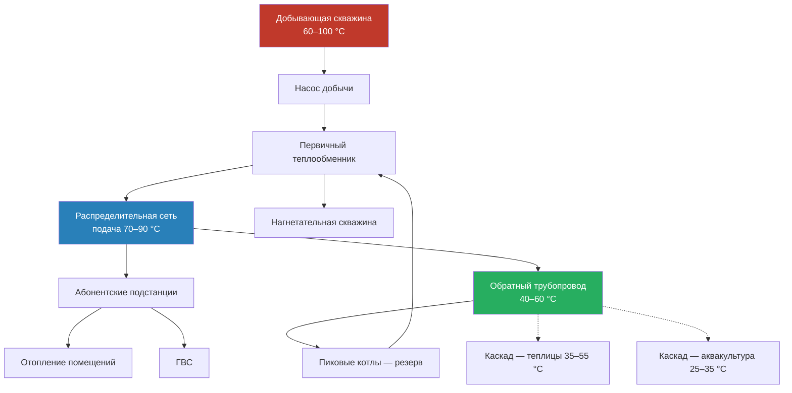

Прямое использование геотермальной энергии (direct use) — применение низко- и среднетемпературных гидротермальных ресурсов (50–150 °C) для теплоснабжения без промежуточного преобразования в электроэнергию. По данным IRENA (2023), суммарная установленная тепловая мощность прямого использования в мире превышает 107 ГВт_т, из которых около 55 ГВт_т приходится на геотермальные тепловые насосы. Согласно IEA Geothermal (2022), объём прямого теплоснабжения ежегодно растёт на 5–7 % благодаря программам декарбонизации теплоснабжения в Европе и Китае.

В российском нормативном пространстве применение геотермальных систем теплоснабжения регулируется СП 60.13330.2020 (инженерные системы зданий) и ФЗ-261 «Об энергосбережении». Требования к тепловым нагрузкам и параметрам теплоносителя в сетях — по СП 124.13330.2012.

## Соответствие температуры и области применения


| Применение | Температура, °C | Типичный расход, л/мин | Тепловая нагрузка |
|---|---|---|---|
| Районное теплоснабжение | 60–100 | 200–2 000 | 1–50 ГДж/ч |
| Обогрев теплиц | 40–80 | 80–800 | 0,5–10 ГДж/ч |
| Аквакультура | 25–35 | 40–400 | 0,2–5 ГДж/ч |
| Промышленная сушка | 100–150 | 100–1 200 | 2–20 ГДж/ч |
| Пищевое производство | 60–120 | 100–1 000 | 1–15 ГДж/ч |
| Бальнеология, СПА | 30–50 | 20–200 | 0,1–2 ГДж/ч |
| Таяние снега и льда | 30–60 | 60–600 | 0,3–8 ГДж/ч |


## Системы районного геотермального теплоснабжения

Геотермальное районное теплоснабжение (district heating) является крупнейшим направлением прямого использования. Тепловая энергия от добывающих скважин распределяется по изолированным трубопроводным сетям к нескольким потребителям. Исландия покрывает более 90 % потребности в теплоснабжении жилых зданий за счёт геотермальных сетей (Orkustofnun, 2023).

### Принципиальная схема системы

### Расчёт первичного теплообменника

Тепловой поток от геотермальной жидкости:


Q = \dot{m}_{\text{geo}} \cdot c_{p,\text{geo}} \cdot (T_{\text{geo,вх}} - T_{\text{geo,вых}})


Где:
- $Q$ — тепловой поток, Вт
- $\dot{m}_{\text{geo}}$ — массовый расход геотермальной жидкости, кг/с
- $c_{p,\text{geo}}$ — удельная теплоёмкость, Дж/(кг·К), для слабоминерализованной воды ≈ 4 180 Дж/(кг·К)
- $T_{\text{geo,вх}},\; T_{\text{geo,вых}}$ — температуры на входе и выходе, °C

Логарифмическая средняя разность температур (LMTD) для противоточного теплообменника:


\Delta T_{\text{lm}} = \frac{(T_{\text{geo,вх}} - T_{\text{dist,вых}}) - (T_{\text{geo,вых}} - T_{\text{dist,вх}})}{\ln\!\left(\dfrac{T_{\text{geo,вх}} - T_{\text{dist,вых}}}{T_{\text{geo,вых}} - T_{\text{dist,вх}}}\right)}


Требуемая площадь поверхности теплопередачи:


A = \frac{Q}{U \cdot \Delta T_{\text{lm}}}


Где $U$ — коэффициент теплопередачи, Вт/(м²·К). Типичные значения:
- пластинчатые теплообменники (чистая жидкость): 1 000–2 000 Вт/(м²·К)
- кожухотрубные теплообменники (жидкость с накипью): 500–1 000 Вт/(м²·К)

Для геотермальных жидкостей с высоким содержанием минералов полное тепловое сопротивление:


\frac{1}{U} = \frac{1}{h_{\text{geo}}} + R_{f,\text{geo}} + \frac{\delta_{\text{wall}}}{k_{\text{wall}}} + R_{f,\text{dist}} + \frac{1}{h_{\text{dist}}}


Здесь $R_f$ — сопротивление загрязнения, типично 0,0001–0,0005 м²·К/Вт для геотермальных применений.

### Числовой пример — теплообменник районного теплоснабжения

**Дано:** скважина 85 °C, $\dot{m}_{\text{geo}} = 25$ кг/с, охлаждение до 45 °C; дистрибутивный контур 55 → 75 °C.

**Тепловой поток:**


Q = 25 \times 4{,}18 \times (85 - 45) = 4{,}18\,\text{МВт}


**LMTD (противоток):**


\Delta T_{\text{lm}} = \frac{(85-75) - (45-55)}{\ln\!\left(\frac{10}{-10}\right)}


Здесь $(85-75) = 10$ K, $(45-55) = -10$ K — условие нарушено; это означает, что распределительный контур нагревается до температуры выше геотермального выхода, что физически невозможно. Корректируем: распределительная подача 70 °C, обратка 45 °C.


\Delta T_{\text{lm}} = \frac{(85-70) - (45-45)}{\ln(15/0)} \to \text{пересмотрено: обратка 40 °C}


При $T_{\text{dist,вх}} = 40$ °C, $T_{\text{dist,вых}} = 68$ °C:

$$\Delta T_1 = 85 - 68 = 17\,\text{K},\quad \Delta T_2 = 45 - 40 = 5\,\text{K}$$


\Delta T_{\text{lm}} = \frac{17 - 5}{\ln(17/5)} = \frac{12}{1{,}224} \approx 9{,}8\,\text{K}


При $U = 1\,500$ Вт/(м²·К):


A = \frac{4{,}18 \times 10^6}{1\,500 \times 9{,}8} \approx 285\,\text{м}^2


Это соответствует пластинчатому теплообменнику с ~570 пластинами площадью 0,5 м² каждая. Рыночная стоимость в России — около 3,5–5 млн руб. (2025 г.).

## Геотермальный обогрев теплиц

Геотермальный обогрев теплиц обеспечивает стабильный и экономичный тепловой режим для круглогодичного производства. Системы поддерживают температуру 15–25 °C при использовании ресурсов 40–80 °C. Исландия и Нидерланды демонстрируют масштабное применение: в Нидерландах геотермальные теплицы производят свыше 100 МВт_т тепла (IF Technology, 2022).

### Системы напольного отопления

Удельный тепловой поток через напольные змеевики:


q_{\text{пол}} = \frac{T_{\text{жидк}} - T_{\text{грунт}}}{R_{\text{итого}}}


Где $R_{\text{итого}}$ суммирует термические сопротивления: жидкость–стенка трубы, стенка трубы, бетонная стяжка, грунт.

Шаг укладки трубы по тепловому балансу:


S = \sqrt{\frac{k_{\text{бет}} \cdot \delta_{\text{стяж}} \cdot (T_{\text{жидк}} - T_{\text{грунт}})}{q_{\text{треб}}}}


### Конвективные нагревательные батареи

Мощность нагревательного элемента с принудительным обдувом:


Q_{\text{батарея}} = \dot{V} \cdot \rho \cdot c_p \cdot (T_{\text{вых}} - T_{\text{вх}})


Требования к проектированию:
- минимальная температура подачи 35–40 °C для адекватной теплоотдачи
- расчётные условия по наружному воздуху: −20 … −30 °C (в зависимости от климатической зоны по СП 131.13330)
- резервный источник тепла при недостаточном геотермальном потенциале
- нормативные потери тепла современной теплицы: 50–80 Вт/м²

## Аквакультура на геотермальном тепле

Геотермальный подогрев воды в рыбоводных хозяйствах оптимизирует темпы роста, конверсию корма и выживаемость продукции. Тилапия (+10 % за °C выше 26 °C до 30 °C), форель (оптимум 12–16 °C) — типичные объекты.


| Вид | Оптимум, °C | Допустимый диапазон, °C | Чувствительность |
|---|---|---|---|
| Тилапия | 28–30 | 22–32 | ±10 % при отклонении 2 °C |
| Тихоокеанская креветка | 26–30 | 24–32 | ±15 % при отклонении 2 °C |
| Атлантический лосось | 12–16 | 8–18 | ±8 % при отклонении 2 °C |
| Канальный сом | 24–28 | 18–30 | ±12 % при отклонении 2 °C |
| Спирулина | 32–35 | 28–38 | ±20 % при отклонении 2 °C |


### Тепловой баланс рыбоводного пруда

Суммарная тепловая нагрузка:


Q_{\text{пруд}} = Q_{\text{поверхн}} + Q_{\text{грунт}} + Q_{\text{вода}}


Потери через поверхность (конвекция + излучение + испарение):


Q_{\text{поверхн}} = A_{\text{пов}}\!\left[h_c(T_{\text{вод}} - T_{\text{воздух}}) + \varepsilon \sigma (T_{\text{вод}}^4 - T_{\text{неба}}^4) + h_{\text{исп}}\right]


Потери тепла в грунт:


Q_{\text{грунт}} = \frac{A_{\text{дно}} \cdot k_{\text{грунт}}}{d_{\text{грунт}}} (T_{\text{вод}} - T_{\text{грунт}})


Нагрев подпиточной воды:


Q_{\text{вода}} = \dot{V}_{\text{подп}} \cdot \rho \cdot c_p \cdot (T_{\text{пруд}} - T_{\text{источн}})


Площадь теплообменника (пластинчатый из титана):


A_{\text{HX}} = \frac{Q_{\text{итого}}}{U \cdot \Delta T_{\text{lm}}}


Коэффициент теплопередачи $U = 1\,500{-}2\,500$ Вт/(м²·К) для чистой геотермальной воды в титановых пластинчатых теплообменниках.

## Каскадное использование геотермальной энергии

Каскадное использование (cascade utilization) позволяет последовательно снижать температуру геотермальной жидкости через несколько ступеней применений, максимизируя извлечение энергии. Типичный каскад:

1. **80–100 °C** — промышленное технологическое тепло или первичная подача в сеть ДТС
2. **50–80 °C** — обогрев теплиц или вторичная подача ДТС
3. **25–50 °C** — аквакультура или бальнеология
4. **20–25 °C** — источник тепла для грунтового теплового насоса (GSHP)

Коэффициент утилизации энергии каскадной системы:


\eta_{\text{каск}} = \frac{Q_{\text{извлечено}}}{Q_{\text{доступно}}} = \frac{\dot{m} c_p (T_{\text{скв}} - T_{\text{закачка}})}{\dot{m} c_p (T_{\text{скв}} - T_{\text{нар}})}


Хорошо спроектированные каскадные системы достигают $\eta_{\text{каск}} = 60{-}75\,\%$ против 30–45 % для однократного использования. Исландский опыт (Reykjavik Energy) показывает значения до 80 % при комплексном каскаде от 130 °C до 20 °C.

## Нивелированная стоимость тепла (LCOH)

Нивелированная стоимость тепла для геотермального ДТС:


\text{LCOH} = \frac{\text{CapEx} + \sum_{t=1}^{n} \frac{\text{OpEx}_t}{(1+r)^t}}{\sum_{t=1}^{n} \frac{Q_t}{(1+r)^t}}


Где $r$ — ставка дисконтирования, $Q_t$ — годовая выработка тепла, ГДж.

Согласно IRENA (2023), LCOH геотермального теплоснабжения составляет:
- **15–35 USD/ГДж** — при использовании готовых высокотемпературных скважин
- **25–50 USD/ГДж** — при использовании среднетемпературных ресурсов с бурением новых скважин
- Для сравнения: природный газ при цене 6 000 руб./тыс. м³ — около 40–50 USD/ГДж тепла (КПД котла 92 %)

При сроке службы 30 лет, $r = 8\,\%$ и LCOH 20 USD/ГДж геотермальное ДТС окупается за 7–12 лет в российских условиях при умеренных ресурсах (Камчатка, Северный Кавказ).

## Требования к проектированию

1. **Коррозионностойкие материалы** — титан, сталь 316L или полимерные трубы для контакта с геотермальной жидкостью с минерализацией >3 г/л
2. **Фильтрация** — сетчатые фильтры 50–100 мкм перед теплообменниками для предотвращения накипи
3. **Полная закачка** — замкнутые системы с нагнетательными скважинами сокращают воздействие на водоносный горизонт
4. **Резервирование** — параллельные теплообменники или резервные источники тепла для критических потребителей
5. **Химический мониторинг** — постоянный контроль pH, жёсткости и содержания H₂S предотвращает коррозию и накипь
6. **Оптимизация каскада** — последовательное снижение температуры максимизирует $\eta_{\text{каск}}$

Согласно ISO 50001 и EN 16247 (энергетический аудит зданий и промышленных объектов), геотермальные системы прямого использования должны проходить верификацию энергетических показателей не реже одного раза в 4 года.

Прямое использование геотермальной энергии обеспечивает надёжное, экономичное и низкоуглеродное теплоснабжение при наличии подходящих ресурсов. Корректный расчёт теплообменников, выбор материалов и проектирование каскадных схем — ключевые факторы максимизации экономических и экологических преимуществ таких систем.
