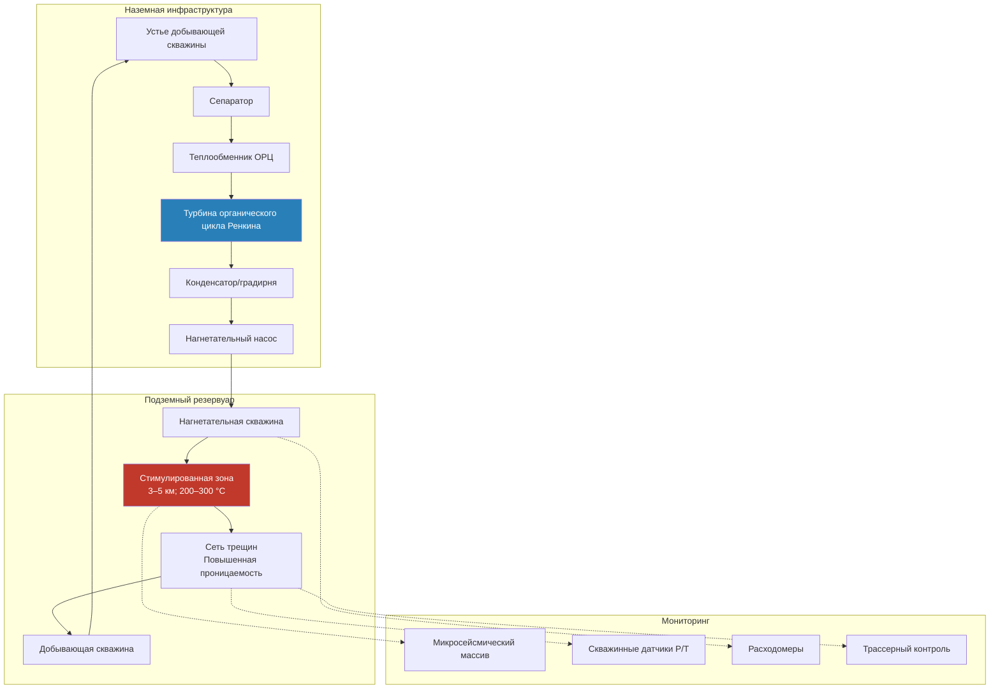

Улучшенные геотермальные системы (EGS, enhanced geothermal systems) — передовая технология извлечения геотермальной энергии из горячих сухих кристаллических пород, лишённых естественной проницаемости или насыщения жидкостью. В отличие от традиционных гидротермальных систем, EGS создаёт искусственные резервуары путём гидравлического стимулирования глубоких пород на глубинах 3–10 км, где температура превышает 150–300 °C. По оценке IEA (Geothermal Power Technology Brief, 2021), EGS потенциально доступны на территории, охватывающей свыше 70 % поверхности суши, что делает их стратегическим ресурсом базовой возобновляемой генерации.

## Технология горячих сухих пород

Формации горячих сухих пород (HDR, hot dry rock) составляют около 98 % геотермального потенциала Земли, но исторически оставались недоступными без инженерного стимулирования. Характеристики:

- **Низкая проницаемость:** < 10⁻¹⁸ м² — требует инженерных сетей трещин для циркуляции жидкости
- **Повышенные геотермальные градиенты:** 40–80 °C/км в перспективных районах (норма — 25–30 °C/км)
- **Глубокое бурение:** 3 000–10 000 м для достижения рабочих температур
- **Широкое географическое распространение:** не ограничено тектоническими границами, как гидротермальные ресурсы

### Скорость извлечения тепла из резервуара

Объёмная скорость извлечения тепла из HDR-резервуара:


Q_{\text{extr}} = \rho_{\text{fl}} \cdot c_{p,\text{fl}} \cdot \dot{V} \cdot (T_{\text{вых}} - T_{\text{вх}})


Где $\rho_{\text{fl}}$ — плотность рабочей жидкости (кг/м³), $c_{p,\text{fl}}$ — удельная теплоёмкость (Дж/(кг·К)), $\dot{V}$ — объёмный расход (м³/с), $(T_{\text{вых}} - T_{\text{вх}})$ — прирост температуры в резервуаре.

Скорость теплового истощения резервуара:


\frac{dT_{\text{rock}}}{dt} = -\frac{h \cdot A_{\text{frac}}}{V_{\text{rock}} \cdot \rho_{\text{rock}} \cdot c_{p,\text{rock}}}(T_{\text{rock}} - T_{\text{fl}})


Где $h$ — коэффициент конвективной теплоотдачи (Вт/(м²·К)), $A_{\text{frac}}$ — площадь поверхности трещин (м²), $V_{\text{rock}}$ — объём стимулированной породы (м³).

## Методы гидравлического стимулирования

Гидравлическое стимулирование (hydraulic stimulation) создаёт проницаемые каналы за счёт контролируемого разрушения породы. Последовательность операций:

1. **Бурение нагнетательной скважины** — вертикальные или наклонно-направленные скважины на целевую глубину с буровыми жидкостями, стойкими к высоким температурам (>200 °C)
2. **Гидравлический разрыв пласта** — закачка жидкости при давлении 30–80 МПа для инициации и распространения трещин
3. **Развитие сети трещин** — последовательные циклы закачки для создания связной системы трещин с проницаемостью 10⁻¹⁴–10⁻¹⁵ м²
4. **Бурение добывающей скважины** — направленное бурение для пересечения стимулированного объёма на расстоянии 400–600 м от нагнетательной

Критическое давление закачки для инициации трещины:


P_{\text{inj}} > \sigma_{h,\min} + T_{\text{rock}} - P_{\text{pore}} + \frac{K_{IC}}{\sqrt{\pi a}}


Где $\sigma_{h,\min}$ — минимальное горизонтальное напряжение, $T_{\text{rock}}$ — прочность породы на растяжение, $P_{\text{pore}}$ — поровое давление, $K_{IC}$ — вязкость разрушения, $a$ — размер исходного дефекта.

Микросейсмический мониторинг во время стимулирования картирует распространение трещин по акустическим эмиссиям, позволяя корректировать параметры закачки в реальном времени.

## Замкнутые системы EGS

Продвинутые замкнутые системы (closed-loop EGS) устраняют необходимость в гидравлическом разрыве, используя герметичные скважинные теплообменники.

**Системы с глубокой U-образной трубой:** рабочая жидкость опускается по центральной изолированной трубе, обменивает тепло с окружающей породой через внешнее кольцевое пространство и поднимается на поверхность. Скорость извлечения тепла:


Q_{\text{U}} = \frac{2\pi k_{\text{rock}} L (T_{\text{rock}} - T_{\text{fl,avg}})}{\ln(r_{\text{therm}}/r_{\text{wb}})}


Где $k_{\text{rock}}$ — теплопроводность породы (Вт/(м·К)), $L$ — длина теплообменника (м), $r_{\text{therm}}/r_{\text{wb}}$ — отношение теплового радиуса к радиусу скважины.

**Многолатеральные конфигурации:** один вертикальный ствол с несколькими горизонтальными ответвлениями по 1–3 км увеличивает площадь контакта с горячей породой в 5–10 раз по сравнению с вертикальными скважинами.

Замкнутые системы снижают сейсмический риск, устраняют возможность прорыва жидкости по коротким путям (short-circuit) и применимы к формациям, непригодным для гидравлического стимулирования.

## Архитектура системы EGS

## Реализованные проекты EGS


| Проект | Страна | Глубина, м | Температура, °C | Мощность, МВт | Статус |
|---|---|---|---|---|---|
| Fenton Hill | США | 4 400 | 235 | 0,01 (тест) | Завершён |
| Soultz-sous-Forêts | Франция | 5 000 | 200 | 1,5 | Работает |
| Cooper Basin | Австралия | 4 200 | 250 | 1,0 (пилот) | Приостановлен |
| Groß Schönebeck | Германия | 4 300 | 150 | 0,5 | Тестирование |
| Desert Peak | США (Невада) | 3 200 | 215 | 1,7 | Работает |
| FORGE (Юта) | США | 2 400 | 220 | Испытательный стенд | Активные НИОКР |
| Pohang | Южная Корея | 4 200 | 300 | 1,0 | Приостановлен |


## Исследовательская программа DOE — FORGE

Министерство энергетики США учредило в 2018 г. программу FORGE (Frontier Observatory for Research in Geothermal Energy) как подземную лабораторию в Милфорде, штат Юта. Цели:
- передовые технологии бурения, снижающие стоимость скважин с 10–15 до 3–5 млн USD
- оптимизация стимулирования и моделирование резервуаров
- демонстрация коммерческой EGS мощностью 5 МВт

**Программа EGS Collab** (многолабораторная) изучает динамику трещин в метровом масштабе на подземном исследовательском полигоне Sanford (Южная Дакота) для верификации связанных термо-гидро-механо-химических (THMC) моделей.

## Числовой пример — расчёт выхода тепла EGS

**Условия:** добывающая скважина 5 000 м, $T_{\text{вых}} = 220$ °C, нагнетательная скважина $T_{\text{вх}} = 50$ °C, расход $\dot{V} = 0,05$ м³/с (вода, $\rho = 870$ кг/м³, $c_p = 4\,500$ Дж/(кг·К) при среднем давлении).


Q_{\text{extr}} = 870 \times 4\,500 \times 0{,}05 \times (220 - 50) = 870 \times 4\,500 \times 0{,}05 \times 170 \approx 33\,\text{МВт}_{\text{т}}


КПД турбины органического цикла Ренкина при $T_H = 200$ °C, $T_C = 35$ °C:


\eta_{\text{Carnot}} = 1 - \frac{308}{473} \approx 0{,}349 \rightarrow \eta_{\text{ORC}} \approx 0{,}349 \times 0{,}55 \approx 19\,\%


Электрическая мощность: $W_e = 33 \times 0{,}19 \approx 6{,}3$ МВт_э. При коэффициенте использования (КИУМ) 90 %:


E_{\text{год}} = 6{,}3 \times 8\,760 \times 0{,}90 \approx 49{,}6\,\text{ГВт·ч/год}


## Экономика EGS


| Показатель | Современное состояние | Целевой уровень к 2030 г. |
|---|---|---|
| LCOE | 100–200 USD/МВт·ч | 60–80 USD/МВт·ч |
| Стоимость бурения (2 скважины) | 10–20 млн USD | 3–6 млн USD |
| Доля бурения в CapEx | 40–60 % | 30–40 % |
| КИУМ (capacity factor) | 90–95 % | 90–95 % |
| КПД теплоотдачи | 10–15 % от теплозапаса | 15–20 % |


Основное препятствие — экономика бурения: снижение стоимости на 50 % расширит применимую ресурсную базу EGS с нескольких сотен до тысяч перспективных площадок по всему миру.

Согласно Taxonomy of Sustainable Finance ЕС (2021) и методологии ВЭБ.РФ (таксономия зелёного финансирования, 2021), геотермальные EGS-проекты квалифицируются как «зелёные» при удельных выбросах парниковых газов не более 100 г CO₂-экв./кВт·ч с учётом полного жизненного цикла, что типично соблюдается при КИУМ ≥ 85 %.

EGS преобразует геотермальную энергию из ресурса, ограниченного географическим расположением, в широко доступный возобновляемый источник базовой генерации. Преодоление барьеров стоимости бурения, прогнозируемости стимулирования и долгосрочной устойчивости резервуара определит сроки коммерческого развёртывания в горизонте 2030–2040 гг.
