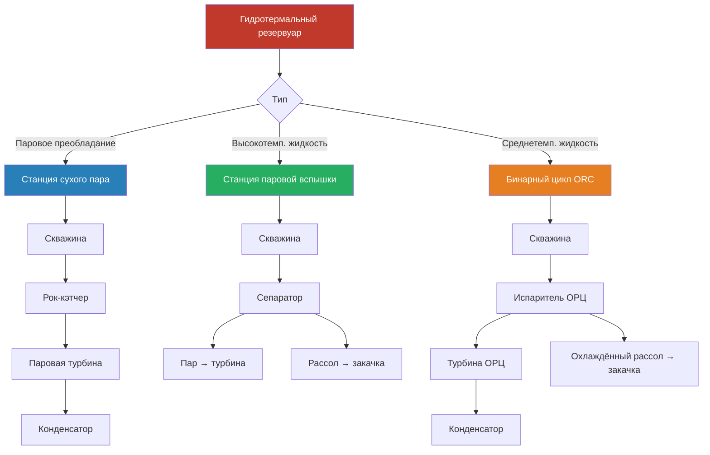

Гидротермальные ресурсы — природные скопления тепловой энергии Земли в виде резервуаров горячей воды и пара. Они представляют наиболее экономически освоенную форму геотермальной энергии: по данным IRENA (2023), установленная мощность геотермальных электростанций в мире достигла 15,9 ГВт, из которых свыше 90 % приходится на гидротермальные системы. Для инженеров ОВИК (HVAC) гидротермальные ресурсы актуальны как источник электроэнергии для нужд ОВиК, а среднетемпературные — для прямого теплоснабжения.

## Классификация гидротермальных систем

### По температуре

**Высокотемпературные ресурсы (>150 °C)**
Встречаются в тектонически активных регионах с недавней вулканической деятельностью. Обеспечивают эффективную генерацию электроэнергии по технологиям паровой вспышки и сухого пара. Геологические индикаторы — фумаролы, горячие источники, гейзеры.

**Среднетемпературные ресурсы (90–150 °C)**
Встречаются в осадочных бассейнах с повышенными градиентами. Применимы для прямого теплоснабжения и бинарного цикла генерации при $T > 120$ °C.

**Низкотемпературные ресурсы (<90 °C)**
Используются для GSHP и прямого теплоснабжения в непосредственной близости от источника. Термодинамические ограничения исключают рентабельную генерацию электроэнергии.

### По фазовому состоянию в резервуаре

**Резервуары с паровым преобладанием (steam-dominated)**
Наиболее редкий и ценный тип: перегретый пар с минимальным содержанием жидкой воды. Примеры: Geysers (Калифорния, >1 500 МВт) и Larderello (Италия, >700 МВт). Давление в резервуаре:


P_{\text{рез}} = P_{\text{нас}}(T_{\text{рез}}) - \Delta P_{\text{кап}}


Где $P_{\text{нас}}$ — давление насыщенного пара при температуре резервуара, $\Delta P_{\text{кап}}$ — поправка на капиллярное давление.

**Резервуары с жидкостным преобладанием (liquid-dominated)**
Составляют большинство продуктивных гидротермальных ресурсов: горячая вода под давлением, предотвращающим кипение на глубине. При извлечении снижение давления вызывает вспышку. Паросодержание после вспышки:


x_{\text{вспл}} = \frac{h_f(P_{\text{рез}}) - h_f(P_{\text{сеп}})}{h_{fg}(P_{\text{сеп}})}


Где $h_f(P_{\text{рез}})$ — энтальпия жидкости при давлении резервуара, $h_f(P_{\text{сеп}})$ — при давлении сепаратора, $h_{fg}(P_{\text{сеп}})$ — теплота парообразования при давлении сепаратора.

## Технологии генерации электроэнергии

### Электростанции сухого пара (dry steam)

Простейшая и наиболее эффективная геотермальная технология. Пар из скважин добычи поступает непосредственно на турбину через рок-кэтчеры (rock catchers) и влагоотделители.

Максимально возможный КПД ограничен циклом Карно:


\eta_{\text{Карно}} = 1 - \frac{T_{\text{холодн}}}{T_{\text{горяч}}}


Практический КПД станции: 15–20 % (50–65 % от КПД Карно). Неконденсируемые газы (CO₂, H₂S) требуют системы газоудаления.

### Электростанции паровой вспышки (flash steam)

Доминирующая технология для высокотемпературных ресурсов с жидкостным преобладанием. Горячая вода из скважин поступает в циклонный сепаратор; снижение давления вызывает частичную вспышку; пар приводит турбину.

**Двухступенчатая вспышка (double flash)** извлекает на 15–25 % больше мощности при тех же условиях резервуара. Дополнительная мощность от низконапорного пара:


\Delta W = \dot{m}_{\text{LP}} \cdot (h_{\text{LP,вх}} - h_{\text{LP,вых}}) \cdot \eta_{\text{турб}}


### Электростанции бинарного цикла (binary cycle / ORC)

Позволяют генерировать электроэнергию из ресурсов 90–175 °C, непригодных для вспышки. Геотермальная жидкость передаёт тепло вторичной рабочей жидкости (изопентан, изобутан, R-245fa) с более низкой точкой кипения через теплообменник без прямого контакта.

КПД бинарного цикла:


\eta_{\text{бин}} = \eta_{\text{цикл}} \cdot \eta_{\text{HX}} \cdot \eta_{\text{турб}} \cdot \eta_{\text{ген}}


Типичный сетевой КПД: 10–13 % при температуре ресурса 150 °C. Разность температур в теплообменнике 5–10 °C критически влияет на производительность.

### Принципиальная схема технологий

## Числовой пример — бинарный цикл ОРЦ для ресурса 140 °C

**Дано:** геотермальная жидкость $T_{\text{вх}} = 140$ °C, $T_{\text{вых}} = 80$ °C, $\dot{m} = 50$ кг/с. Рабочее тело — R-245fa.

**Тепловая мощность, поступающая от геотермального источника:**


Q_{\text{вх}} = 50 \times 4{,}18 \times (140 - 80) = 12{,}54\,\text{МВт}


**КПД цикла Карно** при $T_H = 413$ К, $T_C = 308$ К:


\eta_{\text{Карно}} = 1 - \frac{308}{413} = 25{,}4\,\%


**Реальный КПД ОРЦ:** $\eta_{\text{ORC}} \approx 0{,}254 \times 0{,}48 \approx 12{,}2\,\%$

**Электрическая мощность:**


W_e = 12{,}54 \times 0{,}122 \approx 1{,}53\,\text{МВт}_э


При КИУМ 90 %, годовая выработка: $1{,}53 \times 8\,760 \times 0{,}90 \approx 12{,}05$ ГВт·ч/год.

**LCOE** при CapEx 3 500 USD/кВт, OpEx 120 USD/(кВт·год), $n = 25$ лет, $r = 8\,\%$:


\text{LCOE} = \frac{3\,500 \times 1\,530 + 120 \times 1\,530 \times \text{PVA}(8\%,25)}{12\,050\,000 \times \text{PVA}(8\%,25)}


PVA(8 %, 25) = 10,67. Итого LCOE ≈ **95 USD/МВт·ч** — конкурентоспособно в изолированных энергосистемах и на Дальнем Востоке России.

## Инженерия резервуара

### Оценка устойчивой производственной мощности


Q_{\text{устойч}} = A \cdot \phi \cdot \rho \cdot c_p \cdot \frac{\Delta T}{t_{\text{восст}}}


Где $A$ — площадь резервуара (м²), $\phi$ — эффективная пористость, $\Delta T$ — рабочая разность температур (К), $t_{\text{восст}}$ — допустимый период восстановления (с).

### Падение давления в резервуаре


\frac{dP}{dt} = -\frac{Q}{V \cdot \beta_t}


Где $Q$ — объёмный отбор (м³/с), $V$ — объём резервуара (м³), $\beta_t$ — суммарная сжимаемость (Па⁻¹). Поддержание пластового давления путём закачки продлевает жизнь месторождения.

## Индикаторы качества ресурса


| Параметр | Отличный | Хороший | Удовлетворительный | Предельный |
|---|---|---|---|---|
| Температура, °C | >200 | 150–200 | 120–150 | 90–120 |
| Расход, кг/(с·скв) | >100 | 50–100 | 25–50 | <25 |
| Минерализация, мг/л | <5 000 | 5 000–15 000 | 15 000–50 000 | >50 000 |
| Неконденсируемые газы, % масс. | <1 | 1–3 | 3–7 | >7 |
| Глубина скважины, м | <1 500 | 1 500–2 500 | 2 500–3 500 | >3 500 |
| Проницаемость, мД | >100 | 20–100 | 5–20 | <5 |


## Прямое использование среднетемпературных ресурсов

Среднетемпературные гидротермальные ресурсы применяются для:

- **Районного теплоснабжения (60–150 °C):** подача 70–90 °C, возврат 40–50 °C; требования по СП 124.13330.2012
- **Промышленного технологического тепла (80–200 °C):** пищевое производство, сушка, химия
- **Обогрева теплиц (25–80 °C):** круглогодичное производство
- **Аквакультуры (20–40 °C):** рыбоводство и выращивание ракообразных

## Экономика гидротермальных проектов


| Статья | Диапазон |
|---|---|
| Разведка и подтверждение ресурса | 2–8 млн USD/объект |
| Бурение добывающей скважины | 3–7 млн USD |
| Бурение нагнетательной скважины | 2–5 млн USD |
| Строительство электростанции | 2 500–4 500 USD/кВт |
| O&M | 50–200 USD/(кВт·год) |
| LCOE гидротермальная | 50–100 USD/МВт·ч |


По Taxonomy of Sustainable Finance ЕС (2021), гидротермальные геотермальные электростанции с удельными выбросами <100 г CO₂-экв./кВт·ч относятся к категории «существенного вклада» в климатическую цель. IPCC AR6 (2022) оценивает медианные выбросы жизненного цикла геотермальной электроэнергии в 38 г CO₂-экв./кВт·ч.

Понимание характеристик гидротермальных резервуаров, методов оценки ресурсов и технологий преобразования необходимо при проектировании энергоснабжения крупных комплексов HVAC в регионах с геотермальным потенциалом — Камчатке, Курилах, Сахалине, Северном Кавказе.
